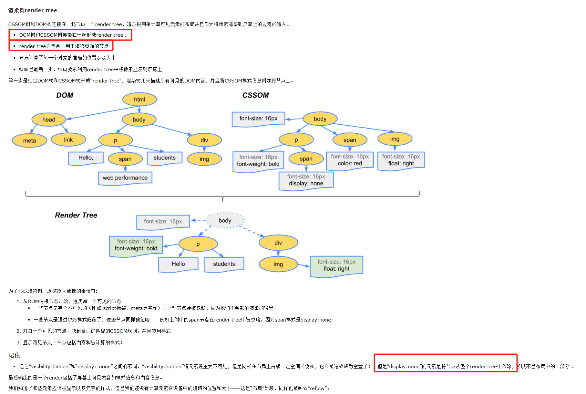
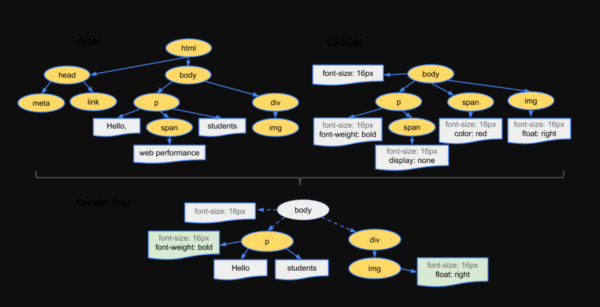
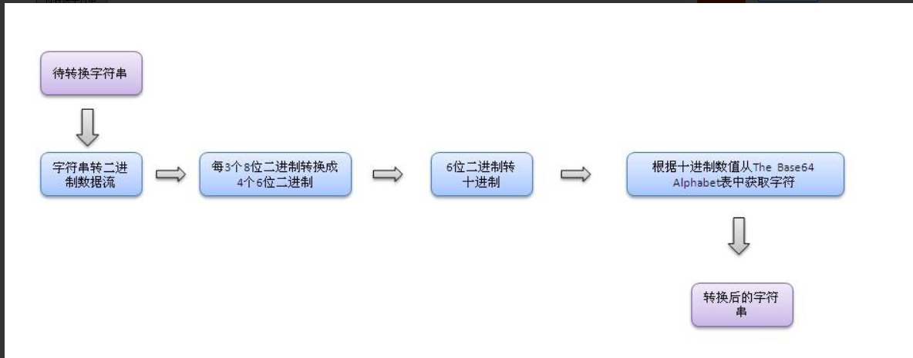
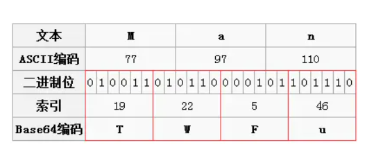
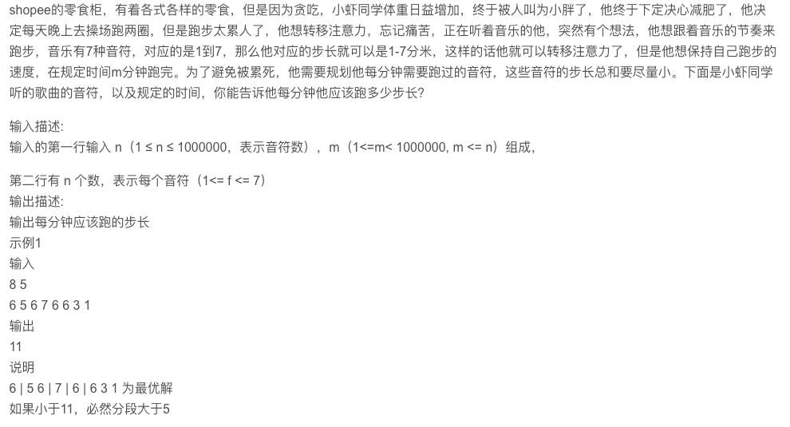

#### new 内部实现      

```js
function _new () {
  // arguments实际上是一个类数组对象，需要转成数组
  let args = [].slice.call(arguments)
  // 第一个参数是构造函数，把它拿出来
  let constructor = args.shift()
  // Object.create()返回一个新对象，这个对象的构造函数的原型指向Foo
  let context = Object.create(constructor.prototype)
  // 在返回的context对象环境中执行构造函数，为新的context添加属性
  let result = constructor.apply(context, args)
  // 如果Foo显示的返回了一个对象，那么应该直接返回这个对象，而不用理会以上所有的操作，一般不会发生这种情况，但是new的实现的确是这样的逻辑
  // 这里之所以判断类型是否为object还要添加 != null 的判断，是因为null的typeof结果也是‘object’
  // 不同的对象在底层都表示为二进制，在Javascript中二进制前三位都为0的话会被判断为Object类型，null的二进制表示全为0，自然前三位也是0，所以执行typeof时会返回"object"
  return (typeof result === 'object' && result != null) ? result : context
}
 
function Foo (name) {
  this.name = name
}
 
Foo.prototype.getName = function() {
  console.log(this.name)
}
 
var a = _new(Foo, 'tom')
a.getName()
 
复制代码
```

实际上new操作符， 就是通过Object.ctreate()创建一个新的对象，这个对象的原型指向构造函数，并且在新建对象的上下文环境中执行构造函数，初始化新建对象的属性

-----

####  js中判断类型的方法      

typeof 只能判断基础类型，null NaN 不行，undefined可以。

constructor不可靠

instanceof基于原型链，只能用在对象上，判读一个对象的原型链上包不包含该原型

Object.prototype.toString.call() 通用

####  typeof有什么不好的地方  

如果需要用typeof来判断类型，只有‘boolean’、‘number’、’string’、‘function’三种类型是靠谱儿的，用于判断其他类型会出现不可预期的错误

Array 要使用Array.isArray(arr)；

####  最完美的方法的哪一种   

Object.prototype.toString.call() 

####   如何实现一个对象的属性无法改变 

**实现方法**：Object.freeze(yourObjName)

**检测是否被冻结**：Object.isFrozen(yourObjName)

不可以新增属性`Object.preventExtensions(obj)`，不可修改属性描述符`configurable` ，不可删除属性`configurable` ，不可修改属性`writable` 

####  defineProperty还有什么其他可以配置的     

 `configurable` true的时候，表示对象的属性是否可以被删除，以及除 `value` 和 `writable` 特性外的其他特性是否可以被修改 不能删除

`enumerable` `enumerable` 定义了对象的属性是否可以在 [`for...in`](https://developer.mozilla.org/zh-CN/docs/Web/JavaScript/Reference/Statements/for...in) 循环和 [`Object.keys()`](https://developer.mozilla.org/zh-CN/docs/Web/JavaScript/Reference/Global_Objects/Object/keys) 中被枚举。

 `writable` 当 `writable` 属性设置为 `false` 时，该属性被称为“不可写的”。它不能被重新赋值。 不能修改

属性值和函数的键 `value`、`get` 和 `set` 字段的默认值为 `undefined`

Object.seal(…)可修改

####  还有什么其他实现的方法 

####     

####   instanceof知道吗

```js
function myInstanceof(target, origin) {
  const proto = target.__proto__;
  if (proto) {
    if (origin.prototype === proto) {
      return true;
    } else {
      return myInstanceof(proto, origin)
    }
  } else {
    return false;
  }
}
```
####   他的作用是什么    

####  他可以判断一个变量是否是数组么   

可以

####   深浅拷贝说一下 

浅拷贝

我们用很多简单的方法都能实现浅拷贝：

```js
arr.slice();
arr.concat();
```

我们也能用简单的办法实现深拷贝：

```
JSON.parse(JSON.stringify(obj))
```

todo: 深拷贝具体怎么实现

####  object.assign实现的是什么 

浅拷贝

方法用于将所有可枚举属性的值从一个或多个源对象复制到目标对象。它将返回目标对象。

####   如何实现深拷贝    


####  说一下你理解的闭包  


####  闭包有什么缺点   

- 闭包的缺点就是常驻内存会增大内存使用量，并且使用不当很容易造成内存泄露。
- 如果不是因为某些特殊任务而需要闭包，在没有必要的情况下，在其它函数中创建函数是不明智的，因为闭包对脚本性能具有负面影响，包括处理速度和内存消耗。

####  平时的应用场景 

函数柯里化

####  xss说一下  

xss是跨站脚本攻击 cross  site  script

有以下几种：反射型 存储型  基于dom

反射型，点击一个恶意链接，，把用户输入反射给浏览器

存储型：用户输入的数据，存储在服务器，这些数据再被浏览器请求时，就会执行这些恶意代码

基于dom，恶意脚本修改页面dom

防范

#### HttpOnly 防止劫取 Cookie

#### 输入检查

## CSRF

CSRF，即 Cross Site Request Forgery，中译是跨站请求伪造，是一种劫持受信任用户向服务器发送非预期请求的攻击方式。

CSRF 攻击是攻击者借助受害者的 Cookie 骗取服务器的信任

#### Referer Check

根据 HTTP 协议，在 HTTP 头中有一个字段叫 Referer，它记录了该 HTTP 请求的来源地址。通过 Referer Check，可以检查请求是否来自合法的"源"

**token校验**

**验证码**

sameSit ： strict

####  csrf说一下  

####  token值怎么传递

存在localstorage里面,放在请求投中的字段里Authorization

####   get方法怎么传递token值

cookie数据存放在客户的浏览器上，**session数据放在服务器上**

服务端会在HTTP协议中告诉客户端，**需要在 Cookie 里面记录一个Session ID**，以后每次请求把这个会话ID发送到服务器，我就知道你是谁了。

### `localStorage，sessionStorage和cookie的区别`

> **共同点**：都是保存在浏览器端、且同源的

- ```
  数据存储方面
  ```

  - **cookie数据**始终在同源的http请求中携带（即使不需要），即cookie在浏览器和服务器间来回传递。cookie数据还有路径（path）的概念，可以限制cookie只属于某个路径下
  - **sessionStorage和localStorage**不会自动把数据发送给服务器，仅在**本地保存**。

- ```
  存储数据大小
  ```

  - 存储大小限制也不同，**cookie数据**不能超过4K，同时因为每次http请求都会携带cookie、所以cookie只适合保存很小的数据，如会话标识。
  - **sessionStorage和localStorage**虽然也有存储大小的限制，但比cookie大得多，可以达到5M或更大

- ```
  数据存储有效期
  ```

  - **sessionStorage**：仅在当前浏览器窗口关闭之前有效；
  - **localStorage**：始终有效，窗口或浏览器关闭也一直保存，本地存储，因此用作持久数据；
  - **cookie**：只在设置的cookie过期时间之前有效，即使窗口关闭或浏览器关闭

- ```
  作用域不同
  ```

  - **sessionStorage**不在不同的浏览器窗口中共享，即使是同一个页面；
  - **localstorage**在所有`同源窗口`中都是共享的；
  - **cookie**: 也是在所有`同源窗口`中都是共享的


####   前端性能优化

todo

####   前端常用的数值单位     

- vw : 1vw 等于视口宽度的1%
- vh : 1vh 等于视口高度的1%
- vmin : 选取 vw 和 vh 中最小的那个
- vmax : 选取 vw 和 vh 中最大的那个

####  rem和em的区别     

### em

#### em 与 px 的计算关系

em的值是px的倍数

默认情况下`font-size = 16px`,那么`1em = 16px`

#### em 如何修改与px的相对计算关系

我们可以在自己元素上面修改`font-size : 32px`， 从而`1em = 32px`

如果自己元素上面没有设置`font-size`, 我们也可以在父元素上面设置`font-size`，从而来影响自己元素（孩子元素）使用的em的值。

##### rem 与 em 的区别🤔

上面也正是rem 与 em的区别：

r**em只能在html标签里面设置rem的依赖的值到底是多少**

**而em是可以在自己元素以及父级元素设置em依赖的值到底是多少**

**rem依据html元素的foot-size。em 单位基于使用他们的元素的字体大小**

####  1vw等于多少   

视口的1%

####   为什么0.1+0.2不等于0.3    

浮点数 0.1表示成二进制是无限不循环小数

####   怎么让它等于0.3  

```
Number.EPSILON`，在这个误差的范围内就可以判定0.1+0.2===0.3为`true
```

#### let a = {} 说一下这段代码变量的存储   

https://juejin.im/post/5dcdf84d6fb9a01ff600fe0b

## 三种类型

在 `JavaScript` 中，变量分为三种类型：

1. 局部变量
2. 被捕获变量
3. 全局变量

除了局部变量，其他的全都存在堆中！根据变量的数据类型，分为以下两种情况

全局的 `let/const` 变量不会修改 `windows` 对象，而是将变量的声明放在了一个特殊的对象下（与 `Scope` 类似）。

全局var放在window中

#### 那let a = 1呢      

#### 说一下let const var    

**`var`和`let`/`const`的区别**

1. 块级作用域
2. 不存在变量提升
3. 暂时性死区
4. 不可重复声明
5. let、const声明的全局变量不会挂在顶层对象下面

**`const`命令两个注意点:**

1. const 声明之后必须马上赋值，否则会报错
2. const 简单类型一旦声明就不能再更改，复杂类型(数组、对象等)指针指向的地址不能更改，内部数据可以更改。

#### 箭头函数和普通函数的区别      

箭头函数可以使用 arguments吗 使用对象结构const arrow = (...args) => { console.log(args) }

箭头函数对于使用function关键字创建的函数有以下区别

1. 箭头函数没有arguments（建议使用更好的语法，剩余运算符替代）

2. 箭头函数没有prototype属性，不能用作构造函数（不能用new关键字调用）

3. 箭头函数没有自己this，它的this是词法的，引用的是上下文的this，即在你写这行代码的时候就箭头函数的this就已经和外层执行上下文的this绑定了(这里个人认为并不代表完全是静态的,因为外层的上下文仍是动态的可以使用call,apply,bind修改,这里只是说明了箭头函数的this始终等于它上层上下文中的this)

#### 给一段代码看输出(this指向问题)    


#### visible:hidden和display:none有什么区别   

  `display:none`不占用原来的位置，而`visibility:hidden`保留原来的位置后

#### 在render dom 和 tree dom里面呢?

render tree类似于DOM tree，但区别很大，render tree能识别样式，render tree中每个节点都有自己的样式，而且 render tree不包含隐藏的节点 (比如display:none的节点，还有head节点)因为这些节点不会用于呈现，而且不会影响呈现的，所以就不会包含到 render tree中。注意 visibility:hidden隐藏的元素还是会包含到 render tree中的，因为visibility:hidden 会影响布局，会占有空间。根据CSS2的标准，render tree中的每个节点都称为Box ，理解页面元素为一个具有填充、边距、边框和位置的盒子。



https://www.cnblogs.com/RachelChen/p/5456182.html



**render dom 只包含了用于渲染页面的节点，dom树和cssdom树链接在一起成为了render树**


#### 浏览器的事件循环机制说一下      


#### 下面这段代码的输出结果      

#### 什么是同源策略      


#### 跨域的方式说一下      


#### 什么是事件


#### call bind apply有什么区别      


#### 实现居中的几种方式      

todo

#### target和currTarget的区别      

**currentTarget始终是监听事件者，而target是事件的真正发出者**。

#### vue的生命周期      


#### vue beforeCreated到create发生了什么      

```js
    callHook(vm, 'beforeCreate')
    initInjections(vm) // resolve injections before data/props
    initState(vm)
    initProvide(vm) // resolve provide after data/props
    callHook(vm, 'created')   
```

由_init方法可以看出，调用beforecreate与created钩子之间，依次发生了初始化inject，初始化state，以及初始化provide这几个过程。 在此我们主要关注平常最常用到的initState过程

initState函数中，首先为vm实例初始化了存放观察者的_watchers属性， 然后依次对props，methods，data，computed，watch属性进行了初始化与观察者的注册。

注意props与methods的初始化是在data之前的。这就是在data属性的声明过程中可以调用props与methods中的方法或属性为data赋值的原因

#### vue 父子组件通信方式      


#### react 生命周期      

#### react父子组件通信方式      

#### react虚拟dom      

#### react diff过程      

#### react diff主要对比的是什么东西

#### Promise中错误是如何处理的

**catch()** 方法返回一个[Promise](https://developer.mozilla.org/zh-CN/docs/Web/API/Promise)，并且处理拒绝的情况。它的行为与调用[`Promise.prototype.then(undefined, onRejected)`](https://developer.mozilla.org/zh-CN/docs/Web/JavaScript/Reference/Global_Objects/Promise/then) 相同。 (事实上, calling `obj.catch(onRejected)` 内部calls `obj.then(undefined, onRejected)`).

catch本质还是调用promise的reject函数

```javascript
fetch('/article/promise-chaining/user.json')
  .then(response => response.json())
  .then(user => fetch(`https://api.github.com/users/${user.name}`))
  .then(response => response.json())
  .then(githubUser => new Promise((resolve, reject) => {
    let img = document.createElement('img');
    img.src = githubUser.avatar_url;
    img.className = "promise-avatar-example";
    document.body.append(img);

    setTimeout(() => {
      img.remove();
      resolve(githubUser);
    }, 3000);
  }))
  .catch(error => alert(error.message));
```

通常情况下，这样的 `.catch` 根本不会被触发。但是如果上述任意一个 promise 被 reject（网络问题或者无效的 json 或其他），`.catch` 就会捕获它。

## [隐式 try…catch](https://zh.javascript.info/promise-error-handling#yin-shi-trycatch)

Promise 的执行者（executor）和 promise 的处理程序（handler）周围有一个“隐式的 `try..catch`”。如果发生异常，它（译注：指异常）就会被捕获，并被视为 rejection 进行处理。

例如，下面这段代码：

```javascript
new Promise((resolve, reject) => {
  throw new Error("Whoops!");
}).catch(alert); // Error: Whoops!
```

……与下面这段代码工作上完全相同：

```javascript
new Promise((resolve, reject) => {
  reject(new Error("Whoops!"));
}).catch(
```

JavaScript 引擎会跟踪此类 rejection，在这种情况下会生成一个全局的 error。如果你运行上面这个代码，你可以在控制台（console）中看到。

在浏览器中，我们可以使用 `unhandledrejection` 事件来捕获这类 error：

```javascript
window.addEventListener('unhandledrejection', function(event) {
  // 这个事件对象有两个特殊的属性：
  alert(event.promise); // [object Promise] - 生成该全局 error 的 promise
  alert(event.reason); // Error: Whoops! - 未处理的 error 对象
});

new Promise(function() {
  throw new Error("Whoops!");
}); // 没有用来处理 error 的 catch
```

这个事件是 [HTML 标准](https://html.spec.whatwg.org/multipage/webappapis.html#unhandled-promise-rejections) 的一部分。

如果出现了一个 error，并且在这儿没有 `.catch`，那么 `unhandledrejection` 处理程序（handler）就会被触发，并获取具有 error 相关信息的 `event` 对象，所以我们就能做一些后续处理了。

通常此类 error 是无法恢复的，所以我们最好的解决方案是将问题告知用户，并且可以将事件报告给服务器。

在 Node.js 等非浏览器环境中，有其他用于跟踪未处理的 error 的方法。

通过try catch扩展作用域捕错误，再通过订阅发布者模式来调用回调函数

todo

```js
  try {
    executor(resolve, reject);
  } catch (reason) {
    reject(reason);
  }
```
catch捕获错误，然后执行reject函数。then中也是，catch就是

```js
MyPromise.prototype.catch = function(onRejected) {
  return this.then(null, onRejected);
};
```

## finally方法

不管是`resolve`还是`reject`都会调用`finally`。

```js
MyPromise.prototype.finally = function(fn) {
    return this.then(value => {
       fn();
       return value;
    }, reason => {
        fn();
        throw reason;
    });
};
```

[http://www.conardli.top/docs/JavaScript/%E6%A8%A1%E6%8B%9F%E5%AE%9E%E7%8E%B0promise.html#catch%E6%96%B9%E6%B3%95](http://www.conardli.top/docs/JavaScript/模拟实现promise.html#catch方法)

-----

### 一面

1. react 中写类组件的时候，如何解决方法 this 丢失问题

   - 在 constructor 里使用 bind
   - 箭头函数

2. 使用 bind 和箭头函数的区别

3. react 生命周期中，在新版本有些将被废弃，也新增了一些生命周期，讲一下？

4. setState 是异步还是同步

   todo

5. VDOM 渲染原理

   todo

6. 实现一个方法，将传入对象的下划线命名方式全部换为驼峰式(考虑递归的场景)。比如

   todo

   ```
   // before
   const obj = {
     first_name: 'chen'
   }
   
   // after
   const obj = {
     firstName: 'chen'
   }
   复制代码
   ```
   
   ```js
   const replaceUpper = (val, char='_') => {
   var arr = val.split('');
   var index = arr.indexOf(char)
   arr.splice(index, 2, arr[index+1].toUpperCase())
   var newVal = arr.join('')
   return newVal
   }
   
   const filterUnderLine = (obj, char='_') => {
   var arr = Object.keys(obj).filter(item => item.indexOf(char) !== -1);
   arr.forEach(item => {
   var before = typeof obj[item] === 'object'? filterUnderLine(obj[item]) : obj[item];
   var key = replaceUpper(item)
   obj[key] = before;
   delete obj[item]
   })
   return obj
   }
   ```
   
   

### 二面

1. es6的模块管理 与 commonjs 的对比

   - **CommonJS模块输出的是一个值的拷贝，ES6 模块输出的是值的引用；**

   - **CommonJS 模块是运行时加载，ES6 模块是编译时输出接口。**

   - **ES6模块运行机制完全不一样，JS 引擎对脚本静态分析的时候，遇到模块加载命令`import`，就会生成一个只读引用。等到脚本真正执行的时候，再根据这个只读引用，到被加载的那个模块里去取值**。

   - 上面代码说明，ES6 模块`import`的变量`counter`是可变的，完全反应其所在模块`lib.js`内部的变化。

     而第二个差异，也是为什么ES6模块这么受人欢迎的最大原因之一。我们知道CommonJS其实加载的是一个对象，这个对象只有在脚本运行时才会生成，而且只会生成一次，这个后面我们会具体解释。但是ES6模块不是对象，它的对外接口只是一种静态定义，在代码静态解析阶段就会生成，这样我们就可以使用各种工具对JS模块进行依赖分析，优化代码

     因为**CommonJS**的`require`语法是同步的，所以就导致了**CommonJS**模块规范只适合用在服务端，而ES6模块无论是在浏览器端还是服务端都是可以使用的，但是在服务端中，还需要遵循一些特殊的规则才能使用 ；

     **CommonJS** 模块输出的是一个值的拷贝，而ES6 模块输出的是值的引用；

     **CommonJS** 模块是运行时加载，而ES6 模块是编译时输出接口，使得对JS的模块进行静态分析成为了可能；

     因为两个模块加载机制的不同，所以在对待循环加载的时候，它们会有不同的表现。**CommonJS**遇到循环依赖的时候，只会输出已经执行的部分，后续的输出或者变化，是不会影响已经输出的变量。而ES6模块相反，使用`import`加载一个变量，变量不会被缓存，真正取值的时候就能取到最终的值；

     关于模块顶层的`this`指向问题，在**CommonJS**顶层，`this`指向当前模块；而在ES6模块中，`this`指向`undefined`；

     关于两个模块互相引用的问题，在ES6模块当中，是支持加载**CommonJS**模块的。但是反过来，**CommonJS**并不能`require`ES6模块，在NodeJS中，两种模块方案是分开处理的

     

   es6 Decorator

   许多面向对象的语言都有修饰器（Decorator）函数，用来修改类的行为。目前，有一个[提案](https://github.com/tc39/proposal-decorators)将这项功能，引入了 ECMAScript。 下面我们采用一个钢铁侠的例子来展开

   ```
   @transform
   class IronMan {
     // ...
   }
   
   function transform(target) {
     target.weapon = laser
   }
   
   console.log(IronMan.weapon) // laser
   复制代码
   ```

   上面代码中，@transform就是一个修饰器。它修改了`IronMan`这个类的行为，为它加上了武器属性`weapon`。`transform`函数的参数`target`是`IronMan`类本身。

   todo

2. es6+ 新特性

todo 复习es6那本书

1. 聊项目

2. Base64 的原理？编码后比编码前是大了还是小了。

   比编码小了

   二进制，每6位生成一个字符，

   

   
   
   

todo

1. **非递归实现树的后序遍历**。（这个比较有意思，大家可以试下）

todo：看es6中的尾递归


貌似不考浏览器和http。我可以把这方面讲进去，作为自己的两点

这里面webpack问的也少，性能优化呢

算法题，优化，js基础，框架核心问题。

备用公司：爱奇艺，招银 **PayPal eBay****携程**新浪

----

虾皮看中，尾递归，es6，基础

框架

----

作者：杨超越求大厂offer
链接：https://www.nowcoder.com/discuss/428695?source_id=profile_create&channel=666
来源：牛客网

shopee一面
 自我介绍
 聊项目
 js基础：作用域、作用域链、原型、原型链，跨域，安全
 css：块级元素和行级元素
 手写qsort


  shopee二面 

  

 假设开发怎么开发。。，分多种场景
 平台配置前端页面怎么做
 是否做过后端
 会不会PHP或者后台
 算法：找出单链表倒数k的节点

 总结：都是很基础的问题，和聊聊项目。一面很想要我，但是最后说由于岗位变化不是很match，社招求职挣扎结束，love&peace。

----

作者：警察叔叔吗xzj在看奇怪的东西
链接：https://www.nowcoder.com/discuss/168716
来源：牛客网


**shopee 深圳** 

​	总结：shopee的一面貌似都比较长，会问比较多的点，也会考察写代码的能力，到这里基本上渐入佳境，总体来说答的还算可以，但也暴露出一些不足。

​	一面：(1.5h)

- ​			0.1+0.2等于多少，精度丢失的原因 	
- ​			对象继承的编程题 	
- ​			异步编程的输出顺序 	
- ​			浏览器事件循环 	
- ​			vue中nextTIck有什么用，怎么实现 	
- ​			vue响应式原理 	
- ​			为什么vue data是一个函数而不是一个对象 	
- ​			知道的http头 	
- ​			浏览器缓存，no-***和no-store的区别 	
- ​			let const var区别 	
- ​			webpack.then原理 	
- ​			箭头函数与普通函数的区别 	
- ​			快排思路及时间复杂度，如果头尾指针每次相遇都在1/3处，其时间复杂度是多少（orz） 	
- ​			编程题：输入任意数量的数组，输出它们的笛卡尔积 	

​	二面：leader(0.5h)

- ​			为什么离职 	
- ​			聊项目 	
- ​			TCP和UDP区别 	
- ​			DNS服务是做什么的，用TCP还是UDP实现 	

​	HR

​	**
** 

​	**shopee 新加坡** 

​	总结：血的教训，新加坡和深圳不会重复发offer的，这点没事前沟通好。面试都是skype远程视频，难度跟深圳shopee差不多（面试官的态度是最nice的），不同点是多了英文hr面，技术面也多了一轮。

​	一面：HR（0.5h）

- ​			全英文，自我介绍，个人情况，期望薪资之类的 	

​	二面：（1.5h）

- ​			一些运用闭包的编程题 	
- ​			盒子模型、border-box 	
- ​			行内元素和内联元素 	
- ​			css: 图片自适应撑满容器，但不改变比例 	
- ​			css: 容器自适应宽高，但比例不变 	
- ​			一个flex的场景，计算其伸缩后的宽度 	
- ​			谈谈实现一个virtualList的思路 	
- ​			介绍项目从开发到发布的所有流程 	
- ​			介绍一下用node做健康检查 	
- ​			一些node多进程场景分析 	
- ​			一道编程题（忘了。。） 	

​	三面：后端的leader(1h)j

- ​			js中处理大数 	
- ​			cookie里的字段，httponly有什么用 	
- ​			你们的node是怎么搜集日志、怎么做监控 	
- ​			xss是什么，怎么预防 	
- ​			浏览器输入url全过程，越详细越好 	
- ​			后续问题：dns查找过程、https与http区别及其过程、为什么要三次握手、浏览器强缓存和协商缓存、TCP重传的机制、浏览器最多能同时发送多少个http请求 	
- ​			编程题： 	
- ​			找出两个有序数组中的重复项，分析时间和空间复杂度，然后就是不断优化优化优化。。 	
- ​			要是数组长度非常大会出现什么情况？

-----



快排思路及时间复杂度，如果头尾指针每次相遇都在1/3处，其时间复杂度是多少（orz） 	


编程题：输入任意数量的数组，输出它们的笛卡尔积

后续问题：dns查找过程、https与http区别及其过程、为什么要三次握手、浏览器强缓存和协商缓存、TCP重传的机制、浏览器最多能同时发送多少个http请求 	

编程题： 	

找出两个有序数组中的重复项，分析时间和空间复杂度，然后就是不断优化优化优化。。 	

要是数组长度非常大会出现什么情况？