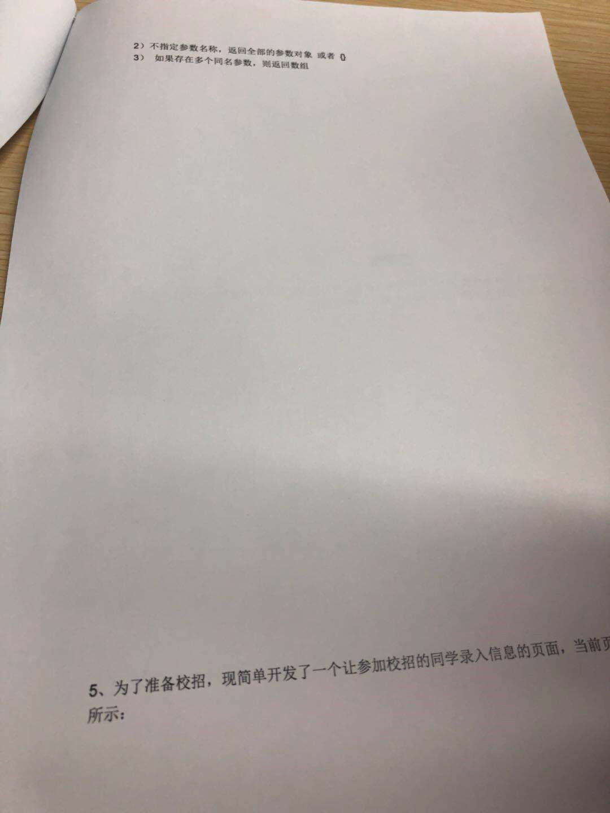
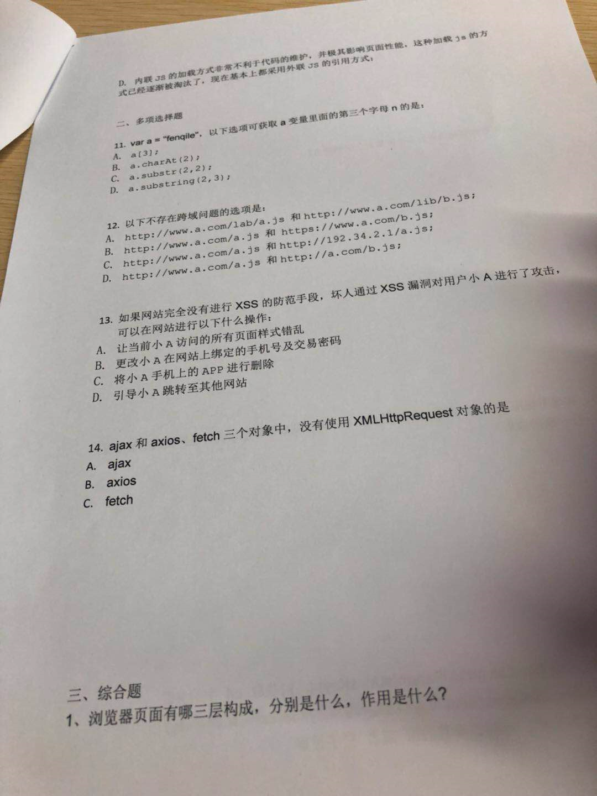
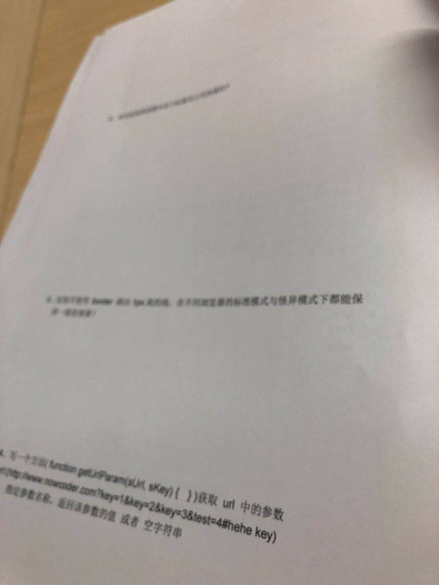
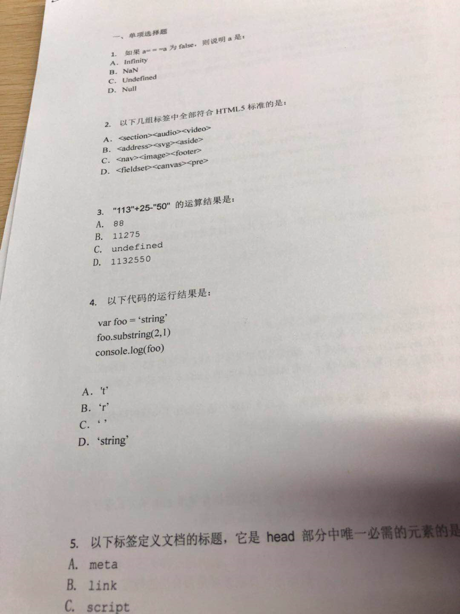
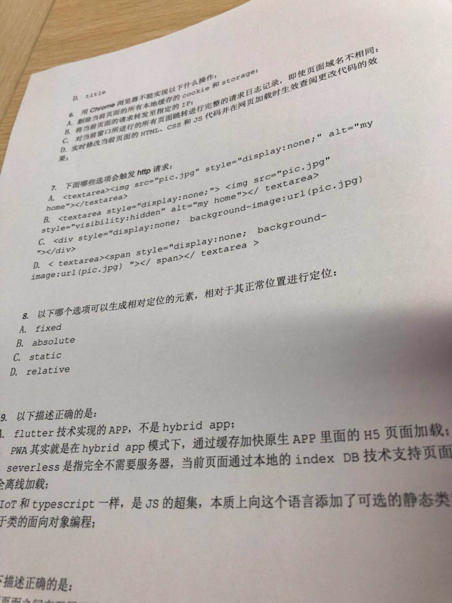

\- new 内部实现      

​       \- js中判断类型的方法      

​       \- typeof有什么不好的地方      

​       \- 最完美的方法的哪一种      

​       \- 如何实现一个对象的属性无法改变      

​       \- defineProperty还有什么其他可以配置的      

​       \- 还有什么其他实现的方法      

​       \- instanceof知道吗      

​       \- 他的作用是什么      

​       \- 他可以判断一个变量是否是数组么      

​       \- 深浅拷贝说一下      

​       \- object.assign实现的是什么      

​       \- 如何实现深拷贝      

​       \- 说一下你理解的闭包      

​       \- 闭包有什么缺点      

​       \- 平时的应用场景      

​       \- xss说一下      

​       \- csrf说一下      

​       \- token值怎么传递      

​       \- get方法怎么传递token值      

​       \- 前端性能优化      

​       \- 前端常用的数值单位      

​       \- rem和em的区别      

​       \- 1vw等于多少      

​       \- 为什么0.1+0.2不等于0.3      

​       \- 怎么让它等于0.3      

​       \- let a = {} 说一下这段代码变量的存储      

​       \- 那let a = 1呢      

​       \- 说一下let const var      

​       \- 箭头函数和普通函数的区别      

​       \- 给一段代码看输出(this指向问题)      

​       \- visible:hidden和display:none有什么区别      

​       \- 在render dom 和 tree dom里面呢?      

​       \- 浏览器的事件循环机制说一下      

​       \- 下面这段代码的输出结果      

​       \- 什么是同源策略      

​       \- 跨域的方式说一下      

​       \- 什么是事件***      

​       \- call bind apply有什么区别      

​       \- 实现居中的几种方式      

​       \- target和currTarget的区别      

​       \- vue的生命周期      

​       \- vue beforeCreated到create发生了什么      

​       \- vue 父子组件通信方式      

​       \- react 生命周期      

​       \- react父子组件通信方式      

​       \- react虚拟dom      

​       \- react diff过程      

​       \- react diff主要对比的是什么东西

Promise中错误是如何处理的

通过try catch扩展作用域捕错误，再通过订阅发布者模式来调用回调函数

-----

### 一面

1. react 中写类组件的时候，如何解决方法 this 丢失问题

   - 在 constructor 里使用 bind
   - 箭头函数

2. 使用 bind 和箭头函数的区别

3. react 生命周期中，在新版本有些将被废弃，也新增了一些生命周期，讲一下？

4. setState 是异步还是同步

5. VDOM 渲染原理

6. 实现一个方法，将传入对象的下划线命名方式全部换为驼峰式(考虑递归的场景)。比如

   ```
   // before
   const obj = {
     first_name: 'chen'
   }
   
   // after
   const obj = {
     firstName: 'chen'
   }
   复制代码
   ```

### 二面

1. es6的模块管理 与 commonjs 的对比
2. es6 Decorator
3. es6+ 新特性
4. 聊项目
5. Base64 的原理？编码后比编码前是大了还是小了。
6. 非递归实现树的后序遍历。（这个比较有意思，大家可以试下）


貌似不考浏览器和http。我可以把这方面讲进去，作为自己的两点

这里面webpack问的也少，性能优化呢

算法题，优化，js基础，框架核心问题。




备用公司：爱奇艺，招银 **PayPal eBay****携程**新浪


----

