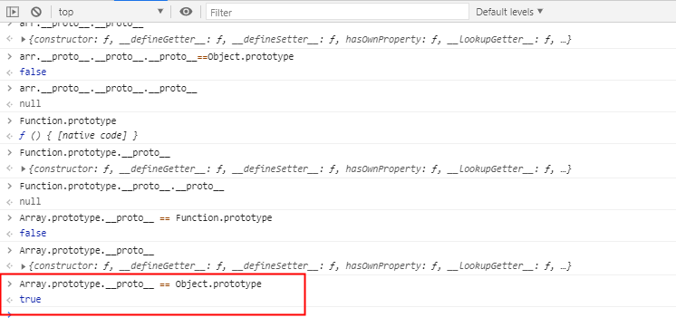
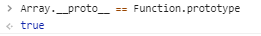

https://www.nowcoder.com/discuss/520603

引用类型保存在哪里？堆内存？直接保存在堆内存？

在 `JavaScript` 中，变量分为三种类型：


\1. 局部变量 

\2. 被捕获变量 （闭包）

\3. 全局变量 


***\*除了局部变量，其他的全都存在堆中！\****根据变量的数据类型，分为以下两种情况


echart的原理

canvas+单独的渲染线程，多线程渲染

Svg 和 Canvas 是两个可以选择的类库之一，其中 svg 交互性更好，性能较弱，不适用于移动端，在绘制数万个点时会崩溃。而 canvas 的渲染速度和性能更好，echarts 在 canvas 上构建一层 MVC层，使得它可以像 svg 一样交互。
3、ECharts 的特点：重要性和优先级依次递减，设计效果直观、生动，能够交互，可个性化定制。
4、ECharts 总体结构是基于 MVC 架构的，各部分的主要作用是：
Storage(M)：模型层，实现图形数据的CURD（增删改查）管理；
Painter(V)： 视图层，实现canvas 元素的生命周期管理，即：视图渲染、更新控制、绘图；
Handler(C)：控制层，事件交互处理，实现完整的dom事件模拟封装。


作者：木木心
链接：https://www.nowcoder.com/discuss/509219
来源：牛客网


自我介绍 

详细介绍自己的[项目]()，以及一些难点，做这些[项目]()的目的（[项目]()上谈了10多分钟） 

什么是跨域，怎么解决 

元素动画实现的几种方式（animation/transition/js） 

```javascript
function positionMessage() {
            if (!checkCompatibility) return;
            var ele = document.getElementById("message");
            ele.style.position = "absolute";
            ele.style.top = "100px";
            ele.style.left = "50px";
        }
```

除此之外，requestAnimationFrame还有以下两个优势：

- CPU节能：使用setTimeout实现的动画，当页面被隐藏或最小化时，setTimeout 仍然在后台执行动画任务，由于此时页面处于不可见或不可用状态，刷新动画是没有意义的，完全是浪费CPU资源。而requestAnimationFrame则完全不同，当页面处理未激活的状态下，该页面的屏幕刷新任务也会被系统暂停，因此跟着系统步伐走的requestAnimationFrame也会停止渲染，当页面被激活时，动画就从上次停留的地方继续执行，有效节省了CPU开销。
- 函数节流：在高频率事件(resize,scroll等)中，为了防止在一个刷新间隔内发生多次函数执行，使用requestAnimationFrame可保证每个刷新间隔内，函数只被执行一次，这样既能保证流畅性，也能更好的节省函数执行的开销。一个刷新间隔内函数执行多次时没有意义的，因为显示器每16.7ms刷新一次，多次绘制并不会在屏幕上体现出来。

todo：动画

es6的新特性 

display的属性 

vue的原理 

浏览器缓存 

webworker 

从输入url到渲染页面的流程 

对数据结构的了解 

归并[排序]() （默写归并排序，并自己验证）

**如何计算时间复杂度** （我很强）

-----

tcp  udp

参考：https://zhidao.baidu.com/question/337954440.html
基于TCP的有FTP、Telnet、SMTP、HTTP、POP3与DNS
基于UDP的有TFTP、SNMP与DNS
其中DNS既可以基于TCP，也可以基于UDP。

```
expires：date（过期日期）、cache-control： max-age=time（毫秒数，多久之后过期）                       |no-cache|no-store）。如果expires和cache-control同时存在，cache-control会覆盖expires。建议两个都写，cache-control是http1.1的头字段，expires是http1.0的头字段，都写兼容会好点。
```

## 1.0的时候见到我——Expires

最早使用的是Expires字段，该字段表示缓存到期时间，即有效时间+当时服务器的时间，然后将这个时间设置在header中返回给服务器。因此，该时间是一个绝对时间，举例说明：

```
Expires: Thu, 10 Nov 2017 08:45:11 GMT
```

在响应消息头中，设置这个字段之后，就可以告诉浏览器，在未过期之前不需要再次请求。

但是，这个字段设置时有**缺点**：

**由于是绝对时间，用户可能会将客户端本地的时间进行修改，而导致浏览器判断缓存失效，重新请求该资源**，同时，**还导致客户端与服务端的时间不一致**，致使缓存失效。

ETag 是为了解决 Last-modified 的一些缺陷：

- 一些资源的最后修改时间变了，但是内容没有改变；
- Last-modified 只能精确到秒级；

​    在Apache中设置Etag的支持比较简单，只需要在apache的配置中加入下面的内容就可以了：

- FileETag MTime Size 注解:FileETag指令配置了当文档是基于一个文件时用以创建ETag(实体标签)应答头的文件的属性(ETag的值用于进行缓冲管理以节约网 络带宽)。ETag的值由文件的inode(索引节点)、大小、最后修改时间决定。FileETag指令可以让您选择(如果您想进行选择)这其中 哪些要素 将被使用。主要关键字如下：
- INode 文件的索引节点(inode)数
- MTime 文件的最后修改日期及时间
- Size 文件的字节数
- All 所有存在的域，等价于：FileETag INode MTime Size
- None 如果一个文档是基于文件的，则不在应答中包含任何ETag头

会加上文件大小

------

这些都是校招，很有可能不是这种

作者：Rana1996
链接：https://www.nowcoder.com/discuss/495162
来源：牛客网


[Shopee]()新加坡[前端]()岗位  

  2020.9.1 一面： 

  \1. [算法]()：将长字符串按照格式转换： 

  若一个字符串长度 >= 4，则保留长字符串的首字母和结尾字母，中间替换为位数，例如： 

  elephant-walk => e6t-w2k， 

  解释：因为elephant长度 >= 4，所以取首字母e和尾字母t，中间有6位，因此转换为e6t 

  


  \2. css： 

  (1)：**js动画为什么比css的transform要慢？** 

## JavaScript 动画和 CSS 动画该如果抉择

- 根据 Google Developer，渲染线程分为 **主线程 (main thread)** 和 **合成线程 (compositor thread)**。如果 CSS 动画只是改变 `transforms` 和 `opacity`，这时整个 **CSS** 动画得以在 **合成线程** 完成（而JS动画则会在 **主线程** 执行，然后触发合成线程进行下一步操作），在 JS 执行一些昂贵的任务时，主线程繁忙，CSS 动画由于使用了合成线程可以保持流畅


  (2)：css优先级 （理解下伪类伪元素）

  \3. React为什么需要key 

  \4. Https怎么防止中间人攻击 

  \5. session，cookie和token有什么区别，有什么优劣

----

作者：BenjaminLPJ
链接：https://www.nowcoder.com/discuss/487434?source_id=profile_create&channel=1009
来源：牛客网

获取元素的第一个元素节点的方式（children[0]和firstElementChild，两者的性能对比）

时长1小时 

  自我介绍 

  [项目]()介绍， 

  js变量提升， 

  为什么有变量提升，**是这门语言的缺陷还是设计如此** 

**JS 存在变量提升，这个的设计其实是低劣的，或者是语言实现时的一个副作用**

  原型链， 

  事件机制，举例说明 

  **获取元素的第一个元素节点的方式（children[0]和firstElementChild，两者的性能对比）** 

最好使用children而不是firstchild和firstElementChild

兼容性好，firstchild会打印空白节点

`**ParentNode.children** `是一个只读属性，返回 一个Node的子[`elements`](https://developer.mozilla.org/zh-CN/docs/Web/API/Element) ，是一个动态更新的 [`HTMLCollection`](https://developer.mozilla.org/zh-CN/docs/Web/API/HTMLCollection)。

**`ParentNode.firstElementChild`** 只读属性，返回对象的第一个子 [`元素`](https://developer.mozilla.org/zh-CN/docs/Web/API/元素), 如果没有子元素，则为null。

dom元素获取api


  flex布局：多张图片纵项布局，水平居中 

  vue的生命周期 

  vuex（没用过） 

  网络相关： 

  请求头字段有哪些 

  同源策略 

  **http tcp udp ip ，说说作用和联系** 

***\*小结TCP与UDP的区别：\****

1.基于连接与无连接； 
2.对系统资源的要求（TCP较多，UDP少）； 
3.UDP程序结构较简单； 
4.流模式与数据报模式 ；

5.TCP保证数据正确性，UDP可能丢包，TCP保证数据顺序，UDP不保证。

tcp是端到端的，udp可以一对多，一对一


  dns协议基于哪个协议 

  数据结构与[算法]()： 

  举例说明栈的使用 

  数组二分查找和二叉搜索树各自的优劣在哪， 

  **二叉搜索树可能都最坏情况，举例** 

链表，on

  **如果一次性给定一组数据，如何建立二叉搜索树可以避免o(n)的情况** 

利用二叉平衡树，来保证不会出现on的极端情况（或者直接找到中间的节点，然后构建二叉树，复杂度太高了）


  **有没有听过迷宫[算法]()思想，如何建立迷宫一个正常的迷宫** 

todo：很难啊，明天来

  最后[算法题]()，**多层嵌套数组对象升序[排序]()** 

  ```js
var lans = [
    {
        "code": "ENG",
        "belongs" : [
            {
                "area" : "EU_A",
                "order" : 3
            },
            {
                "area" : "EU_B",
                "order" : 0
            },
            {
                "area" : "EM_A",
                "order" : 0
            },
            {
                "area" : "EM_B",
                "order" : 0
            },
            {
                "area" : "EM_C",
                "order" : 0
            }
        ]
    },
    {
        "code": "FRC",
        "belongs" : [
            {
                "area" : "EU_A",
                "order" : 2
            },
            {
                "area" : "EU_B",
                "order" : 1
            }
        ]
    },
    {
        "code": "DEU",
        "belongs" : [
            {
                "area" : "EU_A",
                "order" : 1
            },
            {
                "area" : "EU_B",
                "order" : 2
            }
        ]
    }
];


var value = [];

for(var i=0; i<lans.length; i++){
     for(var j=0; j<lans[i].belongs.length; j++){
         if(lans[i].belongs[j].area === "EU_A"){
             value.push(lans[i]);
         }
     }
}

function compare(propL1, sortProp, index){
    return function(obj1, obj2){
        var belongsA = obj1[propL1];
        var belongsB = obj2[propL1];

        var value1 = 0, value2 = 0;
        for(var i=0; i<belongsA.length; i++){
             if(belongsA[i].area === index){
                 value1 = belongsA[i][sortProp];
             }
        }
        for(var j=0; j<belongsB.length; j++){
            if(belongsB[j].area === index){
                value2 = belongsB[j][sortProp];
            }
        }
        return value1 - value2;
    }
}


for(var k=0; k<value.length; k++){
    console.log("order is: " + value[k].code);
}

value.sort(compare("belongs", "order", "EU_A"));

for(var k=0; k<value.length; k++){
    console.log("order after sort is: " + value[k].code);
}
  ```


  虽然有一些忘记了，答的不太好，还是许愿个二面吧

----

作者：Dandelion21
链接：https://www.nowcoder.com/discuss/499316
来源：牛客网


9/4 40min 

  1 .进程跟线程的区别，进程间的通信方式 

  2.**浏览器是多线程的吗？** 

浏览器是多进程的

## 浏览器多进程架构

跟现在的很多多线程浏览器不一样，Chrome浏览器使用多个进程来隔离不同的网页。因此在Chrome中打开一个网页相当于起了一个进程

## 浏览器内核是多线程

浏览器内核是多线程，在内核控制下各线程相互配合以保持同步，一个浏览器通常由以下常驻线程组成：

- GUI 渲染线程
- JavaScript引擎线程
- 定时触发器线程
- 事件触发线程
- 异步http请求线程


  3.hash表了解吗？ 

  4.**平衡[二叉树]()是什么，平衡[二叉树]()的应用场景。** 

平衡二叉树的提出就是为了保证树不至于太倾斜，尽量保证两边平衡。因此它的定义如下：

1. 平衡二叉树要么是一棵空树
2. 要么保证左右子树的高度之差不大于 1
3. 子树也必须是一颗平衡二叉树


  5.写了一手快排，我写的空间复杂度太高了，要求优化。 

  6**.var arr=new Array();写出这个arr的原型链；** 

记住，任何东西的prototype他是一个对象，所以他的隐式原型指向对象



Array的隐式原型指向Function.prototype

因为Array是函数创建的




  7.写一个简单的闭包，讲闭包的原理； 

  8.this的指向分情况讲一下； 

  9.箭头函数跟普通函数的区别； 

  10.箭头函数的this指向； 

  11.实现call方法； 

  12call.apply和bind的区别；

-----

作者：木子凡凡
链接：https://www.nowcoder.com/discuss/507260
来源：牛客网


自我介绍

队列和栈的区别

[排序]()[算法]()以及各自的复杂度

**快排什么时候复杂度最差**

已经排好序，并且每次去的基准都是最左边元素

快速排序优化

五层网络模型

**应用层有哪些协议，哪些是TCP，哪些是UDP**


TCP 三次握手和四次挥手

**TCP UDP的区别**

HTTP请求有哪些缓存相关的header字段

**cache-control和expires的优先级，为什么**

cache-control是http1.1的，expires是http1.0的

**Etag和Last-Modified的区别**

**Etag返回什么状态码**

服务端返回200，并带上etag

协商缓存时：if none match ：etag

304 etag

last-modified

if -modified-since


3开头的还有什么状态码，4开头的呢，5开头的呢，**504表示什么（网关超时）**细节背诵 todo

事务的四个特性

原子性、一致性、隔离性、持久性

进程与线程的区别

[复制代码](#)

```
1``、进程是资源分配的最小单位，线程是程序执行的最小单位（资源调度的最小单位）``2``、进程有自己的独立地址空间，每启动一个进程，系统就会为它分配地址空间，建立数据表来维护代码段、堆栈段和数据段，这种操作非常昂贵。``而线程是共享进程中的数据的，使用相同的地址空间，因此CPU切换一个线程的花费远比进程要小很多，同时创建一个线程的开销也比进程要小很多。``3``、线程之间的通信更方便，同一进程下的线程共享全局变量、静态变量等数据，而进程之间的通信需要以通信的方式（IPC)进行。不过如何处理好同步与互斥是编写多线程程序的难点。``4``、但是多进程程序更健壮，多线程程序只要有一个线程死掉，整个进程也死掉了，而一个进程死掉并不会对另外一个进程造成影响，因为进程有自己独立的地址空间。
```

**nodejs是单线程还是多线程的，Java呢，[C++]()呢**

**nodejs单线程的好处是什么**

而node.js采用单线程异步非阻塞模式，也就是说每一个计算独占cpu，遇到I/O请求不阻塞后面的计算，当I/O完成后，以事件的方式通知，继续执行计算2。

**NodeJS适合运用在高并发、I/O密集、少量业务逻辑的场景。**

还有其他原因，复习下笔记

[复制代码](#)

```
（``1``）多线程占用内存高``（``2``）多线程间切换使得CPU开销大``（``3``）多线程由内存同步开销``（``4``）编写单线程程序简单``（``5``）线程安全
```

水平垂直居中怎么实现

箭头函数与普通函数的区别

**箭头函数能实现ES6的类吗**

不能，没有protorype不能用来创建实例，没有new关键字，this绑定也无法实现

判断数组的方式，instanceof方法有什么弊端

v-if 和 v-show的区别

display:none和visibility：hidden的区别

Vue双向数据绑定原理

**Vue怎么监听数组的变化**

Vue通过重写数组的某些方法（7种）来监听数组变化，而不是触发数组的setter方法

Vue3里通过什么方式监听数据

Vue key的作用

**列表里调整顺序，虚拟DOM是怎么发生变化的**（就是按照存有key的hash值再找一遍）

看代码输出

[复制代码](#)

```
Promise.resolve().then(() => {``  ``console.log(``'1'``);``  ``throw` `'Error'``;``}).then(() => {``  ``console.log(``'2'``);``}).``catch``(() => {``  ``console.log(``'3'``);``  ``throw` `'Error'``;``}).then(() => {``  ``console.log(``'4'``);``}).``catch``(() => {``  ``console.log(``'5'``);``}).then(() => {``  ``console.log(``'6'``);``});``// 1 3 5 6
```

[复制代码](#)

```
console.log(``'1'``);``setTimeout(() => {``  ``console.log(``'2'``);``}, 0);``Promise.resolve().then(() => {``  ``console.log(``'3'``);``}).then(() => {``  ``console.log(``'4'``);``});``console.log(``'5'``);` `// 1 5 3 4 2
```

代码讲思路

[复制代码](#)

```
给你一个数组 nums，对于其中每个元素 nums[i]，请你统计数组中比它小的所有数字的数目， 以数组形式返回答案。``换而言之，对于每个 nums[i] 你必须计算出有效的 j 的数量，其中 j 满足 j != i 且 nums[j] < nums[i] 。` `示例 ``1``：``输入：nums = [``8``,``1``,``2``,``4``,``3``]``输出：[``4``,``0``,``1``,``3``,``2``]``解释：``对于 nums[``0``]=``8` `存在四个比它小的数字：（``1``，``2``，``4` `和 ``3``）。``对于 nums[``1``]=``1` `不存在比它小的数字。``对于 nums[``2``]=``2` `存在一个比它小的数字：（``1``）。``对于 nums[``3``]=``4` `存在三个比它小的数字：（``1``，``2` `和 ``3``）。``对于 nums[``4``]=``3` `存在两个比它小的数字：（``1``，``2``）。` `示例 ``2``：``输入：nums = [``6``,``5``,``4``,``8``]``输出：[``2``,``1``,``0``,``3``]
```

思路：暴力循环，两层循环，时间复杂度O(N^2)
如何优化：先用map将nums的元素与索引保存下来，然后对index[排序]()，排完只要一层遍历即可，时间复杂度O(NlogN)

**map可以排序**

[复制代码](#)

```
function` `solution(nums) {``  ``let map = {};``  ``nums.forEach((item, index) => {``    ``map[item] = index;``  ``})``  ``nums.sort((a, b) => a - b);``  ``let res = [];``  ``for` `(let i = 0; i < nums.length; i++) {``    ``let n = nums[i];``    ``res[map[n]] = i;``  ``}``  ``return` `res;``}
```

反问

部门业务，[前端]()规模

https://www.nowcoder.com/discuss/507260

---

作者：小银鱼要努力
链接：https://www.nowcoder.com/discuss/520603
来源：牛客网


个人研究和[项目]()方向与[前端]()毫无关系所以问的内容偏基础，参考价值可能不太大。 

  \1.  css 中 position 属性可以设置为哪些值？ 

   ->追问：设置成  inherit，initial，unset之后的position是怎样的？  

   \2. 布局题：使用flex布局模型，用 display: flex 实现一个三栏布局，左右定宽 100px，中间自适应。  

   \3. 跨域：追问->怎么解决浏览器的xhr跨域请求限制？cors

[复制代码](#)

```
  ``a.test.shopee.com``  ``b.test.shopee.com``  ``c.shopee.io``  ` `  ``a网站下是否能访问b域名下: ``  ``-``  ``-xhr请求b域名` `  ``a网站下，请求c服务``  ``-xhr请求c域名
```

 \4. 根据代码写输出   

[复制代码](#)

```
  ``(``function``(){``    ``var` `x = y = 1;``  ``})();``  ``var` `z;``  ` `  ``console.log(y); ``// 1``  ``console.log(z); ``// undefined``  ``console.log(x); ``// ReferenceError
```

 \5. 根据代码写输出  

[复制代码](#)

```
  ``var` `obj = {x:1}``  ``function` `foo(o) {``    ``o.x = 2;``    ``o = 100;``  ``}``  ``foo(obj);
```

 \6. JSON.stringify：输出的foo的key是什么？ 

[复制代码](#)   牛逼

```js
  let foo={}    
  let obj = {}    
  foo[obj]= 'hello'         
  console.log(JSON.stringify(foo))//[objec Object]{"[object Object]":"hello"}
```

 \7. this指向问题： 


[复制代码](#)

```
  ``var` `a = 10``  ``var` `obj = {``   ``a: 20,``   ``say: () => {``    ``console.log(``this``.a)``   ``}``  ``}``  ``obj.say() ``  ``var` `anotherObj={a:30} ``  ``obj.say.apply(anotherObj) 
```

 \8. 原型链： 

[复制代码](#)

```
  ``function` `Parent() {``   ``this``.a = ``'Parent'``  ``}``  ` `  ``function` `Child() {``   ``this``.a = ``'Child'``  ``}``  ` `  ``Function.prototype.print = ``function``() {``   ``console.log(``this``.a)``  ``}``  ` `  ``Parent.print()``  ``Child.print()``  ` `  ``var` `p = ``new` `Parent()``  ``p.print()
```

 \9. 事件循环： 

[复制代码](#)

```
 ``console.log(1);``  ` `  ``setTimeout(() => {``   ``console.log(2);``   ``Promise.resolve().then(() => {``    ``console.log(3)``   ``});``  ``});``  ` `  ``new` `Promise((resolve, reject) => {``   ``console.log(4)``   ``resolve(5)``  ``}).then((data) => {``   ``console.log(data);``  ``})``  ` `  ``setTimeout(() => {``   ``console.log(6);``  ``})``  ` `  ``console.log(7);
```

 \10. HTTP2.0与HTTP1.1的区别。 

  ->HTTP2.0的多路复用原理是什么？ 

  \11. cookie可以携带什么属性？ 

  ->HttpOnly属性的作用？  

  \12. 单页面应用有什么缺点？ 

  \13. 代码优化（求解答！） 

[复制代码](#)

```
  ``const getUserTips = (userType, status) => {``    ``// normal user``    ``if``(userType === 1) {``      ``if``(status === 1) {``        ``return` `'normal user'``      ``} ``else` `if``(status === 2) {``        ``return` `'frozen user'``      ``} ``else` `{``        ``return` `'unknown user'``      ``}``    ``} ``else` `if``(userType === 2) {``    ``// vip user ``      ``if``(status === 1) {``        ``return` `'normal vip user'``      ``} ``else` `if``(status === 2) {``        ``return` `'vip user forever'``      ``} ``else` `{``        ``return` `'unknown vip user'``      ``}``    ``} ``else` `{``      ``return` `'unknown status user'``    ``}``  ``}
```

 \14. 简单编程： 打印红绿灯: 打印red，停10s，打印yellow，停2s，打印 green 停 5s。 继续打印red，停10s...，以此类推循环5次。

  


  大概就是以上内容，可能有小知识点遗漏了。

----

- webpack.then原理

---

