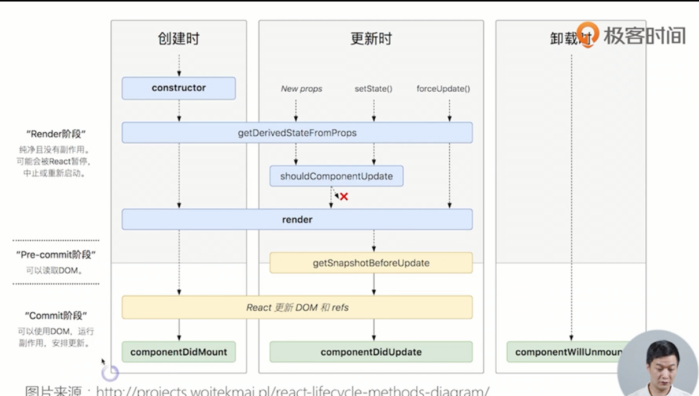

# 监听数据变化的实现原理不同

**监听数据变化的实现原理不同**

- Vue 通过 getter/setter 以及一些函数的劫持，能精确知道数据变化，不需要特别的优化就能达到很好的性能

- React 默认是通过比较引用的方式进行的，如果不优化（PureComponent/shouldComponentUpdate(更新钩子)）可能导致大量不必要的VDOM的重新渲染（为什么会导致大量不必要的渲染？？?）

  > react中重复渲染
  >
  > ```html
  > 组件的 props/state 更改(开发者控制) -> shouldComponentUpdate（开发者控制）-> 计算 VDOM 的更新（React 的 diff 算法会计算出最小化的更新）-> 更新真实 DOM (React 控制)
  > ```
  >
  > 

**数据流不同，vue是双向数据，react是单向，**

**HoC 和 mixins**

  在 Vue 中我们组合不同功能的方式是通过 mixin，而在React中我们通过 HoC (高阶组件）。

> React 最早也是使用 mixins 的，不过后来他们觉得这种方式对组件侵入太强会导致很多问题，就弃用了 mixinx 转而使用 HoC，关于mixin究竟哪里不好，可以参考React官方的这篇文章 Mixins Considered Harmful
>
> 而 Vue 一直是使用 mixin 来实现的。
>
> 为什么 Vue 不采用 HoC 的方式来实现呢？
>
> 高阶组件本质就是高阶函数，React 的组件是一个纯粹的函数，所以高阶函数对React来说非常简单。
>
> vue的设计导致无法实现
>
> 推荐一篇很棒的文章讲的是vue中如何实现高阶组件 探索Vue高阶组件

**组件通信不一样**


React 本身并不支持自定义事件，Vue中子组件向父组件传递消息有两种方式：事件和回调函数，而且Vue更倾向于使用事件。但是在 React 中我们都是使用回调函数的，这可能是他们二者最大的区别。

（react中的事件？？？）子组件，调用父组件的props，中的方法，传递对应的参数

```react
    handleTemp = (e) =>{
        // 接受父组件传递过来的函数，调用并传值给父组件
        this.props.onTemperateChange(e.target.value)
    };
    render(){
        return(
            <p>
                <label htmlFor="tempInput">请输入天气温度：</label>
                {/* onChange 事件调用函数*/}
                <input className="Tem-input" type="text" name="tempInput" value={this.props.temperature} onChange={this.handleTemp}/>
            </p>
        );
    } 
```


**模板渲染方式的不同**

- React 是通过JSX渲染模板
- 而Vue是通过一种拓展的HTML语法进行渲染

> react中render函数是支持闭包特性的，所以我们import的组件在render中可以直接调用。但是在Vue中，由于模板中使用的数据都必须挂在 this 上进行一次中转，所以我们import 一个组件完了之后，还需要在 components 中再声明下，这样显然是很奇怪但又不得不这样的做法。

**Vuex 和 Redux 的区别**

> 在 Vuex 中，$store 被直接注入到了组件实例中，因此可以比较灵活的使用：
>
> - 使用 dispatch 和 commit 提交更新
> - 通过 mapState 或者直接通过 this.$store 来读取数据
>
> 在 Redux 中，我们每一个组件都需要显示的用 **connect 把需要的 props 和 dispatch 连接起来。**
>
> 另外 Vuex 更加灵活一些，组件中既可以 dispatch action 也可以 commit updates，而 Redux 中只能进行 dispatch，并不能直接调用 reducer 进行修改
>
> 从实现原理上来说，最大的区别是两点：
>
> - Redux 使用的是不可变数据，而Vuex的数据是可变的。Redux每次都是用新的state替换旧的state，而Vuex是直接修改
> - Redux 在检测数据变化的时候，是通过 diff 的方式比较差异的，而Vuex其实和Vue的原理一样，是通过 getter/setter来比较的（如果看Vuex源码会知道，其实他内部直接创建一个Vue实例用来跟踪数据变化）

## vue响应式原理 

 get set dep  watcher

## react16新特性

**render可以返回字符串，数组，数字**

**React 16**：用于捕获**子组件树的**JS异常（即错误边界只可以捕获组件在树中比他低的组件错误。），记录错误并展示一个回退的UI。

Portal可以帮助我们在JSX中跟普通组件一样直接使用dialog, 但是又可以让dialog内容层级不在父组件内，而是显示在独立于原来app在外的同层级组件。

**优化SSR**

具体优化了下面五个方面：

1. 生成更简洁的HTML
2. 宽松的客户端一致性校验
3. 无需提前编译
4. react 16服务端渲染速度更快
5. 支持流式渲染

由于Fiber不是新的API，是react对于对比更新的一种新算法

****主要特性：Fragement

React 15：render函数只能接受一个组件，所以一定要外层包一层<div>。

React16：可以通过Fragement直接返回多个组件。

**一、新的生命周期函数**

由于异步渲染的改动，有可能会导致componentWillMount, componentWillReceiveProps,componentWillUpdate ，所以需要抛弃三个函数。

**二、新的context API**

1、context 就是可以使用全局的变量，不需要一层层pass props下去，比如主题颜色


## vue3 的 composition API 有什么优点？

```vue
<template>
  <button @click="increment">
    Count is: {{ state.count }}, double is: {{ state.double }}
  </button>
</template>

<script>
import { reactive, computed } from 'vue'

export default {
  setup(props, context) {
    const state = reactive({
      count: 0,
      double: computed(() => state.count * 2)
    })
    
    function increment() {
      state.count++
    }
    
    return {
      state,
      increment
    }
  }
}
</script>
复制代码
```

  从上面的基础例程可以看到，vue3的.vue组件大体还是和vue2一致，由`template``、script`和`style`组成，作出的改变有以下几点：

- 组件增加了setup选项，组件内所有的逻辑都在这个方法内组织，返回的变量或方法都可以在模板中使用。
- vue2中`data`、`computed`等选项仍然支持，但使用`setup`时不建议再使用vue2中的`data`灯选项。
- 提供了`reactive`、`computed`、`watch`、`onMounted`等抽离的接口代替vue2中`data`等选项。

就是换了一种写法，不再是定义一个对象，options


Composition API提高了代码的上限，也降低了代码的下限。在使用Options API时，即便再菜的鸟也能保证各种代码按其种类进行划分。但使用Composition API时，由于其开放性，出现什么代码是无法想象的。但毫无疑问，Options API到Composition API是vue的一个巨大进步，vue从此可以从容面对大型项目。


同一个逻辑代码可以放在一起，而不是按规定的地方写

在vue2中要实现逻辑复用主要有两种方式：mixin  Scoped slot

Composition Function
  在vue3中提供了一种叫Composition Function的方式，这种方式允许像函数般抽离逻辑：不再受this的控制，可以调api拿到对应数据


逻辑组合和复用

类型推导：Vue3.0 最核心的点之一就是使用 TS 重构，以实现对 TS 丝滑般的支持。而基于函数 的 API 则天然对类型推导很友好。

打包尺寸：每个函数都可作为 named ES export 被单独引入，对 tree-shaking 很友好；其次所有函数名和 setup 函数内部的变量都能被压缩，所以能有更好的压缩效率。


优点就是： 复用更方便， 提高灵活度 更好的支持ts 易于treeshaking


## 和 react hook 的区别在哪里？

让函数组件里面可以使用class组件中的一些东西：生命周期函数，state，props refs

我们知道，functional component在使用的时候有一些限制，比如需要生命周期、state的时候就不能用functional component。 而有了Hooks，你就可以在funtional component里，使用class component的功能:props，state，context，refs，和生命周期函数等等

**Hooks:**

如果需要用Hooks实现，变成

```
    import React, { useState } from 'react';
    
    function Example() {
      // Declare a new state variable, which we'll call "count"
      const [count, setCount] = useState(0);
    
      return (
        <div>
          <p>You clicked {count} times</p>
          <button onClick={() => setCount(count + 1)}>
            Click me
          </button>
        </div>
      );
    }
```

**3.更新state**

Class:

```
<button onClick={() => this.setState({ count: this.state.count + 1 })}>
    Click me
  </button>
复制代码
```

Hooks:

```
 <button onClick={() => setCount(count + 1)}>
    Click me
  </button>
```

1. Hooks只可以在顶层使用。也就是说它不能写在循环体，条件渲染，或者嵌套function里
2. 只可以在React的function组件里使用Hooks。


## Vue 的生命周期具体讲一下

**beforeCreate**


**created**

**beforeMount**

**mounted**

**beforeUpdate**

**updated**

**beforeDestroy**

**destroyed**

当组件在 `<keep-alive>` 内被切换，它的 `activated` 和 `deactivated` 这两个生命周期钩子函数将会被对应执行。

## 数据绑定是在什么时候？

在这个生命周期之间，进行**初始化事件，进行数据的观测**，可以看到在**created**的时候数据已经和**data属性进行绑定**（放在data中的属性当值发生改变的同时，视图也会改变）。

created是可以拿到this，但是beforeCreated没有拿到this


## render 和 模板渲染呢？

activated和deactived是在mounted之后，触发，渲染出来了肯定才能进行keep-alive切换。

render和模板渲染之后就render和渲染，update也会渲染（数据更新时调用）

beforeUpdate
   数据更新之前
   可在更新前访问现有的DOM,如手动移除添加的事件监听器；

updated :
   完成虚拟DOM的重新渲染和打补丁；
   组件DOM 已完成更新；
   可执行依赖的dom 操作
   注意：不要在此函数中操作数据，会陷入死循环的。

## 讲讲 Vue 的 nextTick 方法


## react 中写类组件的时候，如何解决方法 this 丢失问题

**1.** jsx中this没有默认绑定，需要使用bind绑定，否则this会是undefined。

由于类的方法默认不会绑定this，因此在调用的时候如果忘记绑定，this的值将会是undefined。

通常如果不是直接调用，应该为方法绑定this。

**2.** 这个问题的本质原因如下：

这不是React的原因，这是JavaScript中本来就有的。如果你传递一个函数名给一个变量，然后通过在变量后加括号()来调用这个方法，此时方法内部的this的指向就会丢失。

**3.** 在React（或者说JSX）中，传递的事件参数不是一个字符串，而是一个实实在在的函数：

这样说，React中的事件名（eg:onClick、onChange）就是所举例子中的中间变量，React在事件发生时调用onClick，由于onClick只是中间变量，所以处理函数中的this指向会丢失，其实真正调用时并不是this.handleClick(),如果是这样调用那么this指向就不会有问题。真正调用时是onClick()。

- 在 constructor 里使用 bind
- 箭头函数
- 使用 bind 和箭头函数的区别9

(1). 在构造函数中使用bind绑定this

```react
class Button extends React.Component {
constructor(props) {
    super(props);
    this.handleClick = this.handleClick.bind(this);
  }
  handleClick(){
    console.log('this is:', this);
  }
  render() {
    return (
      <button onClick={this.handleClick}>
        Click me
      </button>
    );
  }
}
```


(2). 在调用的时候使用bind绑定this

```react
class Button extends React.Component {
  handleClick(){
    console.log('this is:', this);
  }
  render() {
    return (
      <button onClick={this.handleClick.bind(this)}>
        Click me
      </button>
    );
  }
}
```


(3). 在调用的时候使用箭头函数绑定this

```react
class Button extends React.Component {
  handleClick(){
    console.log('this is:', this);
  }
  render() {
    return (
      <button onClick={()=>this.handleClick()}>
        Click me
      </button>
    );
  }
}
```


(4). 使用属性初始化器语法绑定this(实验性)

​    静态方法，this指向当前实例

```react
class Button extends React.Component {
  handleClick=()=>{
    console.log('this is:', this);
  }
  render() {
    return (
      <button onClick={this.handleClick}>
        Click me
      </button>
    );
  }
}
```


## Vue 组件通讯 (因为我主技术栈是 Vue, 所以只问了 Vue 相关的东西)


## react 生命周期中，在新版本有些将被废弃，也新增了一些生命周期，讲一下？

React 在 V16.3 版本中，为下面三个生命周期函数加上了 `UNSAFE`：

- `UNSAFE_componentWillMount`
- `UNSAFE_componentWillReceiveProps`
- `UNSAFE_componentWillUpdate`

componentWillMount:  有人会多次调用willmount方法，有人会在这个方法里面写ajax请求

`UNSAFE_componentWillReceiveProps` 可能在一次更新中被多次调用应该使用 `componentDidUpdate`，因为它保证每次更新只调用一次。

新加的生命周期

- `static getDerivedStateFromProps`
- `getSnapshotBeforeUpdate`

看不下去，没做过，看不明白


## setState 是异步还是同步

在React中，**如果是由React引发的事件处理（比如通过onClick引发的事件处理），调用setState不会同步更新this.state，除此之外的setState调用会同步执行this.state** 。所谓“除此之外”，指的是绕过React通过addEventListener直接添加的事件处理函数，还有通过setTimeout/setInterval产生的异步调用。

**原因：** 在React的setState函数实现中，会根据一个变量isBatchingUpdates判断是直接更新this.state还是放到队列中回头再说，而isBatchingUpdates默认是false，也就表示setState会同步更新this.state，但是，**有一个函数batchedUpdates，这个函数会把isBatchingUpdates修改为true，而当React在调用事件处理函数之前就会调用这个batchedUpdates，造成的后果，就是由React控制的事件处理过程setState不会同步更新this.state**。

这里所说的同步异步， 并不是真正的同步异步， 它还是同步执行的。

这里的异步指的是多个state会合成到一起进行批量更新。

希望初学者不要被误导


## VDOM 渲染原理

Vue中的模板解析和渲染的核心就是：通过类似snabbdom的h()和patch()的函数，现将模板解析成vnode，如果是初次渲染，则通过patch(container,vnode)将vnode渲染至页面，如果是二次渲染，则通过patch(vnode,newNode)，先通过Diff算法比较原vnode和newNode的差异，以最小的代价重新渲染页面

todo：不够全，还需要加强

## 怎么做懒加载，如果我们想点击一个按钮，然后动态加载 modal，要怎么做（import().then()）

```js
//index.js
/*在页面上有一个按钮，点击按钮去加载资源resource.js*/
let button = document.createElement('button');

button.innerHTML = "点击";

button.addEventListener('click',function(){
 console.log('click');
 //es6草案中的语法,利用jsonp实现动态加载文件
 //直接使用不支持，需要利用语法动态导入的插件@babel/plugin-syntax-dynamic-import
 //vue的懒加载  react的懒加载都是这个原理，打包的时候会打包好resource.js文件，然后按需去动态加载
 import('./resource.js').then(data => {
  console.log(data.default);//数据是放在data的default属性里的
 })
});
```


## 实现一个记忆函数8(react中记忆函数，是用的插件，vue中的计算属性有缓存

```js
// 第二版 (来自 underscore 的实现)
var memorize = function(func, hasher) {
    var memoize = function(key) {
        var cache = memoize.cache;
        var address = '' + (hasher ? hasher.apply(this, arguments) : key);
        if (!cache[address]) {
            cache[address] = func.apply(this, arguments);
        }
        return cache[address];
    };
    memoize.cache = {};
    return memoize;
};
var add = function(a, b, c) {
  return a + b + c
}

var memoizedAdd = memorize(add)

memoizedAdd(1, 2, 3) // 6
memoizedAdd(1, 2, 4) // 6

```

适用于大量依赖之前的结果的场景

就是动态规划中，把之前递归的结果存储起来

## vue 父子组件通信方式 

## react 生命周期 

这个理不清，背图片吧



## react父子组件通信方式 
## react虚拟dom 

- Web UI 中 DOM 节点跨层级的移动操作特别少，可以忽略不计。
- 拥有相同类的两个组件将会生成相似的树形结构，拥有不同类的两个组件将会生成不同的树形结构。
- 对于同一层级的一组子节点，它们可以通过唯一 id 进行区分。


## react diff过程 

看不下去，休息一下，再战，找个好的图解的文章来看

## react diff主要对比的是什么东西


## vue中nextTIck有什么用，怎么实现 


## 为什么vue data是一个函数而不是一个对象 