# 综合大范围题

## 类型

详细文章有讲原理，nan变成数字是0 undefined转成数字是nan nan转布尔fasle

```js
if ( !undefined
  && !null
  && !0
  && !NaN
  && !''
) {
  console.log('true');
} // true
```

# 隐式类型转换（自动类型转换）

当js期望得到某种类型的值，而实际在那里的值是其他的类型，就会发生隐式类型转换。系统内部会自动调用我们前面说ToBoolean ( argument )、ToNumber ( argument )、ToString ( argument )，尝试转换成期望的数据类型。

如果是对象就会使用ToPrimitive ( input [ , PreferredType ] )方法来判断，就会调用对象的valueof和tostring方法，根据参数是number还是不是number来决定valueof和tostring那个先那个后

封装一个类型鉴定函数

```js
[]+[]
//  ""
// 提示：ToPrimitive([])返回空字符串

[] + {}
//  "[object Object]"
//  提示：ToPrimitive({})返回"[object Object]"

123 + { toString: function () { return "def" } }
//  "123def"
//  提示：ToPrimitive(加号右边的对象)返回"def"

{} + []
//  0
// 结果不符合我们的预期："[object Object]"
// 提示：在Chrome中，符号左边的{}被解释成了一个语句块，而不是一个对象
// 注意在别的执行引擎上可能会将{}解释成对象
//  这一行等价于'+[]'
// '+anyValue'等价于Number(anyValue)

({}) + []
//  "[object Object]"
// 加上括号以后，{}被解释成了一个对象，结果符合我们的预期了
```

隐式转换的例子，所以把连个表背了之后，就ok了

valueof

| 象       | 返回值                                                       |
| -------- | ------------------------------------------------------------ |
| Array    | 数组本身（对象类型）。                                       |
| Boolean  | 布尔值（原始类型）。                                         |
| Date     | 从 UTC 1970 年 1 月 1 日午夜开始计算，到所封装的日期所经过的毫秒数（原始类型）。 |
| Function | 函数本身（对象类型）。                                       |
| Number   | 数字值（原始类型）。                                         |
| Object   | 对象本身（对象类型）。**如果自定义对象没有重写valueOf方法，就会使用它。** |
| String   | 字符串值（原始类型）。                                       |

tostring方法toString()则不一样，因为**不管什么对象，我们总有办法“描述”它**，因此js内置对象的toString()总能返回一个原始string类型的值。

### ToBoolean ( argument )（一定能转成功，[]为true +0 -0 nan false）

| Argument Type | Result                                                       |
| ------------- | ------------------------------------------------------------ |
| Undefined     | Return false                                                 |
| Null          | Return false                                                 |
| Boolean       | Return argument                                              |
| Number（）    | 仅当argument为 +0, -0, or NaN时， return false; 否则一律 return true |
| String        | 仅当argument是空字符串（长度为0）时， return false; 否则一律 return true |
| Symbol        | Return true                                                  |
| Object        | Return true                                                  |

##  [] == false 和 !![] == true

true true

注意所有对象，转布尔都是true

### ToNumber ( argument )

| Argument Type | Result                                                       |
| ------------- | ------------------------------------------------------------ |
| Undefined     | Return NaN                                                   |
| Null          | Return +0                                                    |
| Boolean       | 如果 argument 为 true, return 1. 如果 argument 为 false, return +0 |
| Number        | 直接返回argument                                             |
| String        | 将字符串中的内容转化为数字（比如"23"->23），如果转化失败则返回NaN（比如"23a"->NaN）（含有字符串就是nan） |
| Symbol        | 抛出 TypeError 异常                                          |
| Object        | 先**primValue = ToPrimitive(argument, Number)**，再对primValue 使用 ToNumber(primValue)（调用valueof，是原始类型就ok，不是就tostring是原始类型就返回，都不是就报错），一般都是转成字符串，只有[]能变成''空字符串就变成0 |

### ToString ( argument )(一定能转成，不会报类型错误)

| Argument Type | Result                                                       |
| ------------- | ------------------------------------------------------------ |
| Undefined     | Return "undefined"                                           |
| Null          | Return "null"                                                |
| Boolean       | 如果 argument 为 true, return "true".如果 argument 为 false, return "false" |
| Number        | 用字符串来表示这个数字                                       |
| String        | 直接返回 argument                                            |
| Symbol        | 抛出 TypeError 异常                                          |
| Object        | 先primValue = ToPrimitive(argument, hint String)，再对primValue使用ToString(primValue)（先tostring再valueof，都不是就报错） |

**个个排序算法时间复杂度**

\9. 各类排序算法介绍，冒泡，快排，堆排，以及相应的算法复杂度

## 快速排序和归并排序的大致实现以及其复杂度

> 取第一个元素为基准元素，然后，两个指针
>
> 先前面的指针，如果比基准大，就++
>
> while（大）j--
>
> i = j
>
> while（i小于target）i++
>
> j = i
>
> i=  target
>
> 递归基准的左右两边

>  归并 
>
>  按长度分成两部门，然后merge（sort（前），sort（后））
>
>  ```js
>   function mergeSort(array) {
>     if (array.length < 2) {
>       return array;
>     }
>     const mid = Math.floor(array.length / 2);
>     const front = array.slice(0, mid);
>     const end = array.slice(mid);
>     return merge(mergeSort(front), mergeSort(end));
>   }
>  
>   function merge(front, end) {
>     const temp = [];
>     while (front.length && end.length) {
>       if (front[0] < end[0]) {
>         temp.push(front.shift());
>       } else {
>         temp.push(end.shift());
>       }
>     }
>     while (front.length) {
>       temp.push(front.shift());
>     }
>     while (end.length) {
>       temp.push(end.shift());
>     }
>     return temp;
>   }
>  ```

答：

- 归并排序
  - 关键步骤（略）
  - 复杂度
    - 最优 nlog(n) 平均 nlog(n) 最差 nlog(n)  （稳定）
- 快速排序
  - 关键步骤（略）
  - 复杂度
    - 最优 nlog(n) 平均 nlog(n) 最差 n2 （基准是最小的）（不稳定）

----

js隐形转换和显性转换

```
隐性转换为： 1 + '1' = '11'
显性转换
Number("24 cccc");//结果：NaN
ParseInt("24 cccc");//结果：24
备注：Number的显性转换比较严格，若无法强转则直接报错

面试官后引伸了两个问题
1 + -'1' + 1 等于什么
等于 1 ，'1'前面的负号把其数字化，变为-1，则后值为1
'A' - 'B' 等于什么
NaN（字母转化不了数字）
```

了typeof, instanceof, Object.toString.call ，然后说了一下用typeof能检测8种值，es5的string，boolean，number，function，object，undefined  es6的symbol，以及最新的bigint。

#### 数据类型转换的原理

if([] == false) {} 

true

两边都转成数字，[]转数字，调用topr方法，valueof是[] tostring方法是''空字符串转数字是0 false也是0所以是true

, if({} == false) {} , 

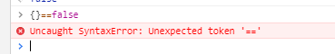

如果把{}圈起来，就是false,因为{}tostring 是[object，object]

if([]) {} 

true

==的原理在下面，类型不一样，只要都不是object，双方转为数字，特殊就是null==undefined，nan和谁都不相等包括自己。齐活了

#### == 的工作过程

```js
 [] == ![]  ---> true
![]    // 空数组转布尔，为true（因为为引用类型） 取非为false
[] == false    // 两者有一方为布尔，先将布尔转为数字，0 == []  再将[]转数字，为0 0 == 0为true
```

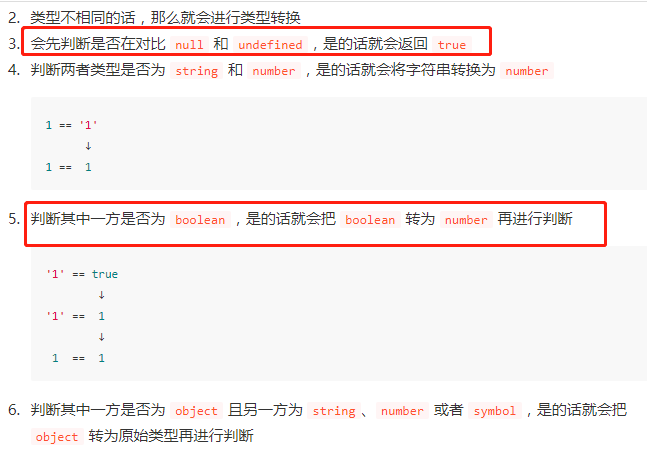

**空数组转布尔为true，引用类型转布尔为true**

**空数组转数字为0，**

string 数字布尔，都是先转成数字然后进行比较 ==的工作过程

typeof null; // "object"
typeof undefined; // "undefined"

isNull = function (obj) {
  return obj === null;
}
isUndefined = function (obj) {
  return obj === void 0;
}

require.context用来拿多个文件，

**而不用新增一个文件，就import一个新的，然后在...引入**，不用维护，组件写好就行

default就是拿模块默认暴露出的东西

3、判断类型

> typeof：

用法：`typeof a`测试变量a  返回数据类型的字符串表达（全部是小写）    

**可以用来判断undefined、数值、字符串**、**函数**。

不能判断null因为返回的是object。typeof也不能区分object和array

> instanceof：实例的意思

`console.log(b1 instanceof Object)`Object是一个构造方法，判断b1是否是Object的实例

判断对象的具体类型  

一个函数的返回结果是一个函数，用 `b1.b3()()`  b3是一个函数（）调用，之后返回的还是一个函数，只有()最后调用返回“xfzhang”

> ===  ：

可以用来判断undefine和null（因为这两种类型只有一个值，所以可以用来判断类型）其他不行。

#### 相等

• JS中使用==来判断两个值是否相等，如果相等则返回true。

• 使用!=来表示两个值是否不相等，如果不等则返回true。

• 注意： null和undefined使用==判断时是相等的。

1、NaN和谁都不相等包括他本身通过（isNaN（）函数来判断是否为NaN）

2、很多时候是把两边转化为数字

3、有些特殊需要记住

| 表达式            | 值    | 表达式                                                | 值    |
| ----------------- | ----- | ----------------------------------------------------- | ----- |
| null == undefined | true  | true == 1 （转化为数字，true转化为数字为1，false为0） | true  |
| “NaN” == NaN      | false | true == 2 （转化为数字，true转化为数字为1，false为0） | false |
| 5 == NaN          | false | undefined == 0                                        | false |
| NaN == NaN        | false | null == 0                                             | false |
| NaN != NaN        | true  | “5” == 5                                              | true  |
| false == 0        | true  |                                                       |       |

---

## 继承

### 1，原型继承

目标  方法共用，属性不互相影响

就是让子函数的原型对象变成父函数的实例对象

高程3第163页

​	弊端：1，**所有的子类实例都共享父类的属性，会互相影响**

​			2，在创建子类型的实例的时候，不能向超类型的构造函数中传递参数

### 2，构造函数继承

在子类构造函数中，通过执行父类的构造函数，执行其对象的初始化代码，获得父类的属性的副本

优势就是可以借机给父类构造函数传递参数

**弊端：函数没有复用。浪费内存**

### 3，组合继承

**利用原型继承方法，利用构造函数复制属性**

以上是原理理解

### es5中使用Object.create()

规范了原型继承

```
Object.is(value1, value2);
Object.is() 方法判断两个值是否为同一个值
```

Object.create()实际执行的是如下，将第一个参数，作为一个空函数的原型对象，再返回这个函数的实例

这个方法接受两个参数：一个用作新对象原型的对象和一个为新对象定义额外属性的对象（可选的）

```js
function object.create(0){
    function F(){};
    F.prototype = o;
    return new F();
}
```

### 寄生式继承 p171高程

```js
function createAnother(original){
    var clone = object(original);
    clone.ayhi = function(){};
    return clone
}
```

通过object来创造一个和original对应类型的对象，然后给这个对象重造，添加方法。再返回这个对象。这样使用这个函数创建的对象都会有对应的方法

### 寄生组合继承

使用构造继承的方法实现属性的继承，再用原型继承的方法实现方法的继承

p172有一个最简单实现寄生组合式继承的方式。

```js
function Parent(name) {
    this.parent = name
}
Parent.prototype.say = function() {
    console.log(`${this.parent}: 你打篮球的样子像kunkun`)
}
function Child(name, parent) {
    // 将父类的构造函数绑定在子类上
    Parent.call(this, parent)
    this.child = name
}

/** 
 1. 这一步不用Child.prototype =Parent.prototype的原因是怕共享内存，修改父类原型对象就会影响子类
 2. 不用Child.prototype = new Parent()的原因是会调用2次父类的构造方法（另一次是call），会存在一份多余的父类实例属性
3. Object.create是创建了父类原型的副本，与父类原型完全隔离
*/
Child.prototype = Object.create(Parent.prototype);
Child.prototype.say = function() {
    console.log(`${this.parent}好，我是练习时长两年半的${this.child}`);
}

// 注意记得把子类的构造指向子类本身
Child.prototype.constructor = Child;

var parent = new Parent('father');
parent.say() // father: 你打篮球的样子像kunkun

var child = new Child('cxk', 'father');
child.say() // father好，我是练习时长两年半的cxkjs
```


复习下：继承：笔记上有

es5中的继承

```js
function A() {
  this.a = 'hello';
}

function B() {
  A.call(this);
  this.b = 'world';
}

B.prototype = Object.create(A.prototype, {
  constructor: { value: B, writable: true, configurable: true }
});

let b = new B();
```

写一个继承吧，组合继承，然后说出寄生组合继承相对于组合继承的优点


----

## 实现axios（不会

```
根据getpost设置方法处理参数，然后用xhr对象来实现

```

-----

## 实现深拷贝（之前复习没考虑symbol等es6属性，还有循环引用，所以答的不好

```js
function isObject(target) {
    const type = typeof target;
    return target !== null && (type === 'object' || type === 'function');
}
function clone(target,map = new WeakMap()){
  if(!isObject(target)){
    let cloneTarget = Array.isArray(target) ? [] : {}
    if (map.get(target)) {
        return map.get(target);
    }
    map.set(target, cloneTarget);
    const keys = Array.isArray(target) ? cloneTarget : Object.keys(target);
    for(const key in keys){
      cloneTarget[key] = clone(target[key],map)
    }
    return cloneTarget
  } else {
    return target
  }
}
    // 防止循环引用
    if (map.get(target)) {
        return target;
    }
    map.set(target, cloneTarget);

function cloneSymbol(targe) {
    return Object(Symbol.prototype.valueOf.call(targe));
}
const symbolTag = '[object Symbol]';
虾皮面经2=3
```


---

## BFC 

1. BFC，如何形成BFC

2. BFC与IFC的区别

3. BFC会与float元素相互覆盖吗？为什么？举例说明

   **不会，然后bfc，因为两个bfc之间不会相互影响，margin不会重叠**

背一下

**flex table 绝对定位元素，overflow不是可见的元素，浮动元素**

bfc：块级格式化上下文

- 根元素（`<html>）`
- 浮动元素（元素的 [`float`](https://developer.mozilla.org/zh-CN/docs/Web/CSS/float) 不是 `none`）
- 绝对定位元素（元素的 [`position`](https://developer.mozilla.org/zh-CN/docs/Web/CSS/position) 为 `absolute` 或 `fixed`）
- 行内块元素（元素的 [`display`](https://developer.mozilla.org/zh-CN/docs/Web/CSS/display) 为 `inline-block`）
- 表格单元格（元素的 [`display`](https://developer.mozilla.org/zh-CN/docs/Web/CSS/display) 为 `table-cell`，HTML表格单元格默认为该值）
- 表格标题（元素的 [`display`](https://developer.mozilla.org/zh-CN/docs/Web/CSS/display) 为 `table-caption`，HTML表格标题默认为该值）
- [`overflow`](https://developer.mozilla.org/zh-CN/docs/Web/CSS/overflow) 值不为 `visible` 的块元素，**所有块状元素，但是不能overflow为visible，**
- 弹性元素（[`display`](https://developer.mozilla.org/zh-CN/docs/Web/CSS/display) 为 `flex` 或 `inline-flex `元素的直接子元素）
- 网格元素（[`display`](https://developer.mozilla.org/zh-CN/docs/Web/CSS/display) 为 `grid` 或 `inline-grid` 元素的直接子元素）

> **BFC**
> BFC(Block Formatting Contexts)直译为"块级格式化上下文"。Block Formatting Contexts就是页面上的一个隔离的渲染区域，容器里面的子元素不会在布局上影响到外面的元素，反之也是如此。如何产生BFC？
> float的值不为none。
> overflow的值不为visible。
> position的值不为relative和static。
> display的值为table-cell, table-caption, inline-block中的任何一个。
> 那BFC一般有什么用呢？比如常见的多栏布局，结合块级别元素浮动，里面的元素则是在一个相对隔离的环境里运行。

> **IFC**
> IFC(Inline Formatting Contexts)直译为"内联格式化上下文"，IFC的line box（线框）**高度由其包含行内元素中最高的实际高度计算而来（不受到竖直方向的padding/margin影响)**
> IFC中的line box一般左右都贴紧整个IFC，但是会因为float元素而扰乱。float元素会位于IFC与与line box之间，使得line box宽度缩短。 同个ifc下的多个line box高度会不同。 IFC中时不可能有块级元素的，当插入块级元素时（如p中插入div）会产生两个匿名块与div分隔开，即产生两个IFC，每个IFC对外表现为块级元素，与div垂直排列。
> 那么IFC一般有什么用呢？
> 水平居中：当一个块要在环境中水平居中时，设置其为inline-block则会在外层产生IFC，通过text-align则可以使其水平居中。
> 垂直居中：创建一个IFC，用其中一个元素撑开父元素的高度，然后设置其vertical-align:middle，其他行内元素则可以在此父元素下垂直居中。

ifc： 由其包含行内元素中最高的实际高度计算而来（不受到竖直方向的padding/margin影响)

---

#### 请求优化和渲染优化的方法

如果页面卡顿你会怎么解决？

- 减少请求数量：合并资源（webpack合并资源，合并css，js），减少HTTP请求，懒加载（webpack懒加载），内联资源等
- 减少请求资源大小：压缩资源，gzip（gzip，去掉不用的代码,CompressionWebpackPlugin），webp图片，减少cookie（放在cdn中，可以多利用浏览器tcp的链接）等
- 提高请求速度：DNS预解析（在link标签中添加`<link rel="dns-prefetch" href="http://www.spreadfirefox.com/">`），资源预加载（css预加载` <link rel="preload" href="style.css" as="style">`），CDN加速等
- 缓存：浏览器缓存，manifest缓存等,sw缓存
- 渲染：css、js加载顺序，同构直出等

性能优化

- Vue-Router路由懒加载（利用Webpack的代码切割）
- 使用CDN加速，将通用的库从vendor进行抽离
- Nginx的gzip压缩
- Vue异步组件
- 服务端渲染SSR
- 如果使用了一些UI库，采用按需加载
- Webpack开启gzip压缩
- 如果首屏为登录页，可以做成多入口
- Service Worker缓存文件处理
- 使用link标签的rel属性设置   prefetch（这段资源将会在未来某个导航或者功能要用到，但是本资源的下载顺序权重比较低，prefetch通常用于加速下一次导航）、preload（preload将会把资源得下载顺序权重提高，使得关键数据提前下载好，优化页面打开速度）

**首屏优化手段**

答：

- SSR
- 占位元素优先出现 （骨架屏）
- dns预加载 link  (<meta http-equiv="x-dns-prefetch-control" content="off"> <link rel="dns-prefetch" href="http://www.spreadfirefox.com/">)
- webpack的压缩优化（gzip压缩）
- PWA

**构建DOM树、样式计算、布局阶段、分**
**层、绘制、分块、光栅化和合成**

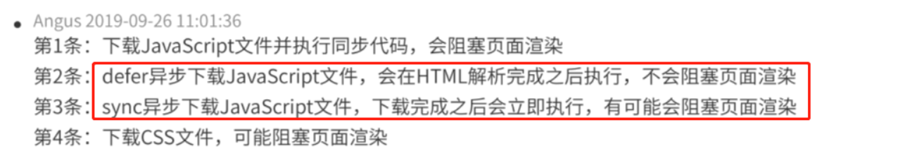

#### 问：你以前做过性能优化方面的开发，介绍下

答：通过探针抓取performance数据，判断资源请求、白屏、首屏时间、页面卡顿，以及编写代码抓取页面错误、慢加载、代理用户事件进行行为分析等等。

-----


**todo：把这个面经中提供的追问全看一下**（专门的时间）

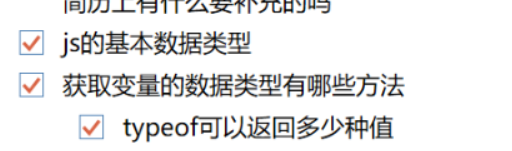

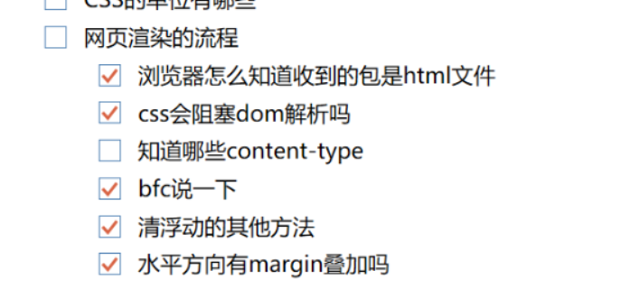

## 设计模式，单例

```js
// 单体模式
var Singleton = function(name){
    this.name = name;
    this.instance = null;
};
Singleton.prototype.getName = function(){
    return this.name;
}
// 获取实例对象
function getInstance(name) {
    if(!this.instance) {
        this.instance = new Singleton(name);
    }
    return this.instance;
}
// 测试单体模式的实例
var a = getInstance("aa");
var b = getInstance("bb");
```

有专门的文章

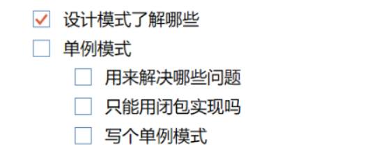

---

## webpack

webpack打包过程

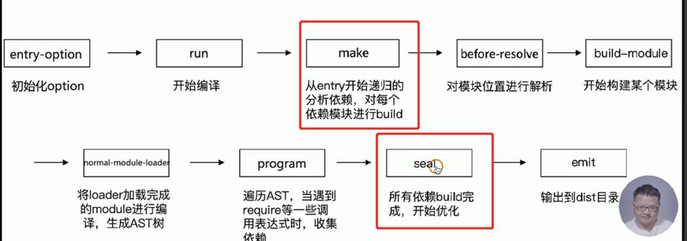

- **Compiler 对象包含了 Webpack 环境所有的的配置信息**，包含 options，loaders，plugins 这些信息，这个对象在 Webpack 启动时候被实例化，它是全局唯一的，可以简单地把它理解为 Webpack 实例；
- **Compilation 对象包含了当前的模块资源、编译生成资源、变化的文件等**。当 Webpack 以开发模式运行时，每当检测到一个文件变化，一次新的 Compilation 将被创建。Compilation 对象也提供了很多事件回调供插件做扩展。通过 Compilation 也能读取到 Compiler 对象。

源代码需要做一些填充就可以自己编写loader

src就是解析之后的js代码。

loaders必须是一个函数，不能是剪头函数，因为webpack要给他绑定this

**file-loader虽然知道可以打包图片**

**其实他是将图片搬到dist文件下，并返回文件地址**

**url-loader：也能打包图片文件，但是打包方式，是把图片变成base64形式，对于大文件不友好，小文件能减少http请求**

Tree shaking的本质是消除无用的JavaScript代码。
因为ES6模块的出现，ES6模块依赖关系是确定的，`和运行时的状态无关`，可以进行可靠的静态分析，
这就是Tree shaking的基础。

> 复习下es6和其他模块化的区别

---

HMR热更新

基本实现原理大致这样的，构建 bundle 的时候，加入一段 HMR runtime 的 js 和一段和服务沟通的 js 。文件修改会触发 webpack 重新构建，服务器通过向浏览器发送更新消息，浏览器通过 jsonp 拉取更新的模块文件，jsonp 回调触发模块热替换逻辑

## 压缩js css html 图片

1，去除多余重复的css，压缩成一行

optimize-css-assets-webpack-plugin

html-webpack-plugin压缩html和js代码

image-webpack-loader 压缩图片

## gzip

用的: `compressionWebpackPlugin`


```javascript
new CompressionWebpackPlugin({
        filename: '[path].gz[query]',
        algorithm: 'gzip',
        test: productionGzipExtensions,
        threshold: 10240,
        minRatio: 0.8
      })
```

####  webpack的css-loader原理讲一下     

1. css-loader 的作用是处理css中的 @import 和 url 这样的外部资源

2. style-loader 的作用是把样式插入到 DOM中，方法是在head中插入一个style标签，并把样式写入到这个标签的 innerHTML 里

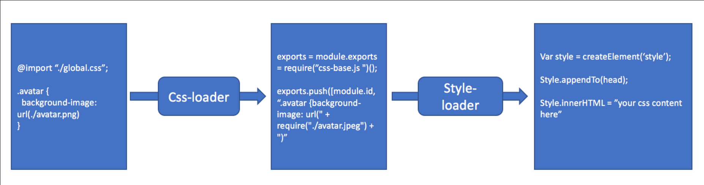

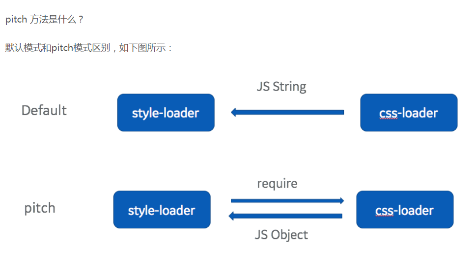

locader有输入输出有不同种类，上面分别是css-loader和style-loader

> 1. 把 @import 替换成 require(“-!../node_modules/css-loader/index.js!./global.css”)， -! 语法会禁用掉 preLoader 和 loader，因此这一个require并不会递归调用自己。
>
> 2. 把 background-image: url(‘./avatar.jpeg’) 替换成 “background-image: url(” + require(“./avatar.jpeg”) + “)”，图片的处理比较简单，因为如何加载图片，这是另一个loader的事情，css-loader 不负责这部分，他只需要关心把 url 转换成 require 就可以了。 简单的概括，就是把这两种CSS内部的依赖，替换成 JS 的语法 require，这样webpack就能正确处理了。
>
> 上面两条就是css-loader的作用，很简单，就是把import里面语法翻译成babel能看懂的requie语法

## Vue-Router路由懒加载（利用Webpack的代码切割）？？？

## 把组件按组分块

有时候我们想把某个路由下的所有组件都打包在同个异步块 (chunk) 中。只需要使用 [命名 chunk](https://webpack.js.org/guides/code-splitting-require/#chunkname)，一个特殊的注释语法来提供 chunk name (需要 Webpack > 2.4)。

```js
const Foo = () => import(/* webpackChunkName: "group-foo" */ './Foo.vue')
const Bar = () => import(/* webpackChunkName: "group-foo" */ './Bar.vue')
const Baz = () => import(/* webpackChunkName: "group-foo" */ './Baz.vue')
```

Webpack 会将任何一个异步模块与相同的块名称组合到相同的异步块中。

这是官网讲解

**webpack.then原理**  webpack模块打包原理

### es6的模块管理 与 commonjs 的对比

- **CommonJS模块输出的是一个值的拷贝，ES6 模块输出的是值的引用；**

- **CommonJS 模块是运行时加载，ES6 模块是编译时输出接口。**

- **ES6模块运行机制完全不一样，JS 引擎对脚本静态分析的时候，遇到模块加载命令`import`，就会生成一个只读引用。等到脚本真正执行的时候，再根据这个只读引用，到被加载的那个模块里去取值**。

- 上面代码说明，ES6 模块`import`的变量`counter`是可变的，完全反应其所在模块`lib.js`内部的变化。

  而第二个差异，也是为什么ES6模块这么受人欢迎的最大原因之一。我们知道CommonJS其实加载的是一个对象，这个对象只有在脚本运行时才会生成，而且只会生成一次，这个后面我们会具体解释。但是ES6模块不是对象，它的对外接口只是一种静态定义，在代码静态解析阶段就会生成，这样我们就可以使用各种工具对JS模块进行依赖分析，优化代码

  因为**CommonJS**的`require`语法是同步的，所以就导致了**CommonJS**模块规范只适合用在服务端，而ES6模块无论是在浏览器端还是服务端都是可以使用的，但是在服务端中，还需要遵循一些特殊的规则才能使用 ；

  **CommonJS** 模块输出的是一个值的拷贝，而ES6 模块输出的是值的引用；

  **CommonJS** 模块是运行时加载，而ES6 模块是编译时输出接口，使得对JS的模块进行静态分析成为了可能；

  因为两个模块加载机制的不同，所以在对待循环加载的时候，它们会有不同的表现。**CommonJS**遇到循环依赖的时候，只会输出已经执行的部分，后续的输出或者变化，是不会影响已经输出的变量。而ES6模块相反，使用`import`加载一个变量，变量不会被缓存，真正取值的时候就能取到最终的值；

  关于模块顶层的`this`指向问题，在**CommonJS**顶层，`this`指向当前模块；而在ES6模块中，`this`指向`undefined`；

  关于两个模块互相引用的问题，在ES6模块当中，是支持加载**CommonJS**模块的。但是反过来，**CommonJS**并不能`require`ES6模块，在NodeJS中，两种模块方案是分开处理的

  es6是编译运行都是一个引用，commonjs是运行时候生成结果的一个拷贝，
  
  **CommonJS 加载的是一个对象（即`module.exports`属性），该对象只有在脚本运行完才会生成。而 ES6 模块不是对象，它的对外接口只是一种静态定义，在代码静态解析阶段就会生成。**
  
  **es6编译的时候生成地址，运行的时候去对应模块取值，支持静态分析，**
  
  **commonjs是运行的时候去同步加载，得到一个值的拷贝，是一个对象**

## Webpack模块打包

既然模块规范有这么多，那webpack是如何去解析不同的模块呢？

webpack根据webpack.config.js中的入口文件，在入口文件里识别模块依赖，不管这里的模块依赖是用CommonJS写的，还是ES6 Module规范写的，webpack会自动进行分析，并通过转换、编译代码，打包成最终的文件。`最终文件中的模块实现是基于webpack自己实现的webpack_require（es5代码）`，所以打包后的文件可以跑在浏览器上。

同时以上意味着在webapck环境下，你可以只使用ES6 模块语法书写代码（通常我们都是这么做的），也可以使用CommonJS模块语法，甚至可以两者混合使用。因为从webpack2开始，内置了对ES6、CommonJS、AMD 模块化语句的支持，`webpack会对各种模块进行语法分析，并做转换编译`。


**所以webpack的模块打包是webpack_require**

## webpack加载异步模块的过程，就是预留script和对应的src预填src，等异步模块加载完成之后就回调函数把异步模块加载到主文件中。整个过程模拟jsonp的方式

> 从上面源码可以知道，**webpack实现模块的异步加载有点像jsonp的流程**。在主js文件中通过在head中构建script标签方式，异步加载模块信息；再使用回调函数webpackJsonpCallback，把异步的模块源码同步到主文件中，所以后续操作异步模块可以像同步模块一样。 源码具体实现流程：
>
> 1. 遇到异步模块时，使用`__webpack_require__.e`函数去把异步代码加载进来。该函数会在html的head中动态增加script标签，src指向指定的异步模块存放的文件。
> 2. 加载的异步模块文件会执行`webpackJsonpCallback`函数，把异步模块加载到主文件中。
> 3. 所以后续可以像同步模块一样,直接使用`__webpack_require__("./src/async.js")`加载异步模块。

https://juejin.im/entry/5b0e3eba5188251534379615

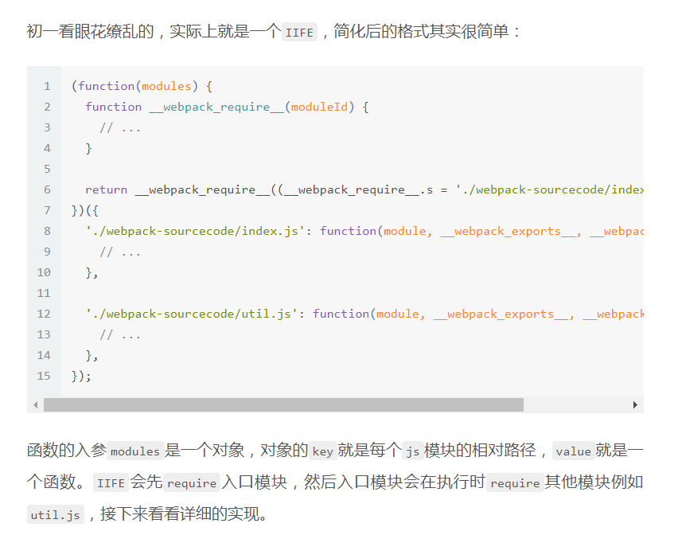

##  webpack怎么优化

#### 提高编译速度，

1，缩小编译范围，减少不必要的编译工作，即 modules、mainFields、noParse、includes、exclude、alias 全部用起来。文件后缀写全，定义别名，@ $

```js
const resolve = dir => path.join(__dirname, '..', dir);

// ...
resolve: {
    modules: [ // 指定以下目录寻找第三方模块，避免webpack往父级目录递归搜索
        resolve('src'),
        resolve('node_modules'),
        resolve(config.common.layoutPath)
    ],
    mainFields: ['main'], // 只采用main字段作为入口文件描述字段，减少搜索步骤
    alias: {
        vue$: "vue/dist/vue.common",
        "@": resolve("src") // 缓存src目录为@符号，避免重复寻址
    }
},
module: {
    noParse: /jquery|lodash/, // 忽略未采用模块化的文件，因此jquery或lodash将不会被下面的loaders解析
    // noParse: function(content) {
    //     return /jquery|lodash/.test(content)
    // },
    rules: [
        {
            test: /\.js$/,
            include: [ // 表示只解析以下目录，减少loader处理范围
                resolve("src"),
                resolve(config.common.layoutPath)
            ],
            exclude: file => /test/.test(file), // 排除test目录文件
            loader: "happypack/loader?id=happy-babel" // 后面会介绍
        },
    ]
}
```


2，搭载 webpack-parallel-uglify-plugin 插件，这个过程可以倍速提升。我们都知道 node 是单线程的，但node能够fork子进程，基于此，webpack-parallel-uglify-plugin 能够把任务分解给多个子进程去并发的执行，子进程处理完后再把结果发送给主进程，从而实现并发编译，进而大幅提升js压缩速度

并发编译，

3，第三方不变的模块，配置dll，不用下次编译

#### 其他方面

- 比如babel-loader 查找的路径，与不查找的路径指定
- 缓存babel编译过的文件

`loader: 'babel-loader?cacheDirectory=true'`

`resolve.extensions`：用来表明文件后缀列表，默认查找顺序是 `['.js', '.json']`，如果你的导入文件没有添加后缀就会按照这个顺序查找文件。我们应该尽可能**减少后缀列表长度，然后将出现频率高的后缀排在前面**

`resolve.alias`：可以通过**别名的方式来映射一个路径**，能让 Webpack 更快找到路径

`module.noParse`：如果你确定一个文件下没有其他依赖，就可以使用该属性让 Webpack **不扫描该文件**，这种方式对于大型的类库很有帮助

### Scope Hoisting(作用域提升，减少代码)

**Scope Hoisting 会分析出模块之间的依赖关系，尽可能的把打包出来的模块合并到一个函数中去。**

**由于scope hositing 需要分析出模块之间的依赖关系，因此源码必须使用ES6模块化语句，不然就不能生效，原因和 tree shaking一样
**

比如我们希望打包两个文件

```
// test.js
export const a = 1
// index.js
import { a } from './test.js'
复制代码
```

对于这种情况，我们打包出来的代码会类似这样

```
[
  /* 0 */
  function (module, exports, require) {
    //...
  },
  /* 1 */
  function (module, exports, require) {
    //...
  }
]
复制代码
```

但是如果我们使用 Scope Hoisting 的话，代码就会尽可能的合并到一个函数中去，也就变成了这样的类似代码

```
[
  /* 0 */
  function (module, exports, require) {
    //...
  }
]
```

- 尽可能的合并打包出来的模块打一个函数中去

### Tree Shaking （webpack 4 生产环境 默认开启）

tree shaking是一个术语、通常用于打包时移除js中未引用的代码(dead-code)，`它依赖于ES6模块系统中的import 和 export 的***静态结构特性***`

如果你使用 Webpack 4 的话，开启生产环境就会自动启动这个优化功能。

配置tree shaking

### 按需加载

想必大家在开发 SPA 项目的时候，项目中都会存在十几甚至更多的路由页面。如果我们将这些页面全部打包进一个 JS 文件的话，虽然将多个请求合并了，但是同样也加载了很多并不需要的代码，耗费了更长的时间。那么为了首页能更快地呈现给用户，我们肯定是希望首页能加载的文件体积越小越好，**这时候我们就可以使用按需加载，将每个路由页面单独打包为一个文件**。当然不仅仅路由可以按需加载，对于 `loadash` 这种大型类库同样可以使用这个功能

### 按需加载小结：

- 第三方组件库按需加载 
- 路由页面打包成独立的文件，按需加载，加快首页访问速度。其他页面访问到的时候再加载对应的js

**按需加载:**
Webpack支持定义分割点, 通过`require.ensure`进行按需加载.

- 在`webpack.config.js`中进行配置`output.chunkFilename`,

```js
//webpack.config.js

output: {
    path: path.resolve(__dirname, './dist'),
    publicPath: '/dist/',
    filename: 'build.js',
    //添加chundkFilename
    chunkFilename: '[name].[chunkhash:5].chunk.js'
}
```

chunk分组

## 总结（快+小+按需加载）：

- 快 - 打包速度 （loader配置优化，指定哪些路径处理、哪些不处理、并行压缩，并行压缩、第三方依赖做缓存不重复打）
- 小 - 体积 （tree-shaking去除无用代码+模块合并成一个function + 页面打包成独立的Js，加快首页速度）
- 按需加载组件与第三方资源

（ok了，打算背一下）

## webpack打包产物是怎样的，到底是为了什么，优化了什么，为什么要合并文件？介绍一下项目中的难点

webpack打包后就是多个chunk文件，同步异步分开，来的js文件，还有静态资源还有css文件

会有缓存，引入过的模块就不会再引入，

删除没有使用的依赖。为代码添加了很多功能，loader和plugin

合并文件，减少http请求，清理不必要代码，压缩文件

优化了什么


## webpack3升级到4为什么会提升速度？ 

- 编译速度快（使用happypack插件实现多线程执行任务）
- 按需加载（不同页面文件单独压缩）
- hash指纹（js、css文件自动添加版本号）
- es2015
- 支持less、stylus
- 图片体积小支持base64压缩
- 支持svg解析
- 支持自定义打包文件的目录
- 支持热更新
- 支持打包输出map文件
- 支持打包压缩文件

基于 webpack4，搭载 webpack-parallel-uglify-plugin 和 happyPack 插件，针对异步加载，css文件加载，们都知道 node 是单线程的，但node能够fork子进程，多进程打包，加快loader的速度

升级至webpack4后，一些默认插件由 optimization 配置替代了，如下：

- CommonsChunkPlugin废弃，由 optimization.splitChunks 和 optimization.runtimeChunk 替代，前者拆分代码，后者提取runtime代码。原来的CommonsChunkPlugin产出模块时，会包含重复的代码，并且无法优化异步模块，minchunks的配置也较复杂，splitChunks解决了这个问题；另外，将 optimization.runtimeChunk 设置为true（或{name: “manifest”}），便能将入口模块中的runtime部分提取出来。
- NoEmitOnErrorsPlugin 废弃，由 optimization.noEmitOnErrors 替代，生产环境默认开启。
- NamedModulesPlugin 废弃，由 optimization.namedModules 替代，生产环境默认开启。
- ModuleConcatenationPlugin 废弃，由 optimization.concatenateModules 替代，生产

升级到 webpack4 后，mini-css-extract-plugin 替代 extract-text-webpack-plugin 成为css打包首选，相比之前，它有如下优势：

1. 异步加载
2. 不重复编译，性能更好
3. 更容易使用

缺陷，不支持css热更新。因此需在开发环境引入 css-hot-loader，以便支持css热更新，如下所示：

基于 webpack4，搭载 webpack-parallel-uglify-plugin 和 happyPack 插件

----


打起精神来，把这两个搞定，再把其他搞定，

### 赶紧再看看webpack，具体了解下webpack流程中分别做了啥    

 Tree Shaking

`webpack` 本身并不会删除任何多余的代码，删除无用代码的工作是 `UglifyJS`做的. `webpack` 做的事情是 `unused harmony exports` 的标记，也就是他会分析你的代码，把不用的 `exports` 删除，但是变量的声明并没有删除。

## 计算机网络

浏览器缓存，内存磁盘之类的（大文件会放磁盘，js css会放内存）

缓存分为强缓存和协商缓存。强缓存不过服务器，协商缓存需要过服务器，协商缓存返回的状态码是304。两类缓存机制可以同时存在，强缓存的优先级高于协商缓存。当执行强缓存时，如若缓存命中，则直接使用缓存数据库中的数据，不再进行缓存协商。

#### 强缓存

**Expires(HTTP1.0)**：Exprires的值为服务端返回的数据到期时间。当再次请求时的请求时间小于返回的此时间，则直接使用缓存数据。但由于服务端时间和客户端时间可能有误差，这也将导致缓存命中的误差。另一方面，Expires是HTTP1.0的产物，故现在大多数使用Cache-Control替代。

缺点：使用的是绝对时间，如果服务端和客户端的时间产生偏差，那么会导致命中缓存产生偏差。

**Pragma(HTTP1.0)**：HTTP1.0时的遗留字段，当值为"no-cache"时强制验证缓存，Pragma禁用缓存，如果又给Expires定义一个还未到期的时间，那么Pragma字段的优先级会更高。服务端响应添加'Pragma': 'no-cache'，浏览器表现行为和刷新(F5)类似。

**Cache-Control(HTTP1.1)**：有很多属性，不同的属性代表的意义也不同：

- private：客户端可以缓存
- public：客户端和代理服务器都可以缓存
- max-age=t：缓存内容将在t秒后失效
- no-cache：需要使用协商缓存来验证缓存数据 （需要验证能不能使用缓存）
- no-store：所有内容都不会缓存

请注意no-cache指令很多人误以为是不缓存，这是不准确的，no-cache的意思是可以缓存，但每次用应该去想服务器验证缓存是否可用。no-store才是不缓存内容。当在首部字段Cache-Control 有指定 max-age 指令时，比起首部字段 Expires，会优先处理 max-age 指令。命中强缓存的表现形式：Firefox浏览器表现为一个灰色的200状态码。Chrome浏览器状态码表现为200 (from disk cache)或是200 OK (from memory cache)。

#### 协商缓存

协商缓存需要进行对比判断是否可以使用缓存。浏览器第一次请求数据时，服务器会将缓存标识与数据一起响应给客户端，客户端将它们备份至缓存中。再次请求时，客户端会将缓存中的标识发送给服务器，服务器根据此标识判断。若未失效，返回304状态码，浏览器拿到此状态码就可以直接使用缓存数据了。

**Last-Modified**：服务器在响应请求时，会告诉浏览器资源的最后修改时间。

**if-Modified-Since**：浏览器再次请求服务器的时候，请求头会包含此字段，后面跟着在缓存中获得的最后修改时间。服务端收到此请求头发现有if-Modified-Since，则与被请求资源的最后修改时间进行对比，如果一致则返回304和响应报文头，浏览器只需要从缓存中获取信息即可。

- 如果真的被修改：那么开始传输响应一个整体，服务器返回：200 OK
- 如果没有被修改：那么只需传输响应header，服务器返回：304 Not Modified

**if-Unmodified-Since**: 从某个时间点算起, 是否文件没有被修改，使用的是相对时间，不需要关心客户端和服务端的时间偏差。

- 如果没有被修改：则开始`继续'传送文件，服务器返回: 200 OK
- 如果文件被修改：则不传输，服务器返回: 412 Precondition failed (预处理错误)

这两个的区别是一个是修改了才下载一个是没修改才下载。如果在服务器上，一个资源被修改了，但其实际内容根本没发生改变，会因为Last-Modified时间匹配不上而返回了整个实体给客户端（即使客户端缓存里有个一模一样的资源）。为了解决这个问题，HTTP1.1推出了Etag。

**Etag**：服务器响应请求时，通过此字段告诉浏览器当前资源在服务器生成的唯一标识（生成规则由服务器决定）

**If-Match**：条件请求，携带上一次请求中资源的ETag，服务器根据这个字段判断文件是否有新的修改

**If-None-Match**： 再次请求服务器时，浏览器的请求报文头部会包含此字段，后面的值为在缓存中获取的标识。服务器接收到次报文后发现If-None-Match则与被请求资源的唯一标识进行对比。

- 不同，说明资源被改动过，则响应整个资源内容，返回状态码200。
- 相同，说明资源无心修改，则响应header，浏览器直接从缓存中获取数据信息。返回状态码304.

但是实际应用中由于Etag的计算是使用算法来得出的，而算法会占用服务端计算的资源，所有服务端的资源都是宝贵的，所以就很少使用Etag了。

- 浏览器地址栏中写入URL，回车浏览器发现缓存中有这个文件了，不用继续请求了，直接去缓存拿（最快）
- F5就是告诉浏览器，别偷懒，好歹去服务器看看这个文件是否有过期了。于是浏览器就胆胆襟襟的发送一个请求带上If-Modify-since
- Ctrl+F5告诉浏览器，你先把你缓存中的这个文件给我删了，然后再去服务器请求个完整的资源文件下来。于是客户端就完成了强行更新的操作

**搞懂了，cache-control，expires是强制缓存，协商就是那些 last-modified if modified-since etag if-match  if-none-match**

强制缓存失效才协商缓存

http请求头

 你一般用的MIME类型有哪些？

| `text`        | 表明文件是普通文本，理论上是人类可读                         | `text/plain`, `text/html`, `text/css, text/javascript`       |
| ------------- | ------------------------------------------------------------ | ------------------------------------------------------------ |
| `image`       | 表明是某种图像。不包括视频，但是动态图（比如动态gif）也使用image类型 | `image/gif`, `image/png`, `image/jpeg`, `image/bmp`, `image/webp`, `image/x-icon`, `image/vnd.microsoft.icon` |
| `audio`       | 表明是某种音频文件                                           | `audio/midi`, `audio/mpeg, audio/webm, audio/ogg, audio/wav` |
| `video`       | 表明是某种视频文件                                           | `video/webm`, `video/ogg`                                    |
| `application` | 表明是某种二进制数据                                         | `application/octet-stream`, `application/pkcs12`, `application/vnd.mspowerpoint`, `application/xhtml+xml`, `application/xml`, `application/pdf` |

**媒体类型**（通常称为 **Multipurpose Internet Mail Extensions** 或 **MIME** 类型 ）是一种标准，用来表示文档、文件或字节流的性质和格式

### Multipart 类型


```
multipart/form-data
multipart/byteranges
```

## tcp

TCP 握手，分手，拥塞控制，流量控制

如何实现流量控制？

由滑动窗口协议（连续ARQ协议）实现。滑动窗口协议既保证了分组无差错、有序接收，也实现了流量控制。主要的方式就是接收方返回的 ACK 中会包含自己的接收窗口的大小，并且利用大小来控制发送方的数据发送。

拥塞控制：拥塞控制是作用于网络的，它是防止过多的数据注入到网络中，避免出现网络负载过大的情况；常用的方法就是：（ 1 ）慢开始、拥塞避免（ 2 ）快重传、快恢复。

流量控制：流量控制是作用于接收者的，它是控制发送者的发送速度从而使接收者来得及接收，防止分组丢失的

HTTPS欺骗是怎么实现的？（搜不到，证书欺骗吗）

---

### vue中v-model实现原理

### `<input v-model="..."><textarea v-model="..."></textarea>`源码分析

一句话概览：text和textarea标签的value属性和input事件及genDefaultModel函数。

```vue
<!--text类型-->
<input v-model="singleMsg">
<!--textarea类型-->
<textarea v-model="multiMsg"></textarea>
复制代码
```

等价于：

```vue
<input type="text" v-bind:value="singleMsg" v-on:input="singleMsg=$event.target.value" >
<textarea v-bind:value="multiMsg" v-on:input="multiMsg=$event.target.value"></textarea>
复制代码
```

真的是这样吗？我们来看看源码。

#### genDefaultModel函数

```js
function genDefaultModel (
  el: ASTElement,
  value: string,
  modifiers: ?ASTModifiers
): ?boolean {
  const type = el.attrsMap.type

  // warn if v-bind:value conflicts with v-model
  // except for inputs with v-bind:type
  if (process.env.NODE_ENV !== 'production') {
     ...
  }

  const { lazy, number, trim } = modifiers || {}
  const needCompositionGuard = !lazy && type !== 'range'
  const event = lazy // 此处我们没有传入lazy修饰符，因此event变量是'input'
    ? 'change'
    : type === 'range'
      ? RANGE_TOKEN
      : 'input'

  let valueExpression = '$event.target.value' 
  if (trim) {
    valueExpression = `$event.target.value.trim()`
  }
  if (number) {
    valueExpression = `_n(${valueExpression})`
  }

  let code = genAssignmentCode(value, valueExpression)
  if (needCompositionGuard) {
    code = `if($event.target.composing)return;${code}`
  }

  addProp(el, 'value', `(${value})`) // <input type="text" v-bind:value="singleMsg" ="singleMsg=$event.target.value" >
  addHandler(el, event, code, null, true) // 这一步印证了input事件<input v-on:input="...">
  if (trim || number) {
    addHandler(el, 'blur', '$forceUpdate()')
  }
}
复制代码
```

源码分析在源码中有注释。

通过源码我们可以看出: input（type=“text”）和textarea的v-model，通过value prop获得值，最终被解析为设置value attribute和input(若设置lazy，则触发change)事件，从而实现双向绑定

**所以nextTick是如何拿到更新后的dom1，在更新dom的那个微任务中，追加了nextTick的回调队列**

---

## react vue渲染原理 diff（直接看原来的笔记）

复习文章： react的渲染原理，之前有看过专门的diff两个的区别

vue是怎么解析模板的？

render

1. 调用 compile 函数,生成 render 函数字符串 ,编译过程如下:

- parse 函数解析 template,生成 ast(抽象语法树)
- optimize 函数优化静态节点 (标记不需要每次都更新的内容,diff 算法会直接跳过静态节点,从而减少比较的过程,优化了 patch 的性能)
- generate 函数生成 render 函数字符串

1. 调用 new Watcher 函数,监听数据的变化,当数据发生变化时，Render 函数执行生成 vnode 对象
2. 调用 patch 方法,对比新旧 vnode 对象,通过 DOM diff 算法,添加、修改、删除真正的 DOM 元素

> 分成两种，第一次编译渲染的时候，就是parse生成ast树，然后优化下ast树，标记不会改变的节点，然后生成vnode对象。监听数据变化的时候，就先生成vnode对象，然后patch对比下新旧vnode对象，然后添加修改真正的dom元素

3.vue的diff是为什么，浏览器重绘重排前会diff吗，为什么？

#### 两个diff的区别

vue中的patch方法

patchVnode的规则是这样的：

1.如果新旧VNode都是静态的，同时它们的key相同（代表同一节点），并且新的VNode是clone或者是标记了once（标记v-once属性，只渲染一次），那么只需要替换elm以及componentInstance即可。

**2.新老节点均有children子节点，则对子节点进行diff操作，调用updateChildren，这个updateChildren也是diff的核心。**

3.如果老节点没有子节点而新节点存在子节点，先清空老节点DOM的文本内容，然后为当前DOM节点加入子节点。

4.当新节点没有子节点而老节点有子节点的时候，则移除该DOM节点的所有子节点。

5.当新老节点都无子节点的时候，只是文本的替换。

更新算法的diff流程

也就是当新旧node都有孩子节点的时候，就会裁员工diff算法

首先，oldStartVnode、oldEndVnode与newStartVnode、newEndVnode两两比较一共有2*2=4种比较方法。

如果两个首部相同，就直接两个指针向后移动，如果前后相同，就把dom中的前或者后移动到新的前后，如果都不相同，newstart，去找下old中是否有这个node，有就移动，没有就创建

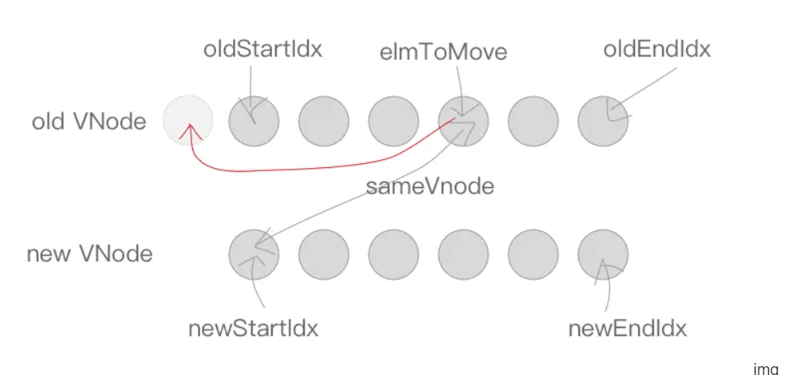

---

### react的diff是怎么弄的呢

todo： diff的笔记找下，当时有好好总结

#### 浏览器重绘重排前会diff吗

VDom特点（虚拟DOM和真实DOM的区别）

- 虚拟DOM不会进行重排和重绘操作。

- 虚拟DOM进行频繁操作，然后一次性修改真实DOM需要改的部分，最后并在真实的DOM中进行重排与重绘，减少过多DOM节点重排和重绘消耗。

- 真实DOM频繁重排和重绘的效率是相当低的。

- 虚拟DOM有效的降低大面积（真实DOM节点）的重排和排版，因为最终与真实DOM比较差异，可以只渲染局部。

- 使用虚拟DOM的损耗计算

  ```
  总消耗 = 虚拟DOM增删改 + （与Diff算法效率有关）真实DOM差异增删改 + （较少的节点）重排与重绘
  复制代码
  ```

- 使用真实DOM的损耗计算

  ```
  总损耗 = 真实DOM完全增删改 + （可能较多的节点）重排与重绘
  ```

**浏览器重绘重排不会diff，没发触发，数据变化，代码变化导致的重排重绘，会减少，会避免频繁的操作重排重绘，因为不是每次都更新，是一次性修改真实dom需要改的部分**

两个的diff

> 我认为react做了三种优化来降低复杂度：1：如果父节点不同，放弃对子节点的比较，直接删除旧节点然后添加新的节点重新渲染；2：如果子节点有变化，Virtual DOM不会计算变化的是什么，而是重新渲染，3：通过唯一的key策略
>
> https://github.com/Advanced-Frontend/Daily-Interview-Question/issues/151
>
> 为什么将一棵树变成另外一棵树时间复杂度是n3次方（太复杂，放弃研究，就直接说，因为要操作，就是增删查改）

之前有特别准备研究这个

----

## CDN 原理

> 问：CDN原理
>
> 答：cache、负载均衡、资源同步
>
> 问：CDN获取最近节点资源的算法是什么
>
> 答：不懂 
>
> 智能 DNS 分线路或者分地区解析
>
> 通过以上的分析我们可以得到，为了实现对普通用户透明(使用缓存后用户客户端无需进行任何设置)访问，需要使用DNS(域名解析)来引导用户来访问Cache服务器，以实现透明的加速服务. 由于用户访问网站的第一步就是域名解析,所以通过修改dns来引导用户访问是最简单有效的方式.
>
> 浏览器向域名解析服务器发出解析请求，由于CDN 对域名解析过程进行了调整，所以用户端一般得到的是该域名对应的 CNAME 记录，此时浏览器需要再次对获得的 CNAME 域名进行解析才能得到缓存服务器实际的IP 地址。 注：在此过程中，全局负载均衡DNS 解析服务器会根据用户端的源IP 地址，如地理位置(北京还是上海)、接入网类型(电信还是网通)将用户的访问请求定位到离用户路由最短、位置最近、负载最轻的Cache 节点(缓存服务器)上，实现就近定位。定位优先原则可按位置、可按路由、也可按负载等。
>
> 如图所示是通过CDN进行请求响应的过程图。通过图中可以看出，在DNS解析域名时新增了一个`全局负载均衡系统（GSLB）`，GSLB的主要功能是根据用户的本地DNS的IP地址判断用户的位置，筛选出距离用户较近的`本地负载均衡系统（SLB）`，并将该SLB的IP地址作为结果返回给本地DNS。SLB主要负责判断`缓存服务器集群`中是否包含用户请求的资源数据，如果缓存服务器中存在请求的资源，则根据缓存服务器集群中节点的健康程度、负载量、连接数等因素筛选出最优的缓存节点，并将HTTP请求重定向到最优的缓存节点上。
>
> 如果买不起cdn，应该用dns中的区域来解析，然后找到最短路线
>
> CDN的关键技术主要有**内容存储**和**分发技术**。
>
> 本地缓存
>
> 浏览器向域名解析服务器发出解析请求，由于CDN 对域名解析过程进行了调整，所以用户端一般得到的是该域名对应的 CNAME 记录，此时浏览器需要再次对获得的 CNAME 域名进行解析才能得到缓存服务器实际的IP 地址。 注：在此过程中，全局负载均衡DNS 解析服务器会根据用户端的源IP 地址，如地理位置(北京还是上海)、接入网类型(电信还是网通)将用户的访问请求定位到离用户路由最短、位置最近、负载最轻的Cache 节点(缓存服务器)上，实现就近定位。定位优先原则可按位置、可按路由、也可按负载等。
>
> 被问道就说这个

---

**width和hegiht分别参照父元素的width和height**

**margin和padding参照包含块的width**

**1. 参数复用**；**2. 提前返回；****3. 延迟计算/运行。**

##  em\px\rem区别？

- px：绝对单位，页面按精确像素展示。
- em：相对单位，基准点为父节点字体的大小，如果自身定义了font-size按自身来计算（浏览器默认字体是16px），整个页面内1em不是一个固定的值。
- rem：相对单位，可理解为”root em”, 相对根节点html的字体大小来计算，CSS3新加属性，chrome/firefox/IE9+支持

### 1，数组去重

> 注意：NaN表示非数值，isNaN函数是用来判读一个东西是不是数值，任何不能被转换为熟知的值都会导致这个函数返回false例如 isNaN("blue");isNaN(true);为true，因为布尔值可以转化为数字
>
> 如果要判断一个数是不是NaN  ：a ！=a

```js
Array.prototype.uniq = function () {
   var resArr = [];
   var flag = true;
     
   for(var i=0;i<this.length;i++){
       if(resArr.indexOf(this[i]) == -1){
           if(this[i] != this[i]){   //排除 NaN
              if(flag){
                   resArr.push(this[i]);
                   flag = false;
              }
           }else{
                resArr.push(this[i]);
           }
       }
   }
    return resArr;
}
```

输入输出

手写new

```js
第一个参数就是Foo,类，构造器函数，context.__proto__ = constructor(Foo).prototype
let context = Object.create(constructor.prototype)  
let result = constructor.apply(context,args)// 获得复制构造函数的属性
```

for of迭代器 数组

for in就是遍历对象，但是会遍历继承属性

file-loader url-loader(区别) source-map-loader svg-inline-loader image-loader

babel-loader

sass-loader

css-loader style-loader postcss-loader

html-webpack-plugin:简化html文件创建

compression-webpack-plugin 添加gzip压缩

speed-measure-webpack-plugin 测速

## **3.Webpack构建流程简单说一下**

loader翻译所有的模块，然后分析出模块依赖的对应关系，然后，组装成chunk，然后输出

Webpack 的运行流程是一个串行的过程，从启动到结束会依次执行以下流程：

- `初始化参数`：从配置文件和 Shell 语句中读取与合并参数，得出最终的参数
- `开始编译`：用上一步得到的参数初始化 Compiler 对象，加载所有配置的插件，执行对象的 run 方法开始执行编译
- `确定入口`：根据配置中的 entry 找出所有的入口文件
- `编译模块`：从入口文件出发，调用所有配置的 Loader 对模块进行翻译，再找出该模块依赖的模块，再递归本步骤直到所有入口依赖的文件都经过了本步骤的处理
- `完成模块编译`：在经过第4步使用 Loader 翻译完所有模块后，得到了每个模块被翻译后的最终内容以及它们之间的依赖关系
- `输出资源`：根据入口和模块之间的依赖关系，组装成一个个包含多个模块的 Chunk，再把每个 Chunk 转换成一个单独的文件加入到输出列表，这步是可以修改输出内容的最后机会
- `输出完成`：在确定好输出内容后，根据配置确定输出的路径和文件名，把文件内容写入到文件系统

在以上过程中，`Webpack` 会在特定的时间点广播出特定的事件，插件在监听到感兴趣的事件后会执行特定的逻辑，并且插件可以调用 Webpack 提供的 API 改变 Webpack 的运行结果。

初始化：启动构建，读取与合并配置参数，加载 Plugin，实例化 Compiler

编译：从 Entry 出发，针对每个 Module 串行调用对应的 Loader 去翻译文件的内容，再找到该 Module 依赖的 Module，递归地进行编译处理

输出：将编译后的 Module 组合成 Chunk，将 Chunk 转换成文件，输出到文件系统中

webpack-merge，提取公共配置

hotModuleReplacemenetPlugin模块热替换

## **8.说一下 Webpack 的热更新原理吧**

(敲黑板，这道题必考)

`Webpack` 的热更新又称热替换（`Hot Module Replacement`），缩写为 `HMR`。 这个机制可以做到不用刷新浏览器而将新变更的模块替换掉旧的模块。

**HMR的核心就是客户端从服务端拉去更新后的文件，准确的说是 chunk diff (chunk 需要更新的部分)，实际上 WDS 与浏览器之间维护了一个 `Websocket`，当本地资源发生变化时，WDS 会向浏览器推送更新，并带上构建时的 hash，让客户端与上一次资源进行对比。客户端对比出差异后会向 WDS 发起 `Ajax` 请求来获取更改内容(文件列表、hash)，这样客户端就可以再借助这些信息继续向 WDS 发起 `jsonp` 请求获取该chunk的增量更新。**

后续的部分(拿到增量更新之后如何处理？哪些状态该保留？哪些又需要更新？)由 `HotModulePlugin` 来完成，提供了相关 API 以供开发者针对自身场景进行处理，像`react-hot-loader` 和 `vue-loader` 都是借助这些 API 实现 HMR。

箭头函数可以使用 arguments吗 使用对象结构const arrow = (...args) => { console.log(args) }

箭头函数对于使用function关键字创建的函数有以下区别

1. 箭头函数没有arguments（建议使用更好的语法，剩余运算符替代）
2. **箭头函数没有prototype属性，不能用作构造函数（不能用new关键字调用）**
3. **箭头函数没有自己this，它的this是词法的，引用的是上下文的this**，即在你写这行代码的时候就箭头函数的this就已经和外层执行上下文的this绑定了(这里个人认为并不代表完全是静态的,因为外层的上下文仍是动态的可以使用call,apply,bind修改,这里只是说明了箭头函数的this始终等于它上层上下文中的this)

#### vue beforeCreated到create发生了什么      

```js
    callHook(vm, 'beforeCreate')
    initInjections(vm) // resolve injections before data/props
    initState(vm)
    initProvide(vm) // resolve provide after data/props
    callHook(vm, 'created')   
```

由_init方法可以看出，调用beforecreate与created钩子之间，依次发生了初始化inject，初始化state，以及初始化provide这几个过程。 在此我们主要关注平常最常用到的initState过程

initState函数中，首先为vm实例初始化了存放观察者的_watchers属性， 然后依次对props，methods，data，computed，watch属性进行了初始化与观察者的注册。

注意props与methods的初始化是在data之前的。这就是在data属性的声明过程中可以调用props与methods中的方法或属性为data赋值的原因


#### for of 与 for in 不同处

1. **与for in不同的是，for of不能循环普通对象({key: value})**
2. **for of不会将循环对象中自定义的属性内容循环出来**
3. **for in 是遍历键名(key或index)，而for of是遍历键值(value)。**

----

cors请求头字段

1，简单请求

客户端： orgin

响应： **Access-Control-Allow-Origin**（**都是access-control开头，**所有都是比较好答，随便说，然后一个是允许跨域访问的域名，一个是是否允许发送cookie，可选允许携带的请求头）

该字段是必须的。它的值要么是请求时`Origin`字段的值，要么是一个`*`，表示接受任意域名的请求。

**Access-Control-Allow-Credentials**

该字段可选。它的值是一个布尔值，表示是否允许发送Cookie。默认情况下，Cookie不包括在CORS请求之中。设为`true`，即表示服务器明确许可，Cookie可以包含在请求中，一起发给服务器。这个值也只能设为`true`，如果服务器不要浏览器发送Cookie，删除该字段即可。

**Access-Control-Expose-Headers**

该字段可选。CORS请求时，`XMLHttpRequest`对象的`getResponseHeader()`方法只能拿到6个基本字段：`Cache-Control`、`Content-Language`、`Content-Type`、`Expires`、`Last-Modified`、`Pragma`。如果想拿到其他字段，就必须在`Access-Control-Expose-Headers`里面指定。上面的例子指定，`getResponseHeader('FooBar')`可以返回`FooBar`字段的值。


AJAX请求中打开`withCredentials`属性。

```javascript
var xhr = new XMLHttpRequest();
xhr.withCredentials = true;
```

需要注意的是，如果要发送Cookie，`Access-Control-Allow-Origin`就不能设为星号，必须指定明确的、与请求网页一致的域名

**1）Access-Control-Request-Method**

该字段是必须的，用来列出浏览器的CORS请求会用到哪些HTTP方法，上例是`PUT`。

**（2）Access-Control-Request-Headers**

该字段是一个逗号分隔的字符串，指定浏览器CORS请求会额外发送的头信息字段，上例是`X-Custom-Header`。

**（1）Access-Control-Allow-Methods**

该字段必需，它的值是逗号分隔的一个字符串，表明服务器支持的所有跨域请求的方法。注意，返回的是所有支持的方法，而不单是浏览器请求的那个方法。这是为了避免多次"预检"请求。

**（2）Access-Control-Allow-Headers**

如果浏览器请求包括`Access-Control-Request-Headers`字段，则`Access-Control-Allow-Headers`字段是必需的。它也是一个逗号分隔的字符串，表明服务器支持的所有头信息字段，不限于浏览器在"预检"中请求的字段。

**（3）Access-Control-Allow-Credentials**

该字段与简单请求时的含义相同。

**（4）Access-Control-Max-Age**

该字段可选，用来指定本次预检请求的有效期，单位为秒。上面结果中，有效期是20天（1728000秒），即允许缓存该条回应1728000秒（即20天），在此期间，不用发出另一条预检请求。


content-type有那些值

有三种值：资源类型可选值，字符集，还有分界符号

texthtml js css 视频，图片，音频

二进制  mulitpart/form-data  application是二进制类的

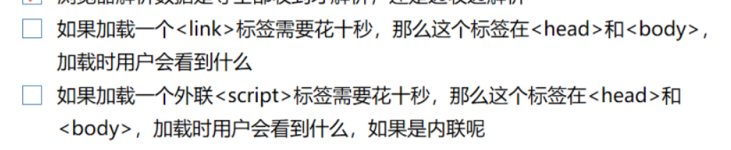

**这是一种比较传统的做法，目的就是把所有外部文件（包括 `CSS` 文件和 `JavaScript` 文件）的引用都放在相同的地方.可是，在文档的 <head> 元素中包含所有 JavaScript 文件，意味着必须等到全部 JavaScript 代码都被下载、解析和执行完成以后，才能开始呈现页面的内容（浏览器在遇到 <body> 标签时才开始呈现内容）**

**对于那些需要很多 JavaScript 代码的页面来说，这无疑会导致浏览器在呈现页面时出现明显的延迟，而延迟期间的浏览器窗口中将是一片空白**

对于这种方式，在解析包含的 JavaScript 代码之前，页面的内容将完全呈现在浏览器中。而用户也会因为浏览器窗口显示空白页面的时间缩短而感到打开页面的速度加快了

- 所有 `<script>` 标签引进的 JavaScript 会按照他们引入的顺序依次被解析，在没有使用 defer 或者 async 的情况下，只有在解析完前面 `<script>` 元素中的代码之后，才会开始解析后面 `<script>` 元素中的代码。
- 由于浏览器会先解析完不使用 defer 属性的 `<script>` 元素中的代码，然后再解析后面的内容，所以一般应该把 `<script>` 元素放在页面最后，即主要内容后面， `</body>` 标签前面。
- 使用 defer 属性可以让脚本在文档完全呈现之后再执行,延迟脚本总是按照指定它们的顺序执行。
- 使用 async 属性可以表示当前脚本不必等待其他脚本，也不必阻塞文档呈现。不能保证异步脚本按照它们在页面中出现的顺序执行。

显然内联脚本的 HTML 页面性能差了很多，一个主要原因是内联后 HTML 较大更容易观察到[流式渲染现象](https://harttle.land/2016/11/26/static-dom-render-blocking.html)，上图中的载入过程发生了多次重绘。 另一个重要原因是浏览器对独立的外链脚本可以做更多的优化，比如文件缓存可以节省下载时间、[代码缓存](https://v8project.blogspot.jp/2015/07/code-caching.html) 可以节省脚本编译时间。


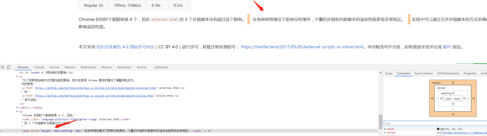

行内元素，无法设置上下的margin，左右可以，padding是都可以设置

---

## 项目亮点，难点

