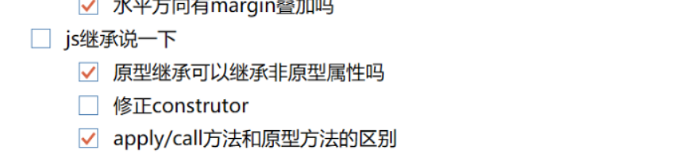

算法题：合并乱序区间

```js
输入: intervals = [[1,3],[2,6],[8,10],[15,18]]
输出: [[1,6],[8,10],[15,18]]
解释: 区间 [1,3] 和 [2,6] 重叠, 将它们合并为 [1,6].
先排序，然后建一个result，每个区间都和result最后一个区间合并，没重合直接放进去，有重合就先pop然后放一个更好的进去
var merge = function(intervals) {
    if(intervals.length==0) return []
    intervals.sort((i,j)=>{
        return i[0]-j[0]
    })
    let result = [[...intervals[0]]]
    for(let i=1;i<intervals.length;i++){
      // 每次都拿最后一个元素，和当前i区间
        mergeTwo([...result[result.length-1]],intervals[i],result)
    }
    return result
};
function mergeTwo(item1,item2,result){
    if(item1[1]<item2[0]){
        result.push(item2)
    } else {
        let f= 0, l = 0
        item1[0]<item2[0] ? f = item1[0]: f = item2[0]
        item1[1]>item2[1] ? l = item1[1]: l = item2[1]
        result.pop()
        result.push([f,l])
    }
}
merge([[1,3],[2,6],[8,10],[15,18]])
```

算法题：两个有序链表和并成一个有序链表

```js
var mergeTwoLists = function(l1, l2) {
    if(l1 === null){
        return l2;
    }
    if(l2 === null){
        return l1;
    }
    if(l1.val < l2.val){
        l1.next = mergeTwoLists(l1.next, l2);
        return l1;
    }else{
        l2.next = mergeTwoLists(l1, l2.next);
        return l2;
    }
};
```

算法题：老师分饼干，每个孩子只能得到一块饼干，但每个孩子想要的饼干大小不尽相同。 目标是尽量让更多的孩子满意。 如孩子的要求是 1, 3, 5, 4, 2，饼干是1, 1， 最多能让1个孩子满足。如孩子的要求是 10, 9, 8, 7, 6，饼干是7, 6, 5，最多能 让2个孩子满足。

```js 
var findContentChildren = function(g, s) {
    let gIndex=0,sIndex=0,res=0;
    let sortG=g.sort((a,b)=>a-b);
    let sortS=s.sort((a,b)=>a-b);
    while(gIndex<g.length&&sIndex<s.length){
        if(s[sIndex]>=g[gIndex]){
            res++;
            gIndex++;
        }
        sIndex++;
    }
    return res
};
排序+双指针对比，对比两个贪心
```


算法题：给定一个正整数数列a, 对于其每个区间, 我们都可以计算一个X值; X值的定义如下: 对于任意区间, 其X值等于区间内最小的那个数乘上区间内所有数和; 现在需要你找出数列a的所有区间中, X值最大的那个区间; 如数列a为: 3 1 6 4 5 2; 则X值最大的区间为6, 4, 5, X = 4 * (6+4+5) = 60;

`先求和，然后计算结果，保留最大的，3 *（总和-3）`

写一个方法输出 ABCDEFG 的值（看试题、现场写程序）。

???? 

从排好序的两个链表中，找到相同的节点，并输出链表（看试题、现场写程序）。

双指针，res.next()等于相同的

```js
var mergeTwoLists = function(l1, l2,res) {
    if(l1 === null){
        return l2;
    }
    if(l2 === null){
        return l1;
    }
    if(l1.val==l2.val){
        res.length==0? res=li;res.next= li;
    }
    if(l1.val < l2.val){
        mergeTwoLists(l1.next, l2,res);
    }else{
        mergeTwoLists(l1, l2.next,res);
    }
};
```


考查箭头函数的 this 与 普通函数的区别，this 的指向 （看试题给结果，分析过程）。

**todo：把对应的题目找出来**

for 循环中的 var 、let 与 const 区别，比如 for( const i = 0;  i< 3; i++ ){ console.log(i); } 会输出什么结果 ？（看试题给结果，分析过程）。


click DOM 节点的 inner 与 outer 的执行机制，考查事件冒泡与事件捕获 （看试题给结果，分析过程）

默认是冒泡，加了参数就是捕获，先捕获后冒泡，target  currentTarget（记住当时打印的信息，target是一直都不变的，所以是点击的元素，current是会随着冒泡变动的）

> **`event.currentTarget`始终是监听事件者，而`event.target`是事件的真正发出者**。
>
> currentTarget是监听这个事件的dom，有很多个元素可以监听事件，因为事件会冒泡，然后event.target是真实那个元素触发的事件
>
> ？？ addEventListener参数，再复习下这个
>
> 第三个参数：可选。布尔值，指定事件是否在捕获或冒泡阶段执行。
>
> 可能值:
>
> - true - 事件句柄在捕获阶段执行
> - false- false- 默认。事件句柄在冒泡阶段执行（默认是在冒泡）


二分查找，(一定能判断左右两边中那一边是有序的)

```java
class Solution {
    public int search(int[] nums, int target) {
        int left = 0;
        int right = nums.length - 1;
        if (right == -1)
            return -1;
        while (left < right) {                                         // 循环结束条件left==right
            int mid = left + (right - left) / 2;
            if (nums[left] < nums[mid]) {                              // 如果左值小于中值，说明左边区间升序               
                if (nums[left] <= target && target <= nums[mid]) {     // 如果目标在左边的升序区间中，右边界移动到mid
                    right = mid;                                       
                } else {                                               // 否则目标在右半边，左边界移动到mid+1
                    left = mid + 1;                                    
                }
            } else if (nums[left] > nums[mid]) {                       // 如果左值大于中值，说明左边不是升序，右半边升序
                if (nums[left] <= target || target <= nums[mid]) {     // 如果目标在左边，右边界移动到mid
                    right = mid;                                       
                } else {                                               // 否则目标在右半边，左边界移动到mid+1
                    left = mid + 1;                                    
                }
            } else if (nums[left] == nums[mid]) {                      // 如果左值等于中值，可能是已经找到了目标，也可能是遇到了重复值
                if (nums[left] != target) {                            // 如果左值不等于目标，说明还没找到，需要逐一清理重复值。
                    left++;
                } else {                                               // 如果左值等于目标，说明已经找到最左边的目标值 
                    right = left;                                      // 将右边界移动到left，循环结束
                }
            }
        }
        return (nums[left] == target) ? left : -1;                     // 返回left，或者-1
    }
};
```

手撕观察者模式（写代码，撕出来了.一个对象，存储这多种事件key来存储，每种事件有一个数组，用来存储订阅的事件，触发事件就是一个个拿出来执行下

Pubsub是个类，这些方法是原型上的方法

```js
/* Pubsub */
 function Pubsub(){
     //存放事件和对应的处理方法
    this.handles = {};
 }
 Pubsub.prototype={
     //传入事件类型type和事件处理handle
     on: function (type, handle) {
         if(!this.handles[type]){
             this.handles[type] = [];
         }
         this.handles[type].push(handle);
     },
     emit: function () {
         //通过传入参数获取事件类型
        var type = Array.prototype.shift.call(arguments);
         if(!this.handles[type]){
             return false;
         }
 		for (var i = 0; i < this.handles[type].length; i++) {
             var handle = this.handles[type][i];
             //执行事件
            handle.apply(this, arguments);
         }
     },
     off: function (type, handle) {
         handles = this.handles[type];
         if(handles){
             if(!handle){
                 handles.length = 0;//清空数组
            }else{
 for (var i = 0; i < handles.length; i++) {
                     var _handle = handles[i];
                     if(_handle === handle){
                         handles.splice(i,1);
                     }
                 }
             }
         }
     }
 }
```

> 一个div垂直居中
> 其距离屏幕左右两边各10px
> 其高度始终是宽度的50%
>
> div中有文本'A'
> 其font—size:20px
> 文本水平垂直居中
>
> ```css
> html body{
>   height: 100%;
>   margin: 0;
>   padding: 0;
> }
> .box{
>     width: 100%;
> }
> .text{
>     overflow: hidden;
>     height: 0;
>     padding-bottom: 50.28%;
> }
> .box .text img{
>     width: 100%;
> }
> .box{
>     width:100%;
>     height:50.3vw
> }
> .box img{ 
>     width:100%; 
> }
>     </style>
> </head>
> <body>
>   <div class="box">
>     <div class="text">
>         
>     </div>
>   </div>
> ```

**1. 一个字典['I', 'have', 'a', 'book', 'good']，实现一个函数，判断一个字符串中是否**都是**出自字典中的，输出true/false**

例如：

输入'I have a book' 输出 true

输入 'this is a good book' 输出 false

todo： 如何降低事件复杂度，**用hashmap得has方法**吗？？？，好像可以，耶耶耶我真棒

```js
var arr = ['I', 'have', 'a', 'book', 'good']
var str = 'I have a book'

function test(str,arr) {
    // 肯定错了有重复怎么办 
    return arr.filter(v => str.indexOf(v) !== -1).length === str.split(' ').length
}
```

-----

**6. 按要求写出bind（题目我实在记不清楚，反正不是简单的写一个bind）**

答：(以下是正常的bind手写实现)  注意，题目不是简单的实现bind函数，而是有一些其他特殊要求

bind如何写，bind函数里面的this就是要执行函数，传入的则是他的this

```jsx
1.处理参数，返回一个闭包
2.判断是否为构造函数调用，如果是则使用new调用当前函数
3.如果不是，使用apply，将context和处理好的参数传入
    Function.prototype.myBind = function (context,...args1) {
      if (this === Function.prototype) {
        throw new TypeError('Error')
      }
      const _this = this
      return function F(...args2) {
        // 判断是否用于构造函数
        if (this instanceof F) {
          return new _this(...args1, ...args2)
        }
        return _this.apply(context, args1.concat(args2))
      }
    }
    Function.prototype.myBind = function(context,...args){
      //不能是给Function绑定this
      if(this == Function.prototype){
        throw new TypeError('Error')
      }
      const _this = this
      return function F(...args2){

        if(this instanceof F){
          return new _this(...args,...args2)
        }
        return _this.apply(context,...args,...args2)
      }
    }
```

**7. 按要求写出一个throttle防抖函数**（并不知道这事什么要求，todo：后面准备多搜搜，这个是什么要求）


答：
 先丢个正常的防抖函数出来

不管事件触发频率多高，一定在事件触发`n`秒后才执行

```jsx
规定事件内，不能触发，等事件到了执行完了就把控制变量清除
function throttle(callback, ms) {
    var pending = false;
    var _this;
    farrs = []

    return function () {
        if (!pending) {
            var args = arguments;
            pending = true;
            _this = this;

            setTimeout(function () {
                farrs.pop()
                callback.apply(_this, args);
                pending = false;
            }, ms);
        } else {
            farrs.push(callback)
        }
    };
}
节流，再次被触发，就清空定时器，重新计时
function debounce(event, time, flag) {
      let timer = null;
      return function (...args) {
        clearTimeout(timer);
        if (flag && !timer) {
          event.apply(this, args);
        }
        timer = setTimeout(() => {
          event.apply(this, args);
        }, time);
      };
    }

```

**结果面试官不满意了，明明题目点第三次的时候虽然不执行，但是等第一次执行完后会马上执行第三次的。反正我最后还是做不出来**，，？？？？

**8. 从一个无序，不相等的数组中，选取N个数，使其和为M实现算法**

哈哈哈哈哈做不出来，面试官很有耐心引导，假如选取2个数的话怎么实现呢，我就想到递归函数之类的，但是最后还是手写不出来。。。

一面的面试官主要是看着笔试题拓展问了相关的知识点，然后我也不知道怎么就过了一面了，，，

用二进制的位来表示元素是否被选中，然后就遍历所有的可能

```js
function search(arr, count, sum) {
  var len = arr.length, res = [];
  for (var i = 0; i < Math.pow(2, len); i++) {
	if (n(i) == count) {
	  var s = 0, temp = [];
	  for (var j = 0; j < len; j++) {
		if (i & 1 << (len - 1 -j)) {
		  s += arr[j]
		  temp.push(arr[j])
		}
	  }
	  if (s == sum) {
		res.push(temp)
	  }
	}
  }
  return res;
}

function n(i) {
  var count = 0;
  while( i ) {
   if(i & 1){
    ++count;
   }
   i >>= 1;
  }
  return count;
}

console.log(search([1,2,3,4],2,5))
```

https://juejin.im/post/6844903792782082055

那么开篇的例子, 4 选 2，满足条件的二进制有 0011、0101、0110、1001、1010、1100 共 6 种可能。而符合对应元素之和为 5 的只有 0110 和 1001。

**二进制表示所有的情况，遍历每次情况的时候判断是否成立**

---

1. 利用html css 编写样式，div垂直body居中、div内的text垂直居中，div高度等于body宽度的一半（第一题就难住我了，充分暴露了我css功底极差的问题，跪，但终究还是写了点）
2. 第二题判断if([] == false) {} , if({} == false) {} , if([]) {} 不会，跪 （最后一面小哥给我讲下，人不错，good）
3. 利用宏任务，微任务的知识点判断程序输出（easy ok)
4. bind函数实现(ok)
5. trottle函数实现（ok， 可以用任务队列也可以只维护一个function， 我用的队列）
6. 给定一个不含重复数字的数组arr,指定个数n,目标和sum,判断是否含有由n个不同数字相加得到sum的情况（ok, leetcode 40 变种， 数字不得重复使用）

---

- 在线编程：实现 bind 函数

- 在线编程：实现 call，apply 函数

- 在线编程：实现一个判断变量类型的函数

- 在线编程：a~z 有 26个字母，按照 1~26 编码，现在给定一个数字字符串，输出所有可能的解码结果，如：输入 `1234`，输出 `['axd', 'abcd', 'lcd']`

  我以为就是for循环，没想到用动态规划

  https://leetcode-cn.com/problems/decode-ways/solution/dong-tai-gui-hua-tu-jie-by-nfgc/

  

- 类数组怎么转换为数组？

- 箭头函数和普通函数有什么区别？

  todo: 复习

- ```
  // 以下代码执行会输出什么
  const  myfun = () => {
      const args = arguments;
      if (true) {
          console.log(args.join());
      }
  }
  myfun(1, 2);
  ```

  

- 实现一个 div 相对视口居中

----

1. 利用html css 编写样式，div垂直body居中、div内的text垂直居中，div高度等于body宽度的一半（第一题就难住我了，充分暴露了我css功底极差的问题，跪，但终究还是写了点）
2. 第二题判断if([] == false) {} , if({} == false) {} , if([]) {} 不会，跪 （最后一面小哥给我讲下，人不错，good）
3. 利用宏任务，微任务的知识点判断程序输出（easy ok)
4. bind函数实现(ok)
5. trottle函数实现（ok， 可以用任务队列也可以只维护一个function， 我用的队列）
6. 给定一个不含重复数字的数组arr,指定个数n,目标和sum,判断是否含有由n个不同数字相加得到sum的情况（ok, leetcode 40 变种， 数字不得重复使用）

----

1. 二叉树路径总和（leetcode 112)

   ```js
   求解从 root 到叶子节点是否存在路径和为 sum 的路径 hasPathSum(root, sum)。
   
   可以转换成求解从 root.left 或者 root.right 到叶子节点是否存在路径和为 sum - root.val 的路径，即 hasPathSum(root.left, sum - root.val) || hasPathSum(root.right, sum - root.val) 。
   class Solution {
       public boolean hasPathSum(TreeNode root, int sum) {
           if (root == null) {
               return false;
           }
           // 到达叶子节点时，递归终止，判断 sum 是否符合条件。
           if (root.left == null && root.right == null) {
               return root.val == sum;
           }
           // 递归地判断root节点的左孩子和右孩子。
           return hasPathSum(root.left, sum - root.val) || hasPathSum(root.right, sum - root.val);
       }
   }
   ```

   ```js
   var hasPathSum = function(root, sum) {
       // 截止条件
       let result = [false]
       dfs(root,sum,result)
       return result[0]
       // 筛选候选节点
   };
   function dfs(root,sum,result){
       if(!root) return 
       if(!root.right && !root.left && sum==root.val){
           console.log(1)
           result[0] = true
       } 
       if(root.left) dfs(root.left,sum-root.val,result)
       if(root.right) dfs(root.right,sum-root.val,result)
   }
   // 这是我自己用dfs写的
   ```

   

2. function request(urls, maxNumber, callback) 要求编写函数实现，根据urls数组内的url地址进行并发网络请求，最大并发数maxNumber,当所有请求完毕后调用callback函数(已知请求网络的方法可以使用fetch api)

3. 

   

   **用for来同步发起max个请求，然后根据url是的长度来判断是否还要发起请求，用finished变量计数，每个请求完成都会再调用handler，然后执行最后的回调函数**

   之前看到的并发，要去面试，估计得背

   - 实现typescript的`Paramters`、`ReturnType` (考察infer关键字使用)----(不会，todo)
   - 实现`Promise.all` (**每个promise resolve结果存数组，最后一个promise返回时，把数组返回**)

   自己手写一个好不好，不照抄

   ```js
   // Promise.all 等到一切都执行完毕了之后执行callback
   Promise.prototype.myAll = function(pros){
     return new Promise((resolve,reject)=>{
       let result = [];
       let index = 0;
       for(let i=0;i<pros.length;i++){
         pros[i].then(data=>{
           result[i] = data;
                 if (++index === promises.length) {
                   resolve(result);
                 }
         },error=>{
           reject(error)
           return
         })
       }
     })
   
   }
   //promise.all中全部都是已经new Promise（）的对象，只剩下最后异步then操作。所以给每个promise的then方法中resolve记录起来，
   // 所有的都resolve之后，就执行all的resolve，promiese.all也是一个新的promise，只有所有的then都resolve，才resolve，reject就直接reject
   ```

   写这种，一定要明确输入输出

---

#### 问：sum(100, 200)(300)(...)...(...)() curring化实现

```js
/**
 *分析：
 * 1. sum可以分步传参
 * 2. sum返回一个函数
 * 3. 调用sum的valueOf方法返回值，需要重写valueOf()方法求和。
 */
function sum () {
  var args = [].slice.apply(arguments);
  var fn = function () {
    // args.push.apply(args, [].slice.apply(arguments));
    // return arguments.callee;
    args.push(...arguments)
    return fn
  }
  fn.valueOf = function () {
    return args.reduce(function (pre, cur) {
      return pre + cur
    })
  }
  return fn
}

console.log(sum(1, 2, 3, 4, 5).valueOf())
console.log(sum(1, 2, 3, 4)(5).valueOf())
console.log(sum(1, 2, 3, 4)(5).valueOf())
console.log(sum(1, 2)(3)(4)(5).valueOf())
console.log(sum(1, 2)(3, 4)(5).valueOf())

给sum创建一个函数，fn，这个函数每次都把参数缓存下来，并给fn一个方法，最后计算所有的参数和，sum函数最后返回fn
```

----

用css2和css3分别写一下垂直居中和水平居中 

css3是flex，其他都是css2

css2，就是要找下 margin postion 那一套 **不定高的css2的方案**  margin auto  不过要内部元素有高宽才能看得到效果 translate是css2

```css
    /* 此处引用上面的公共代码 */
    .container {
        position: relative;
    }
    .box-center {
        position: absolute;
        top: 50%;
        left: 50%;
        margin-top: -50px;
        margin-left: -50px;
    }
        /* 此处引用上面的公共代码 */
    .container {
        display: flex;
        justify-content: center;
        align-items: center;
    }
    .box-center {
        text-align: center;
    }
    <style type="text/css">
    .wrp {
        background-color: #b9b9b9;
        width: 240px;
        height: 160px;
    }
    .box {
        color: white;
        background-color: #3e8e41;
        width: 200px;
        height: 120px;
        overflow: auto;
    }
    .wrp1 { position: relative; }
    .box1 {
        margin: auto;
        position: absolute;
        left: 0; right: 0; top: 0; bottom: 0;
    }
</style>
<div class="wrp wrp1">
    <div class="box box1">
        <h3>完全居中层1：</h3>
        <h3>开发工具 【 WeX5 】： 高性能轻架构、开源免费、跨端、可视化</h3>
    </div>
</div>
```

---

手写jsonp

```js
function jsonp (url,data={},callback='callback') {
    //处理json对象，拼接url
     data.callback = callbak
     let params = []
     for(let key in data){
         params.push(key + '=' + data[key])
     }
     let script = document.creatElement('script')
     script.src = url + '?' + params.join('&')
     document.body.appendChild(script)
     
     //返回Promise
     return new Promise ((resolve,reject) => {
         //定义了这个jsonp处理函数是那个
        window[callback] = (data) => {
            try{
                resolve (data)
            } catch(e){
                reject(e)
            } finally {
                //移除script元素
                script.parentNode.removeChild(script)
                console.log(script)
            }
        }
     })
 }
 
 //请求数据
 jsonp('http://photo.sina.cn/aj/index',{ page:1,},'jsoncallback')
        .then(data => {
     console.log(data)
 })
```


快速排序，归并排序 复习

一个哨兵分成左右两部分，递归左右两边，最后合并起来

```js
function quickSort(arr) {
  if(arr.length<=1) {
  	return arr;
  }
  var s = Math.floor(arr.length/2);
 
  var temp = arr.splice(s,1);
  
  var left=[];
  var right=[];
  for(var i=0;i<arr.length;i++) {
    if(arr[i]<temp) {
      left.push(arr[i]);
    }
    if(arr[i]>=temp) {
      right.push(arr[i]);
    }
  }
  
  return quickSort(left).concat(temp,quickSort(right));  
  
}
```

```js
    function mergeSort(array) {
      if (array.length < 2) {
        return array;
      }
      const mid = Math.floor(array.length / 2);
      const front = array.slice(0, mid);
      const end = array.slice(mid);
      return merge(mergeSort(front), mergeSort(end));
    }

    function merge(front, end) {
      const temp = [];
      while (front.length && end.length) {
        if (front[0] < end[0]) {
          temp.push(front.shift());
        } else {
          temp.push(end.shift());
        }
      }
      while (front.length) {
        temp.push(front.shift());
      }
      while (end.length) {
        temp.push(end.shift());
      }
      return temp;
    }
```

取中间的，左右两边分别再分，最后合并两个有序区间

----


要我用css实现一个模态窗口，要从窗口下面向上弹的动画

```css
        /* 遮挡层样式 */
        .dialog-face{
            position: fixed;
            background: #A02418;
            height: 100%;
            width: 100%;
            z-index: 1000;
            top: 0;
            left: 0;

            opacity: 0.7;
        }
        /* 弹窗布局样式 */
        .dialog-root{
            position: fixed;
            z-index: 2000;
            left: 50%;
            top: 50%;
            transform: translate(-50%, -50%);
        }
```

放弃吧，就说自己动画不会写

---


设计模式：发布订阅、观察者

写代码：回文数，数组去重，自定义log，判断数据类型

​	5.编程，5个feach请求，请求完成后要求立即执行，但最终的输出顺序要按照要求输出ABCDE（思路是：将每个feach的回调通过a/a的方式输出，但最后没有run出来）

```
for循环，在then中，判断结果集中，数组index前面的时候有结果，没有就不输出放入结果数组中，如果前面都有了结果，就把前面的结果依次输出，保存下当前输出的index。用作判断，
```

如何判断是不是完全二叉树（没答出来）


编程题：写个函数反转字符串

编程题：实现一个简单的 EventEmitter

####  二叉树的前中后序遍历，已知前中序，求原有的二叉树

> 这种重新构建二叉树，就是需要用到root.right = 递归() root.left = 递归()

```js
var buildTree = function(preorder, inorder) {
    if(!preorder.length) return null
    const node = new TreeNode(preorder[0])
    const index = inorder.indexOf(preorder[0])
    const inLeft = inorder.slice(0, index)
    const inRight = inorder.slice(index + 1)
    const preLeft = preorder.slice(1, index + 1)
    const preRight = preorder.slice(index + 1)
    node.left = buildTree(preLeft, inLeft)
    node.right = buildTree(preRight, inRight)
    return node
};
```

写一个继承吧，组合继承，然后说出寄生组合继承相对于组合继承的优点(继承我会，只要再背一下就行)

\9. 各类排序算法介绍，冒泡，快排，堆排，以及相应的算法复杂度

代码题，思路是将一个嵌套的数组用深度遍历和广度遍历分别写出来

```js
var result = [];    // 存放结果
var queue = [data]; // 用于遍历
var item;           // 临时值
// 从队列里取出要转换的数据数组
while (item = queue.shift()) {
    item.forEach(i => {
        // 遍历数组，转换数据，放入结果中
        result.push({
            id: i.id,
            title: i.title,
        });
        // 如果有子数据的，放到队列最后等待处理
        i.child && queue.push(i.child);
    })
}
var result = [];    // 存放结果
(function traverse(node) {
    node.forEach(i => {
        result.push({
            id: i.id,
            title: i.title,
        });
        // 有子数据的先遍历子数据
        i.child && traverse(i.child)
    })
})(data);
```


一个div里面有个span，span里有很多字，这时候给span加一个border会咋样显示，这个题我没答对，面试官跟我解释了一下

不知道

写了两个函数然后组合继承，他说让我看看文档，要我封装一个实现继承的函数 

实现一个单行容器内：左边一行文字，右边一个btn，文字边长过程中，不会把btn挤下去，而是文字超出省略

```js

#wrapper {
  display: flex;
}

#text {
  white-space: nowrap;
  text-overflow: ellipsis;
  overflow: hidden;
  flex: 1;
}
```


 一个函数，然后让你说他们的值是多少，为什么，预编译，严格模式，作用域链

\- js类型，封装一个类型鉴定函数

单行文本溢出，多行文本溢出把代码实现写出来

手撕代码：实现一个tab组件

```js
var a = {x:1}
var b = a;
a = a.x = {x:1}
console.log(a);   // {x:1}
console.log(b);   // {x:{x:1}}
var foo = {n: 1};//A
var bar = foo;//B
foo.x = foo = {n: 2};//C

foo.x//undefined
A.执行后，生成对象 OBJ_A',变量foo指向它
B.执行后，bar和foo指向了同一个对象 OBJ_A‘
C.赋值语句，请从左向右执行赋值操作符涉及的每一个表达式求值

foo.x foo 指向 OBJ_A‘, foo.x为undefined bar指向 OBJ_A‘
foo 指向 OBJ_A‘
{n: 2} 生成对象OBJ_B'
从右向左执行赋值,每一个左边表达式不会重复求值

1 foo = {n: 2} foo变量现在指向OBJ_B',返回为OBJ_B'
2 foo.x = OBJ_B',对foo指向的对象的属性x赋值，如果当前没有这个属性那就新建然后赋值，否则直接赋值。
注意此时的foo指向的还是 OBJ_A‘，这个是在表达式求值极端就确定的，也就是对OBJ_A‘的属性x赋值，
3.最终

先对左边表达式求值，再从右边开始向左边赋值
```


如何判断一个对象是不是空对象？

```js
if (Object.keys(object).length === 0) {
    return false // 如果为空,返回false
}
return true // 如果不为空，则会执行到这一步，返回true
```


Number()的存储空间是多大，如果后台发送了一个超过最大字节的数字怎们办

Number类型的实质是一个64位的浮点数。(8字节)

1. 算法：数组中map和reduce，如何用reduce实现map 
2. ​		算法：打平数组和规定深度的打平数组 
3. 给定一个字符串如下，请统计字符串中出现最多的字母和次数  

## 判断this指向

> 剪头函数，普通函数，这些就不复制过来了，bind方法
>
> https://developer.mozilla.org/zh-CN/docs/Web/JavaScript/Reference/Operators/this（分类很全）
>
> ### 作为对象的方法
>
> 
>
> 当函数作为对象里的方法被调用时，`this` 被设置为调用该函数的对象。
>
> 下面的例子中，当 `o.f()` 被调用时，函数内的 `this` 将绑定到 `o` 对象。
>
> ```js
> var o = {
>   prop: 37,
>   f: function() {
>     return this.prop;
>   }
> };
> 
> console.log(o.f()); // 37
> ```
>
> 当一个函数用作构造函数时（使用[new](https://developer.mozilla.org/zh-CN/docs/Web/JavaScript/Reference/Operators/new)关键字），它的`this`被绑定到正在构造的新对象
>
> ```js
> function C(){
>   this.a = 37;
> }
> 
> var o = new C();
> console.log(o.a); // logs 37
> ```
>
> 
>
> ### 作为一个DOM事件处理函数
>
> 
>
> 当函数被用作事件处理函数时，它的 `this` 指向触发事件的元素（一些浏览器在使用非 `addEventListener` 的函数动态地添加监听函数时不遵守这个约定）。
>
> ```js
> // 被调用时，将关联的元素变成蓝色
> function bluify(e){
>   console.log(this === e.currentTarget); // 总是 true
> 
>   // 当 currentTarget 和 target 是同一个对象时为 true
>   console.log(this === e.target);        
>   this.style.backgroundColor = '#A5D9F3';
> }
> 
> // 获取文档中的所有元素的列表
> var elements = document.getElementsByTagName('*');
> 
> // 将bluify作为元素的点击监听函数，当元素被点击时，就会变成蓝色
> for(var i=0 ; i<elements.length ; i++){
>   elements[i].addEventListener('click', bluify, false);
> }
> ```
>
> ### 作为一个内联事件处理函数
>
> 
>
> 当代码被内联 [on-event 处理函数](https://developer.mozilla.org/zh-CN/docs/Web/Guide/Events/Event_handlers) 调用时，它的`this`指向监听器所在的DOM元素：
>
> ```html
> <button onclick="alert(this.tagName.toLowerCase());">
>   Show this
> </button>
> ```
>
> 上面的 alert 会显示 `button`。注意只有外层代码中的 `this` 是这样设置的：
>
> ```html
> <button onclick="alert((function(){return this})());">
>   Show inner this
> </button>
> ```

```js
let a = {
  b: function() { 
    console.log(this) 
  }, 
  c: () => {
    console.log(this)
  }
}

a.b() // 对象a
a.c() // 对象a？？ 答案是window

let d = a.b
d()// window
```

```js
无论如何，foo 的 this 被设置为他被创建时的环境（在上面的例子中，就是全局对象）。这同样适用于在其他函数内创建的箭头函数：这些箭头函数的this被设置为封闭的词法环境的。

// 创建一个含有bar方法的obj对象，
// bar返回一个函数，
// 这个函数返回this，
// 这个返回的函数是以箭头函数创建的，
// 所以它的this被永久绑定到了它外层函数的this。
// bar的值可以在调用中设置，这反过来又设置了返回函数的值。
var obj = {
  bar: function() {
    var x = (() => this);
    return x;
  }
};

// 作为obj对象的一个方法来调用bar，把它的this绑定到obj。
// 将返回的函数的引用赋值给fn。
var fn = obj.bar();

// 直接调用fn而不设置this，
// 通常(即不使用箭头函数的情况)默认为全局对象
// 若在严格模式则为undefined
console.log(fn() === obj); // true

// 但是注意，如果你只是引用obj的方法，
// 而没有调用它
var fn2 = obj.bar;
// 那么调用箭头函数后，this指向window，因为它从 bar 继承了this。
console.log(fn2()() == window); // true
箭头函数一直等于外层函数的this，外层函数在这个例子里面是会变动的。
```


补全代码

```js
function repeat(func, times, wait) {
    
}


// 输入
const repeatFunc = repeat(alert, 4, 3000);

// 输出
// 会alert4次 helloworld, 每次间隔3秒
repeatFunc('hellworld');
// 会alert4次 worldhellp, 每次间隔3秒
repeatFunc('worldhello')
async function wait(seconds) {
    return new Promise((res) => {
        setTimeout(res, seconds);
    });
}

function repeat(func, times, s) {
    return async function (...args) {
        for (let i = 0; i < times; i++) {
            func.apply(null, args);
            await wait(s);
        }
    };
}

let log = console.log
let repeatFunc = repeat(log,4,3000)
repeatFunc('HelloWorld')
repeatFunc('WorldHello')
重要，间隔打印，第一时间想到await
```

 5.两道编程
 实现队列函数（先进先出），以实现一次100秒后打印出1，200秒后打印2，300秒后打印3这样 （没找到题目
 实现类似于模板字符串的功能（没找到题目

----

综合大范围题

**个个排序算法时间复杂度**

\- js类型，封装一个类型鉴定函数

写一个继承吧，组合继承，然后说出寄生组合继承相对于组合继承的优点

\9. 各类排序算法介绍，冒泡，快排，堆排，以及相应的算法复杂度

实现axios（不会

```
根据getpost设置方法处理参数，然后用xhr对象来实现

```

实现深拷贝（之前复习没考虑symbol等es6属性，还有循环引用，所以答的不好

TCP 握手，分手，拥塞控制，流量控制

1. BFC，如何形成BFC

2. BFC与IFC的区别

3. BFC会与float元素相互覆盖吗？为什么？举例说明


#### 请求优化和渲染优化的方法

如果页面卡顿你会怎么解决？

#### 数据类型转换的原理

if([] == false) {} , if({} == false) {} , if([]) {} 

就扯一下，然后题目基本会做就行

**todo：把这个面经中提供的追问全看一下**（专门的时间）





 webpack的css-loader原理讲一下     

 你一般用的MIME类型有哪些？     

webpack3升级到4为什么会提升速度？      

浏览器缓存，内存磁盘之类的

你知道哪些http头部
webpack怎么优化

2.webpack打包产物是怎样的，到底是为了什么，优化了什么，为什么要合并文件？介绍一下项目中的难点

webpack打包过程

性能优化

类型对比，隐式类型转换

HTTPS欺骗是怎么实现的？（搜不到，证书欺骗吗）

复习文章： react的渲染原理，之前有看过专门的diff两个的区别

vue是怎么解析模板的？

3.vue的diff是为什么，浏览器重绘重排前会diff吗，为什么？

两个的diff

> 我认为react做了三种优化来降低复杂度：1：如果父节点不同，放弃对子节点的比较，直接删除旧节点然后添加新的节点重新渲染；2：如果子节点有变化，Virtual DOM不会计算变化的是什么，而是重新渲染，3：通过唯一的key策略\
>
> https://github.com/Advanced-Frontend/Daily-Interview-Question/issues/151
>
> 为什么将一棵树变成另外一棵树时间复杂度是n3次方（太复杂，放弃研究，就直接说，因为要操作，就是增删查改）

之前有特别准备研究这个

CDN 原理

> 问：CDN原理
>
> 答：cache、负载均衡、资源同步
>
> 问：CDN获取最近节点资源的算法是什么
>
> 答：不懂 
>
> 智能 DNS 分线路或者分地区解析
>
> 通过以上的分析我们可以得到，为了实现对普通用户透明(使用缓存后用户客户端无需进行任何设置)访问，需要使用DNS(域名解析)来引导用户来访问Cache服务器，以实现透明的加速服务. 由于用户访问网站的第一步就是域名解析,所以通过修改dns来引导用户访问是最简单有效的方式.
>
> 浏览器向域名解析服务器发出解析请求，由于CDN 对域名解析过程进行了调整，所以用户端一般得到的是该域名对应的 CNAME 记录，此时浏览器需要再次对获得的 CNAME 域名进行解析才能得到缓存服务器实际的IP 地址。 注：在此过程中，全局负载均衡DNS 解析服务器会根据用户端的源IP 地址，如地理位置(北京还是上海)、接入网类型(电信还是网通)将用户的访问请求定位到离用户路由最短、位置最近、负载最轻的Cache 节点(缓存服务器)上，实现就近定位。定位优先原则可按位置、可按路由、也可按负载等。

#### 问：你以前做过性能优化方面的开发，介绍下

答：通过探针抓取performance数据，判断资源请求、白屏、首屏时间、页面卡顿，以及编写代码抓取页面错误、慢加载、代理用户事件进行行为分析等等。

----

js隐形转换和显性转换

```
隐性转换为： 1 + '1' = '11'
显性转换
Number("24 cccc");//结果：NaN
ParseInt("24 cccc");//结果：24
备注：Number的显性转换比较严格，若无法强转则直接报错

面试官后引伸了两个问题
1 + -'1' + 1 等于什么
等于 1 ，'1'前面的负号把其数字化，变为-1，则后值为1
'A' - 'B' 等于什么
NaN（字母转化不了数字）
```

了typeof, instanceof, Object.toString.call ，然后说了一下用typeof能检测8种值，es5的string，boolean，number，function，object，undefined  es6的symbol，以及最新的bigint。

---

