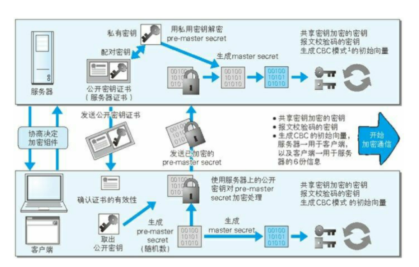
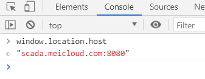

### 腾讯教育科技一面
 ## 事件触发机制

事件冒泡+事件捕获+事件委托

事件捕获阶段，事件目标处理函数、事件冒泡。

先是捕获再是冒泡

事件委托是利用了冒泡

事件委托如何写？？

**currentTarget始终是监听事件者，而target是事件的真正发出者**

```js
// 给父层元素绑定事件
document.getElementById('list').addEventListener('click', function (e) {
  // 兼容性处理
  var event = e || window.event;
  var target = event.target || event.srcElement;
        // 获取到目标阶段指向的元素
   var target = event.target || event.srcElement;

    // 获取到代理事件的函数
    var currentTarget = event.currentTarget;
  // 判断是否匹配目标元素
  if (target.nodeName.toLocaleLowerCase === 'li') {
    console.log('the content is: ', target.innerHTML);
  }
});
```

## 前端安全：详细，讲到了samesite（crsf）

XSS： 通过客户端脚本语言（最常见如：JavaScript）
在一个论坛发帖中发布一段恶意的JavaScript代码就是脚本注入，如果这个代码内容有请求外部服务器，那么就叫做XSS！

CSRF：又称XSRF，冒充用户发起请求（在用户不知情的情况下）,完成一些违背用户意愿的请求（如恶意发帖，删帖，改密码，发邮件等）。

> 很多同学会搞不明白XSS与CSRF的区别，虽然这两个关键词时常抱团出现，但他们两个是不同维度的东西（或者说他们的目的是不一样的）。
> XSS更偏向于方法论，CSRF更偏向于一种形式，只要是伪造用户发起的请求，都可成为CSRF攻击

 xss： 跨站脚本攻击（反射反射型XSS，非持久化，需要欺骗用户自己去点击链接才能触发XSS代码（服务器中没有这样的页面和内容），一般容易出现在搜索页面，存储，dom）(不讲这个分类就不讲)

crsf： 跨站请求伪造（验证码）

HTTP劫持与对策 

**情况二：页面多出了广告的html代码或者插入广告的脚本**

这种情况下，我们能做的有限。

一方面我们可以检测是否有新增的html。监控检测判断，发现是广告就移除掉。

另一方面，对于使用document.write方法写入的广告，我们可以通过重写document.write方法来达到删除广告的目的

1、HTTP响应头，在响应可以通过这些字段来提高安全性

- X-Frame-Options 禁止页面被加载进iframe中
- X-XSS-Protection 对于反射型XSS进行一些防御
- X-Content-Security-Policy 这个就比较复杂了，可选项很多，用来设置允许的的资源来源以及对脚本执行环境的控制等。

2、使用HTTPS、**使用HTTP ONLY的cookie。cookie的secure字段设置为true只能https携带cookie**

3、GET请求与POST请求，要严格遵守规范，不要混用，不要将一些危险的提交使用JSONP完成。

iframe安全问题

使用sandbox的最简单的方式就是只在iframe元素中添加上这个关键词就好，就像下面这样：（添加了会怎么样）**`sandbox`**可以添加很多限制，不主动讲这个

```html
<iframe sandbox src="..."> ... </iframe>
```

**SameSite 属性可以让 Cookie 在跨站请求时不会被发送**，从而可以阻止跨站请求伪造攻击（CSRF）。

##### 属性值

SameSite 可以有下面三种值：

1. **Strict** 仅允许一方请求携带 Cookie，即浏览器将只发送相同站点请求的 Cookie，即当前网页 URL 与请求目标 URL 完全一致。
2. **Lax** 允许部分第三方请求携带 Cookie
3. **None** 无论是否跨站都会发送 Cookie

httpOnly（禁止js读取cookie

**`响应首部 **`Set-Cookie`** 被用来由服务器端向客户端发送 cookie。`**

```bash
Set-Cookie: widget_session=abc123; SameSite=None; Secure
```

## https握手过程（随机数答的不好，

随机数是如何生成的，交换那些随机数

**（1）如何保证公钥不被篡改？**

> 解决方法：将公钥放在[数字证书](http://en.wikipedia.org/wiki/Digital_certificate)中。只要证书是可信的，公钥就是可信的。

**（2）公钥加密计算量太大，如何减少耗用的时间？**

> 解决方法：每一次对话（session），客户端和服务器端都生成一个"对话密钥"（session key），用它来加密信息。由于"对话密钥"是对称加密，所以运算速度非常快，而服务器公钥只用于加密"对话密钥"本身，这样就减少了加密运算的消耗时间。

因此，SSL/TLS协议的基本过程是这样的：

> （1） 客户端向服务器端索要并验证公钥。
>
> （2） 双方协商生成"对话密钥"。
>
> （3） 双方采用"对话密钥"进行加密通信。

ssl和tls的整个过程

1，交换随机数和套件信息

2，服务器**发送自己的证书**，**还有自己的公钥，还有用私钥加密的签名认证**，开始走证书链逐级验证，**确认证书的真实性，再用证书公钥验证签名(确定数据的完整性)**，就确认了服务器的身份（用ca公钥解密证书，拿到的就是服务器公钥呀，

3，**客户端按照密码套件的要求，也生成一个椭圆曲线的公钥（Client Params）**，用“Client KeyExchange”消息发给服务器（这里双方都有了对方的公钥（非对称公钥））  

现在客户端和服务器手里都拿到了**密钥交换算法**的两个参数（Client Params、Server Params）（客户服务端端公钥），就用
**ECDHE(非对称加密算法)算法一阵算，算出了一个新的东西，叫“Pre-Master”，其实也是一个随机数（主要-会话秘钥）**。

**客户端服务端的两个随机数，加双方公钥算出的随机数，三个数字计算成为了秘钥**

（有了主密钥和派生的会话密钥，握手就快结束了。客户端发一个“Change Cipher Spec”，然后再发一
个“Finished”消息，把之前所有发送的数据做个摘要，再加密一下，让服务器做个验证）

4，**客户端将这些数据做个摘要把，再加密一下，发给服务器验证**。服务端也这样

服务器也是同样的操作，发“Change Cipher Spec”和“Finished”消息，双方都验证加密解密OK，握手正
式结束，后面就收发被加密的HTTP请求和响应了

**可以了tls过程已经很明确了**



注意： 每次链接的对称加密的公钥是生成的，所以每次不一样

建立链接的时候，是定下的

服务器证书 + 公钥=》用证书中心给加密，并做一个摘要，对摘要加密

客户端拿到之后，验证证书，用证书中心给的公钥解密，拿到公钥，然后生成随机数，用客户端公钥加密随机数字，两端用随机数生成对称加密算法的钥匙

三个随机数： 两个分别是客户端和服务端生成的随机参数，第三个是用前两个用椭圆曲线算法计算出来的，这三个再计算成最后的会话秘钥

 ## 前端跨域

jsonp

nginx

cors

iframe

ajax

**不同的域、协议或端口**。域名相同的话，就是一级二级子域名都相同

**postMessage**

 **document.domain：**

 ##  小程序原理（答的不好，setDate过程

JavaScript: 微信小程序的 JavaScript 运行环境即不是 Browser 也不是 Node.js。它运行在微信 App 的上下文中，不能操作 Browser context 下的 DOM，也不能通过 Node.js 相关接口访问操作系统 API。所以，严格意义来讲，微信小程序并不是 Html5，虽然开发过程和用到的技术栈和 Html5 是相通的。

WXML: 作为微信小程序的展示层，并不是使用 Html，而是自己发明的基于 XML 语法的描述。

WXSS: 用来修饰展示层的样式。官方的描述是 “ WXSS (WeiXin Style Sheets) 是一套样式语言，用于描述 WXML 的组件样式。WXSS 用来决定 WXML 的组件应该怎么显示。” “我们的 WXSS 具有 CSS 大部分特性...我们对 CSS 进行了扩充以及修改。

## vue构建v-dom树过程 

重要

vnode

## diff过程 

vue的patch是层次遍历，还是深度遍历

- 跟react一样，只进行同层级比较，忽略跨级操作

层次遍历

## 宏任务微任务  1


## webpack相关   1


## 性能优化（自己默认答一遍）

todo： 高频考点，提高自己的知识面

## 逻辑题：时分针夹角 1

当时间为m点n分时，其时针与分针夹角的度数为：

（1）分针在时针前面：


（2）分针在时针后面：


画图就行

一格是30度

## url正则匹配

`(https?|ftp|file)://[-A-Za-z0-9+&@#/%?=~_|!:,.;]+[-A-Za-z0-9+&@#/%=~_|]`

todo ：？



 打代码：

##  写代码用原生JS实现一个类似百度搜索框的自动完成控件（已实现，并附加防抖）

todo: 原生js确实写的很少，必须要好好准备下

有点难，得要好好准备下。好好理解下，自己把流程理顺了就行

```html
<!DOCTYPE html>
<html lang="en">
<head>
  <meta charset="UTF-8">
  <title>Title</title>
  <link rel="stylesheet" href="Web/css/bootstrap.min.css">
  <script src="Web/js/jquery-1.8.3.min.js"></script>
</head>
<style>
  .search {
    display: inline-flex;
    height: 35px;
    margin: 50px auto;
    position: relative;
  }
  .search input {
    border: #eee 1px solid;
    background-color: #fff;
    outline: none;
    width: 200px;
    padding: 0 5px;
  }
  .search button {
    background-color: #ff3300;
    color: #fff;
    border: none;
    width: 80px;
  }
  /*追加到.search的内容后面.然后设置CSS代码, 我们设置他的最小宽度为.search宽度减去搜索按钮的宽度.这样就跟搜索框一样宽.*/
  .search ul {
    list-style-type:none;
    position: absolute;
    left: 0;
    top: 35px;
    border: #eee 1px solid;
    min-width: calc(100% - 80px);
    text-align: left;
  }
  .search ul a {
    display: block;
    padding: 5px;
  }
</style>
<body style="text-align: center;">

  <div class="search">
    <!--1.搜索框,搜索的点击按钮.-->
    <input id="key" type="text" value="" placeholder="请输入需要搜索内容">
    <button>搜索</button>

    <!--2.下面词语列表-->
    <ul id="datalist">
      <!-- <li><a href="#">武林外传</a> </li>
      <li><a href="#">葵花宝典</a> </li>
      <li><a href="#">如来佛掌</a> </li>
      <li><a href="#">九阴白骨爪</a> </li> -->
    </ul>
  </div>
</body>
<script>

  //模拟数据
  var data = ["编程的人", "武林外传", "葵花宝典", "九阴白骨爪", "武林江湖", "will"];

  var ele_key = document.getElementById("key");
  ele_key.onkeyup = function (e) {
    //处理事件
    var val = this.value;
    //获取输入框里匹配的数据
    var srdata = [];
    for (var i = 0; i < data.length; i++) {

      if (val.trim().length > 0 && data[i].indexOf(val) > -1) {
        srdata.push(data[i]);
      }
    }
    //获取到的数据准备追加显示, 前期要做的事情: 清空数据,然后显示数据列表,如果获取到的数据为空,则不显示
    var ele_datalist = document.getElementById("datalist");
    ele_datalist.style.visibility = "visible";
    ele_datalist.innerHTML = "";

    if (srdata.length == 0) {
      ele_datalist.style.visibility = "hidden";
    }

    //将搜索到的数据追加到显示数据列表, 然后每一行加入点击事件, 点击后将数据放入搜索框内, 数据列表隐藏
    var self = this;
    for (var i = 0; i < srdata.length; i++) {
      var ele_li = document.createElement("li");
      var ele_a = document.createElement("a");
      ele_a.setAttribute("href", "javascript:;");
      ele_a.textContent = srdata[i];

      ele_a.onclick = function () {
        self.value = this.textContent;
        ele_datalist.style.visibility = "hidden";
      }


      ele_li.appendChild(ele_a);
      ele_datalist.appendChild(ele_li);
    }

  }

</script>
</html>
```

debounce

- search搜索联想，用户在不断输入值时，用防抖来节约请求资源。
- window触发resize的时候，不断的调整浏览器窗口大小会不断的触发这个事件，用防抖来让其只触发一次

throttle

- 鼠标不断点击触发，mousedown(单位时间内只触发一次)
- 监听滚动事件，比如是否滑到底部自动加载更多，用throttle来判断

**一直不停执行，就用节流，如果是一段时间内触发太多次就用防抖**


时间发生，在n秒之后执行

节流，减少发生的频率

##  大数相加

```js
// n1 n2都是字符串
function addBig(n1,n2){
  let n1Arr = n1.split('').reverse()
  let n2Arr = n2.split('').reverse()
  let flag = 0
  let result = []
  for(let i=0;i<Math.max(n1Arr.length,n2Arr.length); i++){
    let tmp = 0
    if(n1Arr[i] && n2Arr[i]){
      tmp = flag+Number(n1Arr[i])+Number(n2Arr[i])
    }else if(n1Arr[i]){
      tmp =Number(n1Arr[i])+flag
    }else {
      tmp  =Number(n2Arr[i])+flag
    }
    result[i] = tmp%10
    //重要的是这一步，取整，这步错了
    addTmp = tmp > 9 ? 1: 0
  }
  if(flag>0){
    result.push(flag)
  }
  return result.reverse().join('')
}
console.log(addBig('624371231','121')
```

 ### 腾讯教育科技二面
 自我介绍
##  怎么学前端的
##  js看的什么书，印象最深刻的是什么，继承（要写出来，有道题，私有属性不会写

```js
 基于闭包的实现方式
另外一种比较普遍的方式是利用JavaScript的闭包特性。构造函数内定义局部变量和特权函数，其实例只能通过特权函数访问此变量，如下：

function Person(name){
  var _name = name;
  this.getName = function(){
    return _name;
  }
}

var person = new Person('Joe');
这种方式的优点是实现了私有属性的隐藏，Person 的实例并不能直接访问_name属性，只能通过特权函数getName获取：

alert(person._name); // undefined
alert(person.getName()); //'Joe'
使用闭包和特权函数实现私有属性的定义和访问是很多开发者采用的方式，Douglas Crockford也曾在博客中提到过这种方式。但是这种方式存在一些缺陷：

私有变量和特权函数只能在构造函数中创建。通常来讲，构造函数的功能只负责创建新对象，方法应该共享于prototype上。特权函数本质上是存在于每个实例中的，而不是prototype上，增加了资源占用。
```

##  印象深刻的地方
 打代码：
##  登录模块，错误提示（没写完整

考验纯原生手写js能力，还有正则表达式，也看中

纯js手写吗？？todo： 手写登录表单

> 登录模块，输入三次错误之后就需要输入验证码，对信息进行加密处理
>
> 对手机号码号码，邮箱进行正则匹配
>
> 发请求，
>
> 成功之后`this.$cookies.set('userName', this.ruleForm.userName, 60 * 30)`

##  请写一个函数，计算一篇英文文章中出现次数最多的单词及出现次数

问题： 文章很大，然后如何取出单词，空格逗号句号，回车，如何每次只读10行。统计肯定就用map来统计

```java
分治法 + HashMap
没错，分治法 + HashMap 这个方法就是可以用来处理很多 Top K问题的。

对于问题一，其实比较简单，这道题也是我 2016 年腾讯第三轮技术面要求当场写代码的题目。我们可以先判断，这篇文章可能很长，也可能很短，那么我们应该规定一个字数的标志，作为一批的字数限制，例如100个文字。每100个文字是一批的处理极限，我们先读出100个，100以内的就直接全部读出。读出后，打散成字符串，例如英语文章它以空格和一些符号分割。使用split方法就可以打散。此时我们得出一个字符串数组String[] array，有了这个之后就可以参考 找出不重复 问题的解法。每批使用循环遍历一次，存入 HashMap<String,Integer> 里面，string 对应这个数的字符串，Integer 对应它出现的次数，最后最大的自然就是出现次数最多的。下面直接给出个 Demo 函数。

// LinGuanHong
public static void search(String limitText){
    String maxWord = "";
    int    maxTime = 0;
    String[] words = limitText.split(" |\\.|,");
    int length = words.length;
    HashMap<String,Integer> one = new HashMap<>();
    for(int j=0;j<length;j++){
        Integer number = one.get(words[j]);
        if(number != null){
            number = number + 1;
            /** 找到次数加 1    */
            one.put(words[j],number);
            if(maxTime < number){
                maxTime = number;
                maxWord = words[j];
            }
        }else{
            /** 没找到，赋值 1  */
            one.put(words[j],1);
        }
    }
    System.out.println("maxTime is :"+maxTime+" ; maxWord is :"+maxWord);
}
```

##  然后聊了一下部门和评价


 ### 腾讯教育科技三面


##  公司开发模式


##  移动端调试方式


##  移动端兼容性问题


##  小程序渲染和h5渲染的区别


##  https握手过程，是否每一次资源都会握手

先纠正题主描述里的欠妥的地方，“因为它先经过SSL层握手得到公钥”，准确的说，不是公钥，是通信双方共同拥有的秘密，一般称之为“**Pre-Master Key**”。

是的，浏览器可以session ID为单位临时保存加密key等安全参数。

浏览器客户端访问同一个https服务器，可以不必每次都进行完整的TLS Handshake，因为完整的TLS Handshake，涉及到**认证服务器的身份**（数字证书），需要做大量的非对称加密/解密运算，此外还需要做**伪随机函数PRF**，通过“**Pre-Master Key”、“Server Nonce”、“Client Nonce**”共同推导出**session key**，**非对称加密算法RSA/DSA非常耗费CPU资源。**

为了克服这个困难，服务器维护一个以**session ID**（有效期为1天）为索引的结构体，用于临时存放session key，并在**TLS handshake 阶段分享给浏览器**。

当浏览器重新连接https 服务器时，TLS handshake 阶段，出示自己的session ID，**服务器获得session ID，以此为索引，可以获得和该浏览器共同拥有的session key，使用session key可以直接对用户流量做加密/解密动作。**

这样避免了大量的幂、指数计算。

当然，如果服务器没有查找到session ID，双方的TLS安全参数协商按照正常流程走。

Keep-Alive功能使客户端到服 务器端的连接持续有效，当出现对服务器的后继请求时，Keep-Alive功能避免了建立或者重新建立连接。


##  缓存过程，cache-control时间被修改还能否生效

复习下cache-control


**不能吧，因为是强缓存，要么清楚缓存，要么等缓存过期，才会再次发起请求。**

todo： 没找到暂时放一放

 场景题：
##  很大的日志读取，ip出现最多的十次（个），怎么分片（没写出来

`Math.ceil(file.size /(5*1024*1024))`


内存10兆

一次就加载10兆，然后使用堆排序，找到出现最多的10个ip

10次中，再进行一个堆排序进行


把堆排序复制出来，（不用堆排序，就直接用，map，最后sort取出前10个最大的，）

----

复习堆排序

文件分片用二进制的file.slice来进行，hash

文件分片

还是域名分片

大文件上传，把对应的文件写出来

https://juejin.im/post/5dff8a26e51d4558105420ed#heading-21

掘金挂了之后看，先看看域名分片、

除非你有紧急而迫切的需求，不要使用这一过时的技术，升级到 HTTP/2 就好了。在 HTTP/2 里，做域名分片就没必要了：HTTP/2 的连接可以很好的处理并发的无优先级的请求。域名分片甚至会影响性能。大多数 HTTP/2 的实现还会使用一种称作[连接凝聚](https://daniel.haxx.se/blog/2016/08/18/http2-connection-coalescing/)的技术去尝试合并被分片的域名。

cdn或者nginx代理

## 逻辑题（没听清题目，容斥原理。

？？？？这是什么？？？[https://shichengxiao01.github.io/2018/04/08/%E5%AE%B9%E6%96%A5%E5%8E%9F%E7%90%86%E5%B0%8F%E7%BB%93/](https://shichengxiao01.github.io/2018/04/08/容斥原理小结/)

 下班干什么，怎么获取 前端知识

（

作者：杨超越求大厂offer
链接：https://www.nowcoder.com/discuss/426116?source_id=profile_create&channel=1009
来源：牛客网

公司开发模式 

 移动端调试方式 

样式

你有手机没有，手机上装个chrome浏览器，手机打开开发者模式，用数据线连上电脑，电脑打开chrome, 自己动手试一试

代码里安装vconsole，可以看到请求日志dom结构

抓包用fiddler


 移动端兼容性问题 


 小程序渲染和h5渲染的区别

 

 https握手过程，是否每一次资源都会握手 

 缓存过程，cache-control时间被修改还能否生效 

 场景题： 
 \1. 很大的日志读取，ip出现最多的十次，怎么分片（没写出来 

 \2. 逻辑题（没听清题目，容斥原理。 

 下班干什么，怎么获取 [前端]()知识

先把工作中所有用到的工具，学习他的使用技巧原理，之后再根据需要学其他技术

如果一个知识点

）

 ### 腾讯教育科技四面（总监面）
 看看最近的项目
 ## 聊了一下简历上的项目，难点，亮点
##  工资结构，绩效考核
##  实事求是，这个就是聊聊项目和工作经历
##  最后：总监面说项目亮点答的一般，要求做了个活动h5页。
 一天半已完成。 作业好好做


 ### hr面

## 自我介绍，一些背景调查。
## 简历项目扮演角色，这里聊了很多
## 薪资讨论
## 子公司编制和集团编制差异
## 解疑

----

拼命准备，拼命准备，把经典的所有面试题都准备一遍。今天腾讯，明天虾皮

------

编程题

重点是编程题

手写编程题这个比较难

堆排序如何写代码

