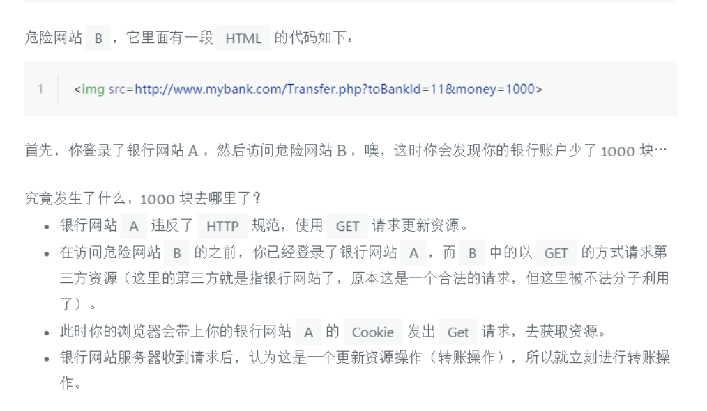

作者：家有佳欣
链接：https://www.nowcoder.com/discuss/315314?type=post&order=time&pos=&page=1&channel=1009&source_id=search_post
来源：牛客网

nginx你有了解使用过吗，nginx的反向***和负载均衡什么意思？有配置过吗 

proxy-pass

upstream 

 假如让你设计一个场景将一个请求分发到不同的服务器上你有什么策略和思路 

轮着来

根据响应时间分配，根据权重分配，根据用户ip分类，根据请求url分配


 js如何监听一个数的变化（不是dom的监听方式）

proxy，set get方法

 快排的时间复杂度，快排稳定吗？你有什么优化方式 


**概括：这里\**效率最好的快排组合\** 是：\**三数取中+插排+聚集相等元素,它和STL中的Sort函数效率差不多\****

**取中间元素作为基准值，如果数量小，就采用插入排序，和基准相等的元素，可以收集起来，然后放到k的周围**

**第一步，在划分过程中，把与key相等元素放入数组的两端**

**第二步，划分结束后，把与key相等的元素移到\**枢轴周围\****

减少迭代次数，确保稳定


 跨域的复杂业务场景 


 **页面卡顿原因是什么，分析一下** 

看是不是有大量的重绘重排（多用dom分片，transform来替代直接设置高宽,todo）

是不是有大量的计算，阻塞了进程（worker来计算

看是不是有要请求资源，请求时间过长，（分多次请求，开启gzip（css，js）压缩，cdn静态资源）

其纵轴是 CPU 使用率，横轴是时间，不同的颜色代表着不同的事件类型，其中：

- 蓝色：加载（Loading）事件
- 黄色：脚本运算（Scripting）事件
- 紫色：渲染（Rendering）事件
- 绿色：绘制（Painting）事件
- 灰色：其他（Other）
- 闲置：浏览器空闲


 http的缓存了解吗？分别的响应头是啥，如何设置资源过期时间，场景有想过应用吗 

todo: http缓存应用

 为何你项目中要使用angular，用的哪个版本？ts使用了吗 


 angular相对于其他2个框架的区别点在哪里你可以分析一下吗 


 angular项目你是如何打包的，配置可以讲一下吗 

 你还有什么问题要问我


xss：跨站脚本攻击

csrf：跨站请求伪造

sql注入： 进一步改造URL：http://www.某某.com/shownews.asp?id=32 and 0<>(select count(*) from admin)

如果系统存在admin表，那我们就得到了网站的管理员密码了。

当然，在攻击一个网站时，我们不知道它的表结构。于是只能用字典枚举法来猜测。这也就是一些SQL注入攻击器的原理，猜解一些惯用的名字。比如user、admin之类的。

再邪恶点，我们可以远程执行cmd指令：http://www.某某.com/shownews.asp?id=32& amp;#8217;; declare @a sysname set @a=’xp_’+’cmdshell’ exec ‘命令语句’---&aid=9

这样你就可以用cmd命令去控制服务器，修改管理员密码、创建用户等，甚至格式化他的硬盘。

**3. 不知道用户名密码，利用SQL注入，登录系统**

这个真是太邪恶了，用户名：’or’’=’ 密码：’or’’=’。猜猜系统做了啥？

SELECT * FROM Users Where Username=’’or’’=’’ and Password=’’or’’=’’

于是，系统返回了Users中所有的记录……

利用get请求，在后面添加一些其他参数（关于sql的）

如何防控： 1，加密重要数据，2，对sql中每个参数，做合法的校验

1.WEB开发人员无法保证所有的输入都已经过滤

2.攻击者利用发送给SQL服务器的输入参数构造可执行的SQL代码（可加入到get请求、post请求、http头信息、cookie中）

> \1. 猜测数据库名，备份数据库
> \2. 猜解字段名称
> \3. 遍历系统的目录结构，分析结构并发现WEB虚拟目录，植入木马
> \4. 查询当前用户的数据库权限
> \5. 设置新的数据库帐户提权得到数据库管理员账户权限
> \6. 利用存储过程获取操作系统管理员账户
> \7. 客户端脚本攻击：通过正常的输入提交方式将恶意脚本提交到数据库中，当其他用户浏览此内容时就会受到恶意脚本的攻击。
> \8. 客户端脚本攻击：通过SQL注入方式将恶意脚本提交到数据库中，直接使用SQL语法UPDATE数据库，并将注入SQL经过“HEX编码”，然后通过exec执行“动态”SQL的特性运行脚本

鹅厂不会让你背概念的，妹子，构建一个怎样的第三方网站可以盗取登陆态，从域名上分析等等

同imweb二面挂了，打错一个大题，csrf的域名劫持

一个典型的CSRF攻击有着如下的流程：

- 受害者登录a.com，并保留了登录凭证（Cookie）。
- 攻击者引诱受害者访问了b.com。
- b.com 向 a.com 发送了一个请求：a.com/act=xx。浏览器会默认携带a.com的Cookie。
- a.com接收到请求后，对请求进行验证，并确认是受害者的凭证，误以为是受害者自己发送的请求。
- a.com以受害者的名义执行了act=xx。
- 攻击完成，攻击者在受害者不知情的情况下，冒充受害者，让a.com执行了自己定义的操作。

#### Samesite=Strict

这种称为严格模式，表明这个 Cookie 在任何情况下都不可能作为第三方 Cookie，绝无例外。比如说 b.com 设置了如下 Cookie：

```html
Set-Cookie: foo=1; Samesite=Strict
Set-Cookie: bar=2; Samesite=Lax
Set-Cookie: baz=3
```

我们在 a.com 下发起对 b.com 的任意请求，foo 这个 Cookie 都不会被包含在 Cookie 请求头中，但 bar 会。举个实际的例子就是，假如淘宝网站用来识别用户登录与否的 Cookie 被设置成了 Samesite=Strict，那么用户从百度搜索页面甚至天猫页面的链接点击进入淘宝后，淘宝都不会是登录状态，因为淘宝的服务器不会接受到那个 Cookie，其它网站发起的对淘宝的任意请求都不会带上那个 Cookie。

#### Samesite=Lax

这种称为宽松模式，比 Strict 放宽了点限制：假如这个请求是这种请求（改变了当前页面或者打开了新页面）且同时是个GET请求，则这个Cookie可以作为第三方Cookie。比如说 b.com设置了如下Cookie：

```html
Set-Cookie: foo=1; Samesite=Strict
Set-Cookie: bar=2; Samesite=Lax
Set-Cookie: baz=3
```

当用户从 a.com 点击链接进入 b.com 时，foo 这个 Cookie 不会被包含在 Cookie 请求头中，但 bar 和 baz 会，也就是说用户在不同网站之间通过链接跳转是不受影响了。但假如这个请求是从 a.com 发起的对 b.com 的异步请求，或者页面跳转是通过表单的 post 提交触发的，则bar也不会发送。


> #### 存储型 XSS
>
> 存储型 XSS 的攻击步骤：
>
> 1. 攻击者将恶意代码提交到目标网站的数据库中。
> 2. 用户打开目标网站时，网站服务端将恶意代码从数据库取出，拼接在 HTML 中返回给浏览器。
> 3. 用户浏览器接收到响应后解析执行，混在其中的恶意代码也被执行。
> 4. 恶意代码窃取用户数据并发送到攻击者的网站，或者冒充用户的行为，调用目标网站接口执行攻击者指定的操作。
>
> 这种攻击常见于带有用户保存数据的网站功能，如论坛发帖、商品评论、用户私信等。
>
> #### 反射型 XSS
>
> 反射型 XSS 的攻击步骤：
>
> 1. 攻击者构造出特殊的 URL，其中包含恶意代码。
> 2. 用户打开带有恶意代码的 URL 时，网站服务端将恶意代码从 URL 中取出，拼接在 HTML 中返回给浏览器。
> 3. 用户浏览器接收到响应后解析执行，混在其中的恶意代码也被执行。
> 4. 恶意代码窃取用户数据并发送到攻击者的网站，或者冒充用户的行为，调用目标网站接口执行攻击者指定的操作。
>
> 反射型 XSS 跟存储型 XSS 的区别是：存储型 XSS 的恶意代码存在数据库里，反射型 XSS 的恶意代码存在 URL 里。
>
> 反射型 XSS 漏洞常见于通过 URL 传递参数的功能，如网站搜索、跳转等。
>
> 由于需要用户主动打开恶意的 URL 才能生效，攻击者往往会结合多种手段诱导用户点击。
>
> POST 的内容也可以触发反射型 XSS，只不过其触发条件比较苛刻（需要构造表单提交页面，并引导用户点击），所以非常少见。
>
> #### DOM 型 XSS
>
> DOM 型 XSS 的攻击步骤：
>
> 1. 攻击者构造出特殊的 URL，其中包含恶意代码。
> 2. 用户打开带有恶意代码的 URL。
> 3. 用户浏览器接收到响应后解析执行，前端 JavaScript 取出 URL 中的恶意代码并执行。
> 4. 恶意代码窃取用户数据并发送到攻击者的网站，或者冒充用户的行为，调用目标网站接口执行攻击者指定的操作。
>
> DOM 型 XSS 跟前两种 XSS 的区别：DOM 型 XSS 攻击中，取出和执行恶意代码由浏览器端完成，属于前端 JavaScript 自身的安全漏洞，而其他两种 XSS 都属于服务端的安全漏洞。
>
> ## XSS 攻击的预防
>
> 通过前面的介绍可以得知，XSS 攻击有两大要素：
>
> 1. 攻击者提交恶意代码。
> 2. 浏览器执行恶意代码。
>
> 针对第一个要素：我们是否能够在用户输入的过程，过滤掉用户输入的恶意代码呢？

-----

作者：信鑫-King
链接：https://www.nowcoder.com/discuss/50455?type=post&order=time&pos=&page=2&channel=1009&source_id=search_post
来源：牛客网


## [腾讯]()课堂IMWeb(挂总监面，看问题就知道为什么了) 

###  一面(2017.2.16 19:00) 

1.  JS事件模型 


1.  AJAX同源策略及跨域方法 

> - AJAX 请求不能发送。
> - 无法获取DOM元素并进行操作。
> - 无法读取Cookie、LocalStorage 和 IndexDB 
>
> 然后就有了跨域方案
>
> 1，cors
>
> 2，ngnix代理
>
> 3，jsonp
>
> 例如：WebSocket，script、img、iframe、video、audio标签的`src`属性等。

1.  HTTP状态码 

   

2.  XSS和CSRF 

> 自己默念答案
>
> 
>
> 

1.  Express特点 

> ## Express的常用功能
>
> - **路由控制**
> - **中间件**
> - 静态文件服务
> - **模板解析**
>
> 有http的中间件api，对mvc，提供一些便捷的api
>
> 都有封装，路由控制router.post('/email', function (req, res) {

todo

1.  nodejs内存泄露 

> 缓存，消息队列没有被消费一直保留，作用域，闭包，长期引用

1.  Vuejs的生命周期? 

> 

1.  gulp和webpack的区别？(模块与流，CommonChunks抽出公共模块) 

> webpack配置相对简单，好像gulp配置比较多
>
> 如果webpack是从入口文件开始打包，每一个文件是一个模块
>
> 然后gulp，配置一系列任务来打包，完成一些功能，然后定义执行顺序，gulp执行任务
>
> 
>
> gulp：强调的是前端开发的流程，通过配置一系列的task，定义task处理的事物（例如文件压缩合并、雪碧图、启动server、 版本控制等），然后定义执行顺序，来让gulp执行task，从而构建前端项目的流程。
> webpack：是一个前端模块化方案，侧重模块打包，把开发中的所有资源（图片、js文件、css文件等）都看成模块，通过loader（加载器）和plugins（插件）对资源进行处理，打包成符合生产环境部署的前端资源。

###  二面（桌面共享写代码） 

[复制代码](#)

```
用原生JS实现一个类似百度搜索框的自动完成控件，比如候选结果集arr=[``'aaa'``,``'abc'``,``'acc'``,``'dda'``,...]，用户输入``'a'``，下拉列表会出现以字母 a 开头的项``'aaa'``, ``'abc'``, ``'acc'``要求：``1``\. 鼠标或键盘可以选中候选结果到输入框``2``\. 能做好兼容性有加分``3``\. 做题时间``45``分钟``4``\. 用原生 js 实现
```

 这个题如果要做好还挺复杂的，兼容下IE、面向对象的设计、输入延时、请求返回的顺序、字符串保存DOM，避免重复 DOM 插入造成的性能问题。
 写的还可以，面试官还比较满意。 

如何兼容这个不会，暂时不强行做

###  三面 (大概1个小时) 

1.  问了项目，对项目的技术点，细节，做的好的，做的不太好的 
2.  统计给定数组中，各数出现的次数，返回 json 对象 
3.  gulp和webpack的区别？ 
4.  5点15分时，时针和分针的夹角 

###  四面 (总监面，3个问题) 

1.  最近做的项目(问最近，开始有些懵，) 
2.  浏览器缓存 
3.  60%喜欢足球，70%喜欢篮球，80%喜欢排球，问既喜欢足球，又喜欢篮球，还喜欢排球的有多少？ 

>  总监全程很高冷，基本不说话，我还以为电话信号不好。回答过程中没有任何反馈，感觉我一直在自言自语。

-----

