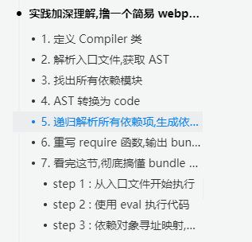
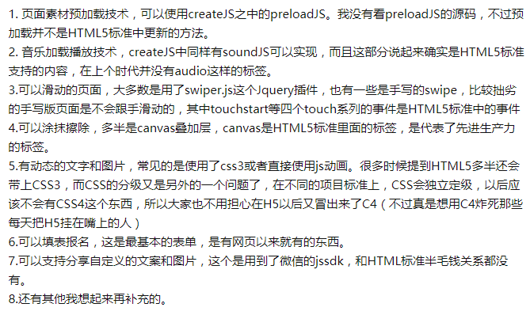
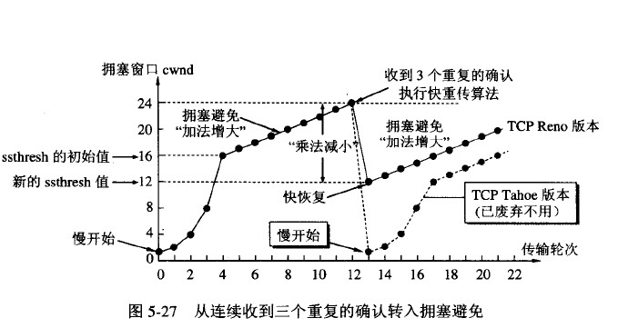

dns原理（针对问题再复习一遍）

登录（cookie）

http3 

vue（找相关的面试题，找到自己忽略不了解的地方）

vue3（实际下载项目使用）（todo）

node（那本书）

webpack（针对问题再复习一遍）

h5（面试题+手写）

手写代码和

----

vue webpack node

从这三个地方开始

vue- vue3

webpack

node

---

node单线程的缺点

无法利用多核cpu

错误会引起整个应用退出

大量计算占用cpu无法继续调用异步io

node内置模块是事先编译成二进制，查询时候优先查内置，不，缓存第一，缓存是编译执行的结果

**node查找顺序**

1，内置模块

2，路径形式的话，补全路径查找，按js json node补全后缀来找再按目录来找

就是之前说的，用，文件或者目录名，匹配js json node文件来查找

3，自定义模块

就是没有包含路径的，就依次从当前目录的依赖一直向上找，找文件和目录

如果是目录，就会当成一个包来看待，会去找packagejson文件中的main属性指定的入口文件，如果没有packagejson文件或者main字段找不到，就是找index js json node如果都没有就没有了


**node中的内存泄露**（再研究下）

缓存（限制大小，限制失效时间）

队列消费不及时

作用域未释放

buffer存储二进制格式的类型

restful是将http请求方法加入了路由，在url路径上体现更资源化


多进程： child_process模块

fork方法（fork（'./work,js'））和spawn一样，不过是读取一个文件，来创建子进程

spawn启动一个进程来执行命令

exec（）启动一个进程来执行命令，回调函数获知子进程状况

execfile启动一个子进程来执行可执行文件

ommessage  postmessage，send通信

node中有管道，套接字

cluster用以解决渡河cpu的利用率问题，自动创建，‘

部署，脚本重启，，判断是否已启动，通过进程id判断，run/app.pid存不存在，不存在就启动

-----

webpack

1，webpack打包原理

Webpack 的运行流程是一个串行的过程,从启动到结束会依次执行以下流程 :

1. 初始化参数：从配置文件和 Shell 语句中读取与合并参数,得出最终的参数。
2. 开始编译：用上一步得到的参数初始化 Compiler 对象,加载所有配置的插件,执行对象的 run 方法开始执行编译。
3. 确定入口：根据配置中的 entry 找出所有的入口文件。
4. 编译模块：从入口文件出发,调用所有配置的 Loader 对模块进行翻译,再找出该模块依赖的模块,再递归本步骤直到所有入口依赖的文件都经过了本步骤的处理。
5. 完成模块编译：在经过第 4 步使用 Loader 翻译完所有模块后,得到了每个模块被翻译后的最终内容以及它们之间的依赖关系。
6. 输出资源：根据入口和模块之间的依赖关系,组装成一个个包含多个模块的 Chunk,再把每个 Chunk 转换成一个单独的文件加入到输出列表,这步是可以修改输出内容的最后机会。
7. 输出完成：在确定好输出内容后,根据配置确定输出的路径和文件名,把文件内容写入到文件系统。

从 entry 出发，首先收集 entry 文件的依赖，queue 其实是一个数组，我们将最开始的入口模块放在最开头。我们将 es6 的代码通过 entry.js 入口文件开始编译，然后根据循环递归调用把所有文件所依赖的文件都解析和加载了一遍

先全部都用loader处理一遍，生成依赖，然后再根据依赖，打包成chunk



2，webpack热更新原理

启动`webpack`，生成`compiler`实例。`compiler`上有很多方法，比如可以启动 `webpack` 所有**编译**工作，以及**监听**本地文件的变化。

使用`express`框架启动本地`server`，让浏览器可以请求本地的**静态资源**。

本地`server`启动之后，再去启动`websocket`服务，如果不了解`websocket`，建议简单了解一下[websocket速成](https://www.ruanyifeng.com/blog/2017/05/websocket.html)。通过`websocket`，可以建立本地服务和浏览器的双向通信。这样就可以实现当本地文件发生变化，立马告知浏览器可以热更新代码啦！


1.当修改了一个或多个文件；
2.文件系统接收更改并通知webpack；
3.webpack重新编译构建一个或多个模块，并通知HMR服务器进行更新；
4.HMR Server 使用webSocket通知HMR runtime 需要更新，HMR运行时通过HTTP请求更新jsonp；
5.HMR运行时替换更新中的模块，如果确定这些模块无法更新，则触发整个页面刷新。


有 A、B 两个 js 模块，现要将当前使用的 A 模块替换成 B 模块，如何用最简单的代码实现热更新？


3，webpack tree-shaking原理

webpack对代码进行标记，把import & export标记为3类：

  \- 所有import标记为`/* harmony import */`

  \- 被使用过的export标记为`/harmony export([type])/`，其中[type]和webpack内部有关，可能是binding，immutable等；

  \- 没有被使用的export标记为`/* unused harmony export [FuncName] */`，其中[FuncName]为export的方法名，之后使用Uglifyjs（或者其他类似的工具）进行代码精简，把没用的都删除。

Uglifyjs： 应该是webpack优化阶段进行代码压缩，简化，对抽象语法树的优化

1. ES6 Module引入进行静态分析，故而编译的时候正确判断到底加载了那些模块
2. 静态分析程序流，判断那些模块和变量未被使用或者引用，进而删除对应代码

4，webpack

```javascript
require.resolve(dependency: String);
```

已同步的方式获取模块的 ID。编译器（compiler）会确保依赖项在最终输出 bundle 中可用。建议将其视为不透明值，只能与 `require.cache[id]` 或 `__webpack_require__(id)` 配合使用（最好避免这种用法）。

webpack如何实现异步加载，先给创建一个模块id和地址，然后等加载完成之后，回调函数写入对应的文件里面

客户端的异步加载是通过`JSONP`原理进行加载资源，将`chunk`内容（`[chunkIds, modules]`）存到全局的`webpackJsonp`数组中，并改造`webpackJsonp`的`push`方法实现监听`chunk`加载完成事件。具体实现如下：

不管是服务端还是客户端同步加载的方法都一样，主要是检测`installedModules`中是否已经缓存有要加载的`module`，有则直接返回，否则就创建一个新的`module`，并执行返回`module.exports`，具体实现如下：

```js
// 编译后的同步加载
__webpack_require__(/*! ./src/app.js */"./src/app.js");

// 加载模块的方法，即require方法
function __webpack_require__(moduleId) {
    // 检查当前的module是否已经存在缓存中
    if(installedModules[moduleId]) {
        return installedModules[moduleId].exports; // 直接返回已缓存的 module.exports
    }
    // 创建一个新的 module， 并添加到缓存中
    var module = installedModules[moduleId] = {
        i: moduleId,
        l: false, // 是否已经加载
        exports: {} // 暴露的对象
    };
    // 执行当前 module 的方法
    modules[moduleId].call(module.exports, module, module.exports, __webpack_require__);
    // 标记 module 加载完成状态
    module.l = true;
    // 返回 module 暴露的 exports 对象
    return module.exports;
}
```

**复习下笔记**

然后就好好看看                  

没有了

----

dns
**如何实现DNS预解析？**

**DNS预解析在什么时候执行？**

> 在 Chrome 中默认已经开启对静态资源的 dns 预解析，因为页面下载到浏览器时已经知道需要访问哪些静态资源 url，所以浏览器会提前做 dns 预解析操作。但对于通过 js 动态加载的 url，浏览器就不会自动预解析了，这时 dns-prefetch 就会派上明显的用场。我们举一个例子，看下真实的效果：
>
> 所以就是页面一下载下来，浏览器就知道要访问那些静态资源url

**那么下一个问题，你讲一下dns解析的具体过程，比如对 www.qq.com 进行解析。dns是基于哪个协议的？**

作者：Marlous
链接：https://www.zhihu.com/question/23042131/answer/24922954
来源：知乎
著作权归作者所有。商业转载请联系作者获得授权，非商业转载请注明出处。


**1）** **浏览器缓存**

　　当用户通过浏览器访问某域名时，浏览器首先会在自己的缓存中查找是否有该域名对应的IP地址（若曾经访问过该域名且没有清空缓存便存在）；

　　**2）** **系统缓存**

　　当浏览器缓存中无域名对应IP则会自动检查用户计算机系统Hosts文件DNS缓存是否有该域名对应IP；

　　**3）** **路由器缓存**

　　当浏览器及系统缓存中均无域名对应IP则进入路由器缓存中检查，以上三步均为客服端的DNS缓存；

　　**4）** **ISP****（互联网服务提供商）DNS****缓存**

　　当在用户客服端查找不到域名对应IP地址，则将进入ISP DNS缓存中进行查询。比如你用的是电信的网络，则会进入电信的DNS缓存服务器中进行查找；

　　**5）** **根域名服务器**

　　当以上均未完成，则进入根服务器进行查询。全球仅有13台根域名服务器，1个主根域名服务器，其余12为辅根域名服务器。根域名收到请求后会查看区域文件记录，若无则将其管辖范围内顶级域名（如.com）服务器IP告诉本地DNS服务器；

　　**6）** **顶级域名服务器**

　　顶级域名服务器收到请求后查看区域文件记录，若无则将其管辖范围内主域名服务器的IP地址告诉本地DNS服务器；

　　**7）** **主域名服务器**

　　主域名服务器接受到请求后查询自己的缓存，如果没有则进入下一级域名服务器进行查找，并重复该步骤直至找到正确纪录；

　　**8****）保存结果至缓存**

　　本地域名服务器把返回的结果保存到缓存，以备下一次使用，同时将该结果反馈给客户端，客户端通过这个IP地址与web服务器建立链接。


TCP与UDP的区别： 
  UDP和TCP协议的主要区别是两者在如何实现信息的可靠传递方面不同。**TCP协议中包含了专门的传递保证机制，当数据接收方收到发送方传来的信息时，会自动向发送方发出确认消息；发送方只有在接收到该确认消息之后才继续传送其它信息，否则将一直等待直到收到确认信息为止。** 与TCP不同，UDP协议并不提供数据传送的保证机制。如果在从发送方到接收方的传递过程中出现数据报的丢失，协议本身并不能做出任何检测或提示。因此，通常人们把UDP协议称为不可靠的传输协议。相对于TCP协议，UDP协议的另外一个不同之处在于如何接收突发性的多个数据报。不同于TCP，UDP并不能确保数据的发送和接收顺序。事实上，UDP协议的这种乱序性基本上很少出现，通常只会在网络非常拥挤的情况下才有可能发生。 
  既然UDP是一种不可靠的网络协议，那么还有什么使用价值或必要呢？其实不然，在有些情况下UDP协议可能会变得非常有用。因为UDP具有TCP所望尘莫及的速度优势。虽然TCP协议中植入了各种安全保障功能，但是在实际执行的过程中会占用大量的系统开销，无疑使速度受到严重的影响。反观UDP由于排除了信息可靠传递机制，将安全和排序等功能移交给上层应用来完成，极大降低了执行时间，使速度得到了保证。 

DNS在进行区域传输的时候使用TCP协议，其它时候则使用UDP协议； 
  DNS的规范规定了2种类型的DNS服务器，一个叫主DNS服务器，一个叫辅助DNS服务器。在一个区中主DNS服务器从自己本机的数据文件中读取该区的DNS数据信息，而辅助DNS服务器则从区的主DNS服务器中读取该区的DNS数据信息。当一个辅助DNS服务器启动时，它需要与主DNS服务器通信，并加载数据信息，这就叫做区传送（zone transfer）。 

为什么既使用TCP又使用UDP？ 
首先了解一下TCP与UDP传送字节的长度限制： 
  **UDP报文的最大长度为512字节，而TCP则允许报文长度超过512字节。当DNS查询超过512字节时，协议的TC标志出现删除标志，这时则使用TCP发送。通常传统的UDP报文一般不会大于512字节。** 

区域传送时使用TCP，主要有一下两点考虑： 
1.辅域名服务器会定时（一般时3小时）向主域名服务器进行查询以便了解数据是否有变动。如有变动，则会执行一次区域传送，进行数据同步。**区域传送将使用TCP而不是UDP，因为数据同步传送的数据量比一个请求和应答的数据量要多得多。** 
2.TCP是一种可靠的连接，保证了数据的准确性。 

域名解析时使用UDP协议： 
客户端向DNS服务器查询域名，一般返回的内容都不超过512字节，用UDP传输即可。不用经过TCP三次握手，这样DNS服务器负载更低，响应更快。虽然从理论上说，客户端也可以指定向DNS服务器查询的时候使用TCP，但事实上，很多DNS服务器进行配置的时候，仅支持UDP查询包。

##### 1、缓存感染：

黑客会熟练的使用DNS请求，将数据放入一个没有设防的DNS服务器的缓存当中。这些缓存信息会在客户进行DNS访问时返回给客户，从而将客户引导到入侵者所设置的运行木马的Web服务器或邮件服务器上，然后黑客从这些服务器上获取用户信息。

##### 2、DNS信息劫持：

入侵者通过监听客户端和DNS服务器的对话，通过猜测服务器响应给客户端的DNS查询ID。每个DNS报文包括一个相关联的16位ID号，DNS服务器根据这个ID号获取请求源位置。黑客在DNS服务器之前将虚假的响应交给用户，从而欺骗客户端去访问恶意的网站。

##### 3、DNS重定向

攻击者能够将DNS名称查询重定向到恶意DNS服务器。这样攻击者可以获得DNS服务器的写权限。

##### DNS的防范方法：

防范方法其实很简单，总结来说就只有两条。
（1） **直接用IP访问重要的服务**，这样至少可以避开DNS欺骗攻击。但这需要你记住要访问的IP地址。

（2） **加密所有对外的数据流**，对服务器来说就是尽量使用SSH之类的有加密支持的协议，对一般用户应该用PGP之类的软件加密所有发到网络上的数据。只要能做到这些，基本上就可以避免DNS欺骗攻击了。


dns欺骗     

  

h5



2.布局方面我是用的是rem + 媒体查询

原生的js事件，原生的代码

----

手写h5那些应用

手写登录模块，考虑下cookie

---


这里面的知识点，全部自己说一下】

------

tcp第三次握手失败怎么办，？？？todo1

**在 Linux 中就是默认重试 5 次，并且就是阶梯性的重试，间隔就是1s、2s、4s、8s、16s，再第五次发出之后还得等 32s 才能知道这次重试的结果，所以说总共等63s 才能断开连接。**



