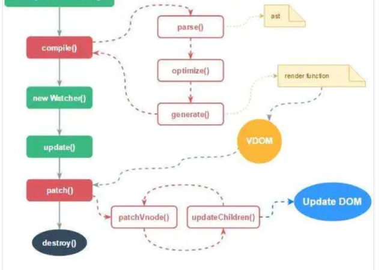
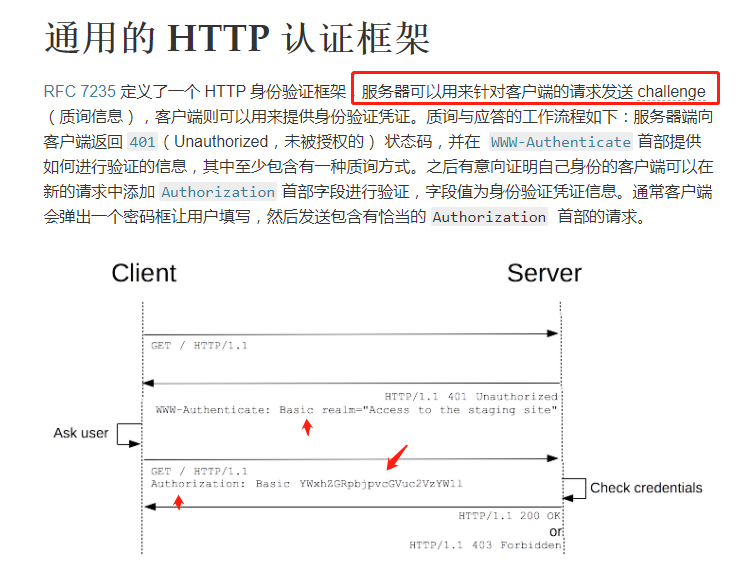
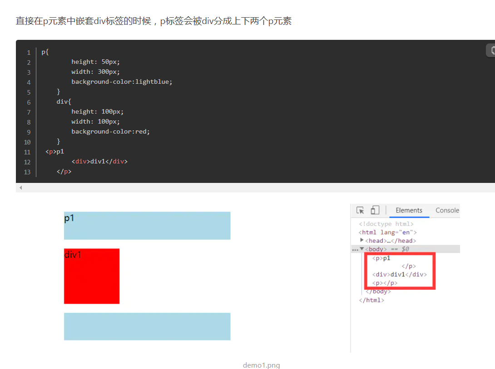
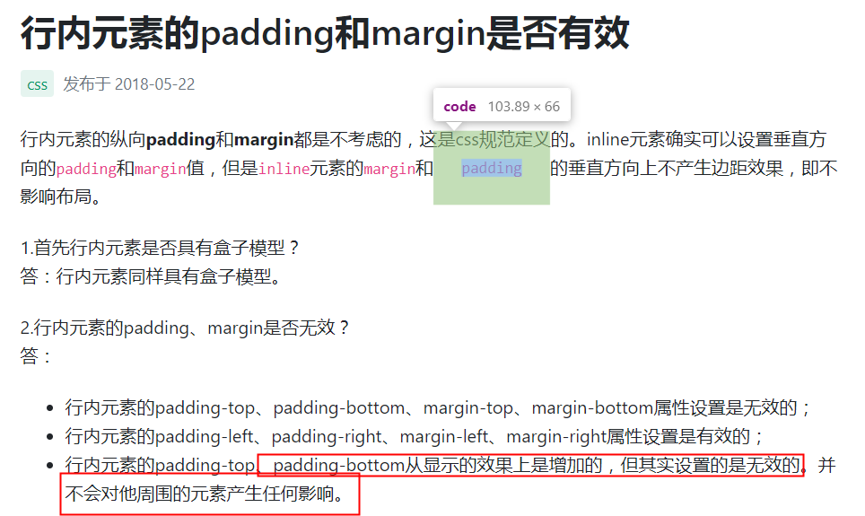

写在前面：和自己不相关的技术，不要去看，重点是理解，然后是背，然后就去好好手写代码，重点关注

---

作者：坏人
链接：https://www.nowcoder.com/discuss/403480
来源：牛客网


•prototype和__proto__的关系是什么 （谁由谁创建的）

  •float和display：inline-block；的区别 

> inline-block: 水平排列一行，即使元素高度不一，也会以高度最大的元素高度为行高，即使高度小的元素周围留空，也不回有第二行元素上浮补位。可以设置默认的垂直对齐基线。inline-block的元素仍然在仍在文档流中占据位置。
>
> float: 让元素脱离当前文档流，呈环绕状排列，如遇上行有空白，而当前元素大小可以挤进去，这个元素会在上行补位排列。默认是顶部对齐。脱离文档流。

  •前端优化策略列举 （背下字节跳动综合大范围题目）

  •首屏、白屏时间如何计算 


### 可使用 Performance API 时

```
白屏时间 = firstPaint - performance.timing.navigationStart;
```

### 不可使用 Performance API 时

```js
白屏时间 = firstPaint - pageStartTime;
```


  •闭包 

  •作用域链 

  •ajax如何实现、readyState五中状态的含义 

| 0    | 未初始化状态：此时，已经创建了一个XMLHttpRequest对象         |
| ---- | ------------------------------------------------------------ |
| 1    | 准备发送状态：此时，已经调用了XMLHttpRequest对象的open方法，并且XMLHttpRequest对象已经准备好将一个请求发送到服务器端 |
| 2    | 已经发送状态：此时，已经通过send方法把一个请求发送到服务器端，但是还没有收到一个响应 |
| 3    | 正在接收状态：此时，已经接收到HTTP响应头部信息，但是消息体部分还没有完全接收到 |
| 4    | 完成响应状态：此时，已经完成了HTTP响应的接收                 |

  •jsonp如何实现 

  •怎么处理跨域 

  •restful的method解释 你们，                                                                                 

GET 用来获取资源，
POST 用来新建资源（也可以用于更新资源），
PUT 用来更新资源，
DELETE 用来删除资源。比如：

  •get和post的区别 

对于GET方式的请求，浏览器会把http header和data一并发送出去，服务器响应200（返回数据）；

而对于POST，浏览器先发送header，服务器响应100 continue，浏览器再发送data，服务器响应200 ok（返回数据）

也就是说，GET只需要汽车跑一趟就把货送到了，而POST得跑两趟，第一趟，先去和服务器打个招呼“嗨，我等下要送一批货来，你们打开门迎接我”，然后再回头把货送过去。

因为POST需要两步，时间上消耗的要多一点，看起来GET比POST更有效。因此Yahoo团队有推荐用GET替换POST来优化网站性能。但这是一个坑！跳入需谨慎。为什么？

数据不一样，之前有接触过，两次交互，三次交互


  •事件模型解释 

  •编写一个元素拖拽的插件  ？

  •编写一个contextmenu的插件   ？ 

  •编写web端cookie的设置和获取方法   ？

document.cookie="name="+username; 

var username=document.cookie.split(";")[0].split("=")[1]; 

  •编写h5需要注意什么   ？


  •xss和crsf的原理以及怎么预防 


  •css优先级 

> 　CSS选择器的优先级是：内联 > ID选择器 > 类选择器 > 标签选择器
>
> 到具体的计算层面，优先级是由 A 、B、C、D 的值来决定的，其中它们的值计算规则如下：
>
> - A 的值等于 1 的前提是存在内联样式, 否则 A = 0;
> - B 的值等于 ID选择器 出现的次数;
> - C 的值等于 类选择器 和 属性选择器 和 伪类 出现的总次数;
> - D 的值等于 标签选择器 和 伪元素 出现的总次数 。
>
> 就比如下面的选择器，它不存在内联样式，所以A=0,不存在id选择器B=0,存在一个类选择器C=1,存在三个标签选择器D=3，那么最终计算结果为: {0, 0, 1 ,3}
>
> ```css
> ul ol li .red {
>     ...
> }
> ```
>
> 按照这个结算方式，下面的计算结果为: {0, 1, 0, 0}
>
> ```css
> #red {
> 
> }
> ```
>
> 我们的比较优先级的方式是从A到D去比较值的大小，A、B、C、D权重从左到右，依次减小。判断优先级时，从左到右，一一比较，直到比较出最大值，即可停止。
>
> 比如第二个例子的B与第一个例子的B相比，1>0,接下来就不需要比较了，第二个选择器的优先级更高

  •如何实现点击radio的文字描述控制radio的状态（通过label实现） 

> html中的label标签的作用是：当点击label标签时，浏览器会自动将焦点转到相关的input表单控件上。
>
> 
>
> ```html
> <input type="radio" name="fruit"/>苹果
> 
> 
> 
> <input type="radio" name="fruit"/>香蕉
> ```
>
> 
> 你想达到的效果是点击”苹果“时，”苹果“前面的radiobutton能够选中，事实上并没有，我们使用label标签就可以简单实现这个功能：
>
> 
>
> ```html
> <label><input type="radio" name="fruit"/>苹果</label>
> 
> 
> 
> <label><input type="radio" name="fruit"/>香蕉</label>
> ```

  •node 

  •Buffer模块是干什么的 

**Buffer作为存在于全局对象上，无需引入模块即可使用，你绝对不可以忽略它。 可以理解Buffer是在内存中开辟的一片区域，用于存放二进制数据。Buffer所开辟的是堆外内存**

  •Stream是什么，使用的两种模式 

一般我们处理数据有两种模式, 一种是buffer模式, 一种是stream模式, buffer模式就是取完数据一次性操作, stream模式就是边取数据边操作.
 举个例子, 如果打开一个2G的文件, 用buffer模式就是先分配2G的内存, 把文件全部读出来, 然后开始操作内存, 而用流模式的方法就是边读数据, 边开始处理

nodejs里面的stream一般分四种, 其中转换流是一种特殊的读写流.

- 输入流(stream.Readable)
- 输出流(stream.Writable)
- 读写流(stream.Duplex)
- 转换流(stream.Transform)

另外, nodejs里面的流有两种模式, 二进制模式和对象模式.

- 二进制模式, 每个分块都是buffer或者string对象.
- 对象模式, 流内部处理的是一系列普通对。


  •http模块如何将异步处理方式实现成同步处理方式，具体解析请参考http模块如何将异步•处理转成同步处理 

使用模块 `bluebird` , 利用其 `promisifyAll` `API` 转成`Promise` 

**直接说，不是很了解**

  •utf8和gbk的区别 

GBK包含全部中文字符；UTF-8则包含全世界所有国家需要用到的字符。


  •知道页面上某个点的坐标，如何获取该坐标上的所有元素 

 不知道，一个个遍历，判断

**clientWidth = width(可视区) + padding**

　　**offsetWidth = width(可视区) + padding + border**

　　**scrollWidth = width(内容区)**　

  •7点15分小于180度的夹角是多少 

  •大数相加 

  •给５升和６升的水杯如何倒出３升的水 

  •一班喜欢足球的人60%，喜欢排球的70%，喜欢篮球的80%，求喜欢足球和排球的占多少 

---

  •前端异常监测如何实现 

没有做过，如果是我的话

a、全局捕获

通过全局的接口，将捕获代码集中写在一个地方，可以利用的接口有：

- window.addEventListener(‘error’) / window.addEventListener(“unhandledrejection”) / document.addEventListener(‘click’) 等
- 框架级别的全局监听，例如aixos中使用interceptor进行拦截，vue、react都有自己的错误采集接口
- 通过对全局函数进行封装包裹，实现在在调用该函数时自动捕获异常
- 对实例方法重写（Patch），在原有功能基础上包裹一层，例如对console.error进行重写，在使用方法不变的情况下也可以异常捕获

b、单点捕获

在业务代码中对单个代码块进行包裹，或在逻辑流程中打点，实现有针对性的异常捕获：

- try…catch
- 专门写一个函数来收集异常信息，在异常发生时，调用该函数
- 专门写一个函数来包裹其他函数，得到一个新函数，该新函数运行结果和原函数一模一样，只是在发生异常时可以捕获异常

只了解捕获异常

---

  •直播点赞按钮的冒泡功能如何实现

主要是动画效果

----

 •js的uglify如何实现 

uglify 包里有 ast.js 所以它一定是生成了抽象语法树
接着遍历语法树并作出优化，像是替换语法树中的变量，变成a，b，c那样的看不出意义的变量名。还有把 if/else 合并成三元运算符等。
最后输出代码的时候，全都输出成一行。

不了解

---


  •项目架构、如何带人 


  •前端工程化方面做了哪些东西

这个面试很难，不是我这个阶段应该会的

---

作者：王司荇
链接：https://www.nowcoder.com/discuss/402583
来源：牛客网


一面: 

  •性能优化 

单独整理的资源，可以好好看看

  •http缓存 

熟悉的不能再熟悉

  •做过的有特点的项目 

pwa

  •遇到的问题与解决方案 

做了一个element没有的组件

  •toB和toC的区别 

  •现场面对客户的经历 

  •前端安全相关(着重中间人劫持) 

https

> 计算机安全问题：专题总结，动手默写下配置
>
> xss
>
> - 服务器对输入的脚本进行过滤／转码
> - 使用 CSP （内容安全策略）让服务器决定浏览器可以加载哪些资源，执行哪些脚本。
>
> crsf
>
> 从第三方站点发送请求时，禁止发送 Cookie —— set-cookie 中设置 SameSite 为 Strict
>
> 验证请求的来源站点 —— 通过 Request Header: Referer || Origin 
>
> CSRF Token 验证，服务器要求所有请求必须携带 CSRF Token ，第三方无法拿到 Token ，伪造的请求会被拒绝访问

**todo:  手动实现下cookie和token登录**

  •为什么跳槽 

  •职业规划 

  •有什么问我的(团队简介、前端参与项目的过程) 

  


  二面: 

  •项目开发流程 

  •对vuex的看法 

全局组件通信，公用数据多适合，小项目可以不用，还是比较大的

  •vue从data改变到页面渲染的过程 

第一次渲染的时候，就先parse生成ast树，然后优化ast树，然后生成vnode，然后render成vnom？？？

没太清楚（**todo：还需要补充**）

数据改变了，set方法监听到，然后把dep类中相关的watcher都通知一下，wachter通知到了，就进行patch方法，生成新的vnode，然后对比新旧两耳vnode来发现区别，然后更新真实dom



  •介绍状态机 

　* **状态总数（state）是有限的。**
　　* **任一时刻，只处在一种状态之中。**
　　* **某种条件下，会从一种状态转变（transition）到另一种状态。**

  •组件设计原则 

> 单一职责
>
> 通用性
>
> 封装
>
> 组合
>
> 纯组件和非纯组件
>
> 可测试
>
> 富有意义

  •怎么看待组件层级嵌套很多层 

todo： 不知道，

  •前端安全防范措施 

todo： 专门的文章


  •介绍oauth 

https://www.ruanyifeng.com/blog/2014/05/oauth_2_0.html

不了解： 大概就是有一个中间授权机构，区分出客户端和服务端

  •怎么看待virtual dom 


  •对flutter的了解 

不了解

  •weex和rn原理 


  •大屏用的技术 

vue+echart+h5

  •大屏数据来源与管理 


  •websocket的使用场景 


  •pwa的使用 

  •对http2的了解 

> 具体中的，深挖，分帧数

  •对新技术的了解 

> 自己下个vue3项目来看看，写写

  •职业规划 

  •为什么想来[腾讯]() 

  •有什么问我的（团队协作方式、技术积累、对我的期待） 


  三面: 

  •为啥想离职，现公司不好吗 

  •360企业安全和360啥关系 

  •你认为蓝信为什么要有支付功能 

  •剩下全聊简历上的项目，就不描述了 

  •有什么问我的（招人原因 node使用场景、技术栈、项目集成方案） 


  四面: 

  •介绍项目特色与难点 

  •性能优化 

-----

  •对MVC MVP MVVM的了解 

> - 视图（View）：用户界面。
> - 控制器（Controller）：业务逻辑
> - 模型（Model）：数据保存

各部分之间的通信方式如下。


> 1. View 传送指令到 Controller
> 2. Controller 完成业务逻辑后，要求 Model 改变状态
> 3. Model 将新的数据发送到 View，用户得到反馈

所有通信都是单向的。

## 四、MVP

MVP 模式将 Controller 改名为 Presenter，同时改变了通信方向。


\1. 各部分之间的通信，都是双向的。

\2. View 与 Model 不发生联系，都通过 Presenter 传递。

\3. View 非常薄，不部署任何业务逻辑，称为"被动视图"（Passive View），即没有任何主动性，而 Presenter非常厚，所有逻辑都部署在那里。

MVVM 模式将 Presenter 改名为 ViewModel，基本上与 MVP 模式完全一致。


------

  •对SEO的了解 

不了解

ssr 提高搜索排行

-----


  •做了道逻辑题 

  •国内前端行业的发展 

  •有什么问我的（团队名称的意义、团队的业务、如何定位前端在设计团队的角色） 

  五面: 

  •同事怎么看待你 

  •你的优点 

  •你的缺点 

  •你还能提高的地方 

  •三年内的职业规划 

  •其他的日常聊天 

  •有什么问我的 

  1.部门在 XXG 以至公司的定位（相比于公司其他方向的部门，我们的特点是？ 相比于同方向其他公司的部门，我们的特点是？） 

  2.设计师、产品、研发之间的合作 

  3.部门对公司或对行业最大的贡献是？ 

  


  五面如上所说，还和其他大佬们聊了聊天，主要有前端能力范围、团队成员技术能力培养、部门技术开源、部门优秀项目等。

----

作者：summering
链接：https://www.nowcoder.com/discuss/396853
来源：牛客网

（和我同一样的工作经验）

一面（电话面） 

----

  **合并两个数组** 

> ```
> var a = [1,2,3]; 
> var b = [4,5,6]; 
> var c = a.concat(b);//c=[1,2,3,4,5,6];
> ```
>
> ```
> a.push.apply(a,b);
> 复制代码
> ```
>
> 调用a.push这个函数实例的apply方法，同时把，b当作参数传入，这样a.push这个方法就会遍历b数组的所有元素，达到合并的效果。 上面的操作就等同于：
>
> ```
> a.push(4,5,6);
> ```
>
> ```
> var a = [1,2,3];
> var b = [4,5,6];
> var newA = [...a,...b]
> ```

----

  **内存泄漏** 

不再用到的内存，没有及时释放，就叫做内存泄漏（memory leak）。

http://www.ruanyifeng.com/blog/2017/04/memory-leak.html

这里面写了如何用谷歌来判断是否内存泄露，原理就是，随着程序不断的运行下去，占用内存越来越多

下面以 WeakMap 为例，看看它是怎么解决内存泄漏的。

> ```javascript
> const wm = new WeakMap();
> 
> const element = document.getElementById('example');
> 
> wm.set(element, 'some information');
> wm.get(element) // "some information"
> ```

上面代码中，先新建一个 Weakmap 实例。然后，将一个 DOM 节点作为键名存入该实例，并将一些附加信息作为键值，一起存放在 WeakMap 里面。这时，WeakMap 里面对`element`的引用就是弱引用，不会被计入垃圾回收机制。

weakmap，是对map的key实现若引用

Set
1.成员不能重复
2.只有健值，没有健名，有点类似数组。
\3. 可以遍历，方法有add, delete,has
weakSet

1. 成员都是对象
2. 成员都是弱引用，随时可以消失。 可以用来保存DOM节点，不容易造成内存泄漏
3. 不能遍历，方法有add, delete,has
   Map
4. 本质上是健值对的集合，类似集合
5. 可以遍历，方法很多，可以干跟各种数据格式转换
   weakMap
   1.直接受对象作为健名（null除外），不接受其他类型的值作为健名
6. 健名所指向的对象，不计入垃圾回收机制
7. 不能遍历，方法同get,set,has,delete

**重点关注，weakmap不能用来遍历，那有啥用，只能用get方法，多用来存储dom节点**

mapset遍历方法

遍历方法（遍历顺序为插入顺序）

- keys()：返回一个包含集合中所有键的迭代器
- values()：返回一个包含集合中所有值得迭代器
- entries()：返回一个包含Set对象中所有元素得键值对迭代器
- forEach(callbackFn, thisArg)：用于对集合成员执行callbackFn操作，如果提供了 thisArg 参数，回调中的this会是这个参数，**没有返回值**

遍历方法

- Keys()：将字典中包含的所有键名以迭代器形式返回
- values()：将字典中包含的所有数值以迭代器形式返回
- entries()：返回所有成员的迭代器
- forEach()：遍历字典的所有成员

---


这个也是

  闭包 

函数和对其周围状态（**lexical environment，词法环境**）的引用捆绑在一起构成**闭包**（**closure**）。也就是说，闭包可以让你从内部函数访问外部函数作用域。在 JavaScript 中，每当函数被创建，就会在函数生成时生成闭包。

**内部函数引用外部函数的时候，当内部函数被创建，外部函数执行的时候，会在内部函数里面生成一个闭包，这个闭包是对外层函数变量的引用**

闭包为什么会引起内存泄露，如何说闭包

**todo：如何说作用域，**(ao,vo,之前的笔记)

----

搜下好好深挖

  面向对象理解 

面向对象最基础的概念就是「类」和「对象」，并将其作为程序的基本单元，并拥有「封装」、「抽象」、「继承」、「多态」的特性。

> - 类（Class）：定义了一件事物的抽象特点。类的定义包含了数据的形式以及对数据的操作。
> - 对象：是类的实例。

所以 基于对象 的概念十分容易掌握，只要合理定义了类的变量，事情就成了大半；再加上合理定义的操作（也就是方法或函数），就已经足够写出足够好的程序出来

搜下理解下

  函数式编程理解 

函数式编程大量使用函数，减少了代码的重复，因此程序比较短，开发速度较快。

函数式编程没有副作用，只要保证接口不变，内部实现是外部无关的。所以，可以在运行状态下直接升级代码，不需要重启，也不需要停机

----


  斐波那契数列？怎么优化？ 

完全没问题

  **http和https区别** 

HTTPS和HTTP的区别主要如下：

1、https协议需要到ca申请证书，一般免费证书较少，因而需要一定费用。

2、http是超文本传输协议，信息是明文传输，https则是具有安全性的ssl加密传输协议。

3、http和https使用的是完全不同的连接方式，用的端口也不一样，前者是80，后者是443。

4、http的连接很简单，是无状态的；HTTPS协议是由SSL+HTTP协议构建的可进行加密传输、身份认证的网络协议，比http协议安全。

> 端口不一样，明文传输，和密文传输，不同的链接方式

身份认证了解（问道也可以说）



这个有很多种方式

Authorization这个字段httpshttp都有，所以都是无状态的

这个要再补充下

  https建立的过程 

非常清楚

  对微服务有什么了解？ 

**不了解**，只知道是干什么的

微服务就是微小紧凑的服务, 提供统一简捷的 API 供外部访问, 实现一组独立的功能.

-----

  从数组中找出三数之和为n写在前面 

```js
function a(arr,n){
	let result = []
	arr = arr.sort((a,b)=>a-b)
	for(let i=0;i<arr.length-2;i++){
		if(i && arr[i]==arr[i-1]) contine
		let left = i+1
        let right = arr.length-1
        let tmp = n-arr[i]
        while(right>left){
            if(arr[left]+arr[right] >tmp ){
                right--
			}else if(arr[left+arr[right]<tmp]){
                left++
			}else {
                result.push(arr[i],arr[left],arr[right])
                left++
                right--
                while(arr[left]==arr[left-1]){
                    left++
                }
                while(arr[right]==arr[right+1]){
                    right--
                }
                
			}
        }
	}
    return result
}
(和答案一模一样)
```

----


  二面（电话面） 

  对设计有研究吗 

  红色适合搭配什么颜色，忌讳搭配什么颜色 

红色：可搭配黄色、白色、茶色、绿色、蓝色、黑色。

绿色，红配绿赛狗屁，没搜到

忌讳找不到

----

  vue和react的区别 

Vue 通过 getter/setter 以及一些函数的劫持，能精确知道数据变化，不需要特别的优化就能达到很好的性能

React 默认是通过比较引用的方式进行的，如果不优化（PureComponent/shouldComponentUpdate）可能导致大量不必要的VDOM的重新渲染

’

在 Vue 中我们组合不同功能的方式是通过 mixin，而在React中我们通过 HoC (高阶组件）。

点到为止

  react fiber架构的理解 

不知道

---


  实现一个css框架你有什么思路吗

> 　　reset.css —处理重置 
> 　　type.css —处理排版 
> 　　grid.css —处理布局 
> 　　widgets.css —处理小零件（widgets），如tab菜单、下拉菜单、以及“更多”按钮 
> 　　base.css —包含所有的其他样式表文件，以便我们只需要在(X)HTML引用base.css即可使用整个CSS框架 
>
> 没哟搜到好的答案，可以说css框架，和组件对应起来，还是说预处理框架的原理？，上面是组件样式设定
>
> less是个预编译工具
>
> ast处理，**其他不了解**

---


  二分查找的时间复杂度怎么求？ 

这点我很强

----

  看过算法导论吗 

没有

----


  对图有了解吗   （不是很了解）

老师上课有讲过图遍历的两种方法，不记得了，还给老师了

----


  http建立连接过程，为什么不是四次或两次握手 

tcp吗：

三次握手

c： syn=1，seq=2000

s： ACK=1 ack = 2001  syn=1，syn=1000

c：ACK=1 ack=10001

两次的时候，服务器并不知道自己发送的消息客户端能不能知道。四次，服务端可以把一次发送消息和回应放在一起，三次最少能确保通信双方都接受和发送的功能正常（要先确保都正常才通信，可靠传输确保通道可行）

四次挥手

c: fin=1 seq=9234

s:ack=1 ack=9235

s: fin=1,seq=1087

c: ack=1 ack=1088

不能合并因为那个时候服务端不一定接受发送消息

那2lml这个呢？？？？

关于其他路上发的包到了这个阶段呢？？？？

四次挥手中，当四次都发送了之后，c对s发送的关闭信号已经发送ack之后要等待两个报文传送最大时间才关闭连接

**因为防止服务器没有收到c发送的ack连接，服务器没有关闭，如果服务器没有收到ack，会再次发送fin请求，然后客户端再相应ack，这就是两个来回**

**第二个就是，等待两个报文时间，而不是立刻开启新的连接，这样当前连接的那些报文就不会影响到下一个新的tcp连接**

**一、保证TCP协议的全双工连接能够可靠关闭**
**二、保证这次连接的重复数据段从网络中消失**

搜下为啥tcp要三次握手四次挥手

> 谢希仁《计算机网络》书中的举例：
> “已失效的连接请求报文段”的产生在这样一种情况下：client发出的第一个连接请求报文段并没有丢失，而是在某个网络结点长时间的滞留了，以致延误到连接释放以后的某个时间才到达server。本来这是一个早已失效的报文段。但server收到此失效的连接请求报文段后，就误认为是client再次发出的一个新的连接请求。于是就向client发出确认报文段，同意建立连接。假设不采用“三次握手”，那么只要server发出确认，新的连接就建立了。由于现在client并没有发出建立连接的请求，因此不会理睬server的确认，也不会向server发送数据。但server却以为新的运输连接已经建立，并一直等待client发来数据。这样，server的很多资源就白白浪费掉了。采用“三次握手”的办法可以防止上述现象发生。例如刚才那种情况，client不会向server的确认发出确认。server由于收不到确认，就知道client并没有要求建立连接。”
>
> 所以主要目的防止server端一直等待，浪费资源。

------

  做软件管家是怎么分析需求的？最大收获是什么？现在翻盘想想有什么做的好的地方，和可以改进的地方？ 


  天擎的权限管理是怎么做的？ 


  天擎样式是怎么划分的？ 

-------

  对未来的规划 


  为什么想来深圳工作 


  为什么毕业不直接来深圳工作 

  以后对全栈有兴趣吗 

  对c++，go有了解吗 

  


  三面(现场面) 

  前端未来规划？ 

  3年之后的规划？ 

好好工作，在工作中承担起来，三年后最好能做个组长

-----

有明确的想从事的路线吗？to B？to C？全栈？ 

都ok

----


  node主要用来解决什么问题？ 

做一些工具，前端自动打包，webpack也是用node来实现的

Node.js就是这样一个服务器端的、非阻断式I/O的、事件驱动的JavaScript运行环境。

node：异步io，非阻塞io是什么意思

todo：了解下这个

> `同步异步`
>  如果是同步的话， 那么应该是client发起请求后， 一直等到serve处理请求完成后才返回继续执行后续的逻辑， 这样`client和serve之间就保持了同步的状态`。
>
> 如果是异步的话， 那么应该是client发起请求后， `立即返回`， 而请求可能还没有到达server端或者请求正在处理， 当然在异步情况下， client端通常会注册事件来处理请求完成后的情况， 如上面的succeed函数。
>
> `阻塞非阻塞`
>  首先需要明白一个概念， Js是单线程， 但是浏览器并不是， 事实上你的请求是浏览器的另一个线程在跑。
>
> 如果是阻塞的话， 那么`该线程就会一直等到这个请求完成之后才能被释放用于其他请求`。
>
> 如果是非阻塞的话， 那么`该线程就可以发起请求后而不用等请求完成继续做其他事情`。
>
> ### IO和CPU
>
> `Io和Cpu是可以同时进行工作的`。
>
> 
>
> node是异步，非阻塞ip，用的是，epoll来调用拿到已经返回的消息（了解，不怎么了解，只是知道）
>
> ### 事件循环
>
> 理解了Node中磁盘IO和网络IO的底层实现后， 基于上面的代码， 可以看出Node是基于事件注册的方式在完成Io后进行一系列的处理， 其内部是利用了事件循环的机制。
>
> 关于事件循环， 是指JS在每次执行完同步任务后会检查执行栈是否为空， 是的话就会去执行注册的事件列表， 不断的循环该过程。Node中的事件循环有六个阶段：
>
> 
>
> **不是很了解，只是知道**

-----


  node做BFF的优点是什么？

没搜到，不了解，

### BFF 的使用场景

- SSR -> 同构
- 服务接口的聚合、裁剪、透传（GraphQL)

### BFF 的利弊

### 优点

- 利于前后端解耦
- 利于多端适配
- 职能分工明确细化
- 利于提升前端体验和性能

### 缺点

- 增多了数据流链路，不利于排查和定位问题
- 前端增加了开发工作量
- 增加了前后端开发人员的技术要求
- 增加了整体框架的复杂程度

-----


  对项目监控这块有什么了解吗？ 

很多，不是看了文章就能明白的

**不了解**，**但很有兴趣做，对node感兴趣，强大前端能做的事情**

-----


  对微服务有了解吗 


  聊一聊docker？ 

  当时什么从事前端？ 

  整个学习历程是什么？ 

  介绍部门团队的情况 

  

  四面（总监面） 


  5g时代的来临对前端有什么机遇与挑战？ 

新领域的Web化思路也会给前端带来新的技术革新和发展机遇，例如Web VR（Virtual Reality，虚拟现实）、物联网（Physical Web，顾名思义，就是将物体连入网络的一种理念）Web化或者Web人工智能等，这些方向的开发者早已跃跃欲试，目前国外也能找到少数这样的应用站点

大数据，更多交互方式场景，是机遇

挑战是啥：更多场景，是机遇也是挑战

----

  Html4，html5是建立在http上的，http的下一代要解决什么问题？ 

http3真正解决了队头阻塞的方式（从tcp层面解决了）TCP 改用 QUIC

下一代http不知道

----


  对现在主流前端框架的看法？ 

  看你有github，你一般在github上做什么呢？ 


  github看过什么关于前端项目的源码？ 

  向什么源码提过pr？ 

  restful接口架构的优缺点？ 

  restful接口架构会导致什么安全问题，具体怎么解决？ 

**先看看什么叫restful：**

REST的名称"表现层状态转化"中，省略了主语。"表现层"其实指的是"资源"（Resources）的"表现层"。

所谓"资源"，就是网络上的一个实体，或者说是网络上的一个具体信息。它可以是一段文本、一张图片、一首歌曲、一种服务，总之就是一个具体的实在。你可以用一个URI（统一资源定位符）指向它，每种资源对应一个特定的URI。要获取这个资源，访问它的URI就可以，因此URI就成了每一个资源的地址或独一无二的识别符。

 

客户端用到的手段，只能是HTTP协议。具体来说，就是HTTP协议里面，四个表示操作方式的动词：GET、POST、PUT、DELETE。它们分别对应四种基本操作：GET用来获取资源，POST用来新建资源（也可以用于更新资源），PUT用来更新资源，DELETE用来删除资源。

- GET /tickets # 获取ticket列表
- GET /tickets/12 # 查看某个具体的ticket
- POST /tickets # 新建一个ticket
- PUT /tickets/12 # 更新ticket 12.
- DELETE /tickets/12 #删除ticekt 12

**实际上呢，不是所有的东西都是“资源”，尤其是在业务系统中，缺点如下：**

 

有个接口是更新订单状态，你是用上面的GET POST PUT DELETE 哪个呢，看样子应该是PUT，但是路径呢PUT /tickets/12

我有时候多个接口 ，更新订单收款状态，更新订单支款状态，更新订单结算状态；

Restful 的路径明显不友好不够用；

不了解真不了解？？？

todo：要不要仔细学下

规范定义api的机制

GraphQL是什么

**（没用过）**

-----


  团队合作有遇到过分歧吗？最后是怎么解决的？有什么事例最后是采取你建议的解决方案？ 

  你印象中觉得[腾讯]()工作形式是什么方式呢？ 

  为什么想从360离职？ 

  深圳到湛江需要多久？ 

  深圳到湛江高铁通了吗？ 

  总结 

  感觉在面试过程有一些问题问的挺有深度的，自己准备并不是很充足，回答得也不是很完善，但最后还是顺利得拿到了offer。

----

作者：LOgragon
链接：https://www.nowcoder.com/discuss/396739
来源：牛客网


记一次凉凉的[腾讯]()前端面试

 先把面经奉上

 

 一面是电话面，大概的面试内容如下:

 

 1.大致介绍一下你的前端项目经历


 2.如何使低版本的浏览器（如IE8等）支持新的语言特性（比如 数组的forEach方法）–提示：使用原型链的相关知识

babel是把es6的代码转换成es5

### polyfill

最后来到 babel-polyfill，它的初衷是模拟（emulate）一整套 ES2015+ 运行时环境，所以它的确会以全局变量的形式 polyfill Map、Set、Promise 之类的类型，也的确会以类似 Array.prototype.includes() 的方式去注入污染原型，这也是官网中提到最适合应用级开发的 polyfill，再次提醒如果你在开发 library 的话，不推荐使用（或者说绝对不要使用）

**polyfill原理没找到到 todo**

之前学课的时候了解过

对于语法，babel编译修改下，对于对象上没有的方法和属性，用defineProperty来定义，对于没有的变量，则绑定到window，全局变量

----

 3.JS为什么是单线程？这样做有什么好处是多线程语言无法实现的？—（解释进程和线程的区别和联系）

> 这主要和js的用途有关，js是作为浏览器的脚本语言，主要是实现用户与浏览器的交互，以及操作dom；这决定了它只能是单线程，否则会带来很复杂的同步问题。 举个例子：如果js被设计了多线程，如果有一个线程要修改一个dom元素，另一个线程要删除这个dom元素，此时浏览器就会一脸茫然，不知所措。所以，为了避免复杂性，从一诞生，JavaScript就是单线程，这已经成了这门语言的核心特征，将来也不会改变
>
> 保证dom操作的同步问题
>
> 进程线程区别
>
> JavaScript 是一个单线程的语言，单线程的优点是不会像 Java 这些多线程语言在编程时出现**线程同步、线程锁问题同时也避免了上下文切换带来的性能开销**问题，那么其实在浏览器环境也只能是单线程，可以想象一下多线程对同一个 DOM 进行操作是什么场景？不是乱套了吗？那么单线程可能你会想到的一个问题是，前面一个执行不完，后面不就卡住了吗？当然不能这样子的，JavaScript 是一种采用了事件驱动、异步回调的模式，另外 JavaScript 在服务端不存在什么历史包袱，在虚拟机上由于又有了 Chrome V8 的支持，使得 JavaScript 成为了 Node.js 的首选语言。、、

进程线程的区别和联系

1.进程要分配一大部分的内存，而线程只需要分配一部分栈就可以了. 2.一个程序至少有一个进程,一个进程至少有一个线程. 3.进程是资源分配的最小单位，线程是程序执行的最小单位。 4.一个线程可以创建和撤销另一个线程，同一个进程中的多个线程之间可以并发执行.

todo： 晚上让观阳说说这个怎么答

---


 4.项目中有使用过react 和vue 那么请比较说明一下两者的优劣


 5.vue是如何实现数据的双向绑定的？（数据劫持和Object.defineProperty 中的set和get函数） react中的单向数据流动有什么好处？

我认为单向数据流的好处在于所有的状态改变(mutation)可追溯。

专注数据层，易于测试，渲染幂等，容易查bug

-----

 6.对框架源码的熟悉程度？react向一个位于很深节点的子组件传值，除了props还有没有别的方法？（我说的是redux里面的provider，但是被告诉说这个不对，然后我也不知道是什么，也没有[百度]()出来）

---

 7.简单说明一下你对ES6中箭头函数的理解

箭头函数可以使用 arguments吗 使用对象结构const arrow = (...args) => { console.log(args) }

箭头函数对于使用function关键字创建的函数有以下区别

1. 箭头函数没有arguments（建议使用更好的语法，剩余运算符替代）

2. **箭头函数没有prototype属性，不能用作构造函数（不能用new关键字调用）**

3. **箭头函数没有自己this，它的this是词法的，引用的是上下文的this**，即在你写这行代码的时候就箭头函数的this就已经和外层执行上下文的this绑定了(这里个人认为并不代表完全是静态的,因为外层的上下文仍是动态的可以使用call,apply,bind修改,这里只是说明了箭头函数的this始终等于它上层上下文中的this)

   ```js
   const myFunc = (...args) =>
     console.log ("arguments", args)
     
   myFunc (1, 2, 3)
   // arguments [1, 2, 3]
   ```

---

 8.跨域问题：如何解决跨域问题？设置请求头应该如何设置？那么服务器返回的报文的响应头中有什么不一样的地方

cors允许跨域

| 请求头                         | 说明                                                         |
| :----------------------------- | :----------------------------------------------------------- |
| Origin                         | 表明预检请求或实际请求的源站 URI,不管是否跨域ORIGIN 字段总是被发送 |
| Access-Control-Request-Method  | 将实际请求所使用的 HTTP 方法告诉服务器                       |
| Access-Control-Request-Headers | 将实际请求所携带的首部字段告诉服务器                         |

| 响应头                           | 说明                                                         |
| :------------------------------- | :----------------------------------------------------------- |
| Access-Control-Allow-Origin      | 指定允许访问该资源的外域 URI，对于携带身份凭证的请求不可使用通配符* |
| Access-Control-Expose-Headers    | 指定 XMLHttpRequest的getResponseHeader 可以访问的响应头      |
| Access-Control-Max-Age           | 指定 preflight 请求的结果能够被缓存多久                      |
| Access-Control-Allow-Credentials | 是否允许浏览器读取 response 的内容； 当用在 preflight 预检请求的响应中时，指定实际的请求是否可使用 credentials |
| Access-Control-Allow-Methods     | 指明实际请求所允许使用的 HTTP 方法                           |
| Access-Control-Allow-Headers     | 指明实际请求中允许携带的首部字段                             |

简单请求

```http
GET /cors HTTP/1.1
Origin: http://api.bob.com
Host: api.alice.com
Accept-Language: en-US
Connection: keep-alive
User-Agent: Mozilla/5.0...
```

```http
Access-Control-Allow-Origin: http://api.bob.com
Access-Control-Allow-Credentials: true
Access-Control-Expose-Headers: FooBar
Content-Type: text/html; charset=utf-8
```

复杂请求

```http
OPTIONS /cors HTTP/1.1
Origin: http://api.bob.com
Access-Control-Request-Method: PUT
Access-Control-Request-Headers: X-Custom-Header
Host: api.alice.com
Accept-Language: en-US
Connection: keep-alive
User-Agent: Mozilla/5.0...
```

```http
HTTP/1.1 200 OK
Date: Mon, 01 Dec 2008 01:15:39 GMT
Server: Apache/2.0.61 (Unix)
Access-Control-Allow-Origin: http://api.bob.com
Access-Control-Allow-Methods: GET, POST, PUT
Access-Control-Allow-Headers: X-Custom-Header
Content-Type: text/html; charset=utf-8
Content-Encoding: gzip
Content-Length: 0
Keep-Alive: timeout=2, max=100
Connection: Keep-Alive
Content-Type: text/plain
```

 9.请讲一下TCP三次握手的过程，输入一个url到页面呈现到浏览器上的全过程

---

```js
let newMethod = function (Parent, ...rest) {
    // 1.以构造器的prototype属性为原型，创建新对象；
    let child = Object.create(Parent.prototype);
    // 2.将this和调用参数传给构造器执行
    let result = Parent.apply(child, rest);
    // 3.如果构造器没有手动返回对象，则返回第一步的对象
    return typeof result  === 'object' ? result : child;
};
```

10.怎样以对象为构造函数创建一个对象

这道题重点考虑

**todo： 没找到**

> 问题：对象，是不能执行apply方法来绑定this
>
> 所以这个在问什么
>
> let child = Object.create(Parent);
>
> 是不是只要这一步？
>
> 

-----

 11.有使用过webpack吗？讲一下插件（plugin）和loader的区别

手写一个简单的loader和plugin

> webpack loader是用来加载文件的，webpack plugin是用来扩展功能的。
>
> loader主要是用来加载一个个文件的，比如它可以加载js文件并把js文件转译成低版本浏览器可以支持的js文件；也可以用来加载css文件，可以把css文件变成页面上的style标签；还可以加载图片文件，可以对文件进行优化。
>
> plugin是用来加强webpack功能的，比如**HTML webpack plugin**是用来生成一个html文件的；再比如**mini css extract plugin**是用来抽取css代码并把它变成一个css文件的
>
> **一、webpack的打包原理**
>
> 1. 识别入口文件
> 2. 通过逐层识别模块依赖(Commonjs、amd或者es6的import，webpack都会对其进行分析，来获取代码的依赖)
> 3. webpack做的就是分析代码，转换代码，编译代码，输出代码
> 4. 最终形成打包后的代码
>
> **二、什么是loader**
>
> loader是文件加载器，能够加载资源文件，并对这些文件进行一些处理，诸如编译、压缩等，最终一起打包到指定的文件中
>
> 1. 处理一个文件可以使用多个loader，loader的执行顺序和配置中的顺序是相反的，即最后一个loader最先执行，第一个loader最后执行
> 2. 第一个执行的loader接收源文件内容作为参数，其它loader接收前一个执行的loader的返回值作为参数，最后执行的loader会返回此模块的JavaScript源码
>
> **三、什么是plugin**
>
> 在webpack运行的生命周期中会广播出许多事件，plugin可以监听这些事件，在合适的时机通过webpack提供的API改变输出结果。
>
> **四、loader和plugin的区别**
>
> 对于loader，它是一个转换器，将A文件进行编译形成B文件，这里操作的是文件，比如将A.scss转换为A.css，单纯的文件转换过程
>
> plugin是一个扩展器，它丰富了webpack本身，针对是loader结束后，webpack打包的整个过程，它并不直接操作文件，而是基于事件机制工作，会监听webpack打包过程中的某些节点，执行广泛的任务

复习下loader和plugin如何写

```js
class CssPathTransfor {
    //必须要有个apply方法 为啥，用来传递compiler方法
  apply (compiler) {
      // 监听webpackemit阶段的钩子
    compiler.plugin('emit', (compilation, callback) => {
      console.log('--CssPathTransfor emit')
      // 遍历所有资源文件
      for (var filePathName in compilation.assets) {
        // 查看对应的文件是否符合指定目录下的文件
        if (/static\/css\/pages/i.test(filePathName)) {
          // 引入路径正则
          const reg = /\/static\/css\/vendor\.wxss/i
          // 需要替换的最终字符串
          const finalStr = '/subPages/enjoy_given/static/css/vendor.wxss'
          // 获取文件内容
          let content = compilation.assets[filePathName].source() || ''
          
          content = content.replace(reg, finalStr)
          // 重写指定输出模块内容
          compilation.assets[filePathName] = {
            source () {
              return content;
            },
            size () {
              return content.length;
            }
          }
        }
      }
        // 一定要调用这个，不然webpack会一直卡在这里
      callback()
    })
  }
}
module.exports = CssPathTransfor
我们观察到 Webpack 配置中 plugins 是一个数组，数组中每一项都是 Webpack 插件的实例。Webpack 遍历执行每一个插件，然后调用插件的apply方法，并传递compiler对象，Webpack 插件必须实现apply方法。
```

```js
module.exports = function (src) {
  if (src) {
    console.log('--- reverse-loader input:', src)
    src = src.split('').reverse().join('')
    console.log('--- reverse-loader output:', src)
  }
  return src;
}
loaders必须是一个函数，不能是剪头函数，因为webpack要给他绑定this
```


 [腾讯]()效率很高，我下午五点多投的简历，然后晚上十点就给我打电话约面试了。我也算是头铁，和面试官约了时间就去嗨了，当然轻敌的我也就凉透了。趁着还有些记忆就把我的面试题分享出来，大家可做参考。话说问我关于Javascript为什么是单线程的时候我真的是一脸懵逼，操作系统的线程和进程也是通通忘完了，事实证明还是要好好复习啊！！！

----

作者：我亦飘零久、
链接：https://www.nowcoder.com/discuss/361300
来源：牛客网


年前本来不打算面试的，才刚开始复习(这个年限的hc比较少)，但是恰好遇到腾讯大佬招人要简历，试了投了下大概3天后收到了面试短信。   
    

 面试的部门是微信支付基础架构部，早前就听说微信面试难度很大，轮次很多，但是心里一直有个大厂梦，这次机会不想错过。 跟面试官约的是晚上，恰逢跨年夜。 

#  一面(1h，过) 

 一面出了5道笔试题 

##  实现斐波那契数列 

>  我用的是最简单的递归方法实现的，果不其然，面试官问我怎么进行优化 

``` js
function Fibo(n){ if(n<=0){ return 0
    } if(n===1){ return 1
    } return Fibo(n-1)+Fibo(n-2)
}
```

 非递归循环实现: 

```js 
function Fibo(n) { if (n <= 0) { return 0
  } if(n == 1) { return 1
  }; let fn_2 = 0 let fn_1 = 1 let fn = 0; for (let i = 2; i <= n; i++) {
    fn = fn_1 + fn_2
    fn_2 = fn_1
    fn_1 = fn
  } return fn
}
```

##  手写冒泡排序 

```js
    function bubbleSort(array) {
        //每次都把最大的元素放到最后
      for (let j = 0; j < array.length; j++) {
        let complete = true;
        for (let i = 0; i < array.length - 1 - j; i++) {
          // 比较相邻数
          if (array[i] > array[i + 1]) {
            [array[i], array[i + 1]] = [array[i + 1], array[i]];
            complete = false;
          }
        }
        // 没有冒泡结束循环
        if (complete) {
          break;
        }
      }
      return array;
    }
```

 实现的是升序还是降序? 升序 

 怎么实现降序? 将内层循环的if条件语句改为小于号即可 

 时间复杂度是多少,这个很简单,O(n^2) 

##  手写二叉树的中序遍历 

```js
function inOrder(root,arr=[]){ 
    if(root){ 
        inOrder(root.left,arr)
        arr.push(root.val) 
        inOrder(root.right,arr)
    } 
    return arr
}
```

 使用的递归的方式解决，其实还可以考虑非递归的方式，网上有很多实现，不再赘述 

**todo:  非递归实现中序遍历**


##  判断一个点是否在圆内 

 直接套用数学公式 

```
function inCircle(cx,cy,x,y,r){ 
	return (cx-x)^2+(cy-y)^2<r^2
}
```

 其中(cx,cy)是点坐标，(x,y)为圆心，r为半径 

 为什么不用开根号? 巴拉巴拉 

##  实现_.[2,3,4].increase(1).reverse().val() 

>  用原型链继承即可实现，就不列代码了 

```js
      Array.prototype.increase = function a(arg){
        return this.map(item=>item+arg)
      }
      Array.prototype.val = function b(){
        return this.toString()
      }
      console.log([2,3,4].increase(1).reverse().val() )
```

 DOM 渲染在 mounted 中就已经完成了

v-model 是内置指令，能用在自定义组件上

可通过 beforeEnter 对单个组件进行路由守卫(错误)

---

##  自我介绍和项目介绍 

 **每个人针对自己的情况介绍，注意介绍的项目一定要非常熟悉，面试官会往死里问的** 

 简历上写了英语听说读写流利，面试官让我来一段英文自我介绍，这个是我的强项 

##  二分查找，时间复杂度和空间复杂度 

```js
function binarySearch(arr,val){ if(!arr.length){ return -1
    } let low=0,high=arr.length-1 while(low<=high){ let mid=Math.floor((low+high)/2) for(let i=0;i<arr.length;i++){ if(arr[i]===val){ return i
            } else if(arr[i]>val){
                high=mid-1
            } else{
                low=mid+1
            }
        }
    }
}
```

##  绝对定位和相对定位 

>  送分题 

```
/*
** position:relative 相对定位，相对自身定位
** position:absolute 绝对定位，相对于最近的不为static的父级元素定位
*/
```

##  vue v-for里的key作用 

 当 Vue 正在更新使用 v-for 渲染的元素列表时，它默认使用“就地更新”的策略。如果数据项的顺序被改变，Vue 将不会移动 DOM 元素来匹配数据项的顺序，而是就地更新每个元素，并且确保它们在每个索引位置正确渲染 

 这个默认的模式是高效的，但是只适用于不依赖子组件状态或临时 DOM 状态的列表渲染输出。 

 key 的特殊属性主要用在 Vue 的虚拟 DOM 算法，在新旧 nodes 对比时辨识 VNodes。如果不使用 key，Vue 会使用一种最大限度减少动态元素并且尽可能的尝试修复/再利用相同类型元素的算法。使用 key，它会基于 key 的变化重新排列元素顺序，并且会移除 key 不存在的元素。 

 有相同父元素的子元素必须有独特的 key。重复的 key 会造成渲染错误。 

**`key` 的特殊 attribute 主要用在 Vue 的虚拟 DOM 算法，在新旧 nodes 对比时辨识 VNodes。如果不使用 key，Vue 会使用一种最大限度减少动态元素并且尽可能的尝试就地修改/复用相同类型元素的算法。而使用 key 时，它会基于 key 的变化重新排列元素顺序，并且会移除 key 不存在的元素。**

**也就是diff的时候有没有key是不一样的情况，不一样的操作**

##  sql分页查询 

 假设是从用户表里查询前10条信息 

```sql
select * from user limit 0,10
```

##  nodejs的应用 

-  restful api 
-  中间件 
-  命令行工具 
-  api*** 
-  反向*** 
-  前端构建工具 
-  平台打包工具 
-  操作系统 

服务器，前端构建工具，bff层，中间层，

##  nodejs的优缺点 

-  异步 
-  非阻塞 

##  nodejs异步非阻塞的理解 

 异步是相对于同步而言的，是指不等请求完成就执行下一个动作的行为。同步是指要等待一个操作完成才能执行下一个操作的行为。 

 非阻塞是线程/进程相关的，它是相对IO而言的，如果执行一个函数后，当前线程仍处于运行状态，就意味当前线程是可以的继续处理其他任务，但要时不时的去看是否返回结果，这就是非阻塞。 

 一个线程/进程经历的5个状态，创建，就绪，运行，阻塞，终止。其中有个阻塞状态，就是说当线程中调用某个函数，需要IO请求，或者暂时得不到竞争资源，操作系统会把该线程阻塞起来，避免浪费CPU资源，等得到了资源，再变成就绪状态，等待CPU调度运行。 非阻塞相反，在不能得到结果前，函数不会阻塞线程，而会立即返回 

 难道面试官看我长得可爱，问题变简单了？ 

##  是否参加过校招，当时为什么不校招 

 渣本没有信心 

#  二面(接近2h，挂) 

 大概在两天后，收到了二面通知短信，约在晚上面(心疼扣钱,真是个贫穷的小女孩了) 

 有两个面试官交替面试，其中有一个说是团队的老大 

##  流程图的功能设计 

>  可以从封装，继承，多态的角度考虑，主要考察的是需求理解能力和代码设计能力，开放性问题，答案有很多，我就不再赘述了 

##  闭包 

 这个是前端必会的问题。如果有不懂的可以看<<你不知道的JavaScript（上卷）>>，讲解的很详细。 

 如果一个函数可以访问其他函数作用域的变量，那这个函数就形成了闭包。 

```
function f(){
    var a=1 function closure(){ return a
    } return closure
}
```

####  闭包优点 

1.  可以让一个变量保存在内存中，不被垃圾回收机制清除 
2.  可以避免变量的全局污染 
3.  可以定义模块，将操作函数暴露到外部，细节隐藏在模块内部 

####  闭包缺点 

1.  容易造成内存泄漏 
2.  闭包对性能会产生负面影响，包括处理速度和内存消耗 

##  内存泄漏 

 如果一个变量长期存在内存里，没有被垃圾回收机制清除，就会产生内存泄漏。 

##  执行上下文 

 执行上下文可以简单理解为一个对象，它包含三个部分: 

-  变量对象 
-  作用域链(词法作用域) 
-  this指向 

 类型可分为: 

-  全局执行上下文 
-  函数执行上下文 
-  eval执行上下文 

 代码执行过程: 1.创建 全局上下文 

 2.全局执行上下文逐行自上而下执行。遇到函数时，函数执行上下文被push到执行栈顶层 

 3.函数执行上下文被激活，成为 active EC, 开始执行函数中的代码，全局执行上下文被挂起 

 4.函数执行完后，callee 被pop移除出执行栈，控制权交还全局上下文，继续执行 

##  call,bind,apply 

 这个答上来了，比较简单就不写了，不了解的可以自行搜索 

##  水平垂直居中 

 水平居中: 

-  行内元素:text-align:center 
-  块级元素:margin:0 auto 
-  display:flex+justify-content:center 
-  position:absolute+left:50%+transform: translateX(-50%) 

 垂直居中: 

-  line-height:height 
-  display:flex+align-items:center 
-  position:absolute+top:50%+transform: translateY(-50%) 

 水平垂直居中: 

-  position: absolute+top: 50%+left: 50%+transform: translate(-50%,-50%) 
-  display:flex+justify-content:center+align-items:center 

 方法不只这些，有兴趣的同学可以自己实现 

##  vue的响应式原理 

 面试常见题，不会的可以搜下 

##  virtual dom的diff原理 

 虚拟dom的产生是在浏览器的解析阶段开始的，而浏览器的解析又可以分成以下部分: 

1.  html解析形成DOM树 
2.  css解析形成css 对象模型(Css Object Model) 
3.  DOM树和css Object Model合并成render树 
4.  页面布局(layout) 
5.  页面绘制(painting) 

>  每次操作真实DOM，浏览器都会从头到尾解析一次浏览器，造成性能的巨大浪费。 

 为了解决这个问题，产生了虚拟DOM 

 虚拟DOM是对真实DOM的结构的抽象，它可以将vnode渲染成真实的DOM，通过和真实DOM的diff比较，对比新旧虚拟节点之间有哪些不同，然后根据对比结果找出需要更新的的节点进行更新。 

####  Vue的diff算法是仅在同级的vnode间做diff，递归地进行同级vnode的diff，最终实现整个DOM树的更新。 

##  父子组件传参 

-  父传子: prop 
-  子传父:$emit 
-  eventbus 
-  跨多层组件：provide/inject 

##  怎么改变一个数组 

用vue的变异方法

##  怎么改变一个对象 

？？

##  怎么改变一个基本类型值 

？？$set

>  这三个问题过于基础，不了解的可以看vue文档 

##  性能优化 

 这个问题最好是结合自身项目经验回答 

##  公司的技术架构 

>  这个涉及公司的问题就保密了 

##  数据库索引的实现原理 

 具体实现请参考附录2 


##  OSI七层模型 

 面试的时候有点小紧张，没有说全 

- 应用层 

- 表示层 

- 会话层   

- 传输层   

- 网络层   

- 数据链路层   

- 物理层    

- 每一层都可能发散往深层次问，面试官对我的回答不是很满意，没有继续追问 

- 

  

##  最小堆原理 

 第一次大厂面试就止步如此了 

手写最小堆

```java
public class HeapSort {
    public static void main(String []args){
        int []arr = {9,8,7,6,5,4,3,2,1};
        sort(arr);
        System.out.println(Arrays.toString(arr));
    }
    public static void sort(int []arr){
        //1.构建大顶堆
        for(int i=arr.length/2-1;i>=0;i--){
            //从第一个非叶子结点从下至上，从右至左调整结构
            adjustHeap(arr,i,arr.length);
        }
        //2.调整堆结构+交换堆顶元素与末尾元素
        for(int j=arr.length-1;j>0;j--){
            swap(arr,0,j);//将堆顶元素与末尾元素进行交换
            adjustHeap(arr,0,j);//重新对堆进行调整
        }

    }

    /**
     * 调整大顶堆（仅是调整过程，建立在大顶堆已构建的基础上）
     * @param arr
     * @param i
     * @param length
     */
    public static void adjustHeap(int []arr,int i,int length){
        int temp = arr[i];//先取出当前元素i
        for(int k=i*2+1;k<length;k=k*2+1){//从i结点的左子结点开始，也就是2i+1处开始
            if(k+1<length && arr[k]<arr[k+1]){//如果左子结点小于右子结点，k指向右子结点
                k++;
            }
            if(arr[k] >temp){//如果子节点大于父节点，将子节点值赋给父节点（不用进行交换）
                arr[i] = arr[k];
                i = k;
            }else{
                break;
            }
        }
        arr[i] = temp;//将temp值放到最终的位置
    }

    /**
     * 交换元素
     * @param arr
     * @param a
     * @param b
     */
    public static void swap(int []arr,int a ,int b){
        int temp=arr[a];
        arr[a] = arr[b];
        arr[b] = temp;
    }
}
```


**todo： 网上看看大顶堆**

----


#  附录

1.[狼叔：如何正确的学习Node.js](https://github.com/i5ting/How-to-learn-node-correctly)

2.[MySQL索引背后的数据结构及算法原理](http://blog.codinglabs.org/articles/theory-of-mysql-index.html)

----

作者：sua
链接：https://www.nowcoder.com/discuss/361125
来源：牛客网

 1.自我介绍 
 \2. p元素嵌套div标签 



不能嵌套


 3.块级元素，行内元素区别 

> 1.行内元素与块级元素直观上的区别二、行内元素与块级元素的三个区别
>
>   行内元素会在一条直线上排列（默认宽度只与内容有关），都是同一行的，水平方向排列。
>
>   块级元素各占据一行（默认宽度是它本身父容器的100%（和父元素的宽度一致），与内容无关），垂直方向排列。块级元素从新行开始，结束接着一个断行。
>
> 2.块级元素可以包含行内元素和块级元素。行内元素不能包含块级元素，只能包含文本或者其它行内元素。
>
> 3.行内元素与块级元素属性的不同，主要是盒模型属性上：行内元素设置width无效，height无效(可以设置line-height)，margin上下无效，padding上下无效
>
> 
>
> 行内元素，无法设置上下的margin，左右可以，padding是都可以设置
>
> 
>
> marginpadding 左右都有效 上下是都无效
>
> padding左右加了可以有，但是不影响其他元素

 4.字符串与对象new String( 

json


 \5. js中array怎么判断是array 

Array.isArray()

Object.prototype.toStirng()=='[Array array]'

 6.浏览器前端存储  

1. cookie  (**cookie**)
2. LocalStorage
3. SessionStorage
4. IndexedDB
5. Web SQL Database [已废弃]


 7.异地调试用户出了bug或者你重现不了 

模拟场景，一个个排除

 8.你工作以来最优秀的一件事情

---

作者：Bugzhang
链接：https://www.nowcoder.com/discuss/214799
来源：牛客网

（因为他会node，所以问的很难）

### [腾讯]()微信

我没想到1年经验被微信捞了，试一试的心态去了，而且我当时压根没复习，裸面的，挂了，没有一面让我能够满意吧。之后给我流到了别的部门可以继续面，不过我打算放弃了。
ps：滨海大厦可真是高大上，贼大，放着一排折叠床看懵逼了。
1面
先说下，大厂社招果然难，根本没有基础问题给你，面的令人窒息，一道简单问题也没有。后来才知道貌似就我没有，其他很多面[腾讯]()的还是很多基础问题的，我咋这么倒霉。

**手写promise**


**获取页面所有图片的src，得注意css部分的获取，有个dom方法，但我当时没想到说按行读文件**

```js
function getBgImgs (doc) {
  const srcChecker = /url\(\s*?['"]?\s*?(\S+?)\s*?["']?\s*?\)/i
  return Array.from(
    Array.from(doc.querySelectorAll('*'))
      .reduce((collection, node) => {
        let prop = window.getComputedStyle(node, null)
          .getPropertyValue('background-image')
        // match `url(...)`
        let match = srcChecker.exec(prop)
        if (match) {
          collection.add(match[1])
        }
        return collection
      }, new Set())
  )
}

getBgImgs(document)
```

正则表达式：就是字符串，

**得想办法弄清楚正则表达式里面是？**

比较难，还不如说用css-loader，

这个和vue-router原理相似，拿到所有的img元素，得到他的src，，css方面

todo:  我在那里看过这个，css-loader的原理

background-image: url(‘./avatar.jpeg’) ，用loader匹配出来，css-loader

---

vue源码相关的一些问题，数据驱动层面的实现


**element表格组件的实现**


**前端监控，问的非常细节**

只能放弃

----

commonjs和es6 module的三个区别，webpack对模块怎么处理

> commonjs找文件的方式
>
> 1，找缓存，如果没有，判断带不带路径，如果带，如果是相对路径就不全，依次判断是否是js json bar，没有就当成目录，找indexjsjsonnode,都没有就报错2，如果是不带路径，就按当前路径依次想上找依赖包，一直到根目录，然后再当成目录找
>
> ### ES6 模块 加载过程
>
> ES6 模块的加载过程分为三步：
>
> #### 1. 查找，下载，解析，构建所有模块实例。
>
> ES6 模块会在程序开始前先根据模块关系查找到所有模块，生成一个无环关系图，并将所有模块实例都创建好，这种方式天然地避免了循环引用的问题，当然也有模块加载缓存，重复 import 同一个模块，只会执行一次代码。
>
> #### 2. 在内存中腾出空间给即将 export 的内容（此时尚未写入 export value）。然后使 import 和 export 指向内存中的这些空间，这个过程也叫连接。
>
> #### 3. 运行模块代码将变量的实际值填写在第二步生成的空间中。
>
> 到第三步，会基于第一步生成的无环图进行深度优先后遍历填值，如果这个过程中访问了尚未初始化完成的空间，会抛出异常。
>
> #### CommonJS的特点
>
> - 所有代码都运行在模块作用域，不会污染全局作用域；
> - 模块是同步加载的，即只有加载完成，才能执行后面的操作；
> - 模块在首次执行后就会缓存，再次加载只返回缓存结果，如果想要再次执行，可清除缓存；
> - CommonJS输出是值的拷贝(即，`require`返回的值是被输出的值的拷贝，模块内部的变化也不会影响这个值)。
>
> #### ES6 Module的特点(对比CommonJS)
>
> - CommonJS模块是运行时加载，ES6 Module是编译时输出接口；
> - CommonJS加载的是整个模块，将所有的接口全部加载进来，ES6 Module可以单独加载其中的某个接口；
> - CommonJS输出是值的拷贝，ES6 Module输出的是值的引用，被输出模块的内部的改变会影响引用的改变；
> - CommonJS `this`指向当前模块，ES6 Module `this`指向`undefined`;
>

这个是大问题，得好好看

---

webpcak HMR原理（我只知道用了websocket心跳包，更新代码）

**todo： 找找视频**

----

打包优化，怎么变快


前端的性能优化


node.js的优化

不知道，不了解

egg.js多进程通信机制和架构。顺便聊操作系统进程通信那块。架构我很清楚master，agent，worker的，通信机制没答好，其实看过好几次但没记住。

2面

大量问业务，非常大量，总而言之就是某个功能为什么如此设计，为什么这样对接


http,tcp,dns,udp怼了一堆不过之前精通这块没翻车

todo： 再仔细学下tcpudp  dns

-----

设计模式，聊了10多种然后被面试官叫停了


-----

随机洗牌算法，血崩没看过

从最后一个元素开始，从数组中随机选出一个位置，交换，直到第一个元素。

```js
    function disorder(array) {
      const length = array.length;
      let current = length - 1;
      let random;
      while (current >-1) {
        random = Math.floor(length * Math.random());
        [array[current], array[random]] = [array[random], array[current]];
        current--;
      }
      return array;
    }
```

-----

webkit的一个阶段叫做XSSAuditor干啥的，发生在哪个阶段（我贼熟悉webkit，但恰恰这个忘了，作用猜出来了是过滤xss的，阶段猜错了）

**chrome xssAuditor工作原理**

chrome的xss检测名称为 xssAuditor 整合到webkit当中，chrome这么做的原因是因为过滤器可以在脚本执行之前就可以拦截，而且任何使用webkit都可以使用这些规则

当加载网页时，xssAuditor会在渲染的之前评估用户的输入数据：

1.检查用户输入是否包含恶意内容，如果存在进行拦截

2.xssAuditor检测用户是否会反射到渲染的页面中(html实体/html熟悉/javascript/css/url)

3.评估输入上下文是否合法，非法进行过滤


《白帽子讲浏览器安全》

------

3面

就一道问题，随机排座位算法，要有连坐功能

todo: 不清楚题目

----

这面试太高深了，我觉得很难，得好好准备啊，不是我这种水笔能进去的

---

作者：我不会厚脸皮
链接：https://www.nowcoder.com/discuss/323582
来源：牛客网


#### 术电面（1h） 

 这轮算是探实力吧，确认有没有前端基础和好的项目经历。 

-  问了平常做过的一些项目，从介绍其中一个开始，进一步挖掘业务的问题和解决办法，同时抽取一些前端技术题。但我的项目比较菜，面试官似乎并不是很满意，于是就把话题引向其他有特色的项目来突围。 
-  HTTP和HTTPS的握手过程，是否了解HTTP2的特点，**以及怎么理解它的多路复用** 

> 要解决的问题：第一个：串行的文件传输。当请求a文件时，b文件只能等待，等待a连接到服务器、服务器处理文件、服务器返回文件，这三个步骤。我们假设这三步用时都是1秒，那么a文件用时为3秒，b文件传输完成用时为6秒，依此类推。（注：此项计算有一个前提条件，就是浏览器和服务器是单通道传输）
>
> 第二个：连接数过多。我们假设Apache设置了最大并发数为300，因为浏览器限制，浏览器发起的最大请求数为6，也就是服务器能承载的最高并发为50，当第51个人访问时，就需要等待前面某个请求处理完成

**同域名下所有通信都在单个连接上完成，同个域名只需要占用一个 TCP 连接，使用一个连接并行发送多个请求和响应**。

**单个连接可以承载任意数量的双向数据流，单个连接上可以并行交错的请求和响应，之间互不干扰**。

**数据流以消息的形式发送，而消息又由一个或多个帧组成，多个帧之间可以乱序发送，因为根据帧首部的流标识可以重新组装。每个请求都可以带一个 31bit 的优先值，0 表示最高优先级， 数值越大优先级越低**。

1，同个域名请求可以只需要一个tcp链接，然后，可以并行多个请求相应，之间不干扰，数据帧有流标志重新组装，帧可以乱序发送

在 HTTP 2.0 中，它把数据报的两大部分分成了 header frame 和 data frame。也就是头部帧和数据体帧。

**流： 存在于连接中的一个虚拟通道**。流可以承载双向消息，每个流都有一个唯一的整数 ID。 HTTP/2 长连接中的数据包是不按请求-响应顺序发送的，一个完整的请求或响应(称一个数据流 stream，每个数据流都有一个独一无二的编号)可能会分成非连续多次发送。它具有如下几个特点：

- **双向性：同一个流内，可同时发送和接受数据**。
- **有序性：流中被传输的数据就是二进制帧 。帧在流上的被发送与被接收都是按照顺序进行的**。

>  **帧代表着最小的数据单位，每个帧会标识出该帧属于哪个流，流也就是多个帧组成的数据流**。!impartant

多路复用，就是在一个 TCP 连接中可以存在多条流。换句话说，也就是可以发送多个请求，对端可以通过帧中的标识知道属于哪个请求。通过这个技术，可以避免 HTTP 旧版本中的队头阻塞问题，极大的提高传输性能。

-  还讲了对前端安全和性能的理解，移动端的认识等 

 总之第一轮感觉还好，勉勉强强，话比较多，时间不慢的。 

####    2、技术现场（1h） 

 深知自己没有可以拿出手的很牛逼的项目，就只能穿插着讲出几个项目了。 

-  讲了前端优化的实践（为什么优化，怎么优化，怎么评估，还能怎么优化） 
-  **前端错误收集**（怎么记录，怎么区分是不是第三方插件的问题，怎么上报，怎么分析） 

todo： 这个了解下

-  **问了PC端和移动端的转换**，ES6常用的东西，数组方法大全等 

不知道这是什么

####    3、技术现场（1h） 

todo: 腾讯2 3面中有

 本轮是和前一轮衔接在一起的。组长面，问的前端方面相对少一点了，偏向于整体性。 

-  目前团队现状，在团队前端沉淀，技术预研上做了什么，为什么这么做，有没有起到什么作用。 
-  列举几条前端代码检查规则，为什么这么制定 

> 准备好待提交的代码
>
> git add . 添加到暂存区
>
> 执行 git commit
>
> husky注册在git pre-commit的钩子调起 lint-staged
>
> lint-staged 取得所有被提交的文件依次执行写好的任务（ Prettier + ESLint）
>
> 如果有错误（没通过 ESLint 检查）则停止任务，等待下次commit，同时打印错误信息
>
> 成功提交
>
> 这个可以用ESlint配置限制4个空格，然后在pre-commit中加“eslint --fix”，就会自动修复成4个空格
>
>  // 末尾不需要逗号  trailingComma: 'none',  // 大括号内的首尾需要空格  bracketSpacing: true,
>
> 统一风格，减少基本错误
>
> （原理不知道）


-  有没有做接口的统一规范，返回码之类的规定，怎么和后端协商好这些规则，怎么让新人很好地用好这些 

无业务意义的状态码就放在http响应码里面，如果有业务意义，校验不通过，一些提示，就放在响应体里面的code和message里面，

分页会固定，每个响应都要有code和data和message


-  为什么要做小程序预研，它不是很简单么 
-  MVVW是什么，有什么优缺点 

减少操作视图代码量，不用再着眼界面ui

**MVVM设计模式的缺点**

1.数据绑定使得 Bug 很难被调试。你看到界面异常了，有可能是你 View 的代码有 Bug，也可能是 Model 的代码有问题。数据绑定使得一个位置的 Bug 被快速传递到别的位置，要定位原始出问题的地方就变得不那么容易了。

2.一个大的模块中model也会很大，虽然使用方便了也很容易保证了数据的一致性，当时长期持有，不释放内存就造成了花费更多的内存。

3.数据双向绑定不利于代码重用。客户端开发最常用的重用是View，但是数据双向绑定技术，让你在一个View都绑定了一个model，不同模块的model都不同。那就不能简单重用View

-  怎么实现记住登录功能（很强的整体性） 
-  怎么实现统一登录，或者授权登录需要考虑什么（更强的整体性）

----

- JS手写二分搜索算法
- 给你一段代码，让你发现其中的问题
- 实现一个Lazyman

都变成异步的，用队列来存储，每个异步的事件，每次调用就放一个，这个执行完了会自动执行下一个

todosleep  awiat

```js
    function LazyMan(name) {
      const queue = [];
      const lazyMan = {
        sayHi() {
          queue.push(() => {
            console.log(`hi this is ${name}`);
            this.next();
          });
        },
        eat(food) {
          queue.push(() => {
            console.log(`eat ${food}`);
            this.next();
          });
          return this;
        },
        sleep(time) {
          queue.push(() => {
            setTimeout(() => {
              console.log(`wake up after ${time}s`);
              this.next();
            }, time * 1000);
          });
          return this;
        },
        sleepFirst(time) {
          queue.unshift(() => {
            setTimeout(() => {
              console.log(`wake up after ${time}s`);
              this.next();
            }, time * 1000);
          });
          return this;
        },
        next() {
          const fn = queue.shift();
          fn && fn();
        },
      };
    
      lazyMan.sayHi();
      setTimeout(() => {
        lazyMan.next();
      });
      return lazyMan;
    }
    
    LazyMan('hhh')
      .sleep(5)
      .eat('apple')
      .sleepFirst(3);
```


---

数组去重及优化，检查运行结果，说思路，再实现下对象数组去重

```js
const unique = arr => arr.filter((e,i) => arr.indexOf(e) === i);
```

```js
const unique = arr => Array.from(new Set(arr));
```

这个，

```js
let arrUnique = function(arr){
    let result = {};
    let finalResult=[];
    for(let i=0;i<arr.length;i++){
        //利用对象的键名无法重复的特点，cpmch_id是唯一区别的属性值
        result[arr[i].mch_id] ? '' : result[arr[i].mch_id] = true && finalResult.push(arr[i]);
    }
    return finalResult;
}
// 搜到的答案都是判断对象中一个具有（id唯一属性）来判断对象是否相同
```


----------

简单实现一下Promise

**todo： 现在写效率好低**

---

await又是怎么实现的？await怎么做到的阻塞？

之前是用promise实现的，但是后面发现在for中不能正常运行，就使用了genrater实现

-----


**○H5语义化标签用过吗？为什么使用语义化标签？**

header footer  nav section aside article

模块化，让人快速知道这是做什么的，

根据语义分权重，方便seo

**CSS的优先级,如果是你，你怎么去实现CSS的优先级，说一下思路。**

有四个优先级： 

- ID选择器的权值，加0,1,0,0。
- 类选择器、属性选择器或伪类，加0,0,1,0。
- 元素和伪元素，加0,0,0,1。
- 通配选择器*对特殊性没有贡献，即0,0,0,0。
- 最后比较特殊的一个标志!important（权重），它没有权值，但它的优先级是最高的，为了方便记忆，可以认为它的权值为1,0,0,0,0。

**○cookie的属性有哪些，如果cookie不设置有效期，cookie什么时候删除**

**cookies生存期限就到关闭浏览器为止**

Cookie属性：

name字段：一个cookie的名称

value字段：一个cookie的值

domain字段：可以访问此cookie的域名

path字段：可以访问此cookie的页面路径

Size字段：此cookie大小

http字段：cookie的httponly属性，若此属性为True，则只有在http请求头中会有此cookie信息，而不能通过document.cookie来访问此cookie。

secure字段：设置是否只能通过https来传递此条cookie。

expires/Max-Age字段：设置cookie超时时间。如果设置的值为一个时间，则当到达该时间时此cookie失效。不设置的话默认是session，意思是cookie会和session一起失效，当浏览器关闭（并不是浏览器标签关闭，而是整个浏览器关闭）后，cookie失效。

SameSite第三方链接，可不可以携带cookie

-----

**如何实现DNS预解析？**

**DNS预解析在什么时候执行？

```
<link rel="dns-prefetch" href="http://www.google.com">
```

http2.0了解多少？http3.0呢？

- QUIC 基于 UDP 实现，是 HTTP/3 中的底层支撑协议，该协议基于 UDP，又取了 TCP 中的精华，实现了即快又可靠的协议

更底层不知道，需要了解吗

说下vue的实现原理


**○node.js用过吗？express拿来做什么？koa用过吗？**

都是node的一个框架

## Express的常用功能

- 路由控制
- 中间件
- 静态文件服务
- 模板解析

Koa 是一个新的 web 框架，由 Express 幕后的原班人马打造， 致力于成为 web 应用和 API 开发领域中的一个更小、更富有表现力、更健壮的基石。 通过利用 async 函数，Koa 帮你丢弃回调函数，并有力地增强错误处理。 Koa 并没有捆绑任何中间件， 而是提供了一套优雅的方法，帮助您快速而愉快地编写服务端应用程序。

------

**webpack打包流程知道吗？treeshaking是什么？它是怎么实现的？源码看过吗？自己手写过loader吗？**

treeShaking可以删除未被导出使用的代码，而sideEffects决定了副作用的处理方式，可以进一步提高有效代码的纯粹度；

**todo： treeShaking原理**

前端安全相关；(着重中间人劫持)


**如使低版本的浏览器支持新的语言特性？**

todo：这个没找到答案，可以看下babel如何编译es6

Babel默认只转换新的JavaScript句法（syntax），而不转换新的API，比如Iterator、Generator、Set、Maps、Proxy、Reflect、Symbol、Promise等全局对象，以及一些定义在全局对象上的方法（比如Object.assign）都不会转码。

举例来说，ES6在Array对象上新增了Array.from方法。Babel就不会转码这个方法。如果想让这个方法运行，必须使用babel-polyfill，为当前环境提供一个垫片。


所以要明白babel-polyfill原理

```js
Object.defineProperty(Array.prototype, 'includes',function(){
  ...
})
```

对于语法进行解析，如果是没有的功能，就创建全局的变量，或者定义对应的属性和方法

-----

JS为什么是单线程？这样做有什么好处是多线程语言无法实现的？


怎样以对象为构造函数创建一个对象


-----

**你使用到了cookie，讲一下你具体的使用方法**


**安全，登录**


**你把cookie存在浏览器端，那么如果有人恶意获取到了你的cookie，他就可以登录你的账号，你怎么解决这个问题？**

1、首先token不是防止XSS的，而是为了防止CSRF的；
2、CSRF攻击的原因是浏览器会自动带上cookie，而浏览器不会自动带上token
或者添加字段，限制自动携带cookie
token：登陆后后端不返回一个token给客户端，客户端将这个token存储起来，然后每次客户端请求都需要开发者手动将token放在header中带过去，服务端每次只需要对这个token进行验证就能使用token中的信息来进行下一步操作了。
挟持了token为啥会没有用

```
1攻击者通过xss拿到用户的cookie然后就可以伪造cookie了。
2或者通过csrf在同个浏览器下面通过浏览器会自动带上cookie的特性
在通过 用户网站-攻击者网站-攻击者请求用户网站的方式 浏览器会自动带上cookie
但是token
1 不会被浏览器带上 问题2 解决
2 token是放在jwt里面下发给客户端的 而且不一定存储在哪里 不能通过document.cookie直接拿到，通过jwt+ip的方式 可以防止 被劫持 即使被劫持 也是无效的jwt
```

关键在于检查了ip然后就可以防止跨站伪造请求

**具体怎么实现，不谈加密的方法，你说说你要对哪些数据对象进行加密。那么如果他获取了你加密的cookie一样可以继续实现登录，问题依然存在，再给你5分钟**

**思考一下。**

------

**那么下一个问题，你讲一下dns解析的具体过程，比如对 www.qq.com 进行解析。dns是基于哪个协议的？**


10、**说一下xss，针对这个问题你如何解决，具体方法。**


11、**SQL注入你知道嘛，这个问题你要怎么解决？**


你有用过es6、es7你觉得他们的特点是什么？

-----

14、**利用apply手写一个bind函数， bind函数返回的是一个什么东西？**

会，知道怎么写

**vue2.0双向数据绑定的原理，vue3.0的双向数据绑定做了什么修改；**


vue遍历虚拟DOM是 深度优先还是广度 优先遍历？

广度

-----

热更新的实现原理；


webpack的打包原理；

-----

2、什么是原型链；

继承，这个ok

3、对http3.0协议的理解；


-----

58个问题，今天全部搞完，搞完，就把实时监控页面复制下，搞好

然后周末就深挖其他方面

----

dns原理（针对问题再复习一遍）

登录（cookie）

http3

vue（找相关的面试题，找到自己忽略不了解的地方）

vue3（实际下载项目使用）

node（那本书）

webpack（针对问题再复习一遍）

h5（面试题+手写）

手写代码和

----

vue webpack node

从这三个地方开始

vue- vue3

webpack

node

---

node单线程的缺点

无法利用多核cpu

错误会引起整个应用退出

大量计算占用cpu无法继续调用异步io

node内置模块是事先编译成二进制，查询时候优先查内置，不，缓存第一，缓存是编译执行的结果

node查找

1，内置

2，路径形式

就是之前说的，用，文件或者目录名，匹配js json node文件来查找

3，自定义模块

就是没有包含路径的，就依次从当前目录的依赖一直向上找，找文件和目录

如果是目录，就会当成一个包来看待，会去找packagejson文件中的main属性指定的入口文件，如果没有packagejson文件或者main字段找不到，就是找index js json node如果都没有就没有了


node中的内存泄露

缓存（限制大小，限制失效时间）

队列消费不及时

作用域未释放

buffer存储二进制格式的类型

restful是将http请求方法加入了路由，在url路径上体现更资源化


多进程： child_process模块

fork方法（fork（'./work,js'））和spawn一样，不过是读取一个文件，来创建子进程

spawn启动一个进程来执行命令

exec（）启动一个进程来执行命令，回调函数获知子进程状况

execfile启动一个子进程来执行可执行文件

ommessage  postmessage，send通信

node中有管道，套接字

cluster用以解决渡河cpu的利用率问题，自动创建，‘

部署，脚本重启，，判断是否已启动，通过进程id判断，run/app.pid存不存在，不存在就启动

pm2部署项目管理node进程

-----

webpack


n/k(k) = n(1+k/1)  =kn

n/k(k^2) = n(k---1)

(k+1)/2  