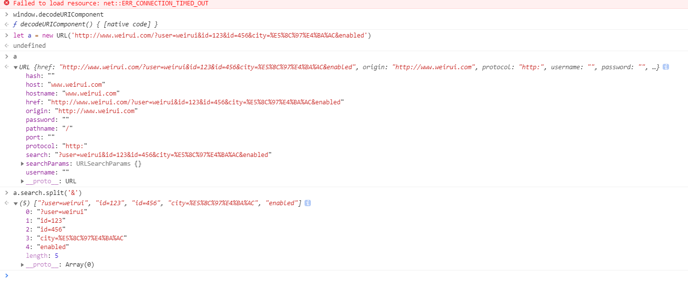
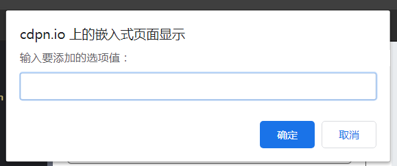

1、页面内有一个正方形元素A以及一个待放置区域B，实现对其拖拽和放下到B区域内，并且改变B区域背景颜色(不可用html5原生事件)。

2、实现超出整数存储范围的两个大正整数相加 function add(a, b) 。
注意：参数 a 和 b 以及函数的返回值都是字符串。

3、页面内有一个input输入框，实现在数组arr查询命中词并和autocomplete效果。

```js
//模拟数据
 var data = ["编程的人", "武林外传", "葵花宝典", "九阴白骨爪", "武林江湖", "will"];
 var ele_key = document.getElementById("key");
 ele_key.onkeyup = function (e) {
  //处理事件
  var val = this.value;
  //获取输入框里匹配的数据
  var srdata = [];
  for (var i = 0; i < data.length; i++) {
   if (val.trim().length > 0 && data[i].indexOf(val) > -1) {
    srdata.push(data[i]);
   }
  }
  //获取到的数据准备追加显示, 前期要做的事情: 清空数据,然后显示数据列表,如果获取到的数据为空,则不显示
  var ele_datalist = document.getElementById("datalist");
  ele_datalist.style.visibility = "visible";
  ele_datalist.innerHTML = "";
  if (srdata.length == 0) {
   ele_datalist.style.visibility = "hidden";
  }
  //将搜索到的数据追加到显示数据列表, 然后每一行加入点击事件, 点击后将数据放入搜索框内, 数据列表隐藏
  var self = this;
  for (var i = 0; i < srdata.length; i++) {
   var ele_li = document.createElement("li");
   var ele_a = document.createElement("a");
   ele_a.setAttribute("href", "javascript:;");
   ele_a.textContent = srdata[i];
   ele_a.onclick = function () {
    self.value = this.textContent;
    ele_datalist.style.visibility = "hidden";
   }
   ele_li.appendChild(ele_a);
   ele_datalist.appendChild(ele_li);
  }
 }

```

24、leetcode 电话号码的字母组合

```js
var letterCombinations = function(digits) {
    let digitsMap = new Map([
        ['2','abc'],
        ['3','def'],
        ['4','ghi'],
        ['5','jkl'],
        ['6','mno'],
        ['7','pqrs'],
        ['8','tuv'],
        ['9','wxyz'],
    ])
    let result = []
    digits = digits.split('')
    digits.forEach(digit=>{
        let tem = []
        let str = digitsMap.get(digit).split('')
        if(result.length==0){
          result = [...str]
        } else{
          for(let i=0;i<result.length;i++){
            str.forEach(str=>{
                    tem.push(result[i]+str)
            })
          }
        result = [...tem]
        }
    })
    return result
};
```

**(就是一个全排列的问题，23 可以把2的所有可能都放进去，然后在把3中每个可能，依次放到对应元素abc ac bc cc  ae be ce)**


**实现页面右键菜单**

codepen地址：http://codepen.io/yacent/pen/LZPggE

实现关键：

\1. HTML5事件 contextmenu 事件可自定义右键菜单

\2. 菜单默认不可见，事件中修改 display属性及 position属性的 top 和 left 值

\3. 取消默认的行为，取消默认的右键菜单的出现

\4. 点击页面其余位置，右键菜单消失

display:none ---不为被隐藏的对象保留其物理空间，即该对象在页面上彻底消失，通俗来说就是看不见也摸不到。

visible:hidden--- 使对象在网页上不可见，但该对象在网页上所占的空间没有改变，通俗来说就是看不见但摸得到。

```html
    <style type="text/css">
    .menu {
        border: 1px solid #000;
        width: 100px;
        padding: 0;
        /* absolute 相对父元素 relative 相对自己 */
        position: absolute;

        display: none;
      }

      .menu li {
        list-style: none;
        border-bottom: 1px solid #000;
      }

      .menu a {
        display: block;
        text-decoration: none;
      }

      .menu a:hover {
        background-color: #000;
        color: #fff;
      }
</style>
    <!-- <link rel="stylesheet" type="text/css" href="a.css"> -->
  </head>
  <body>
    <button id="a">sdfsdf</button>
    <ul class="menu">
      <li><a href="#">1</a></li>
      <li><a href="#">2</a></li>
      <li><a href="#">3</a></li>
      <li><a href="#">4</a></li>
      <li><a href="#">5</a></li>
      <li><a href="#">6</a></li>
      <li><a href="#">7</a></li>
      <li><a href="#">8</a></li>
    </ul>
  
    <script type="text/javascript">
    let a = document.getElementById('a')
    a.onmouseup = function(e){
      if(e.button==2){
        let ul = document.getElementsByClassName('menu')[0]
        ul.style.left = e.clientX
        ul.style.top = e.clientY
        ul.style.display = 'block'
      }
    }	// 菜单默认 不可见
 	// 对页面除菜单外地方点击，菜单消失
    document.addEventListener("click", function(event) {
      document.getElementsByTagName("ul")[0].style.display = "none";
    });
```

**实现页面内的拖拽和放下**

codepen地址：https://codepen.io/yacent/pen/JKPKdX

实现关键：

\1. 正方形随鼠标移动，所以其position属性设为absolute，可调整

\2. 记录mousedown、mousemove、mouseup

  a. mousedown 记录点击处鼠标位置，并计算与目标边缘的差值

  b. mousemove 实时修改其position属性的 top 和 left值

  c. mouseup 将拖拽对象置为空

```html
  <style ype="text/css">
  .square {
	width: 100px;
	height: 100px;
	border: 1px solid #000;
	background-color: #000;

	position: absolute;
}
  #b{
    width: 200px;
    height: 200px;
    float: right;
    background: blue;
  }
</style>
</head>
<body>
	<div class="square">
	</div>
  <div id="b"></div>
  <script type="text/javascript">
  let l = document.getElementById('b').offsetLeft
  let t = document.getElementById('b').offsetTop+ document.getElementById('b').style.height
  let a = document.getElementsByClassName('square')[0]
  let diffx = 0
  let diffy = 0
  let diff = null
    a.onmousedown  = function(event){
      diff = event
      diffx = event.clientX-a.offsetLeft
      diffy = event.clientY-a.offsetTop
    }
    a.onmousemove = function(event){
      if(diff !=null){
        a.style.left = event.clientX-diffx
        a.style.top = event.clientY-diffy
      }
    }
    a.onmouseup = function(event){
      if(diff !=null){
        if((event.clientX-diffx)>l && (event.clientY-diffy)> t){
          document.getElementById('b').style.background = 'red'
        }
        diff=null
      }
    }
```

> 监听三个时间，onmousedown onmouseup  onmousemove
>
> 按下，鼠标离正方形边缘的距离，移动的时候，根据鼠标距离正方形边缘的大小来计算，正方形应该移动的距离，松下的时候，判断是否在B区间里面，然后改变区间的颜色

**登录模块，实现登录，错误提示**（里面有正则表达式）

```html
<html lang="en">
<head>
	<meta charset="UTF-8">
  <title>Drag and Drop</title>
  <style ype="text/css">
 .ok{
   color: green
 }
 .error{
   color: red
 }
</style>
</head>
<body>
    <form name="form1">
        <input type="text" id="username" onblur="check_code()">
        <span id='code_msg'>sdfasdfa</span>
       <input type="password" id="password" onblur="check_pwd()" >
       <span id="pwd_msg">asfda</span>
       <input type="submit" onclick="check()">
       </form>
  <script type="text/javascript">
   function check() {
    if(document.getElementById("username").value=="") {
        alert("没有输入用户名！");
         return false;
      } else if(document.getElementById("password").value=="") {
        alert("没有输入密码！");
        return false;
      } else {
        alert("提交成功！")
        return true;
       }
    }
    function check_code() {
      console.log(1);
      //获取账号
      var code =
        document.getElementById("username").value;
      //校验其格式(\w字母或数字或下划线)
      var span =
        document.getElementById("code_msg");
      var reg = /^\w{6,10}$/;
      if(reg.test(code)) {
        //通过，增加ok样式
        span.className = "ok";
      } else {
        //不通过，增加error样式
        span.className = "error";
      }
    }
    function check_pwd(){
      console.log(2);
      var code2 =document.getElementById("password").value;
      var span2 =
        document.getElementById("pwd_msg");
      var reg2 = /^\w{6,10}$/;
      if(reg2.test(code2)) {
        span2.className = "ok";
      } else {
        span2.className = "error";
      }
 
    }
  </script>
</body>
</html>
```

#### 获取元素的最终background-color

```js
// 获取元素计算后的样式
function getStyle(elem, property){
	if(!elem || !property){
		return false;
	}

	var value = elem.style[camelize(property)], // 先获取是否有内联样式
		css; // 获取的所有计算样式

	// 无内联样式，则获取层叠样式表计算后的样式
	if(!value){
		if(document.defaultView && document.defaultView.getComputedStyle){
            window.getComputedStyle(elem,null).getPropertyValue("height");
            // 上面这样就行，挂载在window上
			css = document.defaultView.getComputedStyle(elem, null);
			value = css ? css.getPropertyValue(property) : null;
		}
	}

	return value;
}
```


1、页面内有一个正方形元素A以及一个待放置区域B，实现对其拖拽和放下到B区域内，并且改变B区域背景颜色(不可用html5原生事件)。

2、实现超出整数存储范围的两个大正整数相加 function add(a, b) 。

注意：参数 a 和 b 以及函数的返回值都是字符串。

3、页面内有一个input输入框，实现在数组arr查询命中词并和autocomplete效果。

写代码用原生JS实现一个类似百度搜索框的自动完成控件（已实现，并附加防抖）+登录

**`includes()`** 方法用于判断一个字符串是否包含在另一个字符串中，根据情况返回 true 或 false。

```html
<html lang="en">
<head>
	<meta charset="UTF-8">
  <title>Drag and Drop</title>
  <style ype="text/css">
    #i{
      width: 100px
    }
    #u>a{
      display: block;
      border: 1px solid #000;
      width: 100px
    }
    #u>a:hover{
      background: #000;
      color: #fff
    }
</style>
</head>
<body>
  <input type="text" id="i">
  <div id='u'>
  </div>
  <script type="text/javascript">
  const dataList = ['学习','学','学前端']
    let i = document.getElementById('i')
    let u =document.getElementById('u')
    i.onkeyup = function(event){
      d((event)=>{
        let v= i.value
        let list = dataList.filter(item=>{
          return item.includes(v)
        })
        // u.removeChild()
        u.innerHTML = ''
        list.forEach(item=>{
          let li = document.createElement('a')
          li.innerHTML = item
          li.onclick = function(event){
            i.value = event.currentTarget.innerHTML
          }
          u.appendChild(li)
        })
      },1000)
    }
  function d(fn,time){
    let timer = null
    if(!timer){
      timer = setTimeout(()=>{
        timer = null
        fn()
      },time)
    }
  }

  </script>
</body>
</html>

```

----

正则

url正则匹配

(https?|ftp|file)://[-A-Za-z0-9+&@#/%?=~_|!:,.;]+[-A-Za-z0-9+&@#/%=~_|] 就是这个url正则匹配
qq正则（举一反三，简单的题目要有自己的思路，看到题，就把思路背下来，把代码背下来）

`[0-9a-bA-Z]+.qq.com`

```
var qqStr="12345"
/^[1-9][0-9]{4,14}$/
var qqReg=/^[1-9]\d{4,10}$/;

console.log(qqReg.test(qqStr));//qq正则
	
匹配一个数字。等价于[0-9]。

例如， /\d/ 或者 /[0-9]/ 匹配"B2 is the suite number."中的'2'。

```

| [`\w`](https://developer.mozilla.org/zh-CN/docs/Web/JavaScript/Guide/Regular_Expressions#special-word) | 匹配一个单字字符（字母、数字或者下划线）。等价于 `[A-Za-z0-9_]`。例如, `/\w/` 匹配 "apple," 中的 'a'，"$5.28,"中的 '5' 和 "3D." 中的 '3'。 |
| ------------------------------------------------------------ | ------------------------------------------------------------ |
| [`\W`](https://developer.mozilla.org/zh-CN/docs/Web/JavaScript/Guide/Regular_Expressions#special-non-word) | 匹配一个非单字字符。等价于 `[^A-Za-z0-9_]`。例如, `/\W/` 或者 `/[^A-Za-z0-9_]/` 匹配 "50%." 中的 '%'。 |

`+`匹配前面一个表达式 1 次或者多次。等价于 `{1,}`。

`*` 匹配前一个表达式 0 次或多次。等价于 `{0,}`

**域名正则（很难）**

由此匹配完整域名的正则表达式：

  `^(?=^.{3,255}$)[a-zA-Z0-9][-a-zA-Z0-9]{0,62}(\.[a-zA-Z0-9][-a-zA-Z0-9]{0,62})+$`

（小数点）默认匹配除换行符之外的任何单个字符

**(?=^.{3,255}$)判断后面是不是跟了3-255个字符，但是不算入匹配，就说开头是不是匹配了这么些个字符串**

例如：baidu.com 

 匹配网址：

`^(?=^.{3,255}$)(http(s)?:\/\/)?(www\.)?[a-zA-Z0-9][-a-zA-Z0-9]{0,62}(\.[a-zA-Z0-9][-a-zA-Z0-9]{0,62})+(:\d+)*(\/\w+\.\w+)*$`

(http(s)?:\/\/)匹配s0-1次，这里的问好作用

`(https?|ftp|file)://[-A-Za-z0-9+&@#/%?=~_|!:,.;]+[-A-Za-z0-9+&@#/%=~_|]`

正则这个放一下

| [`(?:x)`](https://developer.mozilla.org/zh-CN/docs/Web/JavaScript/Guide/Regular_Expressions#special-non-capturing-parentheses) | 匹配 'x' 但是不记住匹配项。这种括号叫作*非捕获括号*，使得你能够定义与正则表达式运算符一起使用的子表达式。看看这个例子 `/(?:foo){1,2}/`。如果表达式是 `/foo{1,2}/`，`{1,2}` 将只应用于 'foo' 的最后一个字符 'o'。如果使用非捕获括号，则 `{1,2}` 会应用于整个 'foo' 单词。更多信息，可以参阅下文的 [Using parentheses](https://developer.mozilla.org/en-US/docs/Web/JavaScript/Guide/Regular_Expressions#Using_parentheses) 条目. |
| ------------------------------------------------------------ | ------------------------------------------------------------ |
| [`x(?=y)`](https://developer.mozilla.org/zh-CN/docs/Web/JavaScript/Guide/Regular_Expressions#special-lookahead) | 匹配'x'仅仅当'x'后面跟着'y'.这种叫做先行断言。例如，/Jack(?=Sprat)/会匹配到'Jack'仅当它后面跟着'Sprat'。/Jack(?=Sprat\|Frost)/匹配‘Jack’仅当它后面跟着'Sprat'或者是‘Frost’。但是‘Sprat’和‘Frost’都不是匹配结果的一部分。 |
| [`(?<=y)`](https://developer.mozilla.org/zh-CN/docs/Web/JavaScript/Guide/Regular_Expressions#special-lookahead)x | 匹配'x'仅当'x'前面是'y'.这种叫做后行断言。例如，/(?<=Jack)Sprat/会匹配到' Sprat '仅仅当它前面是' Jack '。/(?<=Jack\|Tom)Sprat/匹配‘ Sprat ’仅仅当它前面是'Jack'或者是‘Tom’。但是‘Jack’和‘Tom’都不是匹配结果的一部分。 |
| [`x(?!y)`](https://developer.mozilla.org/zh-CN/docs/Web/JavaScript/Guide/Regular_Expressions#special-negated-look-ahead) | 仅仅当'x'后面不跟着'y'时匹配'x'，这被称为正向否定查找。例如，仅仅当这个数字后面没有跟小数点的时候，/\d+(?!\.)/ 匹配一个数字。正则表达式/\d+(?!\.)/.exec("3.141")匹配‘141’而不是‘3.141’ |
| `(?<!*y*)*x*`                                                | 仅仅当'x'前面不是'y'时匹配'x'，这被称为反向否定查找。例如, 仅仅当这个数字前面没有负号的时候，`/(?<!-)\d+/` 匹配一个数字。 `/(?<!-)\d+/.exec('3')` 匹配到 "3". `/(?<!-)\d+/.exec('-3')` 因为这个数字前有负号，所以没有匹配到。 |

```html
    <link
      rel="shortcut icon"
      href="<%= BASE_URL %><%= VUE_APP_ICON %>"
      type="image/x-icon"
    />
网站图标
```

（1）有两种：IE 盒子模型、W3C 盒子模型；
（2）盒模型： 内容(content)、填充(padding)、边界(margin)、 边框(border)；
（3）区 别： IE的content部分把 border 和 padding计算进去了。

### 写一个function，清除字符串前后的空格。（兼容所有浏览器）

```javascript
function trim(str) {
	if (str && typeof str === "string") {
		return str.replace(/(^\s*)|(\s*)$/g,""); //去除前后空白符
	}
}
```

### 使用正则表达式验证邮箱格式

```javascript
    var reg = /^(\w)+(\.\w+)*@(\w)+((\.\w{2,3}){1,3})$/;
    var email = "example@qq.com";
    console.log(reg.test(email));  // true  
```

### 对前端工程师这个职位你是怎么样理解的？

a. 前端是最贴近用户的程序员，前端的能力就是能让产品从 90分进化到 100 分，甚至更好
b. 参与项目，快速高质量完成实现效果图，精确到1px；
c. 与团队成员，UI设计，产品经理的沟通；
d. 做好的页面结构，页面重构和用户体验；
e. 处理hack，兼容、写出优美的代码格式；
f. 针对服务器的优化、拥抱最新前端技术。

---

**手写jsonp**

```js
let jsonp = function(url,data,callback){
    var dataString = url.indexof('?') == -1? '?': '&';
    for(var key in data){
        dataString += key + '=' + data[key] + '&';
    };
    cbFuncName = 'myjsoncb'
    dataString += 'callback='+cbFuncName
    let s = document.createElement('script')
    s.src = url+dataString
    window[cbFuncName] = function(data){
      callback(data)
      document.body.removeChild(s)
    }
    document.body.appendChild(s)
}
```

----

\d匹配一个数字

```js
    // 1、var s1 = "get-element-by-id";     给定这样一个连字符串，写一个function转换为驼峰命名法形式的字符串  getElementById
    var f = function(s) {
        // 匹配一个单字字符（字母、数字或者下划线）。等价于 [A-Za-z0-9_]
        return s.replace(/-\w/g, function(x) {
          // 匹配的是-后面的第一个字符， 匹配结果是-e -b -i
            return x.slice(1).toUpperCase();
        })
    }
    var s1 = "get-element-by-id"; 
    f(s1)
```

判断电话号码

```js
function isPhone(tel) {
    var regx = /^1[34578]\d{9}$/;
    return regx.test(tel);
}
```


```js
function isEmail(email) {
    var regx = /^([a-zA-Z0-9_\-])+@([a-zA-Z0-9_\-])+(\.[a-zA-Z0-9_\-])+$/;
    return regx.test(email);
}
```

深挖下正则表达式，面试前做下小抄笔记（贴在电脑上）

---

深挖原生js事件，深挖原生开发场景

自己手写代码

----

**还有剩下的那些手写编程题，多写**

开始

今天先把这个做了

那个分片的，网上搜下代码

-----

**笔记，原理类的记清楚，看看自己怎么讲清楚**

**之前那些笔记，蒙住答案背一遍，看看**

---

自己简历上的项目，好好研究下

看代码

----

**很大的日志读取，ip出现最多的十次（个），怎么分片（没写出来**

后端的

----

### 14 .new操作符具体干了什么呢?

**new**共经历了四个过程。

```
var fn = function () { };
var fnObj = new fn();
```

1、创建了一个空对象

```
var obj = new object();
```

2、设置原型链

```
obj._proto_ = fn.prototype;
```

3、让fn的this指向obj，并执行fn的函数体

```
var result = fn.call(obj);
```

4、判断fn的返回值类型，如果是值类型，返回obj。如果是引用类型，就返回这个引用类型的对象。

这一步很重要，如果没有返回，就直接返回obj对象这个对象的`__proto__=Fn.prototype`

```js
if (typeof(result) == "object"){ 
	fnObj = result;
 } else { 
	fnObj = obj;
 }
```

> H5之前:
> cookies,缺点是在请求头上带数据,且大小最多是4k;
> Html5之后:
> LocalStorage 用于本地的永久存储,除非主动删除,否者永不过期;
> SessionStorage 用于会话级别的临时存储,这些数据只有在**同一个窗口**下才能访问;当窗口关闭时,数据也会随之销毁;

因为Node是基于事件驱动和无阻塞的，所以非常适合处理并发请求

### 8.你如何对网站的文件和资源进行优化?

1.尽可能减少http请求次数，将css, js, 图片各自合并
2.使用CDN资源托管，降低通信距离
3.添加Expire/Cache-Control头
4.Gzip压缩文件jscss代码
5.将css放在页面最上面
6.将script放在页面最下面
7.避免在css中使用表达式
8.将css, js都放在外部文件中
9.减少DNS查询
10.最小化css, js，减小文件体积 
11.避免重定向
12.移除重复脚本
13.配置实体标签ETag
14.使用AJAX缓存，让网站内容分批加载，局部更新
15.优化网站图片
16.css精灵合并图片

> ### 17.一个页面从输入 URL 到页面加载显示完成，这个过程中都发生了什么？
>
> **详细版：**
> 1、**浏览器会开启一个线程来处理这个请求**，对URL 分析判断如果是 http 协议就按照 Web 方式来处理;
> 2、**调用浏览器内核中的对应方法**，比如 WebView 中的 loadUrl 方法;
> 3、**通过DNS解析获取网址的IP地址**，设置 UA 等信息发出第二个GET请求;
> 4、**进行HTTP协议会话**，客户端发送报头(**请求报头**);
> 5、进入到**web服务**器上的 WebServer，如 Apache、Tomcat、Node.js 等服务器;
> 6、进入部署好的**后端应用**，如PHP、Java、JavaScript、Python 等，找到对应的请求处理;
> 7、处理结束**回馈报头**，此处如果浏览器访问过，缓存上有对应资源，会与服务器最后修改时间对比，一致则返回304;
> 8、**浏览器开始下载html文档**(响应报头，状态码200)，同时使用缓存;
> 9、**文档树建立**，根据标记请求所需指定MIME类型的文件（比如css、js）,同时设置了cookie;
> 10、页面开始**渲染DOM**，JS根据DOM API操作DOM,执行事件绑定等
> 页面显示完成。
>
> **简洁版：**
> 浏览器根据请求的URL交给DNS域名解析，找到真实IP，向服务器发起请求；
>
> ```
> 服务器交给后台处理完成后返回数据，浏览器接收文件（HTML、JS、CSS、图象等）；
> 浏览器对加载到的资源（HTML、JS、CSS等）进行语法解析，建立相应的内部数据结构（如HTML的DOM）；
> 载入解析到的资源文件，渲染页面，完成。
> ```

### 19.请解释一下 JavaScript 的同源策略。

同源策略是指**一段脚本只能读取来自同一来源的窗口和文档的属性。**
同源策略是一种**安全协议**，是客户端脚本（尤其是Javascript）的重要的安全度量标准。它最早出自Netscape Navigator2.0，其目的是防止某个文档或脚本从多个不同源装载。
这里的同源策略指的是：**协议，域名，端口相同**。

### 22.什么是语义化的HTML?

语义化的HTML，符合内容的语义化（结构语义化），标签的语义化（代码语义化），能够方便开发者写出更易读、优雅的代码，同时让机器和爬虫更好的解析。
**优点：**
1.语义化有益于SEO，有利于搜索引擎爬虫更好的理解我们的网页，从而获取更多的有效因袭，提升网页权重。
2.在没有CSS的时候，能够清晰的看出网页的结构，增加可读性。
3.便于团队维护，语义化的HTML能让开发者清楚明白，提升开发效率。
4.支持多终端的浏览器渲染

### 23.常见的浏览器内核有哪些？

1.使用Trident的是internet explorer
2.使用Gecko的是Mozilla Firefox
3.使用WebKit的有苹果的safari，谷歌的chrome
4.使用Presto的是opera

### 24.HTML5有哪些新特性、移除了那些元素？如何处理HTML5新标签的浏览器兼容问题？如何区分 HTML 和HTML5？

**新增的元素：**

- 语义化更好的内容标签（header,nav,footer,aside,article,section）
- 拖拽释放(Drag and drop) API
- 音频、视频(audio,video)API
- 画布(Canvas) API
- 地理(Geolocation) API
- 本地离线存储 **localStorage** 长期存储数据，浏览器关闭后数据不丢失；
  **sessionStorage** 的数据在浏览器关闭后自动删除
- 表单控件，calendar、date、time、email、url、search
  新的技术webworker, websocket, Geolocation

**移除的元素：**

- 纯表现的元素：basefont，big，center，font, s，strike，tt，u；
- 对可用性产生负面影响的元素：frame，frameset，noframes；

**兼容HTML5新标签：**

- IE8/IE7/IE6支持通过document.createElement方法产生的标签，可以利用这一特性让这些浏览器支持HTML5新标签，浏览器支持新标签后，还需要添加标签默认的样式。
- 使用html5shim框架：
  <!--[if lt IE 9]>

<script> src="http://html5shim.googlecode.com/svn/trunk/html5.js"</script><![endif]-->

### 14.平时如何管理你的项目？

1. 先期团队必须确定好全局样式（globe.css），编码模式 (utf-8) 等；
2. 编写习惯必须一致（例如都是采用继承式的写法，单样式都写成一行）；
3. 标注样式编写人，各模块都及时标注（标注关键样式调用的地方）；
4. 页面进行标注（例如 页面 模块 开始和结束）；
5. CSS 跟 HTML 分文件夹并行存放，命名都得统一（例如 style.css）；
6. JS 分文件夹存放 命名以该 JS 功能为准的英文翻译。
7. 图片采用整合的 images.png png8 格式文件使用 尽量整合在一起使用方便将来的管理

3.组合继承
结合原型链和借用构造函数各家优点

1. 原型式继承
   借助原型可以基于已有的对象创建新对象，同时还不必须因此创建自定义的类型
2. 寄生式继承
   创建一个仅用于封装继承过程的函数，该函数在内部以某种方式来增强对象，最后再像真正是它做了所有工作一样返回对象
3. 寄生组合式继承
   通过借用函数来继承属性，通过原型链的混成形式来继承方法

-------



# 判断一个字符串中出现次数最多的字符，并统计次数

```
var s = 'aaaaacccccbbbbb';
var a = s.split('');
a.sort();
s = a.join('');
var pattern = /(\w)\1*/g;               ==>   这里\1是什么意思？如果不写这个会怎样？
var ans = s.match(pattern);
ans.sort(function(a, b) {
 return a.length < b.length;
});;
console.log(ans0 + ': ' + ans[0].length);

```

有\1的情况下ans的值为：

["aaaaa","bbbbb","ccccc"]  

没有\1的情况下ans的值为：

["aaaaabbbbbccccc"]

如果是\2或者\3呢?

ans值为：["a","a","a","a","a","b","b","b","b","b","c","c","c","c","c"] 

**正则表达式中的小括号"()"。是代表分组的意思。 如果再其后面出现\1则是代表与第一个小括号中要匹配的内容相同。**

**注意：\1必须与小括号配合使用**

---

- 原理不同，CSRF是利用网站A本身的漏洞，去请求网站A的api；XSS是向目标网站注入JS代码，然后执行JS里的代码。
- CSRF需要用户先登录目标网站获取cookie，而XSS不需要登录
- CSRF的目标是用户，XSS的目标是服务器
- XSS是利用合法用户获取其信息，而CSRF是伪造成合法用户发起请求

----

**decodeURI()** 函数用于解码js中的URL。它将编码的`url`字符串作为参数并返回已解码的字符串，用法：

```javascript
var uri = "my profile.php?name=sammer&occupation=pāntiNG";
var encoded_uri = encodeURI(uri);
decodeURI(encoded_uri);
```

-----

### 原生js编程

```js
var dis = document.getElementById('display');
dis.addEventListener('mouseenter', function () {
    addClass(dis, 'hover');
}, false);

dis.addEventListener('mouseleave', function () {
    removeClass(dis, 'hover');
}, false)
```

**监听鼠标，移入移出事件**

```js
delegateEvent(container, 'img', 'mouseover', function (event) {
    addClass(event.target, 'hover');
});
delegateEvent(container, 'img', 'mouseout', function (event) {
    removeClass(event.target, 'hover');
});
```

**鼠标，悬浮，移出单个元素**

```css
 #hover {
            display: none;
            position: absolute;
            top: 0;
            width: 100%;
            height: 100%;
            background-color: rgba(0, 0, 0, 0.5);
```

弹出层专用样式

```js
function addItem(itemValue) {
    if (isItemExit(itemValue)) {
        alert('该值已存在！');
    } else {
        var itemText = prompt('输入要添加的选项文本：');
        if (itemText) {
            var newItem = new Option(itemText, itemValue);
        }
        selectBox.add(newItem, null);
    }
}
```



原生弹出输入

```js
document.removeEventListener('mousedown', convertToDragEvent);
                document.removeEventListener('mousemove', convertToDragEvent);
                document.removeEventListener('mouseup', convertToDragEvent);
```

**拖动事件 **mousedown mousemove mouseup

----

再看下一些原生的api

| `resize` | The document view has been resized.                |
| -------- | -------------------------------------------------- |
| `scroll` | The document view or an element has been scrolled. |

视图中，改变视口大小，滚动滚动条

| `keydown`  | 按下任意按键。                                          |
| ---------- | ------------------------------------------------------- |
| `keypress` | 除 Shift、Fn、CapsLock 外的任意键被按住。（连续触发。） |
| `keyup`    | 释放任意按键。2                                         |

| Event Name          | Fired When                                                   |
| :------------------ | :----------------------------------------------------------- |
| `auxclick`          | A pointing device button (ANY non-primary button) has been pressed and released on an element. |
| `click`             | 在元素上按下并释放任意鼠标按键。                             |
| `contextmenu`       | **右键点击（在右键菜单显示前触发）。**                       |
| `dblclick`          | **在元素上双击鼠标按钮。**                                   |
| `mousedown`         | 在元素上按下任意鼠标按钮。                                   |
| `mouseenter`        | 指针移到有事件监听的元素内。                                 |
| `mouseleave`        | 指针移出元素范围外（不冒泡）。                               |
| `mousemove`         | 指针在元素内移动时持续触发。                                 |
| `mouseover`         | 指针移到有事件监听的元素或者它的子元素内。                   |
| `mouseout`          | 指针移出元素，或者移到它的子元素上。                         |
| `mouseup`           | 在元素上释放任意鼠标按键。                                   |
| `pointerlockchange` | 鼠标被锁定或者解除锁定发生时。                               |
| `pointerlockerror`  | 可能因为一些技术的原因鼠标锁定被禁止时。                     |
| `select`            | 有文本被选中。                                               |
| `wheel`             | 滚轮向任意方向滚动。                                         |

| Event Name  | Fired When                                                   |
| :---------- | :----------------------------------------------------------- |
| `drag`      | 正在拖动元素或文本选区（在此过程中持续触发，每 350ms 触发一次） |
| `dragend`   | 拖放操作结束。（松开鼠标按钮或按下 Esc 键）                  |
| `dragenter` | 被拖动的元素或文本选区移入有效释放目标区                     |
| `dragstart` | 用户开始拖动HTML元素或选中的文本                             |
| `dragleave` | 被拖动的元素或文本选区移出有效释放目标区                     |
| `dragover`  | 被拖动的元素或文本选区正在有效释放目标上被拖动 （在此过程中持续触发，每350ms触发一次） |
| `drop`      | 元素在有效释放目标区上释放                                   |

---

## 有哪些监控网页卡顿的方法？

### 卡顿

网页的 FPS

网页内容在不断变化之中，网页的 FPS 是只浏览器在渲染这些变化时的帧率。帧率越高，用户感觉网页越流畅，反之则会感觉卡顿。

### 监控卡顿方法

每秒中计算一次网页的 FPS 值，获得一列数据，然后分析。通俗地解释就是，通过 requestAnimationFrame API 来定时执行一些 JS 代码，如果浏览器卡顿，无法很好地保证渲染的频率，1s 中 frame 无法达到 60 帧，即可间接地反映浏览器的渲染帧率。

## 5. Cdn有哪些优化静态资源加载速度的方法？

可以参考阿里云团队的[《CDN之我见》](https://yq.aliyun.com/articles/577708?spm=a2c41.11181499.0.0)。总结如下：

资源调度：CDN会根据用户接入网络的ip寻找距离用户最优路径的服务器。调度的方式主要有DNS调度、http 302调度、使用 HTTP 进行的 DNS 调度（多用于移动端）； 缓存策略和数据检索：CDN服务器使用高效的算法和数据结构，快速的检索资源和更新读取缓存； 网络优化：从OSI七层模型进行优化，达到网络优化的目的。 L1物理层：硬件设备升级提高速度 L2数据链路层：寻找更快的网络节点、确保 Lastmile 尽量短 L3路由层：路径优化，寻找两点间最优路径 L4传输层：协议TCP优化，保持长连接、TCP快速打开 L7应用层：静态资源压缩、请求合并


