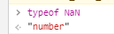
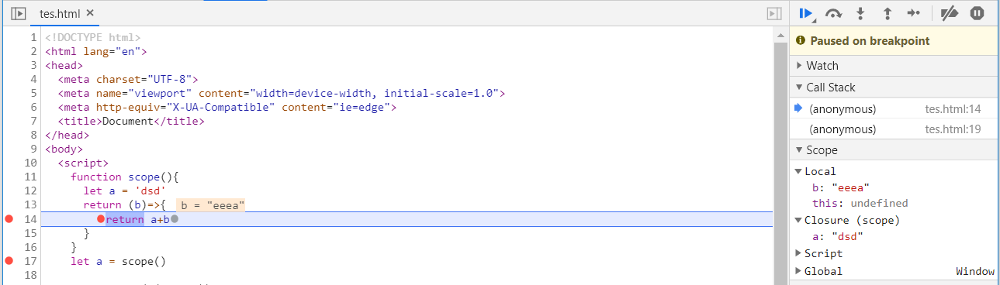
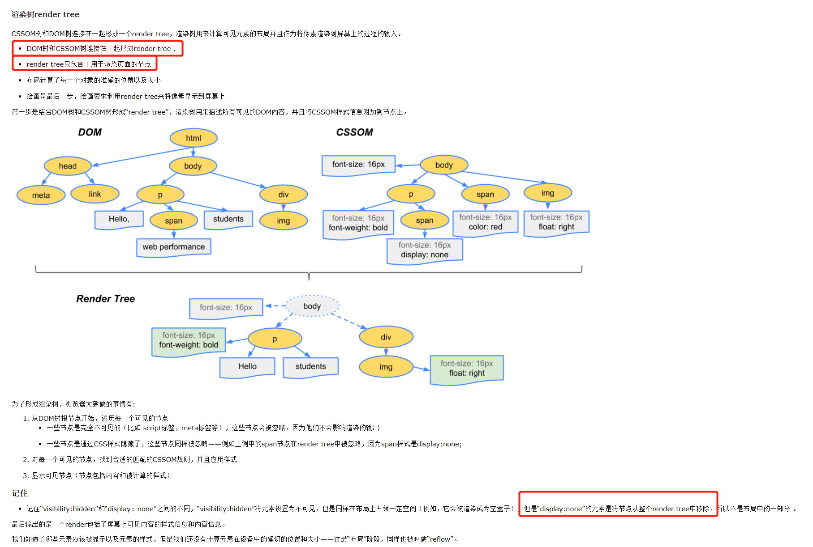
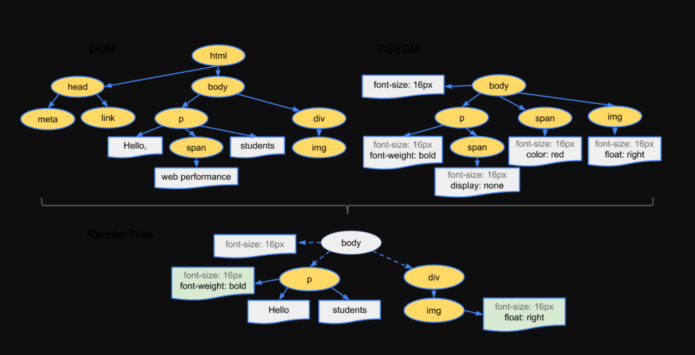
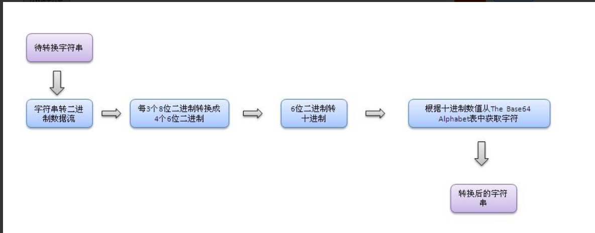
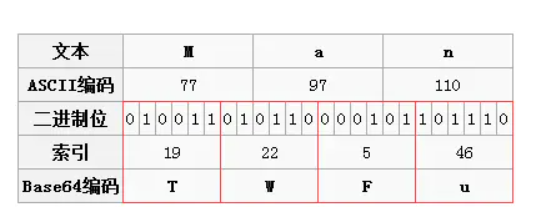
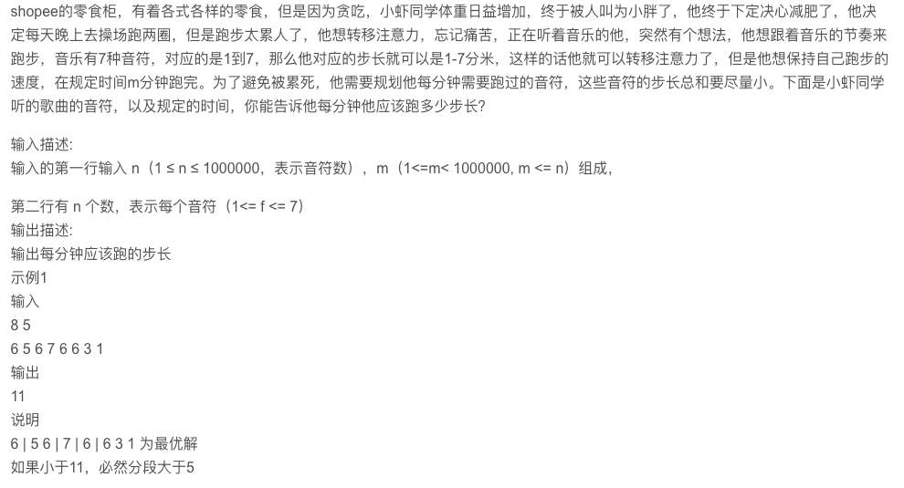
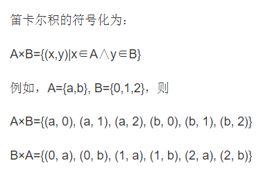

https://juejin.im/post/6844903811622912014

虾皮中： es6

es7

es8

### 1.异步迭代

在`async/await`的某些时刻，你可能尝试在同步循环中调用异步函数。例如：

```
async function process(array) {
  for (let i of array) {
    await doSomething(i);
  }
}
复制代码
```

这段代码不会正常运行，下面这段同样也不会：

```
async function process(array) {
  array.forEach(async i => {
    await doSomething(i);
  });
}
复制代码
```

这段代码中，循环本身依旧保持同步，并在在内部异步函数之前全部调用完成。

ES2018引入异步迭代器（asynchronous iterators），这就像常规迭代器，除了`next()`方法返回一个Promise。因此`await`可以和`for...of`循环一起使用，以串行的方式运行异步操作。例如：

```
async function process(array) {
  for await (let i of array) {
    doSomething(i);
  }
}
```


作者：上沅兮
链接：https://juejin.im/post/6844903811622912014
来源：掘金
著作权归作者所有。商业转载请联系作者获得授权，非商业转载请注明出处。

todo：没有写清除

-----

#### new 内部实现      

```js
function _new () {
  // arguments实际上是一个类数组对象，需要转成数组
  let args = [].slice.call(arguments)
  // 第一个参数是构造函数，把它拿出来
  let constructor = args.shift()
  // Object.create()返回一个新对象，这个对象的构造函数的原型指向Foo
  let context = Object.create(constructor.prototype)
  // 在返回的context对象环境中执行构造函数，为新的context添加属性
  let result = constructor.apply(context, args)
  // 如果Foo显示的返回了一个对象，那么应该直接返回这个对象，而不用理会以上所有的操作，一般不会发生这种情况，但是new的实现的确是这样的逻辑
  // 这里之所以判断类型是否为object还要添加 != null 的判断，是因为null的typeof结果也是‘object’
  // 不同的对象在底层都表示为二进制，在Javascript中二进制前三位都为0的话会被判断为Object类型，null的二进制表示全为0，自然前三位也是0，所以执行typeof时会返回"object"
  // 防止构造函数有返回对象
  return (typeof result === 'object' && result != null) ? result : context
}
 
function Foo (name) {
  this.name = name
}
 
Foo.prototype.getName = function() {
  console.log(this.name)
}
 
var a = _new(Foo, 'tom')
a.getName()
 
复制代码
```

实际上new操作符， 就是通过Object.ctreate()创建一个新的对象，这个对象的原型指向构造函数，并且在新建对象的上下文环境中执行构造函数，初始化新建对象的属性

-----

####  js中判断类型的方法      

**typeof 只能判断基础类型，null NaN 不行，undefined可以。**



constructor不可靠

instanceof基于原型链，只能用在对象上，判读一个对象的原型链上包不包含该原型

Object.prototype.toString.call() 通用

## Object.prototype.toString

使用 Object.prototype.toString 方法, 可以获取到变量的准确的类型.

获得的是准确的类型，Null也是对象，如果你只想判断是不是对象，不是null以外的对象

```
function foo(){};

Object.prototype.toString.call(1);  '[object Number]'
Object.prototype.toString.call('1'); '[object String]'
Object.prototype.toString.call(NaN); '[object Number]'
Object.prototype.toString.call(foo);  '[object Function]'
Object.prototype.toString.call([1,2,3]); '[object Array]'
Object.prototype.toString.call(undefined); '[object Undefined]'
Object.prototype.toString.call(null); '[object Null]'
Object.prototype.toString.call(true); '[object Boolean]'
....
```

####  typeof有什么不好的地方  

如果需要用typeof来判断类型，只有‘boolean’、‘number’、’string’、‘function’三种类型是靠谱儿的，用于判断其他类型会出现不可预期的错误

Array 要使用Array.isArray(arr)；

####  最完美的方法的哪一种   

Object.prototype.toString.call() 

####   如何实现一个对象的属性无法改变 

**实现方法**：Object.freeze(yourObjName)

**检测是否被冻结**：Object.isFrozen(yourObjName)

不可以新增属性`Object.preventExtensions(obj)`，不可修改属性描述符`configurable` ，不可删除属性`configurable` ，不可修改属性`writable` 

**`Object.freeze()`** 方法可以**冻结**一个对象，而defineProperty是配置对象的属性


####  defineProperty还有什么其他可以配置的 

`value get set`

`configurable(属性删除，其他属性能不能被改) enumerable（枚举） writable（被改）`

 `configurable` true的时候，表示对象的属性是否可以被删除，以及除 `value` 和 `writable` 特性外的其他特性是否可以被修改 不能删除

`enumerable` `enumerable` 定义了对象的属性是否可以在 [`for...in`](https://developer.mozilla.org/zh-CN/docs/Web/JavaScript/Reference/Statements/for...in) 循环和 [`Object.keys()`](https://developer.mozilla.org/zh-CN/docs/Web/JavaScript/Reference/Global_Objects/Object/keys) 中被枚举。

 `writable` 当 `writable` 属性设置为 `false` 时，该属性被称为“不可写的”。它不能被重新赋值。 不能修改

属性值和函数的键 `value`、`get` 和 `set` 字段的默认值为 `undefined`

Object.seal(…)可修改

####  还有什么其他实现的方法 

####     非原始类型判断(以及null)

判断数组

- 使用`Array.isArray()`判断数组
- 使用`[] instanceof Array`判断是否在Array的原型链上，即可判断是否为数组
- `[].constructor === Array`通过其构造函数判断是否为数组
- 也可使用`Object.prototype.toString.call([])`判断值是否为'[object Array]'来判断数组

判断对象

- `Object.prototype.toString.call({})`结果为'[object Object]'则为对象
- `{} instanceof Object`判断是否在Object的原型链上，即可判断是否为对象
- `{}.constructor === Object`通过其构造函数判断是否为对象

判断函数

- 使用`func typeof function`判断func是否为函数
- 使用`func instanceof Function`判断func是否为函数
- 通过`func.constructor === Function`判断是否为函数
- 也可使用`Object.prototype.toString.call(func)`判断值是否为'[object Function]'来判断func

判断null

- 最简单的是通过`null===null`来判断是否为null
- `(!a && typeof (a) != 'undefined' && a != 0 && a==a)`判断a是否为null
- `Object.prototype.__proto__===a`判断a是否为原始对象原型的原型即null
- `typeof (a) == 'object' && !a`通过typeof判断null为对象，且对象类型只有null转换为Boolean为false

判断是否为NaN

- `isNaN(any)`直接调用此方法判断是否为非数值

一些其他判断

- `Object.is(a,b)`判断a与b是否完全相等，与===基本相同，不同点在于Object.is判断`+0不等于-0`，`NaN等于自身`
- 一些其他对象类型可以基于原型链判断和构造函数判断
- `prototypeObj.isPrototypeOf(object)`判断object的原型是否为prototypeObj，不同于instanceof，此方法直接判断原型，而非instanceof 判断的是右边的原型链


作者：👂👀👂*5102
链接：https://juejin.im/post/5e9f0bdce51d4546f5791989
来源：掘金
著作权归作者所有。商业转载请联系作者获得授权，非商业转载请注明出处。

####   instanceof知道吗

```js
function myInstanceof(target, origin) {
  const proto = target.__proto__;
  if (proto) {
    if (origin.prototype === proto) {
      return true;
    } else {
      return myInstanceof(proto, origin)
    }
  } else {
    return false;
  }
}
```
####   他的作用是什么    

####  他可以判断一个变量是否是数组么   

可以

a instanceof Array

####   深浅拷贝说一下 

浅拷贝

我们用很多简单的方法都能实现浅拷贝：

```js
arr.slice();
arr.concat();
```

我们也能用简单的办法实现深拷贝：

```
JSON.parse(JSON.stringify(obj))
```

todo: 深拷贝具体怎么实现 （已完成，输出笔记：手写js算法-深拷贝）

应该不难，没有说极度难以理解

####  object.assign实现的是什么 

浅拷贝

方法用于将所有可枚举属性的值从一个或多个源对象复制到目标对象。它将返回目标对象。

####   如何实现深拷贝    

深拷贝具体怎么实现 （已完成，输出笔记：手写js算法-深拷贝）

####  说一下你理解的闭包  

我知道闭包，但是如何把闭包这个问题答好呢



什么是闭包（Closure）
简单讲，闭包就是指有权访问另一个函数作用域中的变量的函数。

MDN 上面这么说：闭包是一种特殊的对象。它由两部分构成：函数，以及创建该函数的环境。环境由闭包创建时在作用域中的任何局部变量组成。

闭包的作用域链包含着它自己的作用域，以及包含它的函数的作用域和全局作用域。

闭包的注意事项
通常，函数的作用域及其所有变量都会在函数执行结束后被销毁。但是，在创建了一个闭包以后，这个函数的作用域就会一直保存到闭包不存在为止。

```js
闭包中的 this 对象

var name = "The Window";

var obj = {
  name: "My Object",
  
  getName: function(){
    return function(){
      return this.name;
    };
  }
};

console.log(obj.getName()());  // The Window
obj.getName()()实际上是在全局作用域中调用了匿名函数，this指向了window。这里要理解函数名与函数功能（或者称函数值）是分割开的，不要认为函数在哪里，其内部的this就指向哪里。匿名函数的执行环境具有全局性，因此其 this 对象通常指向 window。

var name = "The Window";

var obj = {
  name: "My Object",
  
  getName: function(){
    var that = this;
    return function(){
      return that.name;
    };
  }
};

console.log(obj.getName()());  // My Object
```

## 闭包面试题

```js
    function fun(n,o){
      console.log(o);
      return {
        fun: function(m){
          return fun(m,n);
        }
      };
    }

    var a = fun(0);  // ? undefined
    a.fun(1);        // ?      0   
    a.fun(2);        // ?0
    a.fun(3);        // ?0

    var b = fun(0).fun(1).fun(2).fun(3);  // ?  undefined 0 1 2
    // 链式，每次调用的时候，返回的是一个新的对象，新的fun: function(m){
        //   return fun(m,n);
        // }
      // 所以每次返回新的，m就是最新的，那就上面调用传的参数
    var c = fun(0).fun(1);  // ? undefined 0
    c.fun(2);        // ? 1
    c.fun(3);        // ? 2
  // 闭包中this指向很重要
```


####  闭包有什么缺点   

- 闭包的缺点就是常驻内存会增大内存使用量，并且使用不当很容易造成内存泄露。
- 如果不是因为某些特殊任务而需要闭包，在没有必要的情况下，在其它函数中创建函数是不明智的，因为闭包对脚本性能具有负面影响，包括处理速度和内存消耗。

####  平时的应用场景 

函数柯里化

####  xss说一下  

xss是跨站脚本攻击 cross  site  script

有以下几种：反射型 存储型  基于dom

反射型，点击一个恶意链接，，把用户输入反射给浏览器

存储型：用户输入的数据，存储在服务器，这些数据再被浏览器请求时，就会执行这些恶意代码

基于dom，恶意脚本修改页面dom

防范

#### HttpOnly 防止劫取 Cookie 输入检查

## CSRF

CSRF，即 Cross Site Request Forgery，中译是跨站请求伪造，是一种劫持受信任用户向服务器发送非预期请求的攻击方式。

CSRF 攻击是攻击者借助受害者的 Cookie 骗取服务器的信任

#### Referer Check

根据 HTTP 协议，在 HTTP 头中有一个字段叫 Referer，它记录了该 HTTP 请求的来源地址。通过 Referer Check，可以检查请求是否来自合法的"源"

**token校验****验证码** sameSit ： strict

####  csrf说一下  

####  token值怎么传递

存在localstorage里面,放在请求投中的字段里Authorization

####   get方法怎么传递token值

cookie数据存放在客户的浏览器上，**session数据放在服务器上**

服务端会在HTTP协议中告诉客户端，**需要在 Cookie 里面记录一个Session ID**，以后每次请求把这个会话ID发送到服务器，我就知道你是谁了。

### `localStorage，sessionStorage和cookie的区别`

> **共同点**：都是保存在浏览器端、且同源的

- ```
  数据存储方面
  ```

  - **cookie数据**始终在同源的http请求中携带（即使不需要），即cookie在浏览器和服务器间来回传递。cookie数据还有路径（path）的概念，可以限制cookie只属于某个路径下
  - **sessionStorage和localStorage**不会自动把数据发送给服务器，仅在**本地保存**。

- ```
  存储数据大小
  ```

  - 存储大小限制也不同，**cookie数据**不能超过4K，同时因为每次http请求都会携带cookie、所以cookie只适合保存很小的数据，如会话标识。
  - **sessionStorage和localStorage**虽然也有存储大小的限制，但比cookie大得多，可以达到5M或更大

- ```
  数据存储有效期
  ```

  - **sessionStorage**：仅在当前浏览器窗口关闭之前有效；
  - **localStorage**：始终有效，窗口或浏览器关闭也一直保存，本地存储，因此用作持久数据；
  - **cookie**：只在设置的cookie过期时间之前有效，即使浏览器关闭

- ```
  作用域不同
  ```

  - **sessionStorage**不在不同的浏览器窗口中共享，即使是同一个页面；
  - **localstorage**在所有`同源窗口`中都是共享的；
  - **cookie**: 也是在所有`同源窗口`中都是共享的


####   前端性能优化

todo

####   前端常用的数值单位     

- vw : 1vw 等于视口宽度的1%
- vh : 1vh 等于视口高度的1%
- vmin : 选取 vw 和 vh 中最小的那个
- vmax : 选取 vw 和 vh 中最大的那个

####  rem和em的区别     

### em

#### em 与 px 的计算关系

em的值是px的倍数

默认情况下`font-size = 16px`,那么`1em = 16px`

#### em 如何修改与px的相对计算关系

我们可以在自己元素上面修改`font-size : 32px`， 从而`1em = 32px`

如果自己元素上面没有设置`font-size`, 我们也可以在父元素上面设置`font-size`，从而来影响自己元素（孩子元素）使用的em的值。

##### rem 与 em 的区别🤔

上面也正是rem 与 em的区别：

r**em只能在html标签里面设置rem的依赖的值到底是多少**

**而em是可以在自己元素以及父级元素设置em依赖的值到底是多少**

**rem依据html元素的foot-size。em 单位基于使用他们的元素的字体大小**

####  1vw等于多少   

视口的1%

####   为什么0.1+0.2不等于0.3    

浮点数 0.1表示成二进制是无限不循环小数

####   怎么让它等于0.3  

```
Number.EPSILON`，在这个误差的范围内就可以判定0.1+0.2===0.3为`true
```

#### let a = {} 说一下这段代码变量的存储   

https://juejin.im/post/5dcdf84d6fb9a01ff600fe0b

## 三种类型

在 `JavaScript` 中，变量分为三种类型：

1. 局部变量 
2. 被捕获变量 （闭包）
3. 全局变量 

**除了局部变量，其他的全都存在堆中！**根据变量的数据类型，分为以下两种情况

全局的 `let/const` 变量不会修改 `windows` 对象，而是将变量的声明放在了一个特殊的对象下（与 `Scope` 类似）。

全局var放在window中

#### 那let a = 1呢      

#### 说一下let const var    

**`var`和`let`/`const`的区别**

1. 块级作用域
2. 不存在变量提升
3. 暂时性死区
4. 不可重复声明
5. let、const声明的全局变量不会挂在顶层对象下面

**`const`命令两个注意点:**

1. const 声明之后必须马上赋值，否则会报错
2. const 简单类型一旦声明就不能再更改，复杂类型(数组、对象等)指针指向的地址不能更改，内部数据可以更改。

#### 箭头函数和普通函数的区别      

箭头函数可以使用 arguments吗 使用对象结构const arrow = (...args) => { console.log(args) }

箭头函数对于使用function关键字创建的函数有以下区别

1. 箭头函数没有arguments（建议使用更好的语法，剩余运算符替代）

2. 箭头函数没有prototype属性，不能用作构造函数（不能用new关键字调用）

3. 箭头函数没有自己this，它的this是词法的，引用的是上下文的this，即在你写这行代码的时候就箭头函数的this就已经和外层执行上下文的this绑定了(这里个人认为并不代表完全是静态的,因为外层的上下文仍是动态的可以使用call,apply,bind修改,这里只是说明了**箭头函数的this始终等于它上层上下文中的this**)

#### 给一段代码看输出(this指向问题)    


#### visible:hidden和display:none有什么区别   

  `display:none`不占用原来的位置，而`visibility:hidden`保留原来的位置后

#### 在render dom 和 tree dom里面呢?

render tree类似于DOM tree，但区别很大，render tree能识别样式，render tree中每个节点都有自己的样式，而且 render tree不包含隐藏的节点 (比如display:none的节点，还有head节点)因为这些节点不会用于呈现，而且不会影响呈现的，所以就不会包含到 render tree中。注意 visibility:hidden隐藏的元素还是会包含到 render tree中的，因为visibility:hidden 会影响布局，会占有空间。根据CSS2的标准，render tree中的每个节点都称为Box ，理解页面元素为一个具有填充、边距、边框和位置的盒子。



https://www.cnblogs.com/RachelChen/p/5456182.html



**render dom 只包含了用于渲染页面的节点，dom树和cssdom树链接在一起成为了render树**


#### 浏览器的事件循环机制说一下      

todo

#### 下面这段代码的输出结果      

todo：是些什么题目？？

#### 什么是同源策略      

todo

#### 跨域的方式说一下      

todo

#### 什么是事件

todo：dom事件补全

todo：原生事件，dom

#### call bind apply有什么区别      

>  call参数是一个一个，apply的参数是个数组。apply底层是用call实现
>
> bind底层如何实现： 详细文章： 手写js call bind

#### 实现居中的几种方式      

```css
display: flex
flex: 1
他是那三个属性的集合

```

详见文章

#### target和currTarget的区别

todo dom事件问题      

**currentTarget始终是监听事件者，而target是事件的真正发出者**。

#### vue的生命周期      


#### vue beforeCreated到create发生了什么      

```js
    callHook(vm, 'beforeCreate')
    initInjections(vm) // resolve injections before data/props
    initState(vm)
    initProvide(vm) // resolve provide after data/props
    callHook(vm, 'created')   
```

由_init方法可以看出，调用beforecreate与created钩子之间，依次发生了初始化inject，初始化state，以及初始化provide这几个过程。 在此我们主要关注平常最常用到的initState过程

initState函数中，首先为vm实例初始化了存放观察者的_watchers属性， 然后依次对props，methods，data，computed，watch属性进行了初始化与观察者的注册。

注意props与methods的初始化是在data之前的。这就是在data属性的声明过程中可以调用props与methods中的方法或属性为data赋值的原因

#### vue 父子组件通信方式      


#### react 生命周期    

####   

#### react父子组件通信方式     

####  

#### react虚拟dom      


#### react diff过程      


#### react diff主要对比的是什么东西


#### Promise中错误是如何处理的

（1，全局的捕获错误，2，使用promise的reject方法）

**catch()** 方法返回一个[Promise](https://developer.mozilla.org/zh-CN/docs/Web/API/Promise)，并且处理拒绝的情况。它的行为与调用[`Promise.prototype.then(undefined, onRejected)`](https://developer.mozilla.org/zh-CN/docs/Web/JavaScript/Reference/Global_Objects/Promise/then) 相同。 (事实上, calling `obj.catch(onRejected)` 内部calls `obj.then(undefined, onRejected)`).

catch本质还是调用promise的reject函数

```javascript
fetch('/article/promise-chaining/user.json')
  .then(response => response.json())
  .then(user => fetch(`https://api.github.com/users/${user.name}`))
  .then(response => response.json())
  .then(githubUser => new Promise((resolve, reject) => {
    let img = document.createElement('img');
    img.src = githubUser.avatar_url;
    img.className = "promise-avatar-example";
    document.body.append(img);

    setTimeout(() => {
      img.remove();
      resolve(githubUser);
    }, 3000);
  }))
  .catch(error => alert(error.message));
```

通常情况下，这样的 `.catch` 根本不会被触发。但是如果上述任意一个 promise 被 reject（网络问题或者无效的 json 或其他），`.catch` 就会捕获它。

## [隐式 try…catch](https://zh.javascript.info/promise-error-handling#yin-shi-trycatch)

Promise 的执行者（executor）和 promise 的处理程序（handler）周围有一个“隐式的 `try..catch`”。如果发生异常，它（译注：指异常）就会被捕获，并被视为 rejection 进行处理。

例如，下面这段代码：

```javascript
new Promise((resolve, reject) => {
  throw new Error("Whoops!");
}).catch(alert); // Error: Whoops!
```

……与下面这段代码工作上完全相同：

```javascript
new Promise((resolve, reject) => {
  reject(new Error("Whoops!"));
}).catch(
```

JavaScript 引擎会跟踪此类 rejection，在这种情况下会生成一个全局的 error。如果你运行上面这个代码，你可以在控制台（console）中看到。

在浏览器中，我们可以使用 `unhandledrejection` 事件来捕获这类 error：

```javascript
window.addEventListener('unhandledrejection', function(event) {
  // 这个事件对象有两个特殊的属性：
  alert(event.promise); // [object Promise] - 生成该全局 error 的 promise
  alert(event.reason); // Error: Whoops! - 未处理的 error 对象
});

new Promise(function() {
  throw new Error("Whoops!");
}); // 没有用来处理 error 的 catch
```

这个事件是 [HTML 标准](https://html.spec.whatwg.org/multipage/webappapis.html#unhandled-promise-rejections) 的一部分。

如果出现了一个 error，并且在这儿没有 `.catch`，那么 `unhandledrejection` 处理程序（handler）就会被触发，并获取具有 error 相关信息的 `event` 对象，所以我们就能做一些后续处理了。

通常此类 error 是无法恢复的，所以我们最好的解决方案是将问题告知用户，并且可以将事件报告给服务器。

在 Node.js 等非浏览器环境中，有其他用于跟踪未处理的 error 的方法。

通过try catch扩展作用域捕错误，再通过订阅发布者模式来调用回调函数

todo

```js
  try {
    executor(resolve, reject);
  } catch (reason) {
    reject(reason);
  }
```
catch捕获错误，然后执行reject函数。then中也是，catch就是

```js
MyPromise.prototype.catch = function(onRejected) {
  return this.then(null, onRejected);
};
```

## finally方法

不管是`resolve`还是`reject`都会调用`finally`。

```js
MyPromise.prototype.finally = function(fn) {
    return this.then(value => {
       fn();
       return value;
    }, reason => {
        fn();
        throw reason;
    });
};
```

[http://www.conardli.top/docs/JavaScript/%E6%A8%A1%E6%8B%9F%E5%AE%9E%E7%8E%B0promise.html#catch%E6%96%B9%E6%B3%95](http://www.conardli.top/docs/JavaScript/模拟实现promise.html#catch方法)

-----

### 一面

1. react 中写类组件的时候，如何解决方法 this 丢失问题

   - 在 constructor 里使用 bind
   - 箭头函数

2. 使用 bind 和箭头函数的区别

3. react 生命周期中，在新版本有些将被废弃，也新增了一些生命周期，讲一下？

4. setState 是异步还是同步

   todo

5. VDOM 渲染原理

   todo

6. 实现一个方法，将传入对象的下划线命名方式全部换为驼峰式(考虑递归的场景)。比如

   todo

   ```
   // before
   const obj = {
     first_name: 'chen'
   }
   
   // after
   const obj = {
     firstName: 'chen'
   }
   复制代码
   ```
   
   ```js
   const replaceUpper = (val, char='_') => {
   var arr = val.split('');
   var index = arr.indexOf(char)
   arr.splice(index, 2, arr[index+1].toUpperCase())
   var newVal = arr.join('')
   return newVal
   }
   
   const filterUnderLine = (obj, char='_') => {
   var arr = Object.keys(obj).filter(item => item.indexOf(char) !== -1);
   arr.forEach(item => {
   var before = typeof obj[item] === 'object'? filterUnderLine(obj[item]) : obj[item];
   var key = replaceUpper(item)
   obj[key] = before;
   delete obj[item]
   })
   return obj
   }
   ```
   
   

### 二面

1. es6的模块管理 与 commonjs 的对比

   - **CommonJS模块输出的是一个值的拷贝，ES6 模块输出的是值的引用；**

   - **CommonJS 模块是运行时加载，ES6 模块是编译时输出接口。**

   - **ES6模块运行机制完全不一样，JS 引擎对脚本静态分析的时候，遇到模块加载命令`import`，就会生成一个只读引用。等到脚本真正执行的时候，再根据这个只读引用，到被加载的那个模块里去取值**。

   - 上面代码说明，ES6 模块`import`的变量`counter`是可变的，完全反应其所在模块`lib.js`内部的变化。

     而第二个差异，也是为什么ES6模块这么受人欢迎的最大原因之一。我们知道CommonJS其实加载的是一个对象，这个对象只有在脚本运行时才会生成，而且只会生成一次，这个后面我们会具体解释。但是ES6模块不是对象，它的对外接口只是一种静态定义，在代码静态解析阶段就会生成，这样我们就可以使用各种工具对JS模块进行依赖分析，优化代码

     因为**CommonJS**的`require`语法是同步的，所以就导致了**CommonJS**模块规范只适合用在服务端，而ES6模块无论是在浏览器端还是服务端都是可以使用的，但是在服务端中，还需要遵循一些特殊的规则才能使用 ；

     **CommonJS** 模块输出的是一个值的拷贝，而ES6 模块输出的是值的引用；

     **CommonJS** 模块是运行时加载，而ES6 模块是编译时输出接口，使得对JS的模块进行静态分析成为了可能；

     因为两个模块加载机制的不同，所以在对待循环加载的时候，它们会有不同的表现。**CommonJS**遇到循环依赖的时候，只会输出已经执行的部分，后续的输出或者变化，是不会影响已经输出的变量。而ES6模块相反，使用`import`加载一个变量，变量不会被缓存，真正取值的时候就能取到最终的值；

     关于模块顶层的`this`指向问题，在**CommonJS**顶层，`this`指向当前模块；而在ES6模块中，`this`指向`undefined`；

     关于两个模块互相引用的问题，在ES6模块当中，是支持加载**CommonJS**模块的。但是反过来，**CommonJS**并不能`require`ES6模块，在NodeJS中，两种模块方案是分开处理的

     

   es6 Decorator

   许多面向对象的语言都有修饰器（Decorator）函数，用来修改类的行为。目前，有一个[提案](https://github.com/tc39/proposal-decorators)将这项功能，引入了 ECMAScript。 下面我们采用一个钢铁侠的例子来展开

   ```
   @transform
   class IronMan {
     // ...
   }
   
   function transform(target) {
     target.weapon = laser
   }
   
   console.log(IronMan.weapon) // laser
   复制代码
   ```

   上面代码中，@transform就是一个修饰器。它修改了`IronMan`这个类的行为，为它加上了武器属性`weapon`。`transform`函数的参数`target`是`IronMan`类本身。

   todo

2. es6+ 新特性

todo 复习es6那本书

1. 聊项目

2. Base64 的原理？编码后比编码前是大了还是小了。

   比编码大了

   二进制，每6位生成一个字符，

   

   
   
   

todo

1. **非递归实现树的后序遍历**。（这个比较有意思，大家可以试下）

todo：看es6中的尾递归

 手写qsort  快速排序

 算法：找出单链表倒数k的节点

貌似不考浏览器和http。我可以把这方面讲进去，作为自己的两点

这里面webpack问的也少，性能优化呢

算法题，优化，js基础，框架核心问题。

备用公司：爱奇艺，招银 **PayPal eBay****携程**新浪

----

虾皮看中，尾递归，es6，基础

框架

----

作者：杨超越求大厂offer
链接：https://www.nowcoder.com/discuss/428695?source_id=profile_create&channel=666
来源：牛客网

shopee一面
 自我介绍
 聊项目
##  js基础：作用域、作用域链、原型、原型链，跨域，安全
##  css：块级元素和行级元素
 手写qsort  快速排序

##  算法：找出单链表倒数k的节点

**非递归实现树的后序遍历**

## 手写快速排序

  shopee二面   

##  假设开发怎么开发。。，分多种场景

 ## 平台配置前端页面怎么做
 是否做过后端
 会不会PHP或者后台

##  算法：找出单链表倒数k的节点

 总结：都是很基础的问题，和聊聊项目。一面很想要我，但是最后说由于岗位变化不是很match，社招求职挣扎结束，love&peace。

----

作者：警察叔叔吗xzj在看奇怪的东西
链接：https://www.nowcoder.com/discuss/168716
来源：牛客网


**shopee 深圳** 

​	总结：shopee的一面貌似都比较长，会问比较多的点，也会考察写代码的能力，到这里基本上渐入佳境，总体来说答的还算可以，但也暴露出一些不足。

​	一面：(1.5h)

## 0.1+0.2等于多少，精度丢失的原因 	

```js
function add(num1, num2) {
 const num1Digits = (num1.toString().split('.')[1] || '').length;
 const num2Digits = (num2.toString().split('.')[1] || '').length;
 const baseNum = Math.pow(10, Math.max(num1Digits, num2Digits));
 return (num1 * baseNum + num2 * baseNum) / baseNum;
}
```

乘以对应的精度再除。跳过存储的哪一步

首先，计算机无法直接对十进制的数字进行运算，这是硬件物理特性已经决定的。这样运算就分成了两个部分：**先按照IEEE 754转成相应的二进制，然后对阶运算**

运算会转成二进制，浮点数的运算


## 对象继承的编程题 	 

## 异步编程的输出顺序 	

## 浏览器事件循环 	

## vue中nextTIck有什么用，怎么实现 	

## vue响应式原理 	

## 为什么vue data是一个函数而不是一个对象 	

## 知道的http头 

https://juejin.im/post/5ce0f3fdf265da1b86085782

背一下

## 浏览器缓存，no-***和no-store的区别 

no-store是不能缓存 no-cache 是要协商缓存

## let const var区别 	

## webpack.then原理 	

我都不知道这在问什么，足以说明我对这个不熟悉

https://juejin.im/entry/5b0e3eba5188251534379615


看什么资料能让我了解到这，能讲的清楚这些面试题


## 箭头函数与普通函数的区别 	

快排思路及时间复杂度，如果头尾指针每次相遇都在1/3处，其时间复杂度是多少（orz） 	

编程题：输入任意数量的数组，输出它们的笛卡尔积 	

​	二面：leader(0.5h)

为什么离职 	

聊项目 	

## TCP和UDP区别 	

todo：具体细节要好好总结，还有

## DNS服务是做什么的，用TCP还是UDP实现 	

DNS在进行区域传输的时候使用TCP协议，其它时候则使用UDP协议； 

**这里解释了dns是用什么服务，但是具体tcp和udp两个协议细节的地方还是没有讲的很清楚**

TCP与UDP的区别： 
  UDP和TCP协议的主要区别是两者在如何实现信息的可靠传递方面不同。**TCP协议中包含了专门的传递保证机制，当数据接收方收到发送方传来的信息时，会自动向发送方发出确认消息；发送方只有在接收到该确认消息之后才继续传送其它信息，否则将一直等待直到收到确认信息为止。** 与TCP不同，UDP协议并不提供数据传送的保证机制。如果在从发送方到接收方的传递过程中出现数据报的丢失，协议本身并不能做出任何检测或提示。因此，通常人们把UDP协议称为不可靠的传输协议。相对于TCP协议，UDP协议的另外一个不同之处在于如何接收突发性的多个数据报。不同于TCP，UDP并不能确保数据的发送和接收顺序。事实上，UDP协议的这种乱序性基本上很少出现，通常只会在网络非常拥挤的情况下才有可能发生。 
  既然UDP是一种不可靠的网络协议，那么还有什么使用价值或必要呢？其实不然，在有些情况下UDP协议可能会变得非常有用。因为UDP具有TCP所望尘莫及的速度优势。虽然TCP协议中植入了各种安全保障功能，但是在实际执行的过程中会占用大量的系统开销，无疑使速度受到严重的影响。反观UDP由于排除了信息可靠传递机制，将安全和排序等功能移交给上层应用来完成，极大降低了执行时间，使速度得到了保证。 

DNS在进行区域传输的时候使用TCP协议，其它时候则使用UDP协议； 
  DNS的规范规定了2种类型的DNS服务器，一个叫主DNS服务器，一个叫辅助DNS服务器。在一个区中主DNS服务器从自己本机的数据文件中读取该区的DNS数据信息，而辅助DNS服务器则从区的主DNS服务器中读取该区的DNS数据信息。当一个辅助DNS服务器启动时，它需要与主DNS服务器通信，并加载数据信息，这就叫做区传送（zone transfer）。 

为什么既使用TCP又使用UDP？ 
首先了解一下TCP与UDP传送字节的长度限制： 
  **UDP报文的最大长度为512字节，而TCP则允许报文长度超过512字节。当DNS查询超过512字节时，协议的TC标志出现删除标志，这时则使用TCP发送。通常传统的UDP报文一般不会大于512字节。** 

区域传送时使用TCP，主要有一下两点考虑： 
1.辅域名服务器会定时（一般时3小时）向主域名服务器进行查询以便了解数据是否有变动。如有变动，则会执行一次区域传送，进行数据同步。**区域传送将使用TCP而不是UDP，因为数据同步传送的数据量比一个请求和应答的数据量要多得多。** 
2.TCP是一种可靠的连接，保证了数据的准确性。 

域名解析时使用UDP协议： 
客户端向DNS服务器查询域名，一般返回的内容都不超过512字节，用UDP传输即可。不用经过TCP三次握手，这样DNS服务器负载更低，响应更快。虽然从理论上说，客户端也可以指定向DNS服务器查询的时候使用TCP，但事实上，很多DNS服务器进行配置的时候，仅支持UDP查询包。

​	**shopee 新加坡** 

​	总结：血的教训，新加坡和深圳不会重复发offer的，这点没事前沟通好。面试都是skype远程视频，难度跟深圳shopee差不多（面试官的态度是最nice的），不同点是多了英文hr面，技术面也多了一轮。

这个暂时放放

​	一面：HR（0.5h）

- ​			全英文，自我介绍，个人情况，期望薪资之类的 	

​	二面：（1.5h）

## 一些运用闭包的编程题 	

## 盒子模型、border-box 

[CSS](https://developer.mozilla.org/en-US/docs/Web/CSS) 中的 **`box-sizing`** 属性定义了 [user agent](https://developer.mozilla.org/zh-CN/docs/Glossary/User_agent) 应该如何计算一个元素的总宽度和总高度。

box-sizing: content-box

box-sizing: border-box

content-box：是说width就只是宽度，其他的padding和border另外加，也就是元素占位的大小比width多了padding和border

border-box：width就包含了padding和border，width就是占的多大。然后margin都不会包含在里面，

## 行内元素和内联元素 	

**内联元素特点：**

> 1、和其他元素都在一行上；
> 2、元素的高度、宽度及顶部和底部边距**不可**设置；
> 3、元素的宽度就是它包含的文字或图片的宽度，不可改变

**块级元素特点：**

> 1、每个块级元素都从新的一行开始，并且其后的元素也另起一行。（真霸道，一个块级元素独占一行）
>  2、元素的高度、宽度、行高以及顶和底边距都可设置。
>  3、元素宽度在不设置的情况下，是它本身父容器的100%（和父元素的宽度一致），除非设定一个宽度。

**inline-block 元素特点：**

> 1、和其他元素都在一行上；
> 2、元素的高度、宽度、行高以及顶和底边距都可设置。

## css: 图片自适应撑满容器，但不改变比例 	

在默认的水平文档流方向下，CSS `margin`和`padding`属性的垂直方向的百分比值都是相对于宽度计算的，这个和`top`, `bottom`等属性的百分比值不一样。

`left`和`right`是参照包含块的宽度，`bottom`和`top`是参照包含块的高度

问题： css中的百分比都是相对谁来定的

```
<div class="banner">
  
</div>
```

`.banner`元素同样负责控制比例，然后图片填充`.banner`元素即可，CSS代码如下：

```js
.banner {
    padding: 15.15% 0 0;
    position: relative;
}
.banner > img {
    position: absolute;
    width: 100%; height: 100%;
    left: 0; top: 0;
}
```


现在的问题： 就是为什么子元素的高度是父元素的padding

heigth width中的百分比相对于谁？[http://gentlecoder.cn/2019/04/20/css%E4%B8%AD%E7%9A%84%E7%99%BE%E5%88%86%E6%AF%94%E5%80%BC%E5%88%B0%E5%BA%95%E6%98%AF%E7%9B%B8%E5%AF%B9%E4%BA%8E%E8%B0%81/](http://gentlecoder.cn/2019/04/20/css中的百分比值到底是相对于谁/)

**父子均在文档流中**

```
.father {
  width: 100px;
  height: 100px;
  padding: 20px;
  background-color: grey;
}
.child {
  width: 50%;							// 50px
  height: 20%;						// 20px
  background-color: red;
  /* position: relative; */
}
```

**总结**

父子均在文档流中，宽高百分比相对于父元素的content宽高。

**子元素设置绝对定位**

子元素绝对定位时，参照对象为外围第一个定位非`static`、`initial`、`unset`父元素的content+padding的宽高值。

### border-radius

你也许见过有人用下面的代码来让一个矩形变成刚好的圆形（请体会这个“刚好”）：

​                        

```
.circle{border-radius:50%;}
```

对此的解释是，**为一个元素的`border-radius`定义的百分比值，参照物是这个元素自身的尺寸**。也就是说，假如这个元素宽是60px，高是50px（border-box的尺寸），那么`border-radius:50%`的结果等同于`border-radius:30px/20px;`。

如果你还疑惑这里带`/`的圆角写法，请查看[MDN对border-radius的说明](https://developer.mozilla.org/en-US/docs/Web/CSS/border-radius)。

### background-position

`background-position`的初始值就是百分比值`0% 0%`。下面是一个使用示例：


**`background-position`的百分比值，取的参照是一个减法计算值，由放置背景图的区域尺寸，减去背景图的尺寸得到，可以为负值**。对照上面的示例，思考一下，应该可以感受到，以这个减法计算值为参照的话，正好可以符合我们感官上对背景图位置的理解。

这个属性包括水平位置和垂直位置，它们分别参照的是宽度减法计算值和高度减法计算值。

你可能注意到了上面示例的最后一个竟然写了4个值（一般都只用2个值）。关于它的意义，请查看[W3C的background-position](http://www.w3.org/TR/css3-background/#background-position)。

作者：EdwardUp
        链接：https://segmentfault.com/a/1190000000590998
        来源：SegmentFault 思否
        著作权归作者所有。商业转载请联系作者获得授权，非商业转载请注明出处。

## css: 容器自适应宽高，但比例不变 	

```css
li { 
    float: left; 
    width: 31.3333%; 
    margin: 1%; 
    height: 0; 
    padding-bottom: 23.5%; 
    overflow: hidden; 
} 
```

有两种方法：

利用vm来进行计算

利用父元素width100% height:0 padding-bottpm:50%.子元素width100%子元素的高度等于父元素的padding

HTML代码：

```html
<div class="box">
    
</div>
```

CSS代码：

```css
*{
    margin:0;
    padding:0
}
.box{
    width:100%;
    height:51.5vw
}
.box img{ 
    width:100%; 
}
```

```html
<div class="box">
    <div class="text">
        
    </div>
</div>
```

CSS代码：

```css
.box{
    width: 100%;
}
.text{
    overflow: hidden;
    height: 0;
    padding-bottom: 51.5%;
}
.box .text img{
    width: 100%;
}
```

## 一个flex的场景，计算其伸缩后的宽度 

这个我知道flex-basis flex-shirnk

大家一定要搞清楚这样一个事实，**在Flex布局中，子项设置width是没有直接效果的。**

此时一定会有人反驳，我明明设置了`width:100px`就有效果啊！

对是有效果，但并不是`width`直接生效的，而是`flex-basis`的作用。

#### 深入理解flex-basis:auto

`flex-basis`的默认值是`auto`，表示自动，也就是完全根据子列表项自身尺寸渲染。

自身尺寸渲染优先级如下：

```
min-width > || max-width > width > Content Size
```

同时，在Flex布局中，**flex-basis优先级是比width高的**（可以理解为覆盖）。

所以，`flex-basis`和`width`同时设置了具体的数值，则`width`属性值直接被打入冷宫，在样式表现上完全被忽略。

设置了flex就是能伸缩，width不起作用，具体表现和下面三个属性有关。

flex-basis  默认auto等于元素本身的大小，如果设置了优先级比width还大

  flex-shrink默认是1，所以位置不够一定会缩小，缩小按比例缩小

flex-grow默认是0，有多余空间也不变大，如果是1，按就010比例方法

## 谈谈实现一个virtualList的思路 	

https://zhuanlan.zhihu.com/p/34585166

移动端永辉做了一个，可以好好看看

## 介绍项目从开发到发布的所有流程 


## 介绍一下用node做健康检查 	


## 一些node多进程场景分析 	

https://juejin.im/post/5a6e92815188257349792a65

todo： node还是要有相关了解的，就像计算机网络一样

就像问我node的事件模型和js有啥区别一样

这些不是看一看就能懂得，需要单独拿出来好好学一下


一道编程题（忘了。。） 	

​	三面：后端的leader(1h)

## js中处理大数 	

todo： 编程题https://juejin.im/post/5d11bd7af265da1b8a4f2b27

## cookie里的字段，httponly有什么用 

Cookie的`HttpOnly`属性，指示浏览器不要在除HTTP（和 HTTPS)请求之外暴露Cookie。一个有`HttpOnly`属性的Cookie，不能通过非HTTP方式来访问，例如通过调用JavaScript(例如，引用 `document.cookie`），因此，不可能通过跨域脚本（一种非常普通的攻击技术）来偷走这种Cookie。尤其是Facebook 和 Google 正在广泛地使用`HttpOnly`属性。

## 你们的node是怎么搜集日志、怎么做监控 	

todo： 学习和了解

## xss是什么，怎么预防 

## 其他 XSS 防范措施

虽然在渲染页面和执行 JavaScript 时，通过谨慎的转义可以防止 XSS 的发生，但完全依靠开发的谨慎仍然是不够的。以下介绍一些通用的方案，可以降低 XSS 带来的风险和后果。

### Content Security Policy

严格的 CSP 在 XSS 的防范中可以起到以下的作用：

- 禁止加载外域代码，防止复杂的攻击逻辑。
- 禁止外域提交，网站被攻击后，用户的数据不会泄露到外域。
- 禁止内联脚本执行（规则较严格，目前发现 GitHub 使用）。
- 禁止未授权的脚本执行（新特性，Google Map 移动版在使用）。
- 合理使用上报可以及时发现 XSS，利于尽快修复问题。

关于 CSP 的详情，请关注前端安全系列后续的文章。

### 输入内容长度控制

对于不受信任的输入，都应该限定一个合理的长度。虽然无法完全防止 XSS 发生，但可以增加 XSS 攻击的难度。

### 其他安全措施

- HTTP-only Cookie: 禁止 JavaScript 读取某些敏感 Cookie，攻击者完成 XSS 注入后也无法窃取此 Cookie。
- 验证码：防止脚本冒充用户提交危险操作


控制输入输出，使用csp来禁止在家外域代码，内联脚本，httpOnly

1 secure属性
当设置为true时，表示创建的 Cookie 会被以安全的形式向服务器传输，也就是只能在 HTTPS 连接中被浏览器传递到服务器端进行会话验证，如果是 HTTP 连接则不会传递该信息，所以不会被窃取到Cookie 的具体内容。
2 HttpOnly属性
如果在Cookie中设置了"HttpOnly"属性，那么通过程序(JS脚本、Applet等)将无法读取到Cookie信息，这样能有效的防止XSS攻击。

## 浏览器输入url全过程，越详细越好 	


## 后续问题：

## dns查找过程、

## https与http区别及其过程、

## 为什么要三次握手、

## 浏览器强缓存和协商缓存、

## TCP重传的机制、


- RTT（Round Trip Time）：往返时延，也就是**数据包从发出去到收到对应 ACK 的时间。**RTT 是针对连接的，每一个连接都有各自独立的 RTT。
- RTO（Retransmission Time Out）：重传超时，也就是前面说的超时时间。

超时重传：超过一段时间，没有收到ack就猜测丢包了，然后重新发送这个包

### 标准方法

说实话这个标准方法比较，，，麻烦，我就直接贴公式了：

 **SRTT <- (1 - α)·SRTT + α·RTT** //跟基本方法一样，**求 SRTT 的加权平均**

 **rttvar <- (1 - h)·rttvar + h·(|RTT - SRTT |)** //计算 **SRTT 与真实值的差距**（称之为绝对误差|Err|），同样用到**加权平均**

 **RTO = SRTT + 4·rttvar** //估算出来的新的 RTO，rttvar 的系数 4 是调参调出来的

这个算法的整体思想就是结合**平均值**（就是基本方法）和**平均偏差**来进行估算，一波玄学调参得到不错的效果。如果想更深入了解这个算法，参考「[RFC6298](https://link.zhihu.com/?target=https%3A//tools.ietf.org/html/rfc6298)」。

首先明确一点，对 TCP 来说，超时重传是**相当重要**的事件（RTO 往往大于两倍的 RTT，超时往往意味着拥塞），一旦发生这种情况，**TCP 不仅会重传对应数据段，还会降低当前的数据发送速率**，因为TCP 会认为当前网络发生了拥塞。


### 快速重传

**服务器如果收到乱序的包，也给客户端回复 ACK**，只不过是重复的 ACK。就拿刚刚的例子来说，收到乱序的包 6,7,8,9 时，服务器全都发 ACK = 5。这样，客户端就知道 5 发生了空缺。一般来说，如果客户端连续三次收到重复的 ACK，就会重传对应包，而不需要等到计时器超时。

### 带选择确认的重传

改进的方法就是 SACK（Selective Acknowledgment），简单来讲就是在快速重传的基础上，**返回最近收到的报文段的序列号范围**，这样客户端就知道，哪些数据包已经到达服务器了。

## 浏览器最多能同时发送多少个http请求 	

6个

## 找出两个有序数组中的重复项，分析时间和空间复杂度，然后就是不断优化优化优化。。 

## 

## 要是数组长度非常大会出现什么情况？


-----

## 编程题




## 快排思路及时间复杂度，如果头尾指针每次相遇都在1/3处，其时间复杂度是多少（orz） 	

假如每次都平分, 那么就有   (n + 2 * **(n/2)  +  4 \*** (n/4) .... + k  **n/k),   这就是总的执行次数.  就等于** 

**k** * n 次.

不管怎么平分, 一共执行 k 次, 所以就有  n * (1/2)^k = 1,  则有2^k = n, k = log2n(以二为底, n 的对数), 因为每次都需要执行大约 n 次移动, 所以有O(nlogn).

不知道对不对, 是根据二分法的思想算出来的, 不考虑特殊情况, 大约平分了这么多次.

**所以猜nlog3n**


## 输入任意数量的数组，输出它们的笛卡尔积

后续问题：dns查找过程、https与http区别及其过程、为什么要三次握手、浏览器强缓存和协商缓存、TCP重传的机制、浏览器最多能同时发送多少个http请求 	

思路： 就是求子集问题

我的方法就是，每一个数组，就是等于当前种类再*当前数组 `[123][890] `等于 1， 2，3  18 19 10，28 29 20

```js
let arr = [[9,3,2,1],[6,3,4],[0,8,3]]
function dikaerji(arr){
  let result = arr.shift().map(item=>{
    return [item]
  })
  let cur = []
  while(arr.length>0){
    let tem = []
    cur = arr.shift()
    result.forEach(element => {
      cur.forEach(i=>{
        tem.push([...element,i])
      });
    })
    result = [...tem]
  }
  return result
}
console.log(dikaerji(arr))
```




## 找出两个有序数组中的重复项，分析时间和空间复杂度，然后就是不断优化优化优化。。 	

要是数组长度非常大会出现什么情况

```js
function foo(arr1,arr2){
  let result = []
  let i = 0,j=0
  while(i<arr1.length && j<arr2.length){
    while(arr1[i]<arr[j]){
      i++;
    }
    while(arr1[i]< arr[j]){
      j++
    }
    while(arr1[i]==arr[j]){
      result.push(arr1[i])
      i++
      j++
    }
  }
  return result
}
```

时间复杂度，o（n）o（1）

数组长度太大，用链表存储

##  手写qsort  快速排序

  ```js
// 写一个快速排序
function quickSort(array, start, end) {
      if (end - start < 1) {
        return;
      }
      const target = array[start];
      let l = start;
      let r = end;
      while (l < r) {
        while (l < r && array[r] >= target) {
          r--;
        }
        array[l] = array[r];
        while (l < r && array[l] < target) {
          l++;
        }
        array[r] = array[l];
      }
      array[l] = target;
    // 以为不是交换，上面是，把不对的元素放到另外一边，但是留这最后一个l没有被修改，l还等于上一次替换的r
      quickSort(array, start, l - 1);
      quickSort(array, l + 1, end);
      return array;
    }
    console.log(quickSort([2,5,1,3,6,8,4],0,6))
  ```

## 找出单链表倒数k的节点

设定两个节点，间距相差k个节点，当前面的节点到达终点，取后面的节点。

前面的节点到达k后，后面的节点才出发。

代码鲁棒性： 需要考虑head为null，k为0，k大于链表长度的情况

```js
    function FindKthToTail(head, k) {
      if (!head || !k) return null;
      let front = head;
      let behind = head;
      let index = 1;
      while (front.next) {
        index++;
        front = front.next;
        if (index > k) {
          behind = behind.next;
        }
      }
      return (k <= index) && behind;
    }
```

## 非递归实现树的后序遍历

todo：不是很清晰，之后还是要再弄清楚一点

---

## 计算机网络 + 浏览器

   