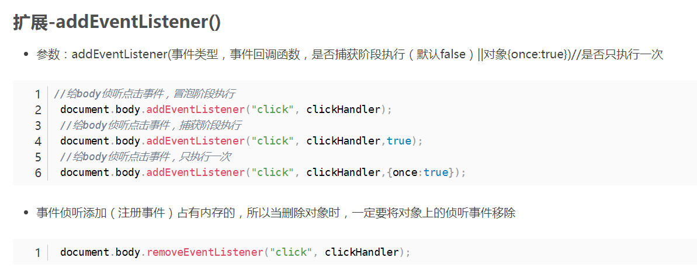
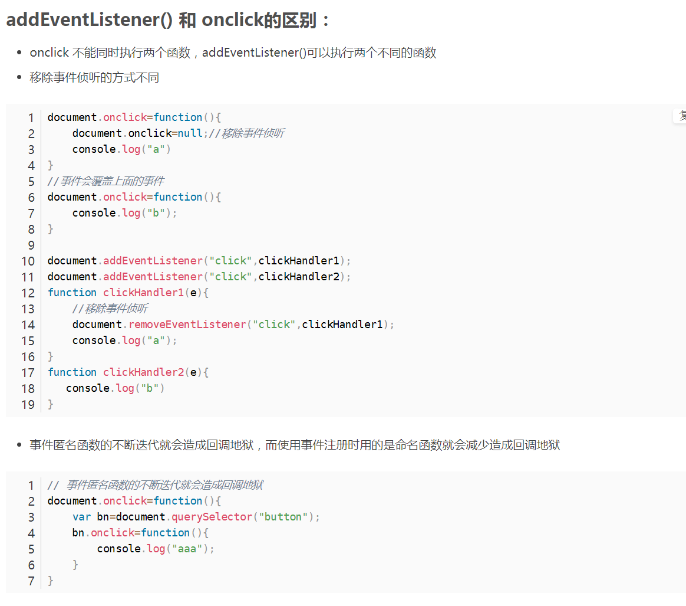
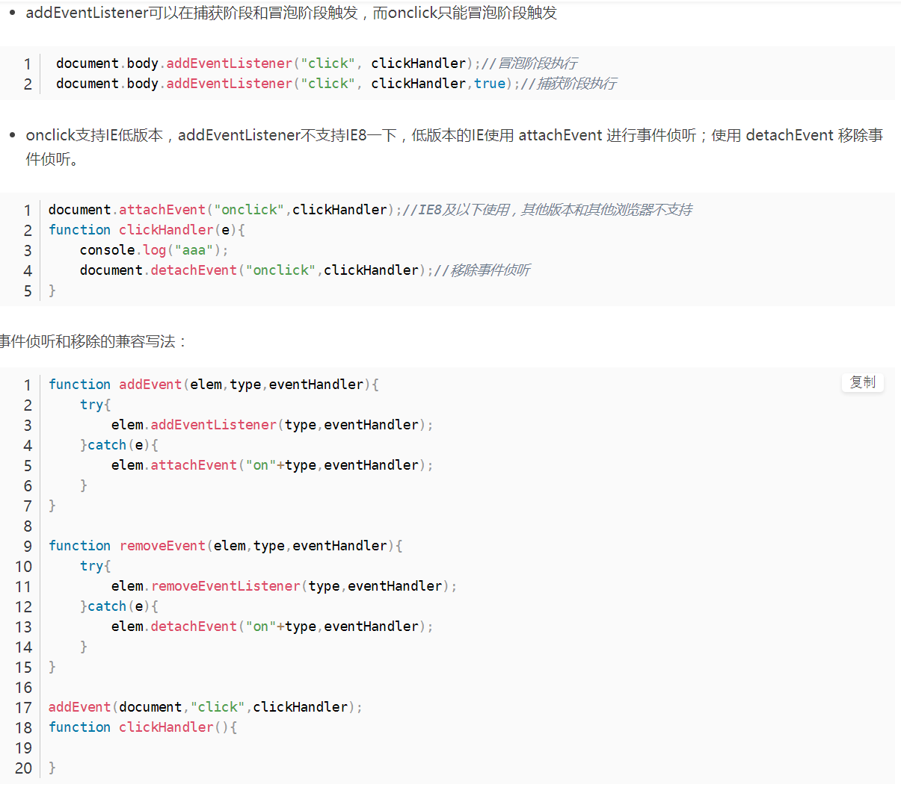
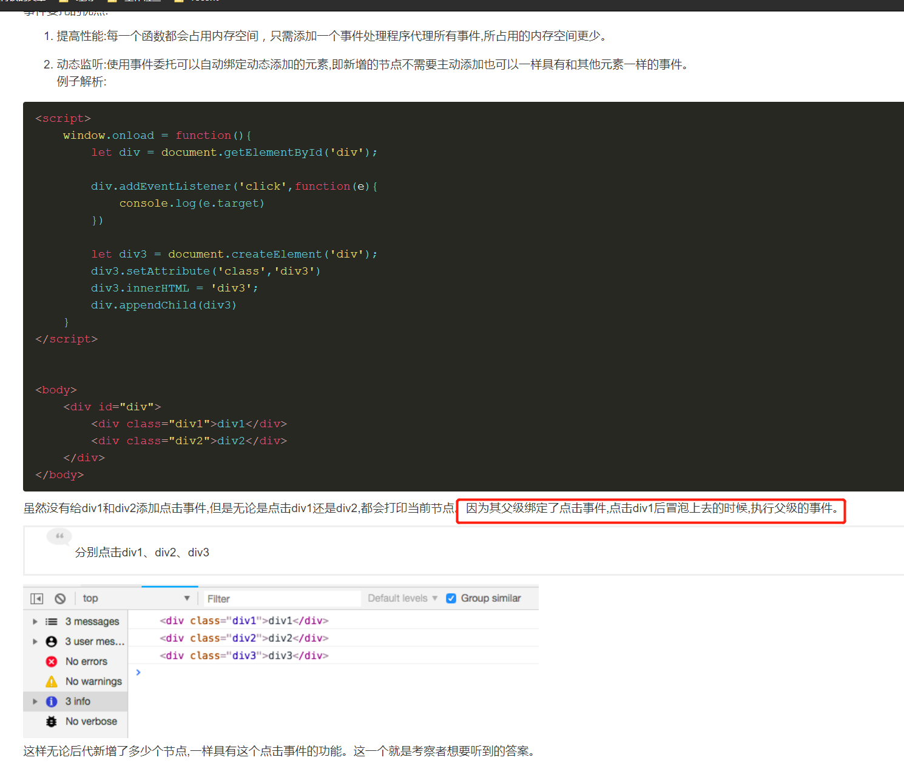
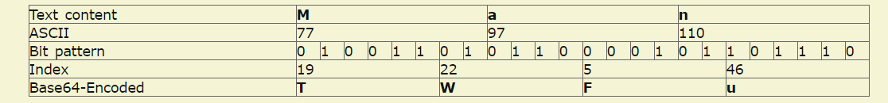
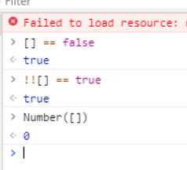
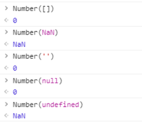

# 校招

一面（大概3-40分钟）

 ## js事件机制，如何阻止事件冒泡，事件委托原理

事件分为系统派发事件和自定义派发事件。

addEventListener();//事件侦听方法，仅用于EventTarget对象
dispatchEvent();//抛发事件方法，派发事件，仅用于EventTarget对象
注意：

必须要先侦听再派发
侦听和派发的对象是同一个，可以是DOM元素，也可以是EventTarget，或者继承EventTarget的类
侦听和派发的事件类型完全相同，其实事件类型就是一个任意字符串
系统派发的事件字符串是固定的，自定义派发的事件，字符串可以任意
事件侦听回调函数，不能传参,因此事件回调函数中有且仅有一个参数,这个参数即为事件对象
事件都可以手动派发，手动派发的话，页面加载完后就会执行

如何阻止事件冒泡

- e.stopPropagation();
- e.cancelBubble=true; IE8及以下浏览器

事件委托
事件侦听添加（注册事件）占有内存的，尽量减少事件侦听的数量，将子元素的事件委托给父元素来执行，叫做事件委托。
当删除对象时，一定要将对象上的侦听事件移除，否则会造成内存泄露。

- e.currentTarget 是事件侦听事件对象（什么对象执行addEventListener函数就是谁）**当前的意思就是谁监听**
- e.target 事件的目标对象 事件实际触发的目标阶段最后对象， target，**每个都是用这个，就是实际触发的节点**
- e.srcElement 事件的目标对象，兼容IE
- 事件函数中this默认等同于e.currentTarget
- target：当前被点击的实际元素
- currentTarget：注册了事件处理程序的元素







如何写一个实践委托



所以实践委托用的是冒泡阶段，addEventListener可以绑定多个同名事件都会执行

## 跨域方案

jsonp

ngnix

cors

link标签

iframe

worker

iframe传值

> 也是利用iframe可以在不同域中传值的特点，而location.hash正好可以携带参数，所以利用iframe作为这个不同域之间的桥梁。

*具体实现步骤*

- 1、向A域名页面插入一个B域名的iframe标签。
- 2、然后在B域名的iframe页面中ajax请求同域名的服务器。
- 3、iframe页面拿到数据后通过praent.location.href将想要传递的参数放到#后面，作为hash传递。
- 4、这样在A域名页面就能通过window.onhashchange 监听处理你想要的数据。

孩子： window.name = xhr.responseText

父亲： console.log(JSON.parse(iframe.contentWindow.name))

###### postMessage跨域

**原理**

> postMessage是H5原生API支持，可以在两个页面或者多个页面，以及不同源页面之间传递数据。窗口之间能够传递数据的前提是必须从一个窗口获取到另外一个窗口的**目标对象**（target window),比如说用iframe打开另外一个窗口，我们得获取到这个iframe的contentWindow。或者通过window.open()打开另外一个窗口时会返回这个窗口的window对象。

*参数传递*

```
/**
  data  需要传递的数据，使用JSON.stringify 序列化
  origin 设置为'*'时，表示传递给所有窗口，也可以指定地址。 如果是同源下设置为'/'
**/
postMessage(data,origin)
```


##  闭包原理应用


 ## 列举http 状态码/请求头（这里聊了挺多，基本上把我知道的都挖出来了，捂脸.jpg）

请求头中所有的东西：

todo：背

 ## cookie 的一些字段属性(经常考)

- name字段为一个cookie的名称。

- value字段为一个cookie的值。

- domain字段为可以访问此cookie的域名。
  非顶级域名，如二级域名或者三级域名，设置的cookie的domain只能为顶级域名或者二级域名或者三级域名本身，不能设置其他二级域名的cookie，否则cookie无法生成。
  顶级域名只能设置domain为顶级域名，不能设置为二级域名或者三级域名，否则cookie无法生成。
  二级域名能读取设置了domain为顶级域名或者自身的cookie，不能读取其他二级域名domain的cookie。所以要想cookie在多个二级域名中共享，需要设置domain为顶级域名，这样就可以在所有二级域名里面或者到这个cookie的值了。
  顶级域名只能获取到domain设置为顶级域名的cookie，其他domain设置为二级域名的无法获取。

- path字段为可以访问此cookie的页面路径。 比如domain是abc.com,path是/test，那么只有/test路径下的页面可以读取此cookie。

- expires/Max-Age 字段为此cookie超时时间。若设置其值为一个时间，那么当到达此时间后，此cookie失效。不设置的话默认值是Session，意思是cookie会和session一起失效。当浏览器关闭(不是浏览器标签页，而是整个浏览器) 后，此cookie失效。

- Size字段 此cookie大小。

- http字段 cookie的httponly属性。若此属性为true，则只有在http请求头中会带有此cookie的信息，而不能通过document.cookie来访问此cookie。

- secure 字段 设置是否只能通过https来传递此条cookie

- 5.secure 设置web页面只有在HTTPS安全连接时，才可以发送Cookie。HHTP则不可以进行回收。

  6.HttpOnly 它使JavaScript 脚本无法获得Cookie，通过上述设置，通常从Web 页面内还可以对Cookie 进行读取操作。但使用JavaScript 的document.cookie 就无法读取附加HttpOnly 属性后的Cookie 的内容了

  `response.setHeader("Set-Cookie","deniro=1; Path=/;Domain=www.deniro.net;" +                "Max-Age=30;HTTPOnly");`

##  cookie，session的区别

实际上Cookie是服务器在**本地机器**上存储的一小段文本，并随着每次请求发送到服务器。

**Cookie技术通过请求和响应报文中写入Cookie信息来控制客户端的状态**

上面我讲到服务端执行session机制时候会生成session的id值，这个id值会发送给客户端，客户端每次请求都会把这个id值放到http请求的头部发送给服务端，而这个id值在客户端会保存下来，保存的容器就是cookie，因此当我们完全禁掉浏览器的cookie的时候，服务端的session也会不能正常使用。

1. cookie数据存放在客户的浏览器（客户端）上，session数据放在服务器上，但是服务端的session的实现对客户端的cookie有依赖关系的；
2. cookie不是很安全，别人可以分析存放在本地的COOKIE并进行COOKIE欺骗，考虑到安全应当使用session；
3. session会在一定时间内保存在服务器上。当访问增多，会比较占用你服务器的性能。考虑到减轻服务器性能方面，应当使用COOKIE；
4. 单个cookie在客户端的限制是3K，就是说一个站点在客户端存放的COOKIE不能超过3K；

 ## 强缓存协商缓存具体过程


 ## 如何隐藏一个元素

display:none

visibility:hidden;

 ## padding，margin百分比

上下左右都相对于父元素的宽度

 ## 链表的优缺点

   数组与链表的优缺点；    
    数组:

    优点：使用方便 ，查询效率 比链表高，内存为一连续的区域 
    
    缺点：大小固定，不适合动态存储，不方便动态添加
    链表：
    
     优点：可动态添加删除   大小可变   
     缺点：只能通过顺次指针访问，查询效率低
二面 （大概40分钟）

 ## 讲一下实习经历和项目经历
 ## js 作用域链

todo：如何讲的清清楚楚

## 文件上传进度展示和大文件断点续传 

看之前准备的面经

（这个其实没什么经验，说了下HTML5 File API和相关的思路就过了）

- 前端上传大文件时使用 Blob.prototype.slice 将文件切片，并发上传多个切片，最后发送一个合并的请求通知服务端合并切片
- 服务端接收切片并存储，收到合并请求后使用流将切片合并到最终文件
- 原生 XMLHttpRequest 的 upload.onprogress 对切片上传进度的监听（e.loaded / e.total) * 100）
- 使用 Vue 计算属性根据每个切片的进度算出整个文件的上传进度

断点续传

- 使用 spark-md5 根据文件内容算出文件 hash
- 通过 hash 可以判断服务端是否已经上传该文件，从而直接提示用户上传成功（秒传）
- 通过 XMLHttpRequest 的 abort 方法暂停切片的上传
- 上传前服务端返回已经上传的切片名，前端跳过这些切片的上传

 ## 回流和重绘，什么情况触发

什么时候触发回流和重绘

https://segmentfault.com/a/1190000017329980

回流：确定位置

重绘： 确定像素

浏览器的优化机制

现代的浏览器都是很聪明的，由于每次重排都会造成额外的计算消耗，因此大多数浏览器都会通过队列化修改并批量执行来优化重排过程。浏览器会将修改操作放入到队列里，直到过了一段时间或者操作达到了一个阈值，才清空队列。但是！**当你获取布局信息的操作的时候，会强制队列刷新**，比如当你访问以下属性或者使用以下方法：

- offsetTop、offsetLeft、offsetWidth、offsetHeight
- scrollTop、scrollLeft、scrollWidth、scrollHeight
- clientTop、clientLeft、clientWidth、clientHeight
- getComputedStyle()
- getBoundingClientRect


 ## vue 和 react 的区别


 ## 做了一道笔试的变形题，找出字符串中第一个连续三个递增的数字并返回
todo：编程题不难

HR面

实习经历，校园经历，在校成绩，奖励情况
专业不匹配为什么做前端
家乡，工作城市偏好
希望公司有什么价值观
offer 情况，期望薪资
如果发了offer觉得什么时候入职比较合适（没想到问这个，以为听错了）
3-12 

offer call

顺便不要脸地推荐一下平时练习前端和算法的一些代码（里面也有两道shopee笔试题）：

https://github.com/rosie597/practice
————————————————
版权声明：本文为CSDN博主「weixin_41531446」的原创文章，遵循CC 4.0 BY-SA版权协议，转载请附上原文出处链接及本声明。
原文链接：https://blog.csdn.net/weixin_41531446/article/details/104831999

----

一面

作者：JAZI6
链接：https://www.nowcoder.com/discuss/112386
来源：牛客网


头一次用牛客，头一次现场出题去做，有点慌张 

## c++和js区别 


  ## 手写js继承实现 


## 闭包，闭包数据缓存手写 (没写出来） 


 ## 事件循环机制 


## url->页面生成过程 

## 性能优化 

## es6新东西 

## promise执行，事件循环机制 

## http请求方式，最好了解常用的四个以外其他的那几个 

todo：head请求

## http缓存 

## webpack 

？？？

## 模块化规范，CMD原理是什么？ 

todo：没找到好的资料，得找一找看看

## vue响应式原理 

  15.实习经历 

----

作者：只要平凡.
链接：https://www.nowcoder.com/discuss/414531?type=2&order=3&pos=26&page=1
来源：牛客网


一面：一面的问题和其他人发的面经里的差不多 

  


  二面： 

  自我介绍 

 ##  实习过程学到最深刻的知识是什么 

 ##  平时看哪些书籍 


  ## 期望做什么方向 


 ##  还学过其他框架或技术吗 


  ## 在学校遇到哪些技术困难 


  还有什么问题要问吗 

  （技术方面问的少，有点记不太清了，只记得这几个问题了） 

  


  HR面： 

  实习工作当中负责的工作内容？ 

  你对第一份工作的期待是怎么样的？对哪方面比较看重？ 

  有了解过Shopee吗？ 

  你是哪里人？ 

  未来是期望在深圳定居工作吗 

  家人对择业有要求吗 

  行业很辛苦，家人对这行会有意见吗 

  你觉得我们公司怎么样？你意向如何？ 

  专业排名如何？ 

  期待的薪资？ 

  有什么问题要问的吗

----

作者：***emily__***
链接：https://www.nowcoder.com/discuss/125422
来源：牛客网

技术终面

##  css-module

只加入了局部作用域和模块依赖，这恰恰是网页组件最急需的功能。

因此，CSS Modules 很容易学，因为它的规则少，同时又非常有用，可以保证某个组件的样式，不会影响到其他组件。

产生局部作用域的唯一方法，就是使用一个独一无二的`class`的名字，不会与其他选择器重名。这就是 CSS Modules 的做法

需要配置webpack才能使用变量

## Node怎么捕获错误

采用事件轮训、异步 IO 等机制使得 Node.js 能够从容应对无阻塞高并发场景，令工程师很困扰的几个理解 Node.js 的地方除了它的事件（回调）机制，还有一个同样头痛的是异常代码的捕获

我的node要加强一下了

###  try/catch 之痛

一般情况下，我们会将有可能出错的代码放到 `try/catch` 块里。但是到了 Node.js，由于 `try/catch` 无法捕捉异步回调里的异常，Node.js 原生提供 `uncaughtException` 事件挂到 `process` 对象上，用于捕获所有未处理的异常：

（这里和浏览器中差不多）

执行的结果是代码进到了 uncaughtException 的回调里而不是 catch 块。 uncaughtException 虽然能够捕获异常，但是此时错误的上下文已经丢失，即使看到错误也不知道哪儿报的错，定位问题非常的不利。而且一旦 uncaughtException 事件触发，整个 node 进程将 crash 掉，如果不做一些善后处理的话会导致整个服务挂掉，这对于线上的服务来说将是非常不好的

###  使用 domain 模块捕捉异常

一般情况下，我们会将有可能出错的代码放到 `try/catch` 块里。但是到了 Node.js，由于 `try/catch` 无法捕捉异步回调里的异常，Node.js 原生提供 `uncaughtException` 事件挂到 `process` 对象上，用于捕获所有未处理的异常：

http://www.alloyteam.com/2013/12/node-js-series-exception-caught/

随 Node.js v0.8 版本发布了一个 [domain](http://nodejs.org/api/domain.html)（域）模块，专门用于处理异步回调的异常，使用 `domain` 我们将很轻松的捕获异步异常：

运行上面的代码，我们会看到错误被 domain 捕获到，并且 uncaughtException 回调并不会执行，事情似乎变得稍微容易些了。

但是如果研究 domain 模块的 API 很快我们会发现，domain 提供了好几个方法，理解起来似乎不是那么直观（其实为啥这个模块叫 “域 (domain)” 呢，总感觉些许别扭），这里简单解释下：

```js
process.on('uncaughtException', function(err) {
    console.error('Error caught in uncaughtException event:', err);
});
 
var d = domain.create();
 
d.on('error', function(err) {
    console.error('Error caught by domain:', err);
});
 
d.run(function() {
    process.nextTick(function() {
        fs.readFile('non_existent.js', function(err, str) {
            if(err) throw err;
            else console.log(str);
        });
    });
});
```

 

首先，关于 domain 模块，我们看到它的稳定性是 2，也就是不稳定，API 可能会变更。

默认情况下，domain 模块是不被引入的，当 `domain.create()`创建一个 domain 之后，调用 `enter()`方法即可 “激活” 这个 domain，具体表现为全局的进程（`process`）对象上会有一个 domain 属性指向之前创建的这个的 domain 实例，同时，domain 模块上有个 `active` 属性也指向这个的 domain 实例。、

结合 [should](https://github.com/visionmedia/should.js) 断言库测试下上面说的：

| // domain was not exists by defaultshould.not.exist(process.domain); var d = domain.create(); d.on('error', function(err) {  console.log(err);}); d.enter(); // makes d the current domain process.domain.should.be.an.Object;process.domain.should.equal(domain.active); d.exit(); // makes d inactive should.not.exist(process.domain); |
| ------------------------------------------------------------ |
|                                                              |

 

执行之后发现几个断言都能 pass。`exit()`方法的意思是退出当前 “域”，将会影响到后续异步异常的捕获，后面会提到。

`enter` 和 `exit` 组合调用这样会使代码有些混乱，尤其是当多个 domain 混合、嵌套使用时比较难理解。

这时候可以使用 `run()`方法，`run()`其实就是对 `enter` 和 `exit` 以及回调的简单封装，即：run() -- callback() -- exit() 这样，就像上面例子中的 `run()`一样。

还有两个方法，`bind()`和 `intercept()`：

bind:

| 1234 | fs.readFile('non_existent.js', d.bind(function(err, buf) {  if(err) throw err;  else res.end(buf.toString());})); |
| ---- | ------------------------------------------------------------ |
|      |                                                              |

 

intercept：

| 123  | fs.readFile('non_existent.js', d.intercept(function(buf) {  console.log(buf);})); |
| ---- | ------------------------------------------------------------ |
|      |                                                              |

 

用法差不多，只是 intercept 拦截了异步回调，如果抛出异常就自己处理掉了。

#### domain 的隐式绑定

domain 主要会影响 `timers` 模块（包括 `setTimeout`, `setInterval`, `setImmediate`）, 事件循环 `process.nextTick`，还有就是 event。

实现的思路都差不多，都是通过注入 domain 代码到 timer、nextTick、event 模块中，在创建的时候检查当前有没有激活（active）的 domain，有则记录下，如果是 timer 和 nextTick，当在事件循环中执行回调的时候，把 process.domain 设置为之前记录的 domain 并把错误交给它处理。如果是 event，多一步判断，先会把异常交给 event 自己定义的 error 事件处理。

这里要注意，如果这个 domain 没有绑定 `error` 事件的话，node 会直接抛出错误，即使 uncaughtException 绑定了也没有用：

| 1234567891011121314 | var d = domain.create(); process.on('uncaughtException', function(err) {  console.error('Error caught in uncaughtException event:', err);}); d.run(function() {  process.nextTick(function() {    fs.readFile('non_existent.js', function(err, str) {      if(err) throw err;      else console.log(str);    });  });}); |
| ------------------- | ------------------------------------------------------------ |
|                     |                                                              |

 

在这个例子里面，使用了 domain 捕获异常但是没有监听 domain 的 error 事件，监听了 uncaughtException，但是还是抛出了异常，个人觉得觉得这里是个 bug，domain 没有 errorHandle 应该把异常交给全局的 uncaughtException，后面有例子验证这一点。

还有一个小问题，同时监听了 uncaughtException 和 domain 的 error 事件，在 node v0.8 里有个 bug，uncaughtException 和 domain 都能捕获异常，0.10+已经修复。

#### domain 的显式绑定

上面没有提到的两个 API 是 `add()`和 `remove()`，add 作用是把 domain 创建之前创建的（EventEmitter 实例）对象添加到这个 domain 里边，然后这个对象即可使用 domain 捕捉异常了，remove 则相反。domain 对象上有个 numbers 队列专门用于管理 add 后的对象。

这里可参考[官方示例](http://nodejs.org/api/domain.html#domain_explicit_binding)。

#### domain 如何抛出异常

我们看 [node 源码](https://github.com/joyent/node/blob/v0.10.4/src/node.js#L43)有这么一行：

| 12   | // do this good and early, since it handles errors.startup.processFatal(); |
| ---- | ------------------------------------------------------------ |
|      |                                                              |

 

`processFatal` 里边调用 `process._fatalException()`，先判断是否存在 process.domain，尝试把错误交给 process.domain 处理，如果不存在才交给 uncaughtException 处理，所以 domain 捕获异常的关键代码在 [node.js#L219](https://github.com/joyent/node/blob/v0.10.4/src/node.js#L219)。

这里尝试修改下上面的例子，在抛出异常前把 process.domain 设为 null：

| 123456789 | d.run(function() {  process.domain = null;  process.nextTick(function() {    fs.readFile('non_existent.js', function(err, str) {      if(err) throw err;      else console.log(str);    });  });}); |
| --------- | ------------------------------------------------------------ |
|           |                                                              |

 

这下 uncaughtException 将捕获异常！

当上面提到的异常都没被捕获，进程将直接退出 [node.js#L280](https://github.com/joyent/node/blob/v0.10.4/src/node.js#L280)：

| 1234 | // if someone handled it, then great. otherwise, die in C++ land// since that means that we'll exit the process, emit the 'exit' event...process.emit('exit', 1); |
| ---- | ------------------------------------------------------------ |
|      |                                                              |

 

另外关于 domain 如何在多个不同的事件循环中传递，可以参考下[这篇](http://deadhorse.me/nodejs/2013/04/13/exception_and_domain.html)文章。

值得关注的是，并不是所有在 domain 域下创建的事件分发器（EventEmitter）上面的异步异常都能捕获：

| 123456789101112131415161718192021222324252627282930313233 | var d = domain.create();var msg;var Msg = function() {  events.EventEmitter.call(this);   this.on('msg', function(msg) {    console.log(msg);  });   this.send = function(msg) {    this.emit('msg', msg);  };   this.read = function(file) {    var root = this;    fs.readFile(file, function(err, buf) {      if(err) throw err;      else root.send(buf.toString());    });  };}; require('util').inherits(Msg, events.EventEmitter); d.on('error', function(err) {  console.error('Error caught by domain:', err);}); d.run(function() {  msg = new Msg();}); msg.read('non_existent.js'); |
| --------------------------------------------------------- | ------------------------------------------------------------ |
|                                                           |                                                              |

 

这个例子中，msg 对象虽然是在 domain 中实例化，但是 msg.send 里边 fs.readFile 在执行回调的时候，process.domain 是 `undefined`。

我们稍微改造下，把 readFile 的回调绑定到 domain 上，或者把 msg.send() 的调用放到 d.run() 包裹，结果可预知，能正常捕获抛出的异常。为了验证，尝试改造下 readFile：

| 12345 | fs.readFile(file, function(err, buf) {  process.domain = d;  if(err) throw err;  else root.send(buf.toString());}); |
| ----- | ------------------------------------------------------------ |
|       |                                                              |

 

这样亦可捕获异常，不过实际中不要这样写，还是要采用 domain 提供的方法。

#### 更好的使用 domain

其实上，更推荐的做法是，如果在活动 domain 里面创建了事件分发器（EventEmitter）实例，我们应该尽可能的给它注册 error 事件，把错误都抛给这个 EventEmitter 实例处理，就像上面的例子，我们改造下，绑定 error 事件并把 readFile 的错误交给 Msg 实例处理：

| 1234567891011 | this.on('error', function(err) {  throw err;}); this.read = function(file) {  var root = this;  fs.readFile(file, function(err, buf) {    if(err) root.emit('error', err);    else root.send(buf.toString());  });}; |
| ------------- | ------------------------------------------------------------ |
|               |                                                              |

 

在书写 Node.js 代码的时候，对于事件分发器，应该养成先绑定（`on()`或 `addEventListener()`）后触发（`emit()`）的习惯。在执行事件回调的时候，**对于有可能抛异常的情况，应该把 emit 放到 domain 里去**：

| 123456789101112131415161718 | var d = domain.create();var e = new events.EventEmitter(); d.on('error', function(err) {  console.error('Error caught by domain:', err);}); e.on('data', function(err) {  if(err) throw err;}); if(Math.random() > 0.5) {  d.run(function() {    e.emit('data', new Error('Error in domain runtime.'));  });} else {  e.emit('data', new Error('Error without domain.'));} |
| --------------------------- | ------------------------------------------------------------ |
|                             |                                                              |

 

根据 [domain#L187](https://github.com/joyent/node/blob/v0.10.4/lib/domain.js#L187) 可知，run 会把传进去的函数包装成另一个函数返回，并在这个返回的函数上设置 domain：

| 1    | b.domain = this; |
| ---- | ---------------- |
|      |                  |

 

events 模块 [events.js#L85](https://github.com/joyent/node/blob/v0.10.4/lib/events.js#L85) 有这么一行：

| 1    | if (this.domain && this !== process) this.domain.enter(); |
| ---- | --------------------------------------------------------- |
|      |                                                           |

 

当调用 e.emit() 的时候，如果回调函数上挂有 domain，则将这个 domain 激活，进而可以捕获异常。

#### domain 的缺陷

有了 domain，似乎异步异常捕捉已经不再是难事。Node.js 允许创建多个 domain 实例，并允许使用 add 添加多个事件分发器给 domain 管理，，而且 domain 之间可以相互嵌套，而创建 domain，是有一定的性能耗损的，这样带来了一个棘手的问题是：多个 domain 如何合理的创建与销毁，domain 的运行期应该如何维护？

还有一点，domain 并不能捕捉所有的异常，看[这里](https://github.com/domenic/domains-tragedy)。

#### domain 实践

关于使用 domain 到集群环境，推荐都看看官方的说明：[Warning: Don't Ignore Errors!](http://nodejs.org/docs/latest/api/domain.html#domain_warning_don_t_ignore_errors)。把每一个网络请求都包在一个 domain 里边，捕获到异常时，不要立即退出进程，应该保证进程中其他连接正常退出之后再 exit，官方推荐的是设一个定时器，过 3min 后退出进程，接下去做善后处理，然后应该返回应该有的错误（如 500）给客户端。

对于 connect 或者 express 创建的 web 服务，有一个 [domain-middleware](https://github.com/fengmk2/domain-middleware) 中间件可以直接用，它会把 next 包装到一个已经定制好的 domain 里边。

在具体应用场景，应该 uncaughtException 事件配合 domain 来用。

在这个例子里面，使用了 domain 捕获异常但是没有监听 domain 的 error 事件，监听了 uncaughtException，但是还是抛出了异常，个人觉得觉得这里是个 bug，domain 没有 errorHandle 应该把异常交给全局的 uncaughtException，后面有例子验证这一点。

还有一个小问题，同时监听了 uncaughtException 和 domain 的 error 事件，在 node v0.8 里有个 bug，uncaughtException 和 domain 都能捕获异常，0.10+已经修复。

## 自动解决语法规范

eslint.vue

todo

## div 实现三角形

```css
<style type="text/css">
.triangle{
    width: 0;
    height: 0;
    border-width: 30px;
    border-style: solid;
    border-color: #000000 transparent transparent transparent;
}
</style>
```


## primose原理+源码


## Instanceof原理


## react16新特性


## aync + await

genertor的原理

## webpack加载顺序

### 加载js文件顺序


webpack会从 webpack.config.js 配置entry的入口js文件开始读起，从上到下按顺序执行。webpack读取js会先看有没有import 。

如果有import，则按import的顺序依次读取导入的js。 如果没有import，则继续执行当前js代码。 执行完当前js代码，会回退到上个js继续执行，直到回退到入口文件index.js 如果已经import过的js，则不再重复导入

该项目具体执行顺序

- 首先读取index.js，发现有import  a.js
- 进入a.js ，发现有import ，导入第一个文件 b.js
- 进入b.js，发现有import，进入 c.js
- 在c.js里没有import，则执行c.js里面的代码，此时打印 console.log('file: c.js')
- 执行完c.js后，回退到上个js，即b.js
- 执行b.js代码，此时打印 console.log('file: b.js')
- 执行完b.js，回退到上个js，即a.js
- 在a.js，导入第二个文件 d.js
- 进入d.js，没有导入的js，则执行当前js代码，此时打印 console.log('file: d.js')
- 执行完d.js，回退到a.js，继续执行a.js代码，此时打印 console.log('file: a.js')
- 执行完a.js，回退到index.js，结束！

### 加载顺序是从后向前

后面的暂时找不到资料

##  web-view 兼容性

html5页面用Android webview打包成app

大多数手机浏览器和内嵌浏览器都是基于webkit的，但是还有诸如opera,火狐浏览器，前缀最好写上去。
webview对css3的支持因不同手机不同手机系统支持会有差异。
尽量使用都已经普遍支持的属性~。

## wpvue框架

使用vue框架开发微信小程序

## proxy

代理对象行为

​	13. 。。。

​	大概40分

​	手写一道题

​	HR面

​	都是常规题

​	请问有没有10.9广州场前端的同学 谢谢

----

作者：岁月静好42
链接：https://www.nowcoder.com/discuss/119657
来源：牛客网


# shopee二面

​    1、介绍一下自己    

## 怎么实现继承，写了用那个实例继承的方式，但是被面试官说这个会存在继承污染还是什么，换另外的方式来做，就用了Object.create()实现继承    

```js
    function People() {
      this.type = 'prople'
    }

    People.prototype.eat = function () {
      console.log('吃东西啦');
    }

    function Man(name) {
      this.name = name;
      this.color = 'black';
    }
//原型继承
Man.prototype = People
//缺点：people中的变量公用了，man的实例之间会共用这些变量

//构造继承
function man(){
    People.call(this)
}
// 缺点：函数不能实例公用，不能继承父类的原型
//组合继承
function man(){
    People.call(this)
}
Man.prototype = People.prototype
父类原型和子类原型是同一个对象，无法区分子类真正是由谁构造
// 父类原型和子类原型是同一个对象，无法区分子类真正是由谁构造
//寄生组合继承
function man(){
	People.call(this)
}
Man.prototype = Object.create(People.prototype,{
    contructor: {
        value: Man
    }
})
//inherits函数：
```


## 闭包讲一下    


## js的事件模型是什么样的具体讲一下，有什么作用，在什么场景下会使用到。    

todo: 定时器的原理

## e.target和e.currentTerget有什么区别（没回答上来）：其实就是e.target指向触发事件的那个元素。e.currentTarget同未修改指向的this指向一致，指向绑定事件的那个元素    


## 因为项目当中使用了react-router，就被问了你知道怎么使用js实现路由功能吗（不知道，没回答上来）    


## 实现一个斐波那契数列实现输入第n项输出相应的值，优化这个函数，让被查找过的下标值下次再次访问的时候能够立马找到并输出    

今天做这个这题我被考过

```js
 function fibonacci(n, map = {}){
     if(n == 1 || n == 2){
         map[n] = 1;
         return 1;
     }
     if(!map[n]){
     	map[n] = fibonacci(n-1, map) + fibonacci(n-2, map)
     }
	 return map[n];
 }

function fi(n,map={}){
    if(n=1 || n==2){
        map[n] = 1
        return 1
    }
    if(!map[n]){
        map[n] = fi(n-1,map) + fi(n-2,map)
    }
    return map[n]
}
```

这个要做，今天学下

## 用数组的reduce方法实现数组拍平算法  (递归)  

今天学下

```js
  let arr = [1,[3,[2,5]],8,9];
  function paiping(arr){
      return arr.reduce((ar=[],cur)=>{
          if(Array.isArray(cur)){
              ar =  [].concat(ar,paiping(cur))
          }else {
             ar = [].concat(ar,cur)
          }
          return ar
      })
  }
  console.log(paiping(arr))
```

如何优化下，完美

​    非常希望有这个offer，加油啊。

-----

## 2019.8.16 shopee意向书（和虾皮一面中的面经是一样的）

**一面**

- new 内部实现
- js 中判断类型的方法
- typeof 有什么不好的地方
- 最完美的方法的哪一种
- 如何实现一个对象的属性无法改变
- defineProperty 还有什么其他可以配置的
- 还有什么其他实现的方法
- instanceof知道吗
- 他的作用是什么
- 他可以判断一个变量是否是数组么
- 深浅拷贝说一下
- object.assign 实现的是什么
- 如何实现深拷贝
- 说一下你理解的闭包
- 闭包有什么缺点
- 平时的应用场景
- xss说一下
- csrf说一下
- token值怎么传递
- get方法怎么传递token值
- 前端性能优化
- 前端常用的数值单位
- rem和em的区别
- 1vw等于多少
- 为什么0.1+0.2不等于0.3
- 怎么让它等于0.3
- let a = {} 说一下这段代码变量的存储
- 那let a = 1呢
- 说一下let const var
- 箭头函数和普通函数的区别
- 给一段代码看输出(this指向问题)
- visible:hidden和display:none有什么区别
- 在render dom 和 tree dom里面呢?
- 浏览器的事件循环机制说一下
- 下面这段代码的输出结果
- 什么是同源策略
- 跨域的方式说一下
- 什么是事件代理
- call bind apply有什么区别
- 实现居中的几种方式
- target和currTarget的区别
- vue的生命周期
- vue beforeCreated到create发生了什么
- vue 父子组件通信方式
- react 生命周期
- react父子组件通信方式
- react虚拟dom
- react diff过程
- react diff主要对比的是什么东西

**二面** 2019.8.23

- 来个自我介绍吧
- 介绍实习内容
- 重点聊了实习的一个东西, 没做过应该不会问
- react列表渲染有什么注意的地方
- 为什么需要加key值
- 知道react是怎么渲染虚拟dom的吗
- vue/react的区别
- 有关注什么前端技术
- 平时会系统学习前端吗?
- 为什么会选择前端
- 有什么想问我的(没啥了吧)
- 然后.....面试官: 你不想了解一下我们公司吗??内心慌得一匹的我马上补了两个问题

**HR面** 2019.8.29

- 家在哪里
- 工作地点怎么选择
- 成绩排名
- 怎么选公司
- 还面了哪些公司
- tx和虾皮的一面比感觉怎么样
- 你认为什么技术氛围比较好
- 期望薪资

----


# 社招

终面

然后就是 HR 面和 Boss 面。老板原来也是搞技术出身的，看到我简历上的内容，还问了我两个技术问题：

> 如果单从修改 DOM 结构来看，React + `dom-diff` 算法与纯 jQuery 直接操作（假设已经知道该如何最快的 patch）相比，哪个效率比较高？

我的答案是：当结构不复杂的时候，`dom-diff` 的耗时占比重是不能被忽略的，此时当然是 jQuery 快；但是当结构复杂了之后，`dom-diff` 的耗时占比重就比较低了，更多的时间被消耗在 DOM 的操作上——React 是直接 patch 到 DOM 上，但 jQuery 是在原生 DOM 上面封装了一层，所以会再慢一些，这个的时间是要多于 `dom-diff` 的。这个问题我不知道标准答案是什么，因为似乎很少有人这么来对比（React 和 jQuery 的应用场景本来就不一样，而且其实这不能算是框架的比较，更像是“一个需要预处理但 N 的常数低”的算法和“一个不需要预处理但 N 的常数比较高”的算法之间的比较），面试的时候面试官也不会直接给出结果。如果我的回答有错误的话还请大佬们指正……

> 堆排序的实现原理？
>
> todo:  堆排序  （）

这个学过算法的人基本都知道，所以就不在这儿多写了。我当时只说完排序的步骤老板就让过了，连建堆和调整的具体算法都不用说

---

现在 shopee 的终面不是老板来面了，更可能是你未来团队的 leader。具体题目不太清楚，可能会比初面稍微难一丢丢吧，不过现在 shopee 也缺人，所以初面过了的话终面被刷的可能性不大，除非面试官觉得你实在是没法跟人相处。

初面（技术面）的话，只从网上找题目背是不行的，需要有自己的理解。面试官一般能看出你究竟是不是真的会，如果碰到不会的问题，可以说不会，但需要思考一下（甚至可以问面试官有没有什么提示），但千万不要明明不会但装作很会的样子。

技术面会考一些算法（后端比前端需要会的算法更多），以及一些框架的原理，还有一些优化相关的东西。我们平时真的能遇到由于框架/浏览器问题导致的 bug，也用简单的算法解决过实际问题。我博客里写过几篇相关的文章，但不要把它们作为面试题的参考

最后，欢迎大家加入 shopee！

校招会问一些简单的数组、排序、链表之类的，社招的话从简单的二叉树到 dom-diff 都可能会考到，这些是为了确认面试者有没有足够的技能（或者学习能力）胜任这份工作；此外如果简历中写了其它好玩的东西可能也会顺着这些来问，例如科班出身的人可能会被问到 LRU 和稳定排序，写过包管理器的人可能会被问到拓扑排序，这些是为了了解面试者对项目的掌握程度，以及除了写过业务代码以外有没有别的能力。

这确实有些“面试造火箭工作拧螺丝”的意思，但这是保持一个团队有较高的平均水平的办法，也是让面试者证明自己比同时期的其他竞争者更有优势的最有效的办法。

----

一个朋友去 shopee 面试资深高级前端工程师，仅供参考。

## unicode 和utf 编解码的原理和不同

简单来说：

- Unicode 是「字符集」

- UTF-8 是「编码规则」

其中：

- 字符集：为每一个「字符」分配一个唯一的 ID（学名为码位 / 码点 / Code Point）

- 编码规则：将「码位」转换为字节序列的规则（编码/解码 可以理解为 加密/解密 的过程）

广义的 Unicode 是一个标准，定义了一个字符集以及一系列的编码规则，即 Unicode 字符集和 UTF-8、UTF-16、UTF-32 等等编码……

Unicode 字符集为每一个字符分配一个码位，例如「知」的码位是 30693，记作 U+77E5（30693 的十六进制为 0x77E5）。

UTF-8 顾名思义，是一套以 8 位为一个编码单位的可变长编码。会将一个码位编码为 1 到 4 个字节：

```
U+ 0000 ~ U+ 007F: 0XXXXXXX

U+ 0080 ~ U+ 07FF: 110XXXXX 10XXXXXX

U+ 0800 ~ U+ FFFF: 1110XXXX 10XXXXXX 10XXXXXX

U+10000 ~ U+10FFFF: 11110XXX 10XXXXXX 10XXXXXX 10XXXXXX

```

根据上表中的编码规则，之前的「知」字的码位 U+77E5 属于第三行的范围：

```
7 7 E 5

0111 0111 1110 0101 二进制的 77E5

--------------------------

0111 011111 100101 二进制的 77E5

1110XXXX 10XXXXXX 10XXXXXX 模版（上表第三行）

11100111 10011111 10100101 代入模版

E 7 9 F A 5
```

这就是将 U+77E5 按照 UTF-8 编码为字节序列 E79FA5 的过程。反之亦然。

8位二进制，每个数字前面几位是0，然后utf-8按照顺序对前面的那几位进行固定编码，然后就把每个二进制前面的0补上对应编码得到的二进制数就是对应的编码

##  base64和二进制的不同



> 第一步，"M"、"a"、"n"的ASCII值分别是77、97、110，对应的二进制值是01001101、01100001、01101110，将它们连成一个24位的二进制字符串010011010110000101101110。
>
> 第二步，将这个24位的二进制字符串分成4组，每组6个二进制位：010011、010110、000101、101110。
>
> 第三步，在每组前面加两个00，扩展成32个二进制位，即四个字节：00010011、00010110、00000101、00101110。它们的十进制值分别是19、22、5、46。
>
> 第四步，根据上表，得到每个值对应Base64编码，即T、W、F、u。

因此，Man的Base64编码就是TWFu。

## 绑定事件的不同种方式，执行顺序，区别在哪里

- 使用内联（这个事件的优先级是最高的。）
- 使用`.onclick`的方式
- 使用事件监听`addEventListener`的方式上面的方式就可以给一个DOM对象绑定一个或者是多个事件。**强烈推荐使用这一种绑定事件的方式**。 使用`addEventListener`的方式还可以拥有第三个参数

**适用与IE6，7，8** IE的事件与模型与W3C的标准事件相比，主要是以下三点不同：

1. 绑定事件的函数不同，IE中使用attachEvent()和detachEvent()
2. 事件必须加上`on`
3. IE6模型中，不支持捕获，只支持冒泡
4. IE中还有毛病，先绑定的事件后发生（准确的说是随机发生）
5. IE中`this`指向`window

## css 实现旋转、拖拽、手势移动

绝对定位中的topleft+监听手势事件

```js

/*
* author: www.somethingwhat.com
*/
var cat = window.cat || {};
cat.touchjs = {
    left: 0,
    top: 0,
    scaleVal: 1,    //缩放
    rotateVal: 0,   //旋转
    curStatus: 0,   //记录当前手势的状态, 0:拖动, 1:缩放, 2:旋转
    //初始化
    init: function ($targetObj, callback) {
        touch.on($targetObj, 'touchstart', function (ev) {
            cat.touchjs.curStatus = 0;
            ev.preventDefault();//阻止默认事件
        });
        if (!window.localStorage.cat_touchjs_data)
            callback(0, 0, 1, 0);
        else {
            var jsonObj = JSON.parse(window.localStorage.cat_touchjs_data);
            cat.touchjs.left = parseFloat(jsonObj.left), cat.touchjs.top = parseFloat(jsonObj.top), cat.touchjs.scaleVal = parseFloat(jsonObj.scale), cat.touchjs.rotateVal = parseFloat(jsonObj.rotate);
            callback(cat.touchjs.left, cat.touchjs.top, cat.touchjs.scaleVal, cat.touchjs.rotateVal);
        }
    },
    //拖动
    drag: function ($targetObj, callback) {
        touch.on($targetObj, 'drag', function (ev) {
            $targetObj.css("left", cat.touchjs.left + ev.x).css("top", cat.touchjs.top + ev.y);
        });
        touch.on($targetObj, 'dragend', function (ev) {
            cat.touchjs.left = cat.touchjs.left + ev.x;
            cat.touchjs.top = cat.touchjs.top + ev.y;
            callback(cat.touchjs.left, cat.touchjs.top);
        });
    },
    //缩放
    scale: function ($targetObj, callback) {
        var initialScale = cat.touchjs.scaleVal || 1;
        var currentScale;
        touch.on($targetObj, 'pinch', function (ev) {
            if (cat.touchjs.curStatus == 2) {
                return;
            }
            cat.touchjs.curStatus = 1;
            currentScale = ev.scale - 1;
            currentScale = initialScale + currentScale;
            cat.touchjs.scaleVal = currentScale;
            var transformStyle = 'scale(' + cat.touchjs.scaleVal + ') rotate(' + cat.touchjs.rotateVal + 'deg)';
            $targetObj.css("transform", transformStyle).css("-webkit-transform", transformStyle);
            callback(cat.touchjs.scaleVal);
        });
 
        touch.on($targetObj, 'pinchend', function (ev) {
            if (cat.touchjs.curStatus == 2) {
                return;
            }
            initialScale = currentScale;
            cat.touchjs.scaleVal = currentScale;
            callback(cat.touchjs.scaleVal);
        });
    },
    //旋转
    rotate: function ($targetObj, callback) {
        var angle = cat.touchjs.rotateVal || 0;
        touch.on($targetObj, 'rotate', function (ev) {
            if (cat.touchjs.curStatus == 1) {
                return;
            }
            cat.touchjs.curStatus = 2;
            var totalAngle = angle + ev.rotation;
            if (ev.fingerStatus === 'end') {
                angle = angle + ev.rotation;
            }
            cat.touchjs.rotateVal = totalAngle;
            var transformStyle = 'scale(' + cat.touchjs.scaleVal + ') rotate(' + cat.touchjs.rotateVal + 'deg)';
            $targetObj.css("transform", transformStyle).css("-webkit-transform", transformStyle);
            $targetObj.attr('data-rotate', cat.touchjs.rotateVal);
            callback(cat.touchjs.rotateVal);
        });
    }
```

## http 非常见code和使用场景


## 前端截图上传服务器如何实现
目前都是使用这个库
然后库的原理是这个
递归取出目标模版的所有DOM节点，填充到一个rederList，并附加是否为顶层元素/包含内容的容器 等信息

通过z-index postion float等css属性和元素的层级信息将rederList排序，计算出一个canvas的renderQueue

遍历renderQueue，将css样式转为setFillStyle可识别的参数，依据nodeType调用相对应canvas方法，如文本则调用fillText，图片drawImage，设置背景色的div调用fillRect等

将画好的canvas填充进页面

# 如何将HTML页面保存为图片？

- 将DOM改写为canvas，然后利用canvas的toDataURL方法实现将DOM输出为包含图片展示的data url。
- 使用HtmlCanvas2实现。
- 使用rasterizeHTML.js实现。

------

优缺点分析：
 (1)、利用DOM改写为canvas的方式：相当于完全重写了整个页面的布局样式，增加了工作量。 由于canvas中没有的对象概念，对于元素丰富、布局复杂的页面，不易重构。  所有DOM元素改写进canvas会带来一些困难。例如：难以支持响应式。
 (2)、利用HtmlCanvas的方式：只需简单调用html2canvas方法并设定配置项即可。脚本使用的所有图像需要驻留在同一个源下，如果页面上有其他画布元素，这些元素已经被跨源内容污染，不再能被html2canvas读取。
 (3)、使用rasterizeHTML.js实现：限制较多，目前仅支持3类可转为canvas的目标格式: 页面url，html字符串和document对象。

# html2canvas脚本截图原理

脚本允许你直接在用户浏览器上获取网页的截图或部分内容。屏幕截图是基于DOM的，因此对于真实的表示来说，它可能不是100%准确的，因为它不做实际的屏幕截图，而是基于页面上可用的信息构建屏幕截图。它实际上并不获取页面的屏幕截图，而是基于从DOM读取的属性构建页面的表示。因此，它只能正确地描述它所理解的属性，这意味着有许多CSS属性不起作用。

# 怎样安装使用html2canvas？

------

安装 `npm install html2canvas`
 引入 `import html2canvas from ‘html2canvas’;`

------

## （1）html2canvas参数

| 名称                   | 默认                    | 描述                                                         |
| ---------------------- | ----------------------- | ------------------------------------------------------------ |
| async                  | true                    | 是否异步解析和呈现元素                                       |
| allowTaint             | false                   | 是否允许跨原始图像污染画布                                   |
| backgroundColor        | #ffffff                 | 画布背景颜色，如果在DOM中未指定，设置 null 为透明            |
|                        |                         |                                                              |
| canvas                 | null                    | 现有画布元素用作绘图的基础                                   |
| foreignObjectRendering | false                   | 是否在浏览器支持的情况下使用ForeignObject渲染持              |
| imageTimeout           | 15000                   | 加载图像的超时（以毫秒为单位，设置 0 为禁用超时              |
| ignoreElements         | (element)=>false        | 谓词函数，用于从渲染中删除匹配元素                           |
| logging                | true                    | 启用日志记录以进行调试                                       |
| onclone                |                         | 在克隆文档进行渲染时调用的回调函数可用于修改将在不影响原始源文档的情况下呈现的内容。 |
| proxy                  | null                    | Url到 代理 ，用于加载跨源图像。如果留空，则不会加载跨原始图像。 |
| removeContainer        | true                    | 是否要清理克隆的DOM元素html2canvas会暂时创建                 |
| scale                  | window.devicePixelRatio | 用于渲染的比例，默认为浏览器设备像素比率                     |
| useCORS                | false                   | 用来设置是否允许使用跨域的图片进行访问                       |
| width                  | element width           | canvas的宽度                                                 |
| height                 | element height          | canvas高度设定                                               |
| x                      | element x-offset        | 裁剪画布x坐标                                                |
| y                      | element y-offset        | 裁剪画布y坐标                                                |
| scrollX                | element scrollX         | 渲染元素时使用的x滚动位置（例如，如果Element使用 position: fixed ） |
| scrollY                | element scrollY         | 渲染元素时使用的y滚动位置（例如，如果Element使用 position: fixed ） |
| windowWidth            | Window.innerWidth       | 渲染元素时使用的窗口宽度，这可能会影响媒体查询之类的东西     |
| windowHeight           | Window.innerHeght       | 染时使用的窗口高度 Element ，这可能会影响媒体查询等内容      |
| taintTest              | true                    | 在渲染前测试图片                                             |

## （2）html2canvas的使用方法

- 第一步：实现保存为图片的第一步：html转为canvas
   基于html2canvas.js可将一个元素渲染为canvas，然后Promise对象会将截取的图片传递给参数canvas。
   `html2canvas(document.body).then(function(canvas) { document.body.appendChild(canvas); });`
- 第二步：canvas转image
   上一步生成的canvas即为包含目标元素的canvas元素对象。实现保存图片的目标只需要将canvas转image即可。
   基于原生canvas的toDataURL方法将canvas输出为data: URI类型的图片地址，再将该图片地址赋值给元素的src属性即可。

## （3）生成的图片清晰度优化

- 将canvas的属性width和height属性放大为2倍（或者设置为devicePixelRatio倍），最后将canvas的CSS样式width和height设置为原先1倍的大小。
  [www.cnblogs.com/regina1123/…](https://www.cnblogs.com/regina1123/p/6234719.html)
   `<canvas width="320" height="180" style="width:160px;height:90px;"></canvas>`
- 更改百分比布局为px布局 
   如果原来使用百分比设置元素宽高，请更改为px为单位的宽高，避免样式二次计算导致的模糊。
- 关闭canvas默认的抗锯齿设置
   默认情况下，canvas的抗锯齿是开启的，需要关闭抗锯齿来实现图像的锐化 （imageSmoothingEnabled）。
   [blog.csdn.net/yiifaa/arti…](https://blog.csdn.net/yiifaa/article/details/72812630)
- 设置模糊元素的width和height为素材原有宽高，然后通过transform: scale进行缩放。这里scale的数值由具体需求决定。
   `.targetElem {width: 54px;height: 142px;margin-top:2px;margin-left:17px;transform: scale(0.5)}`

## （4）跨域图片的设置

- 针对CDN中的图片的配置
   开启html2canvas的useCORS配置项(useCORS: true)
   如果没有开启html2canvas的useCORS配置项，html2canvas会正常执行且不会报错，但是不会输出对应的CDN图片 （已测试同时包含CDN的图片和本地图片的资源的页面，但是只有本地图片能够被正常渲染出来）


```js
html2canvas(document.body).then(function(canvas) {
   canvas.id = 'screenshotCanvas';
   document.body.appendChild(canvas);
});
此时，页面的截图已经 append 到了 body 中。canvas 提供了导出图片的函数：

var can = documeng.getElementById("screenshotCanvas");
var imgDataURI = can.toDataURL('image/png');
```


## 图片上传进度如何获取

Javascript的`XMLHttpRequest`提供了一个`progress`事件，这个事件会返回文件已上传的大小和总大小，根据这两个值，就可以计算上传进度了

## 前端无限滚动如何设计（高级，不会问我小菜鸡）

去看移动端代码

padding+监听窗口可视区域

## 持久化缓存

localStorage和sessionStorage

cookies

IndexedDB （浏览器数据库）

## 手写正则

todo

##  [] == false 和 !![] == true 专门复习下字节大范围题目

true true

注意所有对象，转布尔都是true

#### 相等

• JS中使用==来判断两个值是否相等，如果相等则返回true。

• 使用!=来表示两个值是否不相等，如果不等则返回true。

• 注意： null和undefined使用==判断时是相等的。

1、NaN和谁都不相等包括他本身通过（isNaN（）函数来判断是否为NaN）

2、很多时候是把两边转化为数字

3、有些特殊需要记住

| 表达式            | 值    | 表达式                                                | 值    |
| ----------------- | ----- | ----------------------------------------------------- | ----- |
| null == undefined | true  | true == 1 （转化为数字，true转化为数字为1，false为0） | true  |
| “NaN” == NaN      | false | true == 2 （转化为数字，true转化为数字为1，false为0） | false |
| 5 == NaN          | false | undefined == 0                                        | false |
| NaN == NaN        | false | null == 0                                             | false |
| NaN != NaN        | true  | “5” == 5                                              | true  |
| false == 0        | true  |                                                       |       |





==是先转成数字，记住上面的转数字的情况

## setTimeOut 和 setInterval 底层的区别

当浏览器处理完消息队列中的一个任务之后，就会开始执行 ProcessDelayTask 函数。ProcessDelayTask 函数会根据发起时间和延迟时间计算出到期的任务，然后依次执行这些到期的任务。等到期的任务执行完成之后，再继续下一个循环过程。这样定时器就实现了，从这个过程也可以明显看出，`定时器并不一定是准时延后执行的`
链接：https://juejin.im/post/5dc4eae1e51d456e3562751a

- 宏任务主要有：script（用户代码）、setTimeout、setInterval、I/O、UI 交互事件、postMessage、MessageChannel 等
- 微任务主要有：Promise.then、 MutationObserver 等

所以同步任务也是一个消息队列，宏任务微任务也是一个消息队列，但是同步任务永远是先被放入的，定时器是执行完了一个消息队列中的任务就把到期的定时任务执行，同步任务就直接执行，异步任务就放入消息队列？。应该就是这种太棒啦

---

# Shopee前端开发面经。

第一次面试准备十分的不充分，不过面试官人很好，就当积累经验了。面了快一个半小时，感觉面试官在给我科普。先是问了些数据结构的问题：

## Binary Tree, Balanced Tree, Null Tree；

二叉树，二叉平衡树，空树

这个确实没有继续学

[http://www.conardli.top/docs/dataStructure/%E4%BA%8C%E5%8F%89%E6%A0%91/%E5%B9%B3%E8%A1%A1%E4%BA%8C%E5%8F%89%E6%A0%91.html#%E6%80%9D%E8%B7%AF](http://www.conardli.top/docs/dataStructure/二叉树/平衡二叉树.html#思路)

判断是否是二叉平衡树

## 知道的Search 方法和时间复杂度；

二分查找

插值查找：**基于二分查找算法，将查找点的选择改进为自适应选择，可以提高查找效率。当然，差值查找也属于有序查找。

斐波那契查找：也是二分查找的一种提升算法，通过运用黄金比例的概念在数列中选择查找点进行查找，提高查找效率。同样地，斐波那契查找也属于一种有序查找算法

二叉查找树查找

b+树

红黑树查找

哈希查找

​		1）用给定的哈希函数构造哈希表；

　　2）根据选择的冲突处理方法解决地址冲突；

todo

## 知道的Sort 方法和时间复杂度；

时间复杂度细致的推理

## Hash Map 的collision，

哈希表的哈希函数输入一个键，并向返回一个哈希表的索引。可能的键的集合很大，但是哈希函数值的集合只是表的大小。

HashMap中采用的是`链地址法`。，重复的用链表连接

还有在做一次散列并标记次数，

也有重复换过一个哈希算法

## 在前端的应用；

5. Balanced tree insert node；
6. 6. MD5, SHA-1 (我表示真的不知道)。

之后是一些前端的问题1

## D3.js的原理2

前端可视化

## . SVG的原理3. 

因为 SVG 图像是使用 **XML 标记**构建的，浏览器通过绘制每个点和线来打印它们，而不是用预定义的像素填充某些空间。这确保 SVG 图像可以适应不同的屏幕大小和分辨率，即使是那些尚未发明的。

## SVG和Canvas的对比；4. 

| Canvas                                                       | SVG                                                          |
| ------------------------------------------------------------ | ------------------------------------------------------------ |
| 通过 JavaScript 来绘制 2D 图形                               | 是一种使用 XML 描述 2D 图形的语言                            |
| 是HTML5提供的新元素`<canvas>`                                | 历史久远，并不是HTML5转悠的标签                              |
| 位图（标量图），放大或改变尺寸会失真；逐像素进行渲染，依赖分辨率 | 矢量图，放大或改变尺寸不会失真；不依赖分辨率                 |
| 弱的文本渲染能力（因为放大会失真）                           | 最适合带有大型渲染区域的应用程序，比如谷歌地图（因为放大不会失真） |
| 能够以 .png 或 .jpg 格式保存结果图像；能够引入 .png 或 .jpg格式的图片 | 不能以 .png 或 .jpg 格式保存结果图像；不能引入 .png 或 .jpg格式的图片 |
| 不支持事件处理器（一旦图形被绘制完成，它就不会继续得到浏览器的关注。如果其位置发生变化，那么整个场景也需要重新绘制，包括任何或许已被图形覆盖的对象。） | 支持事件处理器（SVG DOM 中的每个元素都是可用的。您可以为某个元素附加 JavaScript 事件处理器。每个被绘制的图形均被视为对象。如果 SVG 对象的属性发生变化，那么浏览器能够自动重现图形。） |
| 不能被引擎抓取                                               | 可以被引擎抓取                                               |
| ---                                                          | 复杂度高会减慢渲染速度（任何过度使用 DOM 的应用都不快）      |
| 最适合图像密集型的游戏，其中的许多对象会被频繁重绘           | 不适合游戏应用                                               |


## let vs var；5. 


## 闭包；6. 


## Node.js, ReactJs (是要问原理的但是我直接就说了真的不知道)；7. 


## 盒模型；8. 


## prototype；9. 


## CSS Less(表示木有用过)；10. 

## function Point(x) {       this.x = x;}var p1 = Point(1);var p2 = new Point(2);说出1，2 的值并解释new的含义；11.

```js
function Point(x) {       
  this.x = x;
}
var p1 = Point(1);

var p2 = new Point(2)
// 创建一个对象，并且让这个对象的隐式原型指向Point.prototype
// 然后使用apply，让构造器函数Ponit绑定创建的那个对象执行
// 最后得到的对象就是p2
```


 ## 动画；12. 

css动画

CSS 中的 `transform`，`transition` 和 `animation` 是分开的三部分内容，其中 `transfrom` 主要是控制元素变形，并没有一个时间控制的概念，而 `transition` 和 `animation` 才是动画的部分，它们可以控制在一个时间段里，元素在两个或以上的状态切换的效果。

## animation

虽然 `transition` 已经提供了很棒的动画效果了，但是我们只能够控制从一个状态到达另外一个状态，没法来控制多个状态的不断变化，而 `animation` 而帮助我们实现了这一点。使用 `animation` 的前提是我们需要先使用 `@keyframes` 来定义一个动画效果，`@keyframes` 定义的规则可以用来控制动画过程中的各个状态的情况，语法大抵是这个样子：

```
@keyframes W {
  from { left: 0; top: 0; }
  to { left: 100%; top: 100%; }
}
```

作者：teabyii
        链接：https://segmentfault.com/a/1190000006699023

js动画就是用js操作dom样式

## 浏览器怎么工作的。

里面的线程进程还是要再背一背，理清楚一下

----

22

### shopee深圳（已拿offer，高级）

#### 一面

## 前端页面优化的手段有哪些

todo：背一下文章，多多了解

## 讲一讲你对 js 模块化的了解

todo： cmd amd 这些还是不熟，可能需要专门学一下

## node 中的依赖和浏览器的有什么区别？

todo： node篇

## tree-shaking 是基于什么实现的？

todo：webpack篇

## 静态语法分析是怎样的一个过程？

todo：webpack篇

## tree-shaking 一开始是哪个工具提出实现的呢？

todo：webpack篇

## CDN 的缓存策略是什么？


## CDN 常见的状态码是哪几个？


## vue3 的 composition API 有什么优点？


## 和 react hook 的区别在哪里？


## Vue **的生命周期具体讲一下**


## 数据绑定是在什么时候？


## render 和 模板渲染呢？


## 讲讲 Vue 的 nextTick 方法


## webpack 的分包了解吗？

todo：webpack篇

## 你们项目是用 webpack 还是 rollup？为什么？

todo：webpack篇

## 讲一讲以下代码的执行过程1

```js
firstName = "aaa";

var namedPerson = Person('xxx');
// namedPerson.firstName ===
// namedPerson.lastName ===
namedPerson.setName('yyy', true);

function whatsMyName() {
  return `${this.firstName} ${this.lastName}`;
}

// 添加代码，使 Person 函数不使用 new 调用报错
function Person(name) {
    this.firstName = name;
}

Person.prototype.setName = (lastName, useAnotherFirstName) => {
  this.lastName = lastName;

  if (useAnotherFirstName) {
    var tmp;
    tmp = this.firstName;
    this.firstName = firstName;
    firstName = tmp;
  }

  console.log(tmp); // tmp ===
}

Person.prototype.whatsMyName = whatsMyName;
```

问题： 将一个函数复制给一个对象的原型中，通过实例调用的时候。this指向问题

为什么剪头函数this指向window   但是function中的this指向是调用者

上面提到：**this的值是可以用call方法修改的，而且只有在调用的时候我们才能确定this的值**。而当我们使用箭头函数的时候，**箭头函数会默认帮我们绑定外层this的值，所以在箭头函数中this的值和外层的this是一样的。**

不使用箭头函数例子：

```js
const obj = {
	a: function() { console.log(this) }    
}
obj.a()  //打出的是obj对象
复制代码
```

使用箭头函数的例子：

```js
const obj = {
    a: () => {
        console.log(this)
    }
}
obj.a()  //打出来的是window
复制代码
```

在使用箭头函数的例子里，**因为箭头函数默认不会使用自己的this，而是会和外层的this保持一致，最外层的this就是window对象。**

```js
var obj = {    
age : 20,   
say : () => {        alert( this.age )    } 
} 
obj.say();  // undefined  因为obj对象不能产生作用域，所以箭头函数相当于定义在全局作用域，this指向全局
```

什么情况能产生this

执行上下文的创建阶段主要做了三件事：

- 决定this的绑定。
- 创建词法环境。
- 创建变量环境。

所以除了函数，其他都没有this ，，全局，块级，eval


## 实现一个函数，将对象的 keys 值转换为驼峰的形式2

```
function camelcase () {}

console.log(camelcase({
  a_b: true
})); // { aB: true }

console.log(camelcase({
  id: 'abc',
  nested_obj: {
    f_f: 123
  },
  nested_arr: [1, 2],
  nested_arr_and_obj: [
    {
      a_a: 'aa',
      b_b: {
        c_c: 'cc'
      }
    },
    {
      d_d: false
    }
  ]
  }
)); // { id: 'abc', nestedObj: { fF: 123 }, nestedArr: [1, 2], nestedArrAndObj: [ { aA: 'aa', bB: { cC: 'cc' } }, dD: false ] }

console.log(camelcase([
  {
    a_a: 'aa'
  },
  {
    b_b: 'bb'
  }
])); // [ { aA: 'aa' }, { bB: 'bb' } ]
```

```js
function camelcase (obj) {
  Object.keys(obj).forEach(key=>{
    let tmp = key.split('_').map(item=>{
      let i = item.split('')
      i[0] = i[0].toUpperCase()
      return i.join('')
    })
    tmp = tmp.join('').split('')
    tmp[0] = tmp[0].toLowerCase()
    tmp = tmp.join('')
    obj[tmp] =obj[key]
    if(tmp !=key) delete obj[key]
    if(Object.prototype.toString.call(obj[tmp]) === '[object Object]'){
      obj[tmp]= camelcase(obj[tmp])
    }
    if(Array.isArray(obj[tmp])){
      obj[tmp] = obj[tmp].map(item=>{
        return camelcase(item)
      })
    }
  })
  return obj
}

console.log(camelcase({
  id: 'abc',
  nested_obj: {
    f_f: 123
  },
  nested_arr: [1, 2],
  nested_arr_and_obj: [
    {
      a_a: 'aa',
      b_b: {
        c_c: 'cc'
      }
    },
    {
      d_d: false
    }
  ]
  }
)); // { id: 'abc', nestedObj: { fF: 123 }, nestedArr: [1, 2], nestedArrAndObj: [ { aA: 'aa', bB: { cC: 'cc' } }, dD: false ] }
```


#### 二面

有不少题目忘记记录了，囧

自我介绍

## 讲讲 JS 的模块化3

太慢了，弄成一个固定的章节来学习，学习里面的原理

 2-1-1、 CommonJS常见规范

- 一个文件就是一个模块，拥有单独的作用域

- 普通方式定义的 变量、函数、对象都属于该模块内

- 通过 `require` 来加载模块

- 通过 `exports` 和 `module.exports` 来暴露模块中的内容

  

## node 的模块化和浏览器的模块化有什么区别？4

todo： 模块化

## es6 为什么要实现 export/import ，而不是照着 Node 的模块化语法实现5

todo

你 PC 端经验比较多还是移动端经验比较多？

## 讲讲 PC 端和移动端性能优化有什么区别6

todo：性能优化

## 针对移动端有什么特别的性能优化吗7

todo：性能优化

## 除了技术上的优化，有没有从交互上的一些优化做法8 

todo：性能优化

## 我看你开发了两个开源项目，能分别给我讲讲吗

## app-info-parser 的实现原理是什么，解析流程具体是怎么样的

## 你这个动态表单组件和业界里已有的有什么区别

## 你觉得你目前为止做的比较好的项目是哪些？为什么？

你对你未来的职业规划是怎么样的，希望转管理还是深入技术

你为什么要跳槽

我们目前的业务有 blabla，你对哪个比较感兴趣

你有什么要问我的吗

#### HR面

hr 面也是沟通一下跳槽原因、薪资期望、对团队业务的了解等等

#### 总结

据内推人反馈，面试官对我很满意，其实这次面试下来，我对 shopee 的印象也挺好。在这里特别感谢 shopee 对我的认可和后面争取意向时付出的努力，很可惜这次最终没有加入 shopee，未来有机会的话一定会考虑 shopee。向有求职意向的童鞋强推！！需要的话可以找我，我帮你找人内推~

-----

https://cloud.tencent.com/developer/article/1592628

----

## shopee

### 一面

## react 中写类组件的时候，如何解决方法 this 丢失问题

## - 在 constructor 里使用 bind
## - 箭头函数

## 使用 bind 和箭头函数的区别9

## react 生命周期中，在新版本有些将被废弃，也新增了一些生命周期，讲一下？

## setState 是异步还是同步

## VDOM 渲染原理

## 实现一个方法，将传入对象的下划线命名方式全部换为驼峰式(考虑递归的场景)。已完成

```
// before
const obj = {
  first_name: 'chen'
}

// after
const obj = {
  firstName: 'chen'
}
复制代码
```

### 二面

## es6的模块管理 与 commonjs 的对比11

todo：性能优化

## es6 Decorator12

todo： 和类有关，头疼，react上好好学下

## es6+ 新特性

聊项目

## Base64 的原理？编码后比编码前是大了还是小了。(大了)


## 非递归实现树的后序遍历。（这个比较有意思，大家可以试下）

todo： 这个我看过，但是没有自己写过

作者：chenjigeng
链接：https://juejin.im/post/5e70f5d351882549453882f6
来源：掘金
著作权归作者所有。商业转载请联系作者获得授权，非商业转载请注明出处。

---

### Shopee (卖家平台 base 深圳) `Offer`

疫情期间被家里催着回北方，就还是拒了 offer

#### 一面（各种基础题，没记多少）

## CSS 块级元素与行内元素， BFC 等等

## 各种看输出题目，event loop，原型链

## 写一个大数加法

## 写一个数组拍平

#### 二面

## 遍历 Object 属性的方式，哪些可以只遍历自有属性

## async 的异常捕获

## 如何并发执行 async

```js
let tasks = [];
for (let i = 0; i < 5; i++) {
    tasks.push(this.sleep({
        i:i,
    }));
}
await Promise.all(tasks);
```

promise.all实现原理

```js
    MyPromise.all = function (promises) {
      return new Promise((resolve, reject) => {
        if (promises.length === 0) {
          resolve([]);
        } else {
          let result = [];
          let index = 0;
          for (let i = 0; i < promises.length; i++) {
            promises[i].then(data => {
              result[i] = data;
              if (++index === promises.length) {
                resolve(result);
              }
            }, err => {
              reject(err);
              return;
            });
          }
        }
      });
    }
```

```js
async function loadData() {
  var res = await Promise.all([fetch(url1), fetch(url2), fetch(url3)]);
  return"whew all done";
}
```

运行下，直观感受下

## 针对 HTTP 请求的优化方案 1


todo

## icon 是怎么引入的， iconfont 里面怎么识别我们引入的 icon2

根据类名，类名里面的样式就是before伪类。

.icon-QQ:before { content: "\e604"; }

来加载对应的文件  （字体文件）

根据我个人的感觉，`@font-face`的为人所知要得益于icon fonts小图标技术。因为自定义的小图标字体几乎一定是外链的，而恰恰好，低版本IE7，IE8浏览器的`src`只能是`url()`外部字体文件。外加矢量、颜色可控等特性，于是成为了兼容时代最好的小图标解决方案，可谓功不可没，但也带来了另外一个弊端，让很多同学误以为`@font-face`除了自定义一些小图标之外就一无是处了。于是，当越来越多产品和项目不需要兼容IE7，IE8浏览器的时候，由于有更好的SVG图标解决方案，`@font-face`似乎又很少被提及了。

通过本文的一些介绍，大家应该感觉到`@font-face`规则的作用被严重低估了，除了小图标外，`@font-face`还能做的事情非常多，而这些事情，才更像是`@font-face`应该做的事情。

就算你的项目需要兼容IE8，本文介绍的一些特性也是可以渐进增强使用的，例如特殊中文字体优先使用本地字体，或者`unicode-range`特定字符使用特定字体等。

## 如何检测浏览器、服务器是否支持 http2.0 3

```js
(function(){
    // 保证这个方法只在支持 loadTimes 的 chrome 浏览器下执行
    if(window.chrome && typeof chrome.loadTimes === 'function') {
        var loadTimes = window.chrome.loadTimes();
        var spdy = loadTimes.wasFetchedViaSpdy;
        var info = loadTimes.npnNegotiatedProtocol || loadTimes.connectionInfo;
        // 就以 「h2」作为判断标识
        if(spdy && /^h2/i.test(info)) {
            return console.info('本站点使用了 HTTP/2');
        }
    }
    console.warn('本站点没有使用 HTTP/2');
})();
```

服务端搜不到

chrome.loadTimes() is a non-standard API that exposes loading metrics and network information to developers in order to help them better understand their site's performance in the real world.

loadtimes()是一个非标准API，它向开发人员公开加载指标和网络信息，以帮助他们更好地理解站点在现实世界中的性能。

## Sentry 这类监控怎么监控错误的，对于跨域脚本错误呢4

todo：暂时只能了解

https://zhuanlan.zhihu.com/p/75577689

## GraphQL 接口的性能与质量，单机QPS多少，单核还是多核部署（这个算问项目）5


## 怎么做懒加载，如果我们想点击一个按钮，然后动态加载 modal，要怎么做6

todo：懒加载　？？　有哪些懒加载，图片懒加载，等用到再加载

## mobx 和 redux7

todo： 框架

## 实现一个记忆函数8

函数记忆是指将上次的计算结果缓存起来，当下次调用时，如果遇到相同的参数，就直接返回缓存中的数据。

斐波那契

动态规划用的最多

https://juejin.im/post/59af56a96fb9a0248f4aadb8

https://juejin.im/post/5cf476e7e51d4556db6949ba

https://codecocoa.com/t/28929 16年本科毕业，一直以来也没太多面试经历。

----

由于自己也做过面试, 明白大部分面试官过来面试都是中断工作临时过来的, 可能也没有看过简历. 所以我一般的套路就是, 先自己介绍 (吹) 一波.

 

前前后后大概聊了近 3h, 把自己交代的一清二楚, 中途面试官会问 "在你开发过程中遇到的难点?", 我大概说了下自己给公司封装公共组件那块为了与现有微服务以及当前业务的一些难点, 不过好像并没有让他很满意.

 

自认为很厉害的一些博文和组织的沙龙, 面试官也觉得略基础, 没有特别亮眼的地方. 此外又问了一些项目相关的业务等等...

 

最后大概半小时样子, 问了些基础, 其中包括:

##  数据类型判断

## 原型和原型链

## ES5 和 ES6 中的继承

## 闭包

## 事件循环

## 防抖与节流

##  Vue 组件通讯 (因为我主技术栈是 Vue, 所以只问了 Vue 相关的东西)

一道笔试题 (面试官好像觉得我答得不错, 最后没让我做这道笔试)

 

面完近 3h, 我以为很稳了, 结果他告诉我这是一面, 过没过都会有 HR 通知, 后面还有 2-3 面. 我等啊等啊, 等到今天, 快 1 周了, 邮箱还是空空如也~

 

**面试的准备**

[面试准备](https://github.com/PassionZale/QA-LeetCode/blob/512e4750d3cf6dcd685105ef6c929d73e3da42f9/MS.md)

 

**面试的过程**

\1. HR 电话联系, 这一轮大致就把你问个底朝天.

主要会对照简历上写的公司问相关工作经历, 大概交代下每家公司做了哪块, 是管理还是开发, 每家公司做了哪些业务. 而后问离职原因, 最后问自己心中理想的工作环境氛围那些是怎样的.

\2. 技术一面

深圳这边的 Shopee 应该是刚成立不久, 来来回回有很多面试的人. 那一栋楼, 他们租了 2 层还是 3 层作为办公, 面试好像是去 4 楼, 扫码预约, 然后开始等, 等了近半个小时, 面试官从 2 楼上来喊我下去面试.

一番自我介绍后, 便开始给他演示我的一些小东西, 而后说了下现在公司我负责的事情, 中途会被问到开发中遇到的难点, 怎么解决等等.

这一聊就聊了很久, 总体感觉还不错, 而后就开始问我一些问题.

他们应该有个题库, 譬如我前端技术栈主要是 Vuejs, 就不会问 React 那些, 等等.

大部分问的是一些 Javascript 基础, 详细的见上述列表. 由于我准备了一些, 基本所有问题对答如流, 问完差不多就快 7 点钟了, 还有一道笔试题, 应该是 Vuejs 相关的, 说我答的还可以, 不用做了.

这个时候, 以为自己稳了, 他就告诉他不是前端的负责人, 后面还有两面, 你需要再回去等通知. 不论过不过, 都会有 HR 给你发邮件告知结果.

等了快一周, 毫无音讯, 说实话, 作为面试者, 我是无法接收这个结果的. 中饭都没吃跑去折腾到近 7 点, 真的好饿

 

**其他**

在 V 站, Shoppe 的招聘贴满站都是, 再到后面, 帖子里都写着需要 211、985, 如果你们准备收这类的大佬, 那最开始就写上, 我自然也不会投.

以前我觉得约人来公司面试, 公司没有成本.

现在自己也当面试官, 也体会到了面试不易, 其实成本是有的, 相互都有成本, 还是祝 Shopee 深圳这边团队人员早日齐备.

面试这个事情, 重在参与吧, 和讨媳妇一样, 眼缘很重要!

-----

http://www.xinaoyuanfa.com/discuss/247729?type=0&order=0&pos=148&page=1

---

Henry:
react技术栈

shuing:
想问下，是不是可以自学下react，然后做些相关项目会好些

Henry:
rn

Henry:
ts

Henry:
都多看看

Henry:
react hooks mobx可以看看

-----

链表的优缺点

7、实现一个斐波那契数列实现输入第n项输出相应的值，优化这个函数，让被查找过的下标值下次再次访问的时候能够立马找到并输出 8、用数组的reduce方法实现数组拍平算法 

例如科班出身的人可能会被问到 LRU 和稳定排序

\1. Binary Tree, Balanced Tree, Null Tree；2. 知道的Search 方法和时间复杂度；3. 知道的Sort 方法和时间复杂度；4. Hash Map 的collision，在前端的应用；5. Balanced tree insert node；6. MD5, SHA-1 (我表示真的不知道)

实现一个函数，将对象的 keys 值转换为驼峰的形式

实现一个方法，将传入对象的下划线命名方式全部换为驼峰式(考虑递归的场景)。

Base64 的原理？编码后比编码前是大了还是小了。

非递归实现树的后序遍历。（这个比较有意思，大家可以试下）

写一个大数加法

写一个数组拍平

实现一个记忆函数

防抖与节流

(算法基础，但是要深入掌握)，一定要够深才能打动面试官

85： 两天看完，这周看完，然后白天看知识点，晚上刷算法题
一定要看明白，相信自己一定能看懂


----

cnd缓存策略  （专题文章）

webpack原理 （极客时间原理章节）

模块化，原理 （视频？？）找不到视频  webpack模块化原理

https://segmentfault.com/a/1190000010349749

前端优化 (专题文章) 

框架 react（怎么学，学完之后要把所有的框架面试题看完）

https://juejin.im/post/599156cc6fb9a03c3a25db08#heading-2

[https://github.com/tsrot/study-notes/blob/master/React%E5%AD%A6%E4%B9%A0%E8%B5%84%E6%BA%90%E6%B1%87%E6%80%BB.md](https://github.com/tsrot/study-notes/blob/master/React学习资源汇总.md)

看看阮一峰的demo

再找一些资料来看

或者看看官网


错误，性能监控(去能源做这个？？)


（webpack原理 -> 模块化->框架->性能优化->数据结构于算法-> cdn计算机网络-> 性能监控->node->）

这周： react+vue框架

下周： webpack + 模块化 + 性能优化 +cdn

下下周： 数据结构 + node + 性能监控

（大假前全部看完）

一定要去一家好公司，（1，发展好，2待遇好，3，金融业务，4，领导好）

----

有进步，很不错，

再把node和react学下，然后把所有面试题过一遍，然后多面面18k以上的公司

项目上：之后可以自己做个性能监测系统，性能优化

各种公总号里面的面试题

----

https://juejin.im/post/6844903630894546951

