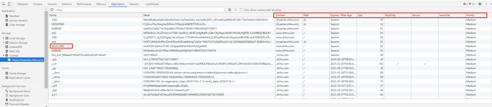
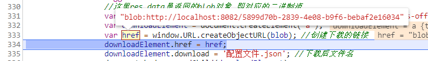

https://github.com/rosie597/practice/commit/71351ac42ca08c3bf2939218655011275bf2b1f1

虾皮算法题

https://syun0216.github.io/Front-end-notes/interview/Shopee1%E9%9D%A2.html

这篇面试题我看过，但是认知不到，找不到对应的比较好的答案

之后遇到找不到答案的面试题，要深挖，递推思考

---

作者：岁月静好42
链接：https://www.nowcoder.com/discuss/119657
来源：牛客网


1、介绍一下自己  

   2、怎么实现继承，写了用那个实例继承的方式，但是被面试官说这个会存在**继承污染**还是什么，换另外的方式来做，就用了Object.create()实现继承  

   3、闭包讲一下  

   4、js的事件模型是什么样的具体讲一下，有什么作用，在什么场景下会使用到。  

   5、e.target和e.currentTerget有什么区别（没回答上来）：其实就是e.target指向触发事件的那个元素。e.currentTarget同未修改指向的this指向一致，指向绑定事件的那个元素  

   6、因为项目当中使用了react-router，就被问了**你知道怎么使用js实现路由功能吗**（不知道，没回答上来）  

**你知道怎么使用js实现路由功能吗**

把之前找个那个笔记复习背下

todo

> 

   7、实现一个斐波那契数列实现输入第n项输出相应的值，优化这个函数，让被查找过的下标值下次再次访问的时候能够立马找到并输出  

   8、**用数组的reduce方法实现数组拍平算法**

todo

**递归**

作者：WX18813292768
链接：https://www.nowcoder.com/discuss/460805
来源：牛客网


shopee[前端]()一面凉经    

​     https://www.nowcoder.com/discuss/379707?type=post&order=create&pos=&page=1    

​     shopee虾皮[前端]()一面凉面筋    

​     https://www.nowcoder.com/discuss/376474?type=post&order=create&pos=&page=1    

​      shopee [前端]()[面经]()     

​      https://www.nowcoder.com/discuss/376308?type=post&order=create&pos=&page=1     

​      shopee春招[前端]()[面经]()     

​      https://www.nowcoder.com/discuss/380419?type=post&order=create&pos=&page=0

---

作者：boygreen
链接：https://www.nowcoder.com/discuss/479590
来源：牛客网


1.一道css/html布局题，就是弹性布局，高度始终是宽度的50%  

**flex手写那些常用属性**

   2.防抖和节流  

   3.经典闭包  

   😀基础：  

   html/css  

   1.**给标签分个类。说到ul、ol有什么区别？dl、dd是什么？**  

   2.flex题，flex: 1（flex：1 1 0）flex：auto（flex：1 1 auto）  

   3  .BFC特性？触发？应用？  

   4.px/rem/em


   JS  

   1.Promise输出  

​    2.**http状态码**    **背的再详细一点**

-  3xx：http/1.0的301、302 和 http/1.1的307、308、303（see other）还有304 
-  4xx：[客户端]()，主要介绍了 400、401和403的区别、405、416 
-  5xx：服务端，主要介绍 502、503、501 

 \3. 介绍[前端]()缓存。如何永久缓存一个资源?协商缓存优先级？etag生成原理（分静态和动态hash）？

作者：boygreen
链接：https://www.nowcoder.com/discuss/479590
来源：牛客网


二面（56min）：  

   1.[项目]()怼了快30min（hhh，主要有个表述不清楚，面试官听得云里雾里）  

   2.**线性结构（[链表]()、数组、栈、队列）区别和应用场景？**  

   3.**引用类型和基础类型？栈变量和堆变量有什么特点（内存大小方面叭应该是）？字符串属于栈变量？**  

   😀手撕：  

   1.**[二叉树]()后序遍历（非递归，需要输入和输出）**  

[复制代码](#)

```
var` `postorderTraversal = ``function``(root) {``  ``// 调用栈``  ``const call = []``  ``const res = []``  ``if` `(root !== ``null``) call.push(root)``  ``while` `(call.length) {``    ``const t = call.pop()``    ``if` `(t !== ``null``) {``      ``call.push(t)``      ``call.push(``null``)``      ``if` `(t.right) call.push(t.right)``      ``if` `(t.left) call.push(t.left)``    ``} ``else` `{``      ``res.push(call.pop().val)``    ``}``  ``}` `  ``return` `res``};
```

 2.**三个三个交换[链表]()结点（稍微修改一下两两反转[链表]()的递归单元就行啦，需要输入输出）** 

[复制代码](#)

```js
var swapPairs = function(head) {``  ``if` `(``    ``head === null ||``    ``head.next === null || ``    ``head.next.next === null``  ``) { ``return` `head }` `  ``const` `next1 = head.next ``  ``const` `next2 = next1.next``  ``const` `temp = next2.next``  ``next2.next = next1``  ``next1.next = head``  ``head.next = swapPairs(temp)``  ``return` `next2
```

---

作者：上上吉
链接：https://www.nowcoder.com/discuss/231686
来源：牛客网


一面 

  大概做了10道题，包括选择填空代码 

  1.http3相关 

  2.**websoket相关** 

  3.跨域相关 

  4.**arguments转数组，用call方法要加个参数怎么做，不懂** 

> ```js
> Array.prototype.slice.call(arguments)
> function arg2arr(){
>   // call后面的参数，是给slice方法的参数，如果另外还需要加参数，如何加，就不能用这种方法对不对，
>   // 用call方法，还要加新的参数，就在已经转成了的数组里面再加新参数
>   // 如果是用...很方便，
>     // var arr = Array.prototype.slice.call(arguments,4,5,6);
>     var arr = Array.from(arguments)
>     console.log(arr);
> }
> arg2arr(1,2,3);
> 一共三种方法，三点是最好加新的参数
> ```

  5.**正则匹配网址** 

`(https?|ftp|file)://[-A-Za-z0-9+&@#/%?=~_|!:,.;]+[-A-Za-z0-9+&@#/%=~_|]`

  6.**compose** 


  大概记得这么多 

  


  二面 20min 

  1.生命周期 

  2.vue的一些新技术 

  3.浏览器新技术 

  4.**兼容怎么做** 

**todo: 新的知识面**

  5.数据结构 使用 

  6.[二叉树]() 

  7.[排序]()

---

作者：乐色
链接：https://www.nowcoder.com/discuss/399887
来源：牛客网


css 

  1、**行内元素跟块级元素有什么区别？** 

## 行内元素和块级元素的区别？

|                           行内元素                           |                       块级元素                       |
| :----------------------------------------------------------: | :--------------------------------------------------: |
|              只可以设置width，不可以设置height               |                可以设置width和height                 |
| 只能设置margin-left,margin-right,padding-left,padding-right，不可以设置top，bottom等元素 |               可以设置margin和padding                |
| 相邻的行内元素会排在同一行，直到一行排不下才会换行，其宽度随内容变化 | 独占一行，在默认情况下，其宽度会自动填满父级元素宽度 |
|                     对应于display:inline                     |                  对应于display:bloc                  |

 2、**BFC** 

> ## 一、常见定位方案
>
> 在讲 BFC 之前，我们先来了解一下常见的定位方案，定位方案是控制元素的布局，有三种常见方案:
>
> - 普通流 (normal flow)
>
> > 在普通流中，元素按照其在 HTML 中的先后位置至上而下布局，在这个过程中，行内元素水平排列，直到当行被占满然后换行，块级元素则会被渲染为完整的一个新行，除非另外指定，否则所有元素默认都是普通流定位，也可以说，普通流中元素的位置由该元素在 HTML 文档中的位置决定。
>
> - 浮动 (float)
>
> > 在浮动布局中，元素首先按照普通流的位置出现，然后根据浮动的方向尽可能的向左边或右边偏移，其效果与印刷排版中的文本环绕相似。
>
> - 绝对定位 (absolute positioning)
>
> > 在绝对定位布局中，元素会整体脱离普通流，因此绝对定位元素不会对其兄弟元素造成影响，而元素具体的位置由绝对定位的坐标决定。
>
> ## 二、BFC 概念
>
> Formatting context(格式化上下文) 是 W3C CSS2.1 规范中的一个概念。它是页面中的一块渲染区域，并且有一套渲染规则，它决定了其子元素将如何定位，以及和其他元素的关系和相互作用。
>
> 
>
> 那么 BFC 是什么呢？
>
> BFC 即 Block Formatting Contexts (块级格式化上下文)，它属于上述定位方案的普通流。
>
> **具有 BFC 特性的元素可以看作是隔离了的独立容器，容器里面的元素不会在布局上影响到外面的元素，并且 BFC 具有普通容器所没有的一些特性。
> **
>
> 通俗一点来讲，可以把 BFC 理解为一个封闭的大箱子，箱子内部的元素无论如何翻江倒海，都不会影响到外部。
>
> ## 三、触发 BFC
>
> 只要元素满足下面任一条件即可触发 BFC 特性：
>
> - body 根元素
> - 浮动元素：float 除 none 以外的值
> - 绝对定位元素：position (absolute、fixed)
> - display 为 inline-block、table-cells、flex
> - overflow 除了 visible 以外的值 (hidden、auto、scroll)

  1、**用数组的reduce方法实现数组拍平算法**

```js
const flat = arr => {
  return arr.reduce((pre, cur) => {
    return pre.concat(Array.isArray(cur) ? flat(cur) : cur);
  }, []);
};
```

  2、怎么判断类型(typeof和instanceof)？ 

  3、let/const和var的区别 

  4、怎么理解闭包？有没有用到闭包 

  5、给了三段代码看输出结果(对象this，事件循环输出，原型) 

  6、跨域问题 

  vue 

  1、组件怎么进行通信？ 

  1、怎么进行双向数据绑定？ 

  2、有没有了解过虚拟DOM？ 

  3、v-for中key的作用？ 

  浏览器 

  1、http2.0以及跟http1.1的区别  背

  2、缓存机制

---

作者：土拨鼠201902151816582
链接：https://www.nowcoder.com/discuss/399783
来源：牛客网


HTTPS 

 事件委托 

 事件循环 

 new instanceof 

 判断数据的类型 

 闭包 

 数据存储类型 

 父子组件通信 

 vue数据绑定 

 数据响应式 

 cookie localstorage sessionstorage 

 同源限制，跨域问题 

 CSRF 

 Computed和watch 

 CDN

----

script标签中async和defer（现在已经会了）

**CDN原理**（知道那个意思，每次都不知道怎么回答，下去好好看看）

估计得突破下这个

httpOnly、sameSite字段，**客户端能设置httpOnly吗**

> HttpOnly是包含在Set-Cookie **HTTP响应头文件中的附加标志**。生成cookie时使用HttpOnly标志有助于降低客户端脚本访问受保护cookie的风险（如果浏览器支持）。
>
> 不可以

**a.com中能拿到b.com中的设置的localStorage吗**
**cookie有什么用？cookie一般会存放什么**




----

作者：LouisDewey
链接：https://www.nowcoder.com/discuss/404892
来源：牛客网


**4.ajax请求时，上传5M数据，服务端返回10M数据，一个页面有三条并行请求，为了用户体验，怎么知道当前用户进度百分比？（只说了一小点思路）** 

面试官的意思貌似是三条并行的请求，1条在上传5m数据，两条在下载5m数据相关的

> onprogress时间
>
> ```js
> xhr.upload.onprogress = function (event) {
>   if (event.lengthComputable) {
>     var percent = Math.floor(event.loaded / event.total * 100) ;
>     // 设置进度显示
>     $("#J_upload_progress").progress('set progress', percent);
>   }
> };
> ```
>
> 文件下载显示进度条
>
> 下载进度事件也是onprogress事件
>
> `var percent = (evt.loaded/evt.total)*100;`
>
> http://blog.beifengtz.com/article/23

a标签下载二进制文件

> ```js
> let instance = axios.create({ responseType: 'blob'});
>                 instance.get(exportUrl + '/product_model/tag/export',{params:{groupId:groupId,condition:this.searchValue}})
>                     .then(res =>{
>                         //这里res.data是返回的blob对象,即对应的二进制流
>                         var blob = new Blob([res.data], {type: 'application/vnd.openxmlformats-officedocument.spreadsheetml.sheet;charset=utf-8'}); //application/vnd.openxmlformats-officedocument.spreadsheetml.sheet这里表示xlsx类型
>                         var downloadElement = document.createElement('a');
>                         var href = window.URL.createObjectURL(blob); //创建下载的链接
>                         downloadElement.href = href;
>                         downloadElement.download = '导出测点表.xls'; //下载后文件名
>                         document.body.appendChild(downloadElement);
>                         downloadElement.click(); //点击下载
>                         document.body.removeChild(downloadElement); //下载完成移除元素
>                         window.URL.revokeObjectURL(href); //释放掉blob对象
>                     }).catch(err =>{
>                         this.$message.error('当前没有数据');
>                 })
> ```
>
> `var href = window.URL.createObjectURL(blob); `
>
> 创建一个当前内存文件，变成一个字符串下载连接，然后可以通过a标签下载
>
> 

  5.options预检 

  **6.假设浏览器上有一个页面，页面上有一个列表，我想向列表中插入1000个Dom元素，for循环1000次，每次插入一个，发现性能方面的问题，怎么优化（只说了一种方法，面试官说还有其他方法QAQ）**

>  var fragment = document.createDocumentFragment()

2.**有一个对象，有什么方法能够遍历它自身的属性，而不是原型链的属性（只说了一种方法QAQ）**

>  Object.keys()
>
> for in
>
> `**hasOwnProperty()**` 方法会返回一个布尔值，指示对象自身属性中是否具有指定的属性（也就是，是否有指定的键）。
>
> **`Object.getOwnPropertyNames()`**方法返回一个由指定对象的所有自身属性的属性名（包括不可枚举属性但不包括Symbol值作为名称的属性）组成的数组。
>
> 这个不要用，不可枚举变量
>
> 所以现在就是两种方法：Object.keys()   还有 for in hasOwnProperty()来实现对象的遍历


其他就要过滤


作者：风的记忆
链接：https://www.nowcoder.com/discuss/404892
来源：牛客网

其实我都没有听懂面试官老哥到底想表达什么意思（面试官的意思貌似是三条并行的请求，1条在上传5m数据，两条在下载5m数据相关的），我就答了答ajax上传相关的东西还有HTML5的progress标签，还有下载相关的API，其他的我也不知道了

---

作者：公孙月
链接：https://www.nowcoder.com/discuss/465904
来源：牛客网

\2. 

  输入： 

  dateFormat(new Date('2020-12-01'), 'yyyy/MM/dd') // 2020/12/01 

  dateFormat(new Date('2020-04-01'), 'yyyy/MM/dd') // 2020/04/01 

  dateFormat(new Date('2020-04-01'), 'yyyy年MM月dd日') // 2020年04月01日 

  写一个日期格式化函数 

  const dateFormat = (dateInput, format)=>{} 

  3.冒泡[排序]()手写和优化

---

6.响应式布局 rem
7.mvm和mvvm的区别和应用场景
**8.this.$prop和this.$options的区别**

this.$options

用于当前 Vue 实例的初始化选项。需要在选项中包含自定义 property 时会有用处：

this.$prop

当前组件接收到的 props 对象。Vue 实例代理了对其 props 对象 property 的访问。

new Vue的时候传了一个对象，把该对象记为options，Vue将options中自定义的属性和Vue构造函数中定义的属性合并为vm.$options，vm.$options.data()中的this指向vm.$options，而methodA和B并没有直接挂在vm.$options下，所以this.methodA和this.B为undefined。

创建实例会有的属性，问题就是通过vm.$options.data()拿到的属性中，如果里面的复制语句有this，会出现this不对情况，因为当前this是vm.$options.，而不是当前vue实例

---

作者：维在小腐
链接：https://www.nowcoder.com/discuss/463919
来源：牛客网


### 二面    

 1.自我认识，优缺点 

 2.介绍一下react 

 3.diff[算法]() 

 4.HTTP2的特性 

 5.常用状态码 

 6.**304是多好还是少好（应该是少好）** 

 7.**用户反应按钮点不了，怎么处理** 

 8.下次要怎么处理（提示了性能，安全） 

 9.性能优化方式 

 8.**（上面提到了requestAnimationframe）requestAnimationframe为什么能实现性能优化** 

   **9.requestAnimationframe是在什么时候执行，在什么时候之前（浏览器重绘），什么时候之后（不太清楚，提示了它属于宏任务）**

这个也要突破，这两个都是网上资料很少，没讲清除的地方

----

作者：牛客693422167号
链接：https://www.nowcoder.com/discuss/489440
来源：牛客网


1.**屏幕里面内容未占满的时候footer固定在屏幕可视区域的底部。占满的时候显示在网页的最底端**。 

  \2. 

  function foo() {  
   console.log( this.a );  
  }  

  function doFoo() {  
   foo();  
  }  

  var obj = {  
   a: 1,  
   doFoo: doFoo  
  };  

  var a = 2;   
  obj.doFoo() 

  


  \3. 

  var F = function(){};  

  Object.prototype.a = function(){};  

  Function.prototype.b = function(){};  

  var f = new F();  

  // f能不能拿到a方法和b方

9.vue 父组件跟子组件的created跟mounted钩子的触发顺序

14**.当线上出现一个测试环境无法复现的bug，怎么定位？**

----

作者：阔诺dio哒
链接：https://www.nowcoder.com/discuss/511285
来源：牛客网

一面： 
 面试官上来先介绍了一下面试流程，介绍了一下公司，老亚撒西了，感觉不那么紧张了 
 \1. 自我介绍，之前实习的时候干了什么 
 \2. 如何学习[前端]()的，
 \3. 为什么选择做[前端]()
 \4. 熟悉react？对react的理解，为什么框架会更好 
 \5. 为什么用hook，好处，和有状态组件的对比 
 \6. next.js 服务端渲染相关的东西（[项目]()中有用到）
 \7. 搭建博客到部署需要哪些阶段 
 \8. [leetcode]()611 **求数组中能组成三角形的个数**
 写了十几二十分钟？[leetcode]()上有题解，代码就不放了。
 面试官：一般人都用三重暴力循环 
 我：我一开始也是写了三个循环嘛，可是写了你也会让我优化的。这个和之前做的三数之和是差不多思路 
 面试官：（笑） 
 感觉自己的一面更多是唠嗑，不太会表达，但是面试官总是能抓住回答的关键词，然后说，你说的是那个xxx对吧，我就嗯嗯嗯对！老亚撒西了。 
 一面主要唠实习，还有[项目]()，以及框架的一些理解之类的。

 二面： 
 二面相比一面就比较中规中矩 
 \1. 进程和线程 进程通信 
 \2. 操作系统打开一个浏览器页面发生了什么（还以为他要问输入URL返回页面那个经典题，应该从一个页面是一个进程，然后多个线程，比如js线程，GUI线程，它们之间的关系之类的？ 
 \3. 不用object如何存储键值对 
 \4. 快排 介绍 时间复杂度 最好 最坏 怎么算的 优化 
 \5. 栈和队列 
 \6. 原型链 介绍 
 给arr让你写原型链，还问了一些别的 
 \```javascript 

  arr=[] 

  arr.__proto__==Array.prototype 

  Array.prototype.__proto__==Object.prototype 

  Object.prototype.__proto__==null 

  Array.__proto__==Function.prototype 

  Function.__proto__==Function.prototype 

  \``` 

  \7. **三栏布局 left(100px) | middle(自适应) | right(200px) float/flex/grid** 

  \8. 接上 绝对定位和相对定位 

  \9. 闭包 介绍 手写 

  \10. 手写 call 

  


  反问： 

  对[前端]()未来发展的前景怎么看 


  怎么问这么高深的问题 

  为什么要从事[前端]()？ （此处省略十分钟，大概内容是他说他前后端都做过，觉得逻辑重复，比较枯燥，不太喜欢。聊了serverless，未来的发展方向等） 

----

作者：HighwaytoHell
链接：https://www.nowcoder.com/discuss/511168
来源：牛客网


# shopee 

   一面凉：  

 **script直接插入 会执行吗**    （问题深挖）

> 原来是因为浏览器对动态插入的script标签，默认设置的是`async`。（各浏览器有区别）
>
> 我们知道`async`作用的js脚本时没有顺序的，**异步加载，加载后执行**。
>
> 因此特性，所以还有个`defer`，`defer`**是异步加载，按script在文档中的顺序执行。**
>
> 通过`createDocumentFragment`创造文档片段，然后一次插入，这样浏览器该知道顺序了吧。
>
> 但是结果依旧没变。猜想错误！
>
> 由截图可见，网络请求顺序是按照script插入的顺序，先插入到dom的先请求，但是请求时间不一样，test2比test1的请求时间短，内容先返回。看现象貌似结论是：**资源加载完成时执行，因此资源加载先完成的先执行**
>
> 我们都知道如果是非动态插入的script，是按照在html里出现的顺序执行的，但是现在动态插入的脚本，虽然先插入的script位于html的前面，后插入的在后面，但是执行顺序却没有按这个顺序来。
>
> 是不是因为浏览器不知道在一个script标签插入后还有没有下一个要插入，所以没法按顺序执行呢？那么我们一次性插入这2个标签会怎样？
>
> 总结： 写在html中的script静态的，是按顺序异步加载，然后加载完成之后，按顺序执行
>
> 动态的script，默认的属性是`async`，异步加载，先加载完先执行，
>
> 如果要让顺序相同，就要设置`async`==false

> 上面的只提供了思路，没有说准备
>
> 
>
> <script src="script.js"></script>

没有 defer 或 async，浏览器会立即加载并执行指定的脚本，“立即”指的是在渲染该 script 标签之下的文档元素之前，也就是说不等待后续载入的文档元素，读到就加载并执行。

<script async src="script.js"></script>

有 async，加载和渲染后续文档元素的过程将和 script.js 的加载与执行并行进行（异步）。

<script defer src="myscript.js"></script>

有 defer，加载后续文档元素的过程将和 script.js 的加载并行进行（异步），但是 script.js 的执行要在所有元素解析完成之后，DOMContentLoaded 事件触发之前完成。

> 默认不是异步的，动态创建的script，是异步下载，中断当前dom构建来实现的
>
> 关闭，之后虽然表现和defer一样，但是如果这个script不是在文档最后，**而是在中间，就会不一样**


1.  长连接一直保持不浪费网络资源吗（没答上来。[keep]()-alive也是有时间的。） 

从图中可以发现一个完整的HTTP事务，有链接的建立，请求的发送，响应接收，断开链接这四个过程,早期通过HTTP协议传输的数据以文本为主，一个请求可能就把所有要返回的数据取到，但是，现在要展现一张完整的页面需要很多个请求才能完成，如图片,JS,CSS等，如果每一个HTTP请求都需要新建并断开一个TCP，这个开销是完全没有必要的。

 

开启HTTP Keep-Alive之后，能复用已有的TCP链接，当前一个请求已经响应完毕，服务器端没有立即关闭TCP链接，而是等待一段时间接收浏览器端可能发送过来的第二个请求，通常浏览器在第一个请求返回之后会立即发送第二个请求，如果某一时刻只能有一个链接，同一个TCP链接处理的请求越多，开启KeepAlive能节省的TCP建立和关闭的消耗就越多。

 

当然通常会启用多个链接去从服务器器上请求资源，但是开启了Keep-Alive之后，仍然能加快资源的加载速度。HTTP/1.1之后默认开启Keep-Alive, 在HTTP的头域中增加Connection选项。当设置为Connection:keep-alive表示开启，设置为Connection:close表示关闭。实际上HTTP的KeepAlive写法是Keep-Alive，跟TCP的KeepAlive写法上也有不同。所以TCP KeepAlive和HTTP的Keep-Alive不是同一回事情。

> keep-alive是http层面的，表示复用之前的tcp连接，
>
> Connection请求字段

总结: (不考虑keepalive)

http1.0  

带content-length，body长度可知，客户端在接收body时，就可以依据这个长度来接受数据。接受完毕后，就表示这个请求完毕了。客户端主动调用close进入四次挥手。

不带content-length ，body长度不可知，客户端一直接受数据，直到服务端主动断开

 

http1.1

带content-length            body长度可知   客户端主动断开

带Transfer-encoding：chunked    body会被分成多个块，每块的开始会标识出当前块的长度，body就不需要通过content-length来指定了。但依然可以知道body的长度 客户端主动断开

不带Transfer-encoding：chunked且不带content-length     客户端接收数据，直到服务端主动断开连接。


> 没有keepalive的时候，就是发送数据的一放主动断开

二、长连接的过期时间

  客户端的长连接不可能无限期的拿着，会有一个超时时间，服务器有时候会告诉客户端超时时间，譬如：


 

   上图中的Keep-Alive: timeout=20，表示这个TCP通道可以保持20秒。另外还可能有max=XXX，表示这个长连接最多接收XXX次请求就断开。对于客户端来说，如果服务器没有告诉客户端超时时间也没关系，服务端可能主动发起四次握手断开TCP连接，客户端能够知道该TCP连接已经无效；另外TCP还有心跳包来检测当前连接是否还活着，方法很多，避免浪费资源。

三、长连接的数据传输完成识别

  使用长连接之后，客户端、服务端怎么知道本次传输结束呢？两部分：1是判断传输数据是否达到了Content-Length指示的大小；2动态生成的文件没有Content-Length，它是分块传输（chunked），这时候就要根据chunked编码来判断，chunked编码的数据在最后有一个空chunked块，表明本次传输数据结束。更细节的介绍可以看[这篇文章](http://www.cnblogs.com/skynet/archive/2010/12/11/1903347.html)。

> 长连接，可以设置过期时间，也是支持根据数据长度来判断是否断开链接，也可以通过心跳包来判断，是否断开连接

**xss的反射型具体是如何做到的。xss恶意代码获取到cookie之后能干嘛，能做csrf攻击吗** 

能做到，拿到cookie信息，可以尝试做csrf攻击

**todo: xss原理**下午看，现在很累，有点疲倦


这个要再多多理解下


深入理解这个（灵魂发问妈呀）


**浏览器css选择器为什么是从右往左匹配的。**

试想一下，如果采用 left-to-right 的方式读取css规则，那么大多数规则读到最后（最右）才会发现是不匹配的，这样会做费时耗能，最后有很多都是无用的；而如果采取 right-to-left 的方式，那么只要发现最右边选择器不匹配，就可以直接舍弃了，避免了许多无效匹配。

显而易见，right-to-left 比 left-to-right 的无效匹配次数更少，从而匹配快、性能更优，所以目前主流的浏览器基本采取right-to-left的方式读取css规则

**避免很多无效匹配**

要深入原理，深入理解

---

作者：一条池子里的鱼
链接：https://www.nowcoder.com/discuss/477389
来源：牛客网

\## 虾皮一面 
 \+ 进程与线程 
 \+ **为什么打开一个tab页面就是一个进程** 
 \+ **进程之间会互相影响吗** 
 \+ 一个tab页面崩溃会不会影响其它tab页面 
 \+ [排序]()[算法]()有什么
 \+ **快速[排序]()空间复杂度，时间复杂度，快速[排序]()的结束条件，最优最差时间复杂度的情况**
 \+ **var,let,const的差别** 
 \+ **什么时候会挂载到window** 
 \+ 函数作用域，变量保存在哪里 
 \+ 作用域有哪些 
 \+ **作用域的理解，最终的作用域** 
 \+ **作用域链什么时候确定的** 
 \+ 执行上下文 
 \+ new 操作符 
 \+ call与apply的区别 
 \+ **一个页面里有一个同源的frame，如何通信（postmessage?cookie?还有吗？）** 
 \+ 跨域，什么受到跨域限制（cookie,请求） 
 a.baidu.com b.baidu.com 是跨域吗 
 baidu.com#a, baidu.com#b 是跨域吗 
 a.baidu.com可以用baidu.com的接口吗 
 \+ 重绘与回流，如何优化(.class, 脱离文档流，先把元素隐藏改变再隐藏) 
 \+ **margin重叠，如何解决（BFC,padding,border,分别套一个div）** 
 \+ **float消除，伪元素加在哪里** 
 \+ **flex布局的缺点，IE浏览器不兼容怎么处理** 
 \+ 常见的网络协议 
 \+ **报文结构** 
 \+ HTTPS三次握手，如何印证数字证书，HTTPS如何劫持，获取虚假数字证书给服务端发送信息 
 \+ 高阶组件，优点，为什么要用高阶组件 
 \+ 组件通信 

  \+ 字符串反转 

  会要求提供尽可能多的解决方案 


******
 \## 虾皮二面 
 \+ **position的值，position:fixed失效原因** 
 \+ 判断数据类型的方法 
 \+ 数据类型有哪些 
 \+ **去除字符串开始与结束位置的空格** 
 \+ 两数之和 
 \+ **列表转换树形结构** 
 \+ react生命周期 
 \+ react的路由 
 \+ react-router 
 \+ [前端]()工程化
 \+ CSPF 
 \+ react性能优化 
 \+ **rem的原理** 
 \+ **为什么不能全部设置为base64** 
 \+ 性能优化 

  \+ 渲染的流程

-----

不想那么多了，先把要学的计划都学好，