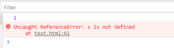

#### 虾皮

虾皮通过一个同学内推的，面的金融部门

虾皮都是qq视频面试+腾讯文档word写代码

一面 周二早上

#### http 302 301 307之间的区别

在这里总结一下，从实际效果看：302 允许各种各样的重定向，一般情况下都会实现为到 GET 的重定向，但是不能确保 POST 会重定向为 POST；而 303 只允许任意请求到 GET 的重定向；307 和 302 一样，除了不允许 POST 到 GET 的重定向。

307为临时重定向，注意划红线的部分，如果重定向307的原请求不是get或者head方法，那么浏览器一定不能自动的进行重定向，即便location有url，也应该忽略。

在HTTP 1.0的时候，**302的规范是原请求是post不可以自动重定向**，但是服务器和浏览器的实现是运行重定向。

302规范是只重定向get和head请求

但是实现确实都会重定向，

**http1.0则是让303实现了302的实现，都可以重定向，但是307实现了规范，除了head和get，其他方法不能重定向**

  把HTTP 1.0规范中302的规范和实现拆分开，分别赋予HTTP 1.1中303和307，因此在HTTP 1.1中，303继承了HTTP 1.0中302的实现（即原请求是post，也允许自动进行重定向，结果是无论原请求是get还是post，都可以自动进行重定向），而307则继承了HTTP 1.0中302的规范（即如果原请求是post，则不允许进行自动重定向，结果是post不重定向，get可以自动重定向）。

**301 308（不能改变请求方法）**

#### 301和302对于seo来说哪个更好 (301)

301，会继承原地址seo的成果

SEO（搜索引擎优化）中提到一点：如果我们把一个地址采用301跳转方式跳转的话，搜索引擎会把老地址的PageRank等信息带到新地址，同时在搜索引擎索引库中彻底废弃掉原先的老地址


使用301表示永久性跳转，如果A页面已经被搜索引擎收录了，那么搜索引擎会知道以后再也没有A页面这个页面了，它已经转移到B页面上去了，搜索引擎会把原来对于A页面的排名权重转移到B页面上去，平稳过渡，然后在搜索引擎的数据库中删除A页面，替换成B页面。

使用302表示暂时性跳转，302与301的区别在于，搜索引擎的数据库不会删除A页面，但仍会增加B页面。

(302会浏览器浏览记录会算在b上，并给b建立索引)

从表面上看，302比301更友好，但因为302是暂时性跳转的含义，如果被用来做长期跳转，搜索引擎就会认为这是网站在利用302跳转转移A页面的权重，为B页面作弊，就会给予网站惩罚。由于搜索引擎对于跳转时间判断规则的不确定，因此不建议使用302跳转。

Google一直强调使用301，而不要用302。

#### 跨域是什么、如何解决


#### jsonp有什么缺点

只能发送get请求

2.1它**只支持GET请求而**不支持POST等其它类型的HTTP请求
        2.2它只支持跨域HTTP请求这种情况，不能解决不同域的两个页面之间如何进行JavaScript调用的问题。
        2.3 **jsonp在调用失败的时候不会返回各种HTTP状态码。**
        2.4**缺点是安全性。万一假如提供jsonp的服务存在页面注入漏洞，即它返回的javascript的内容被人控制的**。那么结果是什么？所有调用这个 jsonp的网站都会存在漏洞。于是无法把危险控制在一个域名下…所以在使用jsonp的时候必须要保证使用的jsonp服务必须是安全可信的。

todo：如何跨域操作cookie

#### 图片base64和外链的应用场景，各有什么优缺点(base64减少请求数，但是会增加额外的体积)

base64减少请求数，但是会增加额外的体积

#### http缓存机制


#### https的握手过程是怎样的


#### set/map的区别

set一个不能重复的元素集合

key-value形式的键值对集合，其中key是set形式，不能重复

#### hook的局限性

todo不明白

#### setState和hook的区别

useState

`const [count, setCount] = useState()` 的原因。这与 class 里面 `this.state.count` 和 `this.setState` 类似，唯一区别就是你需要成对的获取它们。

todo

#### decorator的作用，编译后是怎样的(@decorator -> decorator(target)...)

类就是用方法包裹，修饰类的属性，就Object.definePropoty

Decorator 的原理和作用则更为简单，就是包装对象，然后返回一个新的对象描述（descriptor），其作用也非常单一简单，基本上就是获取包装对象的宿主、键值几个有限的信息。

如何将 Decorator 这个特性应用于数据定义层，实现一些类似于类型检查、字段映射等功能。

```js
// decorator 外部可以包装一个函数，函数可以带参数
function Decorator(type){
    /**
     * 这里是真正的 decorator
     * @target 装饰的属性所述的类的原型，注意，不是实例后的类。如果装饰的是 Car 的某个属性，这个 target 的值就是 Car.prototype
     * @name 装饰的属性的 key
     * @descriptor 装饰的对象的描述对象
     */
    return function (target, name, descriptor){
        // 以此可以获取实例化的时候此属性的默认值
        let v = descriptor.initializer && descriptor.initializer.call(this);
        // 返回一个新的描述对象，或者直接修改 descriptor 也可以
        return {
            enumerable: true,
            configurable: true,
            get: function() {
                return v;
            },
            set: function(c) {
                v = c;
            }
        }
    }
}
```

todo:还要更详细了解

#### symbol是什么，一般用来做什么（枚举，私有属性）

Symbol 的用途就是如此：Symbol 可以创建一个独一无二的值（但并不是字符串）。

用 Symbol 来改写上面的 race：

```text
var race = {
  protoss: Symbol(),
  terran: Symbol(),
  zerg: Symbol()
}

race.protoss !== race.terran // true
race.protoss !== race.zerg // true
```

你也可以给每个 Symbol 起一个名字：

```text
var race = {
  protoss: Symbol('protoss'),
  terran: Symbol('terran'),
  zerg: Symbol('zerg')
}
```

不过这个名字跟 Symbol 的值并没有关系，你可以认为这个名字就是个注释。如下代码可以证明 Symbol 的名字与值无关：

```js
var a1 = Symbol('a')
var a2 = Symbol('a')
a1 !== a2 // true
```

Symbol 生成一个全局唯一的值。（枚举）

### 私有属性

由于没有访问限制，JavaScript 曾经有一个惯例：私有属性以下划线起始来命名。 这样不仅无法隐藏这些名字，而且会搞坏代码风格。 可以利用 Symbol 来隐藏这些私有属性：

```js
let speak = Symbol('speak')
class Person {
    [speak]() {
        console.log('harttle')
    }
}
```

如下几种访问都获取不到 `speak` 属性：

```
let p = new Person()

Object.keys(p)                      // []
Object.getOwnPropertyNames(p)       // []
for(let key in p) console.log(key)  // <empty>
```

但 Symbol 只能隐藏这些函数，并不能阻止未授权访问。 仍然可以通过 `Object.getOwnPerpertySymbols()`, `Reflect.ownKeys(p)` 来枚举到 `speak` 属性。

如何写私有属性

1，闭包

2，闭包+symbol


但是还是能遍历出来，


#### csrf 是什么 如何防范

1. Get 请求不对数据进行修改
2. 不让第三方网站访问到用户 Cookie
3. 阻止第三方网站请求接口
4. 请求时附带验证信息，比如验证码或者 token

**验证码校验token**

#### SameSite （csp，精确控制那些资料的src能访问）

可以对 Cookie 设置 `SameSite` 属性。该属性设置 Cookie 不随着跨域请求发送，该属性可以很大程度减少 CSRF 的攻击，但是该属性目前并不是所有浏览器都兼容

#### sql注入是什么，如何防范

sql预编译转义

严格的参数校验

#### react 调用setState之后发生了什么

setState是异步的,react通常会集齐一些组件后一起更新组件，以保证性能。所以当我们在设置setState后，立即通过this.state是获取最新状态是获取不到的。如果要获取最新的状态可以在setState回调中获取。


#### nodejs事件循环机制

```
   ┌───────────────────────┐
┌─>│        timers         │
│  └──────────┬────────────┘
│  ┌──────────┴────────────┐
│  │     I/O callbacks     │
│  └──────────┬────────────┘
│  ┌──────────┴────────────┐
│  │     idle, prepare     │
│  └──────────┬────────────┘      ┌───────────────┐
│  ┌──────────┴────────────┐      │   incoming:   │
│  │         poll          │<─────┤  connections, │
│  └──────────┬────────────┘      │   data, etc.  │
│  ┌──────────┴────────────┐      └───────────────┘
│  │        check          │
│  └──────────┬────────────┘
│  ┌──────────┴────────────┐
└──┤    close callbacks    │
   └───────────────────────┘
复制代码
```

-  \1. **`timers` 阶段**: 这个阶段执行 `setTimeout(callback)` 和 `setInterval(callback)` 预定的 callback;
-  \2. **`I/O callbacks` 阶段**: 此阶段执行某些系统操作的回调，例如TCP错误的类型。 例如，如果TCP套接字在尝试连接时收到 ECONNREFUSED，则某些* nix系统希望等待报告错误。 这将操作将等待在==I/O回调阶段==执行;
-  \3. **`idle, prepare` 阶段**: 仅node内部使用;
-  \4. **`poll` 阶段**: 获取新的I/O事件, 例如操作读取文件等等，适当的条件下node将阻塞在这里;
-  \5. **`check` 阶段**: 执行 `setImmediate()` 设定的callbacks;
-  \6. **`close callbacks` 阶段**: 比如 `socket.on(‘close’, callback)` 的callback会在这个阶段执行;

对于日常开发来说，我们比较关注的是timers、I/O callbacks、check阶段。node和浏览器相比一个明显的不同就是**node在每个阶段结束**后会去执行所有microtask任务。对于这个特点我们可以做个试验：**同步任务完成后也会执行完成所有的微任务**

**事实证明，process.nextTick的优先级会比promise.then高。**

#### pm2的原理，有哪些模式(cluster fork)

**这样就可以启动你的Node.js服务，并且根据你的电脑CPU个数去启动相应的进程数，监听到错误事件，自带重启子进程，即使更新了代码，需要热更新，也会逐个替换，号称永动机。**

？？？？？

todo：完全没有接触过啊

https://segmentfault.com/a/1190000021230376

放最后看

#### docker和k8s有了解多少(k8s听过没用过)


todo：放最后看，完全没有没有接触过

#### 移动端端一个元素拖动，如何实现和优化（节流、改变位置）

[Vue.Draggable](https://github.com/SortableJS/Vue.Draggable) 用的是这个，，可以监听html5中的拖动事件，为要拖动的元素添加让一个元素被拖动需要添加 `draggable` 属性，再加上全局事件处理函数[`ondragstart`]

获取移动的位置信息，然后就用css的transform属性来实现移动div，添加过渡动画

优化：就对每次move操作加节流，再加些交互友好的东西

#### `for in`/`for of` 看代码输出

**continue** 语句用来跳出本次循环，但会继续执行后面的循环。
**break** 语句用来结束循环，后面的循环不会再执行。
⚠️**return** 并不能用来跳出for循环，return语句只能出现在函数体内，它会终止函数的执行，并返回一个指定的值。

for...in语句以任意顺序遍历一个对象的可枚举属性

#### for...in可以遍历可枚举但对象，本身及原型链上的都会遍历出来，

```js
const obj = {a:1, b:2, c:3};
Object.defineProperty(obj, 'd', {value: 4, enumerable: false})
obj.__proto__ = {name: 'ricky', age: '25'}

console.log(obj)

console.log('=====for in=======')
for (var prop in obj) {
  console.log(prop, obj[prop]);
}
console.log('=====Object.keys=======')
console.log(Object.keys(obj))
console.log('=====Object.getOwnPropertyNames=======')
console.log(Object.getOwnPropertyNames(obj))
console.log('=====Object.values=======')
console.log(Object.values(obj))
console.log('=====Object.entries=======')
console.log(Object.entries(obj))
复制代码
```

**输出结果**


**Object.getOwnPropertyNames**这个会遍历出不可枚举的属性包括自己的属性，其他都没有，for in也不会，但是原型链上的都会，但是内置的Object array number不会

for in会遍历原型链


for of循环可迭代对象（包括 Array，Map，Set，String，TypedArray，类数组的对象（比如arguments对象、DOM NodeList 对象）、以及Generator生成器对象等）。

### for of(es6) 循环可迭代对象

for of循环可迭代对象（包括 Array，Map，Set，String，TypedArray，类数组的对象（比如arguments对象、DOM NodeList 对象）、以及Generator生成器对象等）。

```
const array = [{a: 1}, {b: 2}, {c: 3}];
array.name = 'ricky';

console.log(array)
console.log('=====for of=======')
for (var prop of array) {
  console.log(prop);
}
console.log('=====for in=======')
for (var prop in array) {
  console.log(prop);
}
复制代码
```


#### for of 与 for in 不同处

1. **与for in不同的是，for of不能循环普通对象({key: value})**
2. **for of不会将循环对象中自定义的属性内容循环出来**
3. **for in 是遍历键名(key或index)，而for of是遍历键值(value)。**


#### 几道看代码说输出（忘了具体题目了）


todo：看代码输出的肯定要弄出来

#### 描述链表的反转怎样实现，复杂度多少

两个指针，一个tmp来保留中间节点

```
    ListNode nextTemp = curr.next;
    curr.next = prev;
    prev = curr;
    curr = nextTemp;
```


o（n），两个个指针

编程

#### 实现`instanceOf`

**`target.__proto__;`==`origin.prototype`递归调用**

```js
function myInstanceof(target, origin) {
  const proto = target.__proto__;
  if (proto) {
    if (origin.prototype === proto) {
      return true;
    } else {
      return myInstanceof(proto, origin)
    }
  } else {
    return false;
  }
}
function People() {
  this.type = 'prople'
}
function Man(name) {
  People.call(this);
}

Man.prototype = Object.create(People.prototype, {
  constructor: {
    value: Man
  }
})
```
#### 实现一个对象被`for of`遍历

for in可以遍历对象，但是会遍历原型链上

for in遍历的是key for of遍历是value

**for of 用来遍历含有Symbol.iterator属性的对象**，数组，setmap都可以

所以就是让这个对象实现symbol的迭代器

```js
仔细看一下发现就会发现 Symbol.iterator 接口其实是一个 Generator 函数，那么就可以简化代码：
newObj[Symbol.iterator] = function* (){
    let keys = Object.keys( this );
    
    for(let i = 0, l = keys.length; i < l; i++){
        yield this[keys[i]];
    }
}

for(let v of newObj){
    console.log( v );
}
```

#### 实现链表的添加、删除。复杂度多少

```
单向链表要删除某一节点时，必须要先通过遍历的方式找到前驱节点（开发中大致分为两种删除方式:1.通过待删除节点序号2.按值查找）。若仅仅知道待删除节点，是不能知道前驱节点的，故单链表的增删操作复杂度为O(n)。
双链表（双向链表）知道要删除某一节点p时，获取其前驱节点q的方式为 q = p->prior，不必再进行遍历。故时间复杂度为O(1)。而若只知道待删除节点的序号，则依然要按序查找，时间复杂度仍为O(n)。
单、双链表的插入操作，若给定前驱节点，则时间复杂度均为O(1)。否则只能按序或按值查找前驱节点，时间复杂度为O(n)。
至于查找，二者的时间复杂度均为O(n)。 对于最基本的CRUD操作，双链表优势在于删除给定节点。但其劣势在于浪费存储空间（若从工程角度考量，则其维护性和可读性都更低）。
双链表本身的结构优势在于，可以O(1)地找到前驱节点，若算法需要对待操作节点的前驱节点做处理，则双链表相比单链表有更加便捷的优势。
```


一面考的都是一些基础知识，需要一定牢固的基础知识准备才行

二面 时间 一面之后的下午

#### 给了两段效果上都可以实现child 继承 parent，细节上的差别

  ```js
  function child(){}
  function parent(){}
  child.prototype.__proto__ = parent.prototype ()（父类的属性，不是子类各独有一份，而是互相影响）
  child.prototype = new parent()  （父类属性，不是子类独有一份，并且覆盖了子类的构造器）
  ```

todo：这道题好难啊，目前看出来的就是，最后一个将new parent（）直接赋值给了child.prototype。覆盖了child的constutor

console.log(a1.c) // 拿不到，父类的变量（第一个拿不到父类的属性），两个都能拿到父类原型上的方法

所以，第二种继承更好，能拿到父类的属性，能拿到父类的方法

**但是覆盖了子类的构造器函数**

todo：非常好的继承，还有原型链指向问题

还需要在上面多多加点属性测试，在把网上已有的继承实例进行比较

> 继承，原型链，复习
>
> todo：
>
> 综下比较：第一种少了，在child里面调用父类构造函数，少了`child.prototype.constuctor = Child`（**不用，构造器没有任何问题**，下面那个寄生组合继承完全没有必要，**只需要在子类里面调用父类构造器，拥有父类的变量**）
>
> **第二种，让子类原型指向了一个父类的实例，1，每个子类是共享了父类的变量而不是每个人都有一份，2，覆盖了子类构造器**
>
> ## 原型继承
>
> > 将父类指向子类的原型。
>
> ```js
> Man.prototype = new People();
> ```
>
> 缺点：原型是所有子类实例共享的，改变一个其他也会改变。对的，
>
> ## 寄生组合继承
>
> > 在组合继承的基础上，子类继承一个由父类原型生成的空对象。
>
> ```js
>     function Man(name) {
>       People.call(this);
>     }
> 
>     Man.prototype = Object.create(People.prototype, {
>       constructor: {
>         value: Man
>       }
>     })
> ```
>
> **`Object.create()`**方法创建一个新对象，使用现有的对象来提供新创建的对象的__proto__。
>
> 就相当于  `Man.prototype = {constructor:man,__proto__:People.prototype}`
>
> 然后new Man时，会拷贝一份父类变量到子类
>
> 目的就是让父类变量子类都有一份互不影响，父类方法子类共享，子类能知道自己的构造器
>
> **复习原型链**

#### 一些代码看输出的题目。考点有函数`this`指向的问题

> 虾皮考：原型，继承，原型链，es6，代码输出问题，细节
> this指向问题
>
> 多多做下这些相关的考题

#### 如何监听html外链资源加载失败(面试官又追问了`onerror` 和`addEventListener`的error都能吗。面试官说onerror不行，具体我没试过...)（面试官要问的就是使用adeeventlistener来监听加载外链失败的错误）

**常见的做法是给这些元素上设置`onload`,`onerror`方法。**

比如：``

> 支持`onload`的标签：`<body>, <frame>, <frameset>, <iframe>, , <input type="image">, <link>, <script>, <style>`
>
> 支持`onerror`的标签：`, <input type="image">, <object>, <script>, <style> , <audio>, <video>`

`window.addEventListener('error')`与window.onerror的异同点

1. 使用window.onerror捕获JS运行时错误
2. 使用window.addEventListener('unhandledrejection')捕获未处理的promise reject错误

#### window.onerror

window.onerror是一个全局变量，默认值为null。当有js运行时错误触发时，window会触发error事件，并执行window.onerror()。onerror可以接受多个参数。

#### addEventListener('error')

监听js运行时错误事件，会比window.onerror先触发，与onerror的功能大体类似，不过事件回调函数传参只有一个保存所有错误信息的参数，不能阻止默认事件处理函数的执行**，但可以全局捕获资源加载异常的错误**

#### `Mutation Observer`、`Intersection Observer`使用场景（Intersection听过没用过）

观察者模式  （性能监测工具，环境）

- `Intersection Observer`，交叉观察者。观察一个元素是否在视窗可见
- `Mutation Observer`，变动观察者。观察DOM中的变化
- `Resize Observer`，视图观察者。 观察视口大小的变化
- `Performance Observer`，性能观察者。监测性能度量事件

#### `127.0.0.1`和`0.0.0.0`差别（一个只能通过`localhost` ，一个可以通过本机ip或者localhost都行）

*3）127.0.0.1：*

本机地址，主要用于测试。用汉语表示，就是“我自己”。在Windows系统中，这个地址有一个别名“Localhost”。寻址这样一个地址，是不能把它发到网络接口的。除非出错，否则在传输介质上永远不应该出现目的地址为“127.0.0.1”的数据包。

127.0.0.1 是一个环回地址。并不表示“本机”。0.0.0.0才是真正表示“本网络中的本机”。

#### 利用promise js sleep函数实现

```js

    var sleep = function (time, i) {
      return new Promise(function (resolve, reject) {
        setTimeout(function () {
          resolve(i);
        }, time);
      })
    };

    var start = async function () {
      for (let i = 0; i < 6; i++) {
        let result = await sleep(1000, i);
        console.log(result);
      }
    };

    start();

每隔1秒答应对应的i值

0，1，2，3，4，5
```

背下来，很重要（sleep函数里面是一个promise，这个promise里面有settimeout，时间结束resolve这个promise。然后for 6个sleep函数，await他们执行完成）

#### jsx转换后是怎样的


解析代码->解析成js代码->解析成astjson

#### `redux` `compose`函数做什么的，中间件呢

todo: redux不做

#### `redux-saga`是什么，和`redux-thunk`有什么区别

todo: react

#### dva有了解吗

todo: react

#### `umi.js`有用过吗

todo: react

#### `req.pipe(res)`

```
Stream`公有方法`pipe
```

- source是可读流：Readable。dest是可写流：Writable。
- `Readable.pipe(Writable)` 。
- Readable订阅事件：data、error、end、close。Readable接收到事件执行相应的方法。
- Writable订阅事件：drain、error、close，并发布pipe事件。Writable接收到事件执行相应的方法。
- 返回Writable。

简单的说就是把一个 readable stream 的所有数据写入到另一个 writable stream 里面去，应该很好理解吧。

#### stream 如何处理数据消费和数据生产的速率不一致问题

todo

#### writeable stream `drain`事件是做什么的（这是和一个控制读写速率有关的事件）

###  Drain事件

当你调用`stream.write`方法的时候返回`false`,这个时候表明写入的数据超过可写流的阀值.然后等待可写流又能恢复写入数据的时候,该事件将会被出发

二面考得比较细，问了很多看代码问输出的问题，也问了一些比较细节的问题，有些细节的地方确实实际也没接触过。

作者：flytam
链接：https://juejin.im/post/6855649603497230350
来源：掘金
著作权归作者所有。商业转载请联系作者获得授权，非商业转载请注明出处。

---

校招

双非+无实习经验+考研失败党
 目前虾皮offer已收到。

#### 笔试：

选择题12条包括HTTP2的知识、冒泡事件和捕获的、出入栈顺序之类的，数据结构、JS、计算机网络都有覆盖到。
 代码题3条：

 #### 版本号比较，比如2.9.13 > 2.8；

https://leetcode-cn.com/problems/compare-version-numbers/solution/shuang-zhi-zhen-jian-dan-si-lu-by-homyee_king/

```js
/**
 * @param {string} version1
 * @param {string} version2
 * @return {number}
 */
var compareVersion = function(version1, version2) {
    let v1 = version1.split("."),v2 = version2.split('.')

// 格式化数字
v1 = v1.map(val=>parseInt(val))
v2 = v2.map(val=>parseInt(val))


   let i = 0,j=0,len1 = v1.length,len2 = v2.length
   while(i<len1 && j<len2){
       if(v1[i]<v2[j]) return -1
       else if(v1[i] === v2[j]){
           i++
           j++
       }
       else return 1
   }

   if(i===len1 && j=== len2) return 0 //all done
    if(i===len1 ){ //v1 遍历完
        const left = v2.slice(j)
        return left.some(val => val !== 0)?-1:0
    }
    if(j===len2){ //v2遍历完
         const left = v1.slice(i)
        return left.some(val => val !== 0)?1:0
    }
    
};
```


 解析 'a=4&b=2'=> {a:4,b:2}把字符串转为对象string => object，然后用reduce函数把所有对象的a属性全加起来；

```js
//reduce方法处理对象，对象的属性求和
var resultObject = [{subject: 'zhaoqian',score: 98},
                                {subject: 'sunli',score: 90},
                                {subject: 'zhouwu',score: 79}];
var totalScore=resultObject.reduce(function (pre,cur) {
                    return pre+cur.score;
                },0);
console.log(totalScore);
```

### reduce参数

- `callback`

  执行数组中每个值 (如果没有提供 `initialValue则第一个值除外`)的函数，包含四个参数：

  **`accumulator`**累计器累计回调的返回值; 它是上一次调用回调时返回的累积值，或`initialValue`（见于下方）。`currentValue`数组中正在处理的元素。`index` 可选数组中正在处理的当前元素的索引。 如果提供了`initialValue`，则起始索引号为0，否则从索引1起始。`array`可选调用`reduce()`的数组

- `initialValue`可选

  作为第一次调用 `callback`函数时的第一个参数的值。 如果没有提供初始值，则将使用数组中的第一个元素。 在没有初始值的空数组上调用 reduce 将报错。

#### 编写函数解析类似字符串 '2[a3[b]]' => abbbabbb。

```js
var decodeString = function(str) {
  const reg = /(\d+)\[([^\[\]]+)\]/g;
  const res = str.replace(reg, (match, p1, p2) => p2.repeat(p1));
  return reg.test(res) ? decodeString(res): res;
};
replace方法，p1,p2是匹配（）里面的东西
```

 

热题100还是要刷的

目前我想到的思路，就是保留一下栈的index，用栈来匹配[]，

答案是使用两个栈

```js
const decodeString = (s) => {
  let numStack = []            // 存 倍数num 的栈
  let strStack = []            // 存 待拼接的str 的栈
  let num = 0                  // 倍数的“搬运工”
  let result = ''              // 字符串的“搬运工”
  for (const char of s) {      // 逐字符扫描
    if (!isNaN(char)) {        // 遇到数字
      num = num * 10 + Number(char) // 读取数字
    } else if (char === '[') { // 遇到 [
      strStack.push(result)    // result串进入strStack栈等待
      result = ''              // 完成进栈后 清零
      numStack.push(num)       // 倍数num进入栈等待
      num = 0                  // 完成进栈后 清零
    } else if (char === ']') { // 遇到 ]，两个栈的栈顶出栈
      let repeatTimes = numStack.pop() // 获取拷贝次数
      result = strStack.pop() + result.repeat(repeatTimes) // 构建子串
    } else {                   // 遇到字母，追加给result串
      result += char
    }
  }
  return result 
}
```

#### 一面：

面试的没做记录，靠回忆咯，基本是前端的基础知识。
 JS相关：红宝书的大部分知识点，

**包括作用域和**

**继承和**

**Object.defineProperty之类的。**
 **HTTP相关：包括cookie等。**


 **Vue相关：包括单向数据流和vuex的原理等。**
 **数据结构和算法相关：二分查找。**
 其他：还专门问了函数式编程。

#### 二面：

1. 作用域和js基础相关

```js
(function(){
    var x = y = 1
})()

console.log(y)
console.log(x)
```



1. 箭头函数相关

```js
var a = 1
const obj = {
    a: 2,
    sayA: function() {
        console.log(a)
    },
    sayB: () => {
        console.log(a)
    }
}
```

我绝对看过这道题，但是我特么不记得了，必须复习

1. for ... in 和 enumerable相关

```jsx
// 输出什么？
// 为什么length不输出？
var arr = [1,2,3]
for(var item in obj) {
    console.log(item)
}
0，1，2  length是array的内置属性，不会被遍历出来，应该设置了不可枚举
```

#### 后面的忘了 最后一道题是keep-alive的实现原理。

根据组件 ID 和 tag 生成缓存 Key，并在缓存对象中查找是否已缓存过该组件实例

## LRU 策略

最近最久未使用算法

就是当缓存容器满了的时候，把最久没使用的去掉

最近用的放在最前面（最后一个就是最久未使用的）

```js
var LRUCache = function(capacity) {
    this.cache = new Map()
    this.capacity = capacity
}

LRUCache.prototype.get = function(key) {
    if (this.cache.has(key)) {
        // 存在即更新
        let temp = this.cache.get(key)
        this.cache.delete(key)
        this.cache.set(key, temp)
        return temp
    }
    return -1
}

LRUCache.prototype.put = function(key, value) {
    if (this.cache.has(key)) {
        // 存在即更新（删除后加入）
        this.cache.delete(key)
    } else if (this.cache.size >= this.capacity) {
        // 不存在即加入
        // 缓存超过最大值，则移除最近没有使用的
        this.cache.delete(this.cache.keys().next().value)
    }
    this.cache.set(key, value)
}

作者：user7746o
链接：https://leetcode-cn.com/problems/lru-cache/solution/ping-zi-jun-qian-duan-jin-jie-suan-fa-lru-shi-xian/
来源：力扣（LeetCode）
著作权归作者所有。商业转载请联系作者获得授权，非商业转载请注明出处。
```

作者：格致匠心
链接：https://www.jianshu.com/p/b939cdd86e66
来源：简书
著作权归作者所有。商业转载请联系作者获得授权，非商业转载请注明出处。

-----

今天面试深圳shoppe公司，好紧张，面试经验太少导致。一面通过，特此记录下面试经验，立个flag，二面通过来还愿٩̋(๑˃́ꇴ˂̀๑)

一面技术面，分三个部分

(1)自我介绍，介绍下技术栈巴拉巴拉。。

(2)前端问题

#### 1怎么实现深拷贝  （看具体的文章）

#### 2排序算法和时间复杂度了解哪些 


#### position参数 两列布局 


float+bfc

```jsx
.left{
    float: left;
    width: 100px;
    /* margin-right: 20px;    //形成20px的间隔 */
}
.right{
    overflow: hidden; 
}
    </style>
</head>

<body>
  <div class="parent">
    <div class="left">
        <p>left</p>
    </div>
    <div class="right">
        <p>right</p>
        <p>right</p>
    </div>
</div>js
```

flex

```jsx
<div class="parent">
    <div class="left">
        <p>left</p>
    </div>
    <div class="right">
        <p>right</p>
        <p>right</p>
    </div>
</div>
.parent{
    display: flex;
}
.left{
    margin-right: 20px;
}
.right{
    flex: 1;
}
.left p{width: 200px;}
```


#### 3vue 你了解过vue的源码吗 双向绑定 

#### slot这个没回答出来 怎么触发数据更新 

**通过这一章的分析，我们了解了普通插槽和作用域插槽的实现。它们有一个很大的差别是数据作用域，普通插槽是在父组件编译和渲染阶段生成 vnodes，所以数据的作用域是父组件实例，子组件渲染的时候直接拿到这些渲染好的 vnodes。而对于作用域插槽，父组件在编译和渲染阶段并不会直接生成 vnodes，而是在父节点 vnode 的 data 中保留一个 scopedSlots 对象，存储着不同名称的插槽以及它们对应的渲染函数，只有在编译和渲染子组件阶段才会执行这个渲染函数生成 vnodes，由于是在子组件环境执行的，所以对应的数据作用域是子组件实例。**

**简单地说，两种插槽的目的都是让子组件 slot 占位符生成的内容由父组件来决定，但数据的作用域会根据它们 vnodes 渲染时机不同而不同。**

```
通过这一章的分析，我们了解了普通插槽和作用域插槽的实现。它们有一个很大的差别是数据作用域，普通插槽是在父组件编译和渲染阶段生成 vnodes，所以数据的作用域是父组件实例，子组件渲染的时候直接拿到这些渲染好的 vnodes。而对于作用域插槽，父组件在编译和渲染阶段并不会直接生成 vnodes，而是在父节点 vnode 的 data 中保留一个 scopedSlots 对象，存储着不同名称的插槽以及它们对应的渲染函数，只有在编译和渲染子组件阶段才会执行这个渲染函数生成 vnodes，由于是在子组件环境执行的，所以对应的数据作用域是子组件实例。

简单地说，两种插槽的目的都是让子组件 slot 占位符生成的内容由父组件来决定，但数据的作用域会根据它们 vnodes 渲染时机不同而不同。
```

todo:  原理不知道

#### vmodel实现原理是什么 

### 深入 v-model

看到这里，你是不是在犯嘀咕：这两中不同的代码都可以实现同样的双向数据绑定的效果，肯定不是巧合，这两种处理方式肯定存在某种联系。

不错，上面两个示例基本是等效的实现。改造后的示例是改造前的复杂实现方式，也就是说 v-model 只是一种封装或者语法糖，负责监听用户的输入事件以更新数据，并对一些极端场景进行特殊处理。

v-model 会忽略所有表单元素的 value、checked、selected 特性的初始值而总是将 Vue 实例的数据作为数据来源。你应该通过 JavaScript 在组件的 data 选项中声明初始值。

作者：littleLane
链接：https://juejin.im/post/6844903784963899400
来源：掘金
著作权归作者所有。商业转载请联系作者获得授权，非商业转载请注明出处。

todo：要看啊，现在没有脑子，

#### keep-alive生命周期

4redux中间件 有用过哪些中间件 connect怎么实现传给组件数据的 现有项目中用高阶组件的情况 


5es6 7 set map 区别 引用类型和值类型区别 syanc await 

proxy和defineproperty区别 

怎么实现instanceof 

设计模式，设计模式我没看，就没回答上来。

#### 6 5分钟会只生成一张图片，如果在时间内就不会生成新的图片，怎么优化请求。

todo

#### 7 nodejs问我一个页面请求，在express框架都经历了什么，不知道，没有了解过。。

todo

#### 8敲代码 实现链式无序调用，涉及到异步和同步的，要等待显示 我是用类写的，回来一查，我写的还是对的，哈哈哈

todo

#### 9 https 的ssl层作用在哪一层 前端性能优化 前端安全 漏洞解决办法 跨域没问


希望二面顺利，二面过了回来继续写，凉凉了估计没心情，hhhhhhhhhh 加油加油加油，晴晴要努力( ๑‾̀‾́)σ»


作者：晴晴要努力
链接：https://www.jianshu.com/p/a29b0289edad
来源：简书
著作权归作者所有。商业转载请联系作者获得授权，非商业转载请注明出处。

----

