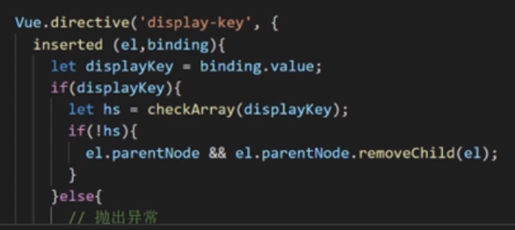

pwa项目：实现了无网络能打开页面，首屏优化骨架屏，服务器推送，添加到桌面等功能

对webpack打包进行优化，提高编译速度，10+vue项目配置文件统一写入，

我对项目做的贡献，统一类似模块中的模板，单据的钩子来写自定义的时间

封装过公用组件，基础的页面，然后就是，对路由统一管理，公用组件统一注册，require_context

做过比较难的就是多选月份区间的组件

（添加全局指令，控制权限）



在那个项目中用下

----

node部署

用pm2

部署，安装node pm2 git

监听对应的commit

打包对应的模块，

依赖改变了，就下载依赖，再打包

exec（）

最后将打包后的文件拷贝到服务器对应的路径下

-----

# v-if、v-show、v-html 的原理是什么，它是如何封装的？

v-if会调用addIfCondition方法，生成vnode的时候会忽略对应节点，render的时候就不会渲染；
v-show会生成vnode，render的时候也会渲染成真实节点，只是在render过程中会在节点的属性中修改show属性值，也就是常说的display；
v-html会先移除节点下的所有节点，调用html方法，通过addProp添加innerHTML属性，归根结底还是设置innerHTML为v-html的值

v-moudel这些也是这么讲的。

todo: vue编译原理（这个还是要准备下）

----

Performance Timing.dom Loadin

Performance Timing.navigation Start

----

# 手写二进制转 Base64

#### 字符转二进制

```
function charToBinary(text) {
  var code = "";
  for (let i of text) {
    // 字符编码
    let number = i.charCodeAt().toString(2);
    // 1 bytes = 8bit，将 number 不足8位的0补上
    for (let a = 0; a <= 8 - number.length; a++) {
       number = 0 + number;
    }
    code += number;
  }
  return code;
}
```

#### 二进制转Base64

```
// 将二进制数据每 6bit 位替换成一个 base64 字符
function binaryTobase64(code) {
  let base64Code = "ABCDEFGHIJKLMNOPQRSTUVWXYZabcdefghijklmnopqrstuvwxyz0123456789+/";
  let res = '';
  // 1 bytes = 8bit，6bit 位替换成一个 base64 字符
  // 所以每 3 bytes 的数据，能成功替换成 4 个 base64 字符
    
  // 对不足 24 bit (也就是 3 bytes) 的情况进行特殊处理
  if (code.length % 24 === 8) {
    code += '0000';
    res += '=='
  }
  if (code.length % 24 === 16) {
    code += '00';
    res += '='
  }

  let encode = '';
  // code 按 6bit 一组，转换为
  for (let i = 0; i < code.length; i += 6) {
    let item = code.slice(i, i + 6);
    encode += base64Code[parseInt(item, 2)];
  }
  return encode + res;
}
```

#### 字符转Base64

```
function base64encode(text) {
  let base64Code = "ABCDEFGHIJKLMNOPQRSTUVWXYZabcdefghijklmnopqrstuvwxyz0123456789+/=";
  let res = '';
  let i = 0;
  while (i < text.length) {
    let char1, char2, char3, enc1, enc2, enc3, enc4;
    
    // 三个字符一组，转二进制
    char1 = text.charCodeAt(i++); 
    char2 = text.charCodeAt(i++);
    char3 = text.charCodeAt(i++);

    enc1 = char1 >> 2; // 取第 1 字节的前 6 位
    
    // 三个一组处理
    if (isNaN(char2)) {
      // 只有 1 字节的时候
      enc2 = ((char1 & 3) << 4) | (0 >> 4);
      // 第65个字符用来代替补位的 = 号
      enc3 = enc4 = 64;
    } else if (isNaN(char3)) {
      // 只有 2 字节的时候
      enc2 = ((char1 & 3) << 4) | (char2 >> 4);
      enc3 = ((char2 & 15) << 2) | (0 >> 6);
      enc4 = 64;
    } else {
      enc2 = ((char1 & 3) << 4) | (char2 >> 4); // 取第 1 个字节的后 2 位(3 = 11 << 4 = 110000) + 第 2 个字节的前 4 位
      enc3 = ((char2 & 15) << 2) | (char3 >> 6); // 取第 2 个字节的后 4 位 (15 = 1111 << 2 = 111100) + 第 3 个字节的前 2 位
      enc4 = char3 & 63; // 取最后一个字节的最后 6 位 (63 = 111111)
    }
    
    // 转base64
    res += base64Code.charAt(enc1) + base64Code.charAt(enc2) + base64Code.charAt(enc3) + base64Code.charAt(enc4)
  }

  return res;
}
```

#### 字符转Base64-最优解（window.btoa，window.atob）✅✅✅

```
let encodedData = window.btoa("this is a example");
console.log(encodedData); // dGhpcyBpcyBhIGV4YW1wbGU=

let decodeData = window.atob(encodedData);
console.log(decodeData); // this is a example
```

---

# 第 69 题： 如何把一个字符串的大小写取反（大写变小写小写变大写），例如 ’AbC' 变成 'aBc' 

判断变大之后是否相同，不同就是对的

```js
function processString (s) {
    var arr = s.split('');
    var new_arr = arr.map((item) => {
        return item === item.toUpperCase() ? item.toLowerCase() : item.toUpperCase();
    });
    return new_arr.join('');
}
console.log(processString('AbC'));
```

