## appshell

1，可以把那些头部尾部，硬编码在index。html中，把样式内联进来

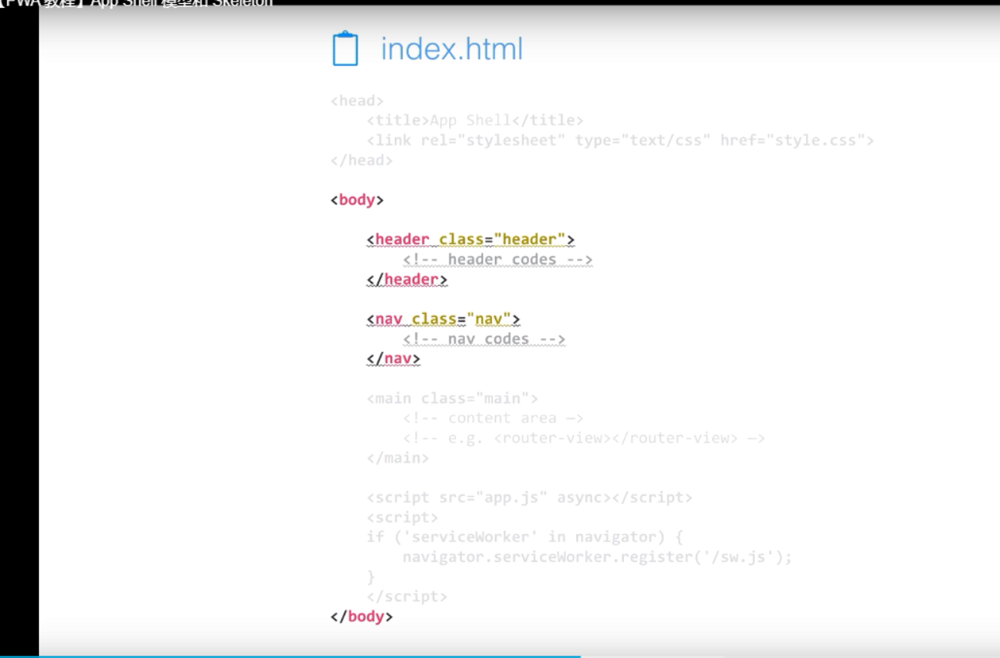

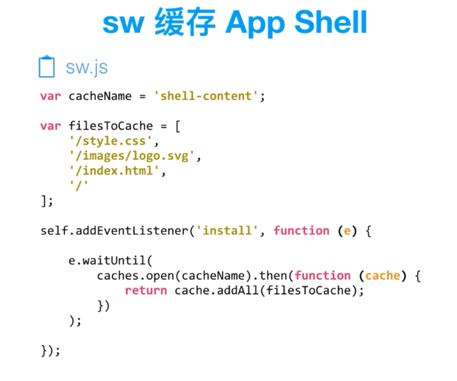

骨架屏

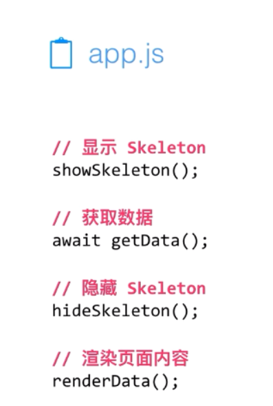

用在spa中

利用serviceworker去缓存 那些固定不变的部分，头部和尾部，

用了一个给予workbox的插件交lavas，来配置workbox。然后在servicework中配置生命周期要做的业务代码，配置缓存内容和缓存策略

利用了web-push来实现从服务端向客户端推送消息。原理应该是和浏览器有关，因为是推送给具体浏览器。

当时还发生了兼容性问题，谷歌不支持web-push，火狐才支持。

就这些，然后再看下serveworker的视频

---

serveworker

是个特殊的worker，是浏览器独立运行在后台的一个worker

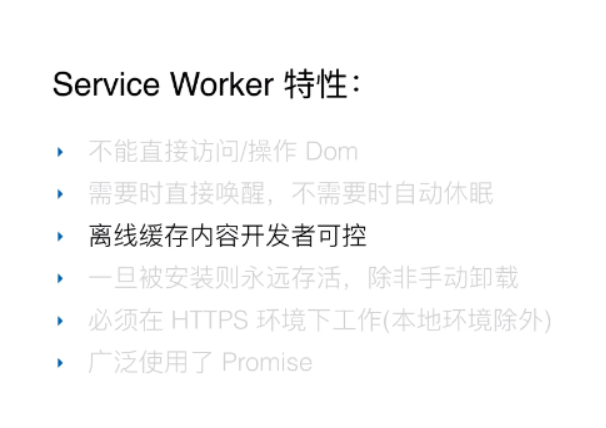

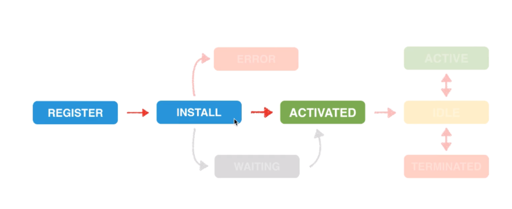

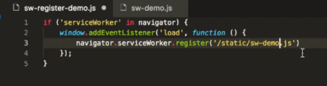

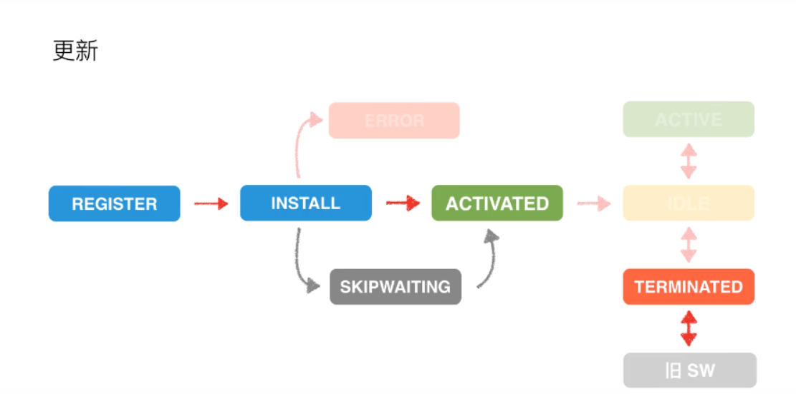

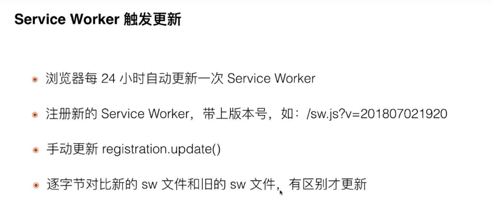

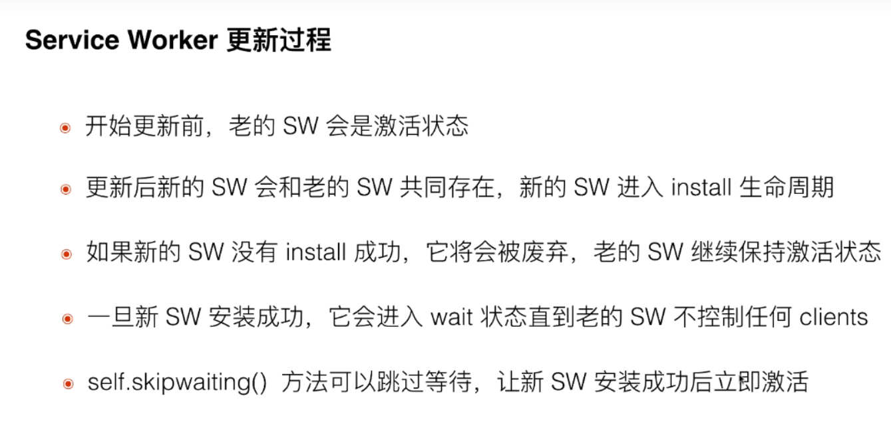

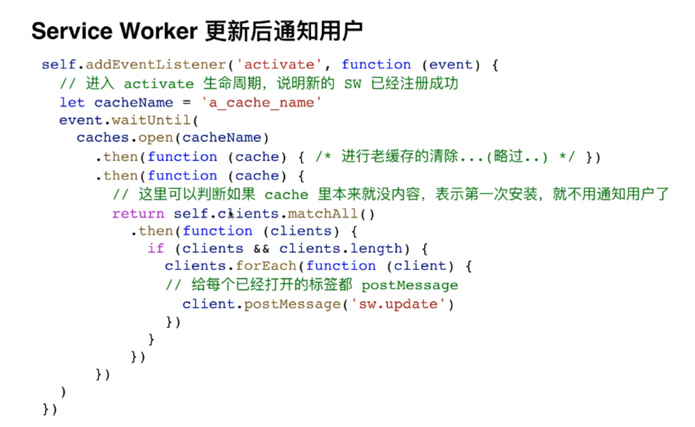

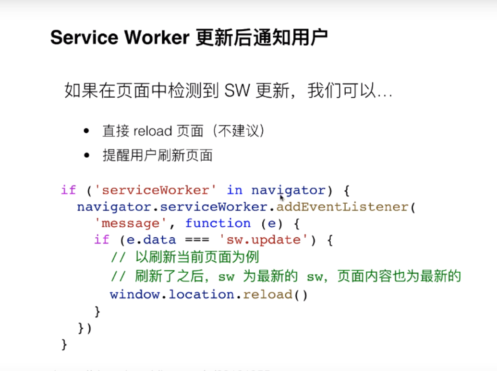

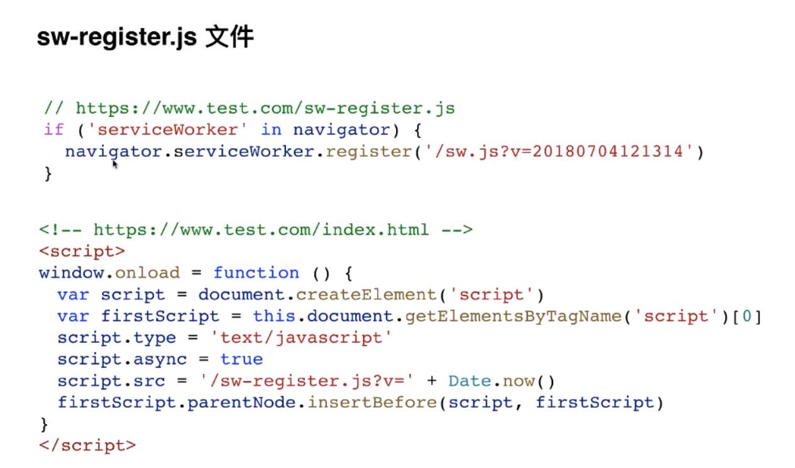

-----

重点讲下自己做的web-push功能

**mpa架构**

去了解下