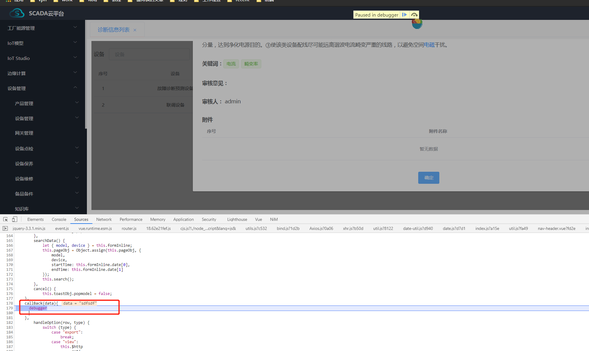
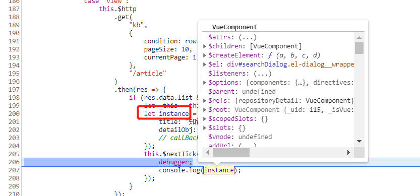
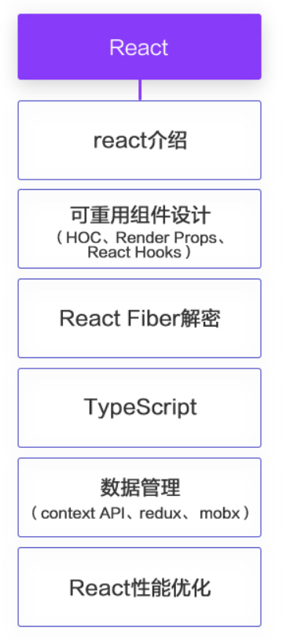

npm run e2e

测试框架：

测试框架本质都是浏览器，不过那些操作是由程序来定义的

那么映射到前端这边的话就是：我不管你逻辑使用什么框架什么逻辑写的，我只想知道浏览器上我要的交互效果，ui展示效果是不是正确的，功能使用上是不是正确的，那么这就叫E2E测试。

---

作者：纵横
链接：https://www.zhihu.com/question/51764943/answer/280470597
来源：知乎
著作权归作者所有。商业转载请联系作者获得授权，非商业转载请注明出处。


webpack template的E2E测试框架是[nightwatch](https://link.zhihu.com/?target=http%3A//nightwatchjs.org/)。

官网偶尔会挂掉，看[github](https://link.zhihu.com/?target=https%3A//github.com/nightwatchjs/nightwatch-docs/tree/master/api/method)也行。它的架构是这样的：


稍微解释一下运行的过程：

- 测试编写测试脚本
- runner.js 引入依赖、浏览器内核并运行脚本
- nightwatch.js 在后台打开一个 java 进程，用于操作浏览器
- java 进程收到脚本的指令
- java 进程操作浏览器

所以在运行之前要确保PC中有[JDK](https://link.zhihu.com/?target=http%3A//www.oracle.com/technetwork/java/javase/downloads/index.html)哦～

## 配置

既然是大型项目，相比开启dev-server应该也要几十秒吧，所以稍微修改一下配置。

```text
// test/e2e/runner.js
process.env.NODE_ENV = 'testing'

var opts = process.argv.slice(2)
if (opts.indexOf('--config') === -1) {
  opts = opts.concat(['--config', 'test/e2e/nightwatch.conf.js'])
}
if (opts.indexOf('--env') === -1) {
  opts = opts.concat(['--env', 'chrome'])
}

var spawn = require('cross-spawn')
var runner = spawn('./node_modules/.bin/nightwatch', opts, { stdio: 'inherit' })

runner.on('exit', function (code) {
  process.exit(code)
})

runner.on('error', function (err) {
  throw err
})
```

在开始e2e测试的时候就不会再自动开启dev-server啦，想测就测～

```text
npm run dev
npm run e2e // 新开一个命令行，专门用于在dev上进行测试
```

## 编写测试脚本

nightwatch 在测试用例编写的时候还是很舒服的。

我们在test/e2e/specs文件夹下建立对页面的测试。

```text
module.exports = {
  'default e2e tests': function (browser) {
    const devServer = browser.globals.devServerURL
    browser
      .url(devServer)
      ... // 你的测试代码
      .end()
  }
}
```

**无回调的链式操作**

```text
.url('http://www.google.com') // 打开地址
.waitForElementVisible('body', 1000) // 等待界面显示
.assert.title('Google') // 断言title为Google
.assert.visible('input[type=text]') // 断言输入框显示
.setValue('input[type=text]', 'rembrandt van rijn') // 设置输入框的值
.waitForElementVisible('button[name=btnG]', 1000) // 等待按钮显示
.click('button[name=btnG]') // 点击按钮
.pause(1000) // 暂停等待请求
.assert.containsText('ol#rso li:first-child', 'Rembrandt - Wikipedia')
// 断言包含字符串
.end();

```

裕浩写的是这个，看看要不要加在项目里，反正算是接触过自动化测试框架了引入就行,不难,java来执行定义的操作,然后就是执行内置的项目。

----

eslint：ok了，也是配置，然后配置对应的规则，再给webpack添加一个eslint的loader

```js
      {
        test: /\.(js|vue)$/,
        loader: 'eslint-loader',
        enforce: 'pre',
        include: [resolve('src'), resolve('test')],
        options: {
          formatter: require('eslint-friendly-formatter'),
        },
      },
```

----

### 全局公用弹窗，写好了，但是只能简单的改变属性，无法添加更复杂的操作，因为拿不到组件实例

找不到对应的文件了，好烦，算了

全局弹窗：今天晚上目标，全局弹窗，学习node，看面试题

```js
billTypeWriteBack(res, cb) {
      this.searchForm.model.billTypeId = res.data[0].billTypeId;
      cb(true);
    },
```

其实也是可以传递函数，重点在于如何传递函数，点击结束，如何调用writeback（res，cb），关键是怎么拿到vue实例。**这个先放一放**，看看其他工具实例。**把这个突破了，应该就可以作为项目亮点**

没办法先放一放

动态挂载对应组件，let contexts = require.context('.', false, /\.vue$/);找到所有要挂载的组件，然后根据name动态挂载组件




回调是传进来了，也拿到了data，this也是当前的this可以的

cb能不能再加下，应该可以，就是这样，ok



**可以用上面那个callback拿到数据，也可以用返回实例，拿到更多信息，做更多hack操作**

```js
    document.body.appendChild(instance.$el)
    Vue.nextTick(() => {
      instance.ref = name
      instance.isModal = true
    })
```

挂载是异步的，所有要用nextTick，不需要用

------

骨架屏，全局控制框

二次封装axios


------

dialogFormVisible

import pagination from '@/mixins/pagination' 公用mixin

-----

```js
export function installElement(Vue, Element) {

  // --- Dialog --- 尝试在element也修改dialog属性
  Element.Dialog.props.closeOnClickModal = {
    type: Boolean,
    default: false,
  };

  Element.InputNumber.props.placeholder = {
    type: String,
    default: '请输入',
  };

  // 更改el-datePiker默认placeholder属性为请选择, valueFormat为timestamp
  Object.assign(Element.DatePicker.props, {
    placeholder: {
      type: String,
      default: constants.datePiker.placeholder,
    },
    startPlaceholder: {
      type: String,
      default: constants.datePiker.startPlaceholder,
    },
    endPlaceholder: {
      type: String,
      default: constants.datePiker.endPlaceholder,
    },
    valueFormat: {
      type: String,
      default: constants.datePiker.valueFormat,
    },
  });

  // 更改日期输入框可以输入

  // 修改Autocomplete组件下拉选项宽度为自适应
  Element.Autocomplete.watch = {
    suggestionVisible(val) {
      this.broadcast('ElAutocompleteSuggestions', 'visible', [val, 'auto']);
    },
  };

  // 只读表单带:
  Element.Form.props.labelSuffix.default = '';

  // 原型挂载
  // Vue.prototype.$dict = dictFormat
  // Vue.prototype.$$ = constants
  // Vue.prototype.$loadingText = loadingText
  // Vue.prototype.currencyFormat = currencyFormat
  // Vue.prototype.$f = $f
  // Vue.prototype.$eventBus = new Vue()

  // 设置i-table pagination样式
  Element.Pagination.props.layout.default = 'total, slot, ->, prev, pager, next, sizes, jumper';
  Element.Pagination.props.background.default = true;
  Element.Pagination.props.small.default = true;
  Element.Pagination.props.pageSizes.default = () => {
    return [5, 10, 15, 20];
  };

  // Element.Dialog.props.closeOnClickModal.default = false;
  // Element.Dialog.props.closeOnPressEscape.default = false;

  // Element.Upload = extend.Upload(Element);
  Vue.use(Element, { size: 'small', zIndex: 3000 });

  // 注册业务组件
  Vue.component('i-select', ISelect)
  Vue.component('remote-select', RemoteSelect)
  Vue.component('ElUpload', Vue.extend(extend.Upload(Element)))
  Vue.component('ElInputNumber', Vue.extend(extend.InputNumber(Element)))
}

```

配置element全局属性，注册，业务组件

fis-mengine-ui\src\config\element\extend.js（全局函数）

这两天，就把项目亮点+面试题，好好准备下，把工作搞好，做完

如何控制，项目中的

**dockerfile，用了dock来部署**

**commitlint.config。js控制上传代码控制**

**--no-ftp 应该有自动上传的功能**

**那些全局公用的函数组件**

**附件上传，大文件上传**

**skeleton**

**this.$root.eventHub.$on('submit', this.onSubmit);**

先简单实现，然后再理解里面的原理

打包成多个页面入口，多入口打包文件（解决我那个多vue项目的功能）

-------

有思路，自己写写看：要保持思考，保持理解

**webpack**，要不要再把这个极客时间的课程学一下，再来看面试题

**electron**项目就看那个

找个**react实战项目**跟着做下，看下原理（**做一个简单，但全的react项目·，这个项目中每一行代码自己都能看懂**，然后就去看原理类的题目）就是状态管理器，react-router，react本身那个生命周期好好理解，没了，应该够，加油

docker部署https://mooc.study.163.com/smartSpec/detail/1202851605.htm

https://coding.imooc.com/class/chapter/229.html#Anchor（暂时决定就看这个简单的）



**node**再找找资料（node没有，直接看面试题或者之后找资料）

node学习cli

看永辉项目

其他面试题

作为一个循环，来一遍遍复习咋样

---

第二轮

electron原理

react原理（本身的原理，周边的原理）

node-cli

可以，就这样把，反正这段时间没啥事就这样学，最后就刷面试题

三个礼拜，一个礼拜一个够了，时间足够。

